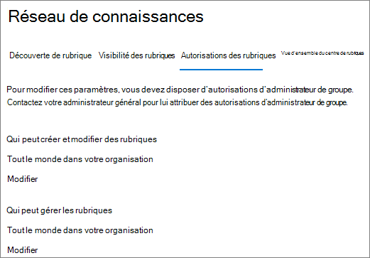
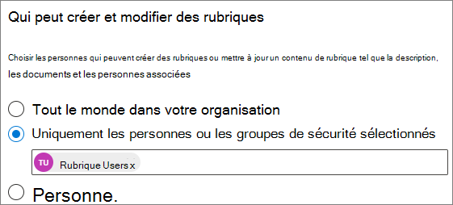
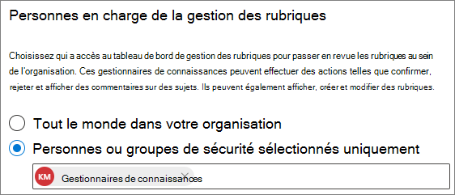

# Gérer les autorisations des rubriques dans les rubriques microsoft

Vous pouvez gérer les paramètres d’autorisations de rubrique dans le [Centre d’administration Microsoft 365.](https://admin.microsoft.com) Vous devez être administrateur général ou administrateur SharePoint pour effectuer ces tâches.

Avec les paramètres d’autorisations de rubrique, vous pouvez choisir :

- Les utilisateurs qui peuvent créer et modifier des rubriques : créez des rubriques qui n’ont pas été trouvées lors de la découverte ou modifiez les détails d’une rubrique existante.
- Les utilisateurs qui peuvent gérer les rubriques : accéder au centre de gestion des rubriques et consulter les commentaires sur les sujets, ainsi que déplacer des rubriques tout au long du cycle de vie.

## Pour accéder aux paramètres de gestion des rubriques :

1. Dans le Centre d’administration Microsoft 365, cliquez sur **Paramètres,** puis **Paramètres de l’organisation.**
2. Sous **l’onglet Services,** cliquez sur **Expériences de rubrique.**

     

3. Sélectionnez **l’onglet Autorisations de rubrique.** Consultez les sections suivantes pour plus d’informations sur chaque paramètre.

     

## Modifier les personnes autorisées à mettre à jour les détails de la rubrique

Pour mettre à jour les personnes autorisées à créer et modifier des rubriques :

1. Sous **l’onglet Autorisations de rubrique,** sous Qui peut créer et modifier des **rubriques,** sélectionnez **Modifier**.
2. Dans la page **Qui peut créer et modifier des rubriques,** vous pouvez sélectionner :
    - **Tout le monde dans votre organisation**
    - **Personnes ou groupes de sécurité sélectionnés uniquement**
    - **Personne**

      

3. Sélectionnez **Enregistrer**.

Pour mettre à jour les personnes autorisées à gérer les rubriques :

1. Sous **l’onglet Autorisations de rubrique,** sous **Qui peut gérer les rubriques,** sélectionnez **Modifier**.
2. Dans la page **Qui peut gérer les rubriques,** vous pouvez sélectionner :
    - **Tout le monde dans votre organisation**
    - **Personnes ou groupes de sécurité sélectionnés**

      

3. Sélectionnez **Enregistrer**.

## Voir aussi

[Gérer la découverte de rubriques dans les rubriques microsoft](topic-experiences-discovery.md)

[Gérer la visibilité des rubriques dans les rubriques microsoft](topic-experiences-knowledge-rules.md)

[Modifier le nom du centre de rubriques dans Rubriques microsoft](topic-experiences-administration.md)
