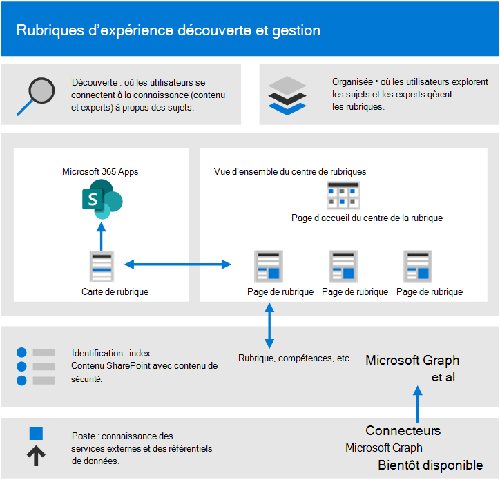
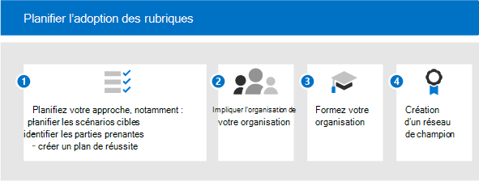

# Prise en main de l’adoption d’expériences de rubrique (aperçu)

> [!Note]
> Le contenu de cet article est destiné à Project cortex privé preview. [En savoir plus sur le Projet cortex](https://aka.ms/projectcortex).

Avant de commencer à adopter, vous devez comprendre les concepts impliqués dans la gestion des connaissances et les expériences de rubrique. Le diagramme suivant montre ce qui se passe lors de la découverte et de la procédure de la rubrique :

- **Découverte**: les utilisateurs peuvent découvrir des connaissances dans les applications qu’ils utilisent quotidiennement via les fiches rubrique : ils peuvent également découvrir des rubriques dans Microsoft Search.
- **Organisée**: les experts techniques (PME) affinent les sujets par le biais de pages de rubrique, et ai apprend leur entrée. Le centre de rubriques contient des pages de rubrique que les utilisateurs peuvent explorer et que des experts peuvent gérer.
- **Identification**: grâce à Microsoft Graph and artificiel Intelligence (ai) Knowledge and People (rubriques, compétences, etc.) sont identifiés et automatiquement organisés en rubriques connexes. Le contenu SharePoint est indexé avec le contenu de sécurité.
- **Poste**: grâce aux connecteurs de contenu Microsoft Graph (bientôt disponible), vous pouvez vous conformer à des services externes et des référentiels de données.

Pour plus d’informations, vous pouvez consulter la [vue d’ensemble](topic-experiences-overview.md) d’une introduction.

Gardez à l’esprit que :

- La découverte de rubrique est améliorée lorsque davantage de contenu est disponible.
- La sécurité, la confidentialité et l’emplacement de vos données sont conservés même si les informations sont présentées dans une nouvelle expérience.
- Les utilisateurs ont besoin d’une licence pour afficher les expériences des rubriques.
- La découverte est initialement en langue anglaise.

Pour vous aider à préparer les questions suivantes :

- Quel contenu doit être utilisé pour la découverte des rubriques ?
- Qui gérera les sujets ?
- Qui verra les cartes et les mises en surbrillance des rubriques ?
- Quelles rubriques sont attendues ?

Consultez cette liste des conditions préalables pour tirer le meilleur parti des expériences de rubrique :

|Produit ou fonctionnalité |Description |
|:-------|:--------|
|SharePoint Online avec des pages SharePoint modernes |L’exploration de rubriques inclut uniquement le contenu sur les sites SharePoint et les cartes de rubrique ne peuvent être exposées que sur des pages modernes.|
|Microsoft Graph |Vous pouvez contrôler si les rubriques sont incluses ou exclues de la recherche ou de la recherche avec les paramètres de Microsoft Graph. |

## Planifier l’adoption

Pour planifier l’adoption des expériences de rubrique, vous devez :

1. Planifiez votre approche et vos scénarios cibles :
    - Réfléchissez à la définition et la hiérarchisation des [scénarios](#target-scenarios).
    - Réfléchissez aux [parties prenantes](#identify-stakeholders) et aux membres de l’équipe de projet dont vous avez besoin.  
    - Déterminez l’impact commercial que vous souhaitez atteindre et la façon dont vous allez [mesurer le succès](#create-a-success-plan).

2. Engagez votre organisation :
    - Identifiez les groupes d’entreprise et les équipes métier qui doivent être impliqués et s’alignent sur ces groupes et sur les scénarios que vous planifiez.
    - Commencez à réfléchir sur la façon d’impliquer des initiateurs précoces afin d’obtenir des commentaires critiques afin que vous puissiez vous lancer dans la meilleure solution.
    - Commencez à créer la communauté et réfléchissez à la façon dont les expériences de rubrique peuvent être utilisées dans votre organisation en fonction de ces différents groupes.

3. Formation de votre organisation : la plupart des utilisateurs comprennent le concept des rubriques et la façon dont les cartes de rubrique compilent les informations pertinentes, et comprennent et voient la valeur. Toutefois, vous pouvez créer une formation adaptée à votre propre culture et à votre organisation, pour montrer comment vous souhaitez que les expériences de rubrique soient utilisées dans votre organisation. Certaines ressources de formation :
    - [Centre de ressources du projet cortex](https://aka.ms/projectcortex). Comprend des présentations et des informations sur les fonctionnalités, des vidéos et des présentations d’heures Office, ainsi que des informations sur les partenaires et leurs offres.
    - Bientôt disponible, des vidéos de formation et de l’aide pour les utilisateurs finaux.

4. [Créez un réseau de champion](#build-a-champion-network):
    - Vous pouvez avoir des communautés de pratiques ou des réseaux de champion déjà en place. Il s’agit de méthodes idéales pour vous aider à vous aider et à faire part de leurs collègues. Et ils peuvent partager des histoires de réussite qui peuvent être très précieuses. Ils peuvent proposer des conseils et susciter une excitation.

### Scénarios cibles

Les raisons qui permettent de déterminer le modèle qui sera nécessaire et de structurer votre organisation en fonction de l’emplacement auquel le modèle sera appliqué. Voici quelques scénarios dans lesquels la gestion des connaissances peut aider votre organisation :

- Intégration de rôle & formation : comprendre la terminologie, les projets clés et la culture d’une nouvelle organisation sont des étapes importantes de l’intégration. Une découverte facile des rubriques permet aux nouveaux employés de se familiariser rapidement avec de nouveaux projets, rôles ou projets.
- Découverte d’expertise et partage d’informations : lorsque les rubriques sont gérées et partagées, les personnes de votre organisation peuvent trouver plus facilement des informations et des experts pour les aider dans leur travail quotidien.
- Prise de décision étendue et amélioration du temps de mise sur le marché : lorsque les informations et les experts sont faciles à atteindre, vous pouvez prendre des décisions plus facilement et éclater vos projets.

Par exemple, voici un scénario d’intégration de rôle :

- Un employé (Jordanie) prend un nouveau rôle ou vient d’être embauché et commence simplement par un rôle. La Jordanie souhaite être impliquée et productif aussi rapidement que possible. Toutefois, la Jordanie a également besoin d’aide pour trouver un lieu de départ.
- Un collègue (Kim) qui était dans le rôle avant la création de pages de rubrique qui peuvent aider les nouveaux employés et quiconque cherchent ces informations.
- Philippe était une PME et disposait des autorisations nécessaires pour consulter des pages de rubrique non confirmées. Les pages de rubrique non confirmées constituent de bons points de départ pour les éléments découverts et créés par le AI, et Kim a pu les modifier pour ajouter des ressources d’experts, des définitions et épingler d’autres ressources.
- Dans la mesure où la Jordanie parcourt un nouveau billet sur SharePoint, la Jordanie voit une rubrique en surbrillance et la place au-dessus pour obtenir rapidement une définition du terme et des personnes à contacter avec plus de questions. Avant, il se peut que la Jordanie ait dû faire des indications pour obtenir ces informations et contacter des collègues afin de connaître les personnes à demander.
- L’exposition de ces informations via des expériences de rubrique peut être puissante, car bien que ces informations puissent être disponibles auparavant, il se peut qu’elles aient été siloées et difficiles à trouver. Le fait de le placer dans les applications qu’elle utilise et d’aider la Jordanie à trouver ces experts peut également conduire un sentiment d’engagement et de communauté. Elle peut également aider la Jordanie à se faire sentir plus facilement lors du traitement du nouveau rôle.

Après avoir identifié vos scénarios, vous pouvez hiérarchiser les scénarios :

L’une des méthodes de hiérarchisation consiste à tracer vos scénarios dans une grille illustrant l’impact et la facilité d’implémentation. Recherchez les scénarios ayant un impact à la fois élevé et faciles à mettre en œuvre. Faites-en votre priorité la plus haute. Les scénarios à faible impact et difficile à mettre en œuvre sont les plus bas. Lorsque vous êtes un gagnant rapide avec un scénario à fort impact, facile à mettre en œuvre, il permet aux utilisateurs d’être passionnés et de voir les possibilités d’utilisation des rubriques.

Choisissez un des scénarios clés à prendre en compte à l’origine, collaborez avec vos précurseurs pour obtenir des commentaires, puis déployez-les en plusieurs étapes. De cette façon, vous pouvez effectuer des itérations, apporter des améliorations et obtenir des commentaires afin de développer votre adoption au fil du temps. 

### Identifier les parties prenantes

Identifier les parties prenantes de votre projet. Les principaux rôles sont le sponsor exécutif, le propriétaire de la réussite et les champions.

|Role |Responsibilities |Département |
|:-------|:-------|:--------|
| Commanditaire (s) exécutif (s)   | Communication de la vision et des valeurs de haut niveau à la société   |  Leadership exécutif   |
| Responsable (s) de projet | Superviser l’exécution complète du processus de lancement et de déploiement | Gestion de projets |
| Administrateurs de connaissances| Installer et configurer des expériences de rubrique | Service informatique |
| Gestionnaires de connaissances | Gestion des rubriques et superviser la taxonomie | Tout service |
| Gestionnaires de taxonomie | Superviser la taxonomie | Tout service |
| Experts des sujets et des collaborateurs | Générer ou examiner des rubriques et des descriptions | Tout service |
| Champions  | Aider à la gestion et à la gestion des objections | Tout service (personnel) |
| Administrateur des clients | Configurer les paramètres au niveau du client | Service informatique |
| Administrateur Power Platform| Configurer un environnement Common Data Services | Service informatique |
| Administrateur ou gestionnaire de recherche | Configurer les paramètres de recherche | Service informatique |

Dans une organisation de grande taille, vous pouvez également avoir plusieurs personnes dans ces rôles, et vous devrez en faire la coordination. Dans une petite entreprise, une seule personne peut effectuer plusieurs de ces rôles. Différents rôles peuvent être plus impliqués dans différentes phases du projet. Par exemple, certaines personnes sont plus impliquées dans la configuration des fonctionnalités (administrateurs client), tandis que d’autres ne sont pas impliquées jusqu’à ce que vous commenciez à définir des sujets de minerai sont plus impliqués dans le maintien (experts et champions).
 
Bien que nous vous recommandons de disposer de chacun de ces rôles dans tout votre déploiement, vous pouvez constater que vous n’en avez pas besoin tous pour commencer à utiliser votre solution identifiée.

### Créer un plan de réussite

Utilisez ces indicateurs pour mesurer le succès des expériences de rubrique dans votre organisation. Regarde:

1. Utilisation de la rubrique :
      - Impressions de rubrique
      - Quantité de sujets (confirmée et non confirmée) dans votre liste de rubriques organisée.
      - Nombre de pages de rubrique publiées.
1. Commentaires des utilisateurs finaux à partir des fiches rubrique.
1. Effectuer des enquêtes de satisfaction des employés. Les rubriques doivent améliorer la capacité des employés à trouver des informations, donc trouver des moyens de recueillir leurs commentaires sur cela.
1. Impact positif sur l’analyse de la recherche. Dans la mesure où les rubriques apparaissent dans l’expérience de recherche, il se peut que les taux de recherches abandonnées soient abaissés, car les personnes sont plus facilement en mesure de trouver les rubriques de la recherche. 

### Création d’un réseau de champion

Créez un réseau de champion dans votre organisation. Les champions sont importants car ils peuvent :

- Créer un cercle d’influence parmi leurs équipes
- Rubrique Drive Management & maintenance

Vous pouvez recruter des champions auprès de différents rôles : les responsables du savoir et les experts en matière de sujet.

De nombreux réseaux de champion exploitent yammer en tant que plateforme. Dans Yammer, les personnes peuvent publier des questions et obtenir des réponses, et partager des expériences réussies. Il est difficile de récupérer le mot seul, de sorte que vous pouvez vous appuyer sur le réseau des personnes de votre entreprise pour offrir des conseils à leurs pairs et montrer comment leur équipe utilise des expériences de rubrique pour permettre à d’autres équipes de réfléchir à leurs propres scénarios.

Certaines organisations utilisent hackathons (formel ou informel, virtuel ou en personne) pour rassembler des groupes de personnes qui travaillent sur un projet spécifique. Par exemple, vous pouvez réunir vos experts en matière de sujet et les faire collaborer pour réunir un ensemble de pages de rubrique.

Réfléchissez à la façon dont vous pouvez reconnaître vos champions. Récompenser leurs activités, leur donner une certaine notoriété et générer une sensation et un engagement de la communauté visible, de sorte qu’ils aient le plaisir de contribuer à quelque valeur que ce soit et qu’ils renvoient également à un autre point.

Maintenant que vous êtes prêt à déployer, vous devez vous assurer que vous encouragez un engagement continu.

- Gérez les groupes Yammer actifs pour vos champions.
- Partager des expériences réussies.
- Héberger régulièrement des événements d’engagement supplémentaires pour partager des articles ou introduire de nouvelles fonctionnalités.
- Configurez les défis pour les personnes et exécutez des concours.

## Étapes suivantes

Lorsque vous êtes prêt à déployer des expériences de rubrique, vous devrez faire en sorte que des personnes soient impliquées.

- Commencez à introduire l’ensemble de fonctionnalités et à les faire réfléchir à leurs scénarios.
- Recueillez les parties prenantes et créez des scénarios.
- Dirigez la communauté et réfléchissez à la façon dont vous allez les engager.
- Ensuite, suivez les étapes de préparation. Certains d’entre eux peuvent être prêts techniques et être prêts pour les entreprises.
- Enfin, socialiser et promouvoir.
