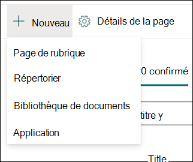

# Utilisation des rubriques dans le Centre des rubriques (aperçu)

> [!Note] 
> Le contenu de cet article est destiné à Project cortex privé preview. Pour [plus d’informations sur le projet cortex](https://aka.ms/projectcortex).

Dans le centre de la rubrique, un gestionnaire de connaissances peut consulter des rubriques qui ont été extraites et découvertes dans les emplacements sources SharePoint que vous avez spécifiés et qui peuvent les confirmer ou les refuser. Un responsable de la connaissance peut également créer et publier de nouvelles pages de rubrique, le cas échéant, si elles ne sont pas disponibles dans la découverte de rubrique, ou en modifier les existantes si elles doivent être mises à jour.

## Conditions préalables

Pour travailler dans le Centre des rubriques, vous devez disposer des autorisations requises. Votre administrateur peut vous ajouter lors de la configuration de la [gestion des connaissances](set-up-knowledge-network.md), ou les nouveaux utilisateurs peuvent être ajoutés par la [suite](give-user-permissions-to-the-topic-center.md).

Les utilisateurs du Centre des rubriques peuvent disposer de deux jeux d’autorisations :

- Créer et modifier des rubriques : créer des rubriques ou mettre à jour le contenu de la rubrique, comme la description, les documents et les personnes associées
- Gérer les rubriques : utilisez le tableau de bord de gestion des rubriques pour examiner les sujets au sein de l’organisation. Les utilisateurs peuvent effectuer des actions telles que confirmer et rejeter des rubriques

## Consulter les rubriques non confirmées

Sur la page d’accueil du centre de la rubrique, les rubriques qui ont été découvertes dans vos emplacements sources SharePoint spécifiés sont répertoriées sous l’onglet non **confirmé** . Un utilisateur disposant des autorisations pour gérer les rubriques peut consulter les rubriques non confirmées et choisir de les confirmer ou de les refuser.

Pour consulter une rubrique non confirmée :

1. Sous l’onglet non **confirmé** , sélectionnez la rubrique pour ouvrir la page rubrique. 

2. Sur la page rubrique, passez en revue la page de la rubrique, puis sélectionnez **modifier** si vous devez apporter des modifications à la page.
3. Sur la page d’accueil du centre de connaissances, pour la rubrique sélectionnée, vous pouvez : 
    a. Sélectionnez la case à cocher pour confirmer que vous souhaitez conserver la rubrique. 
    b. Sélectionnez le **x** si vous souhaitez rejeter la rubrique. 

    Les rubriques confirmées seront supprimées de la liste non **confirmée** et s’afficheront désormais dans l’onglet **confirmé** . 

    Les sujets rejetés seront supprimés de la liste non **confirmée** et s’afficheront désormais dans l’onglet **rejeté ou exclu** . 
    
   
## Créer une rubrique

Un utilisateur disposant d’autorisations de création ou de modification de rubrique peut créer une rubrique si nécessaire. Vous devrez peut-être procéder ainsi si la rubrique n’a pas été découverte par le biais de la découverte ou si la technologie AI n’a pas trouvé suffisamment de preuves pour l’établir en tant que rubrique.

Pour créer une rubrique, procédez comme suit :
1. Sur la page Centre des rubriques, sélectionnez **nouveau**, puis **page de rubrique**. 

      

2. Sur la page nouvelle rubrique, vous pouvez renseigner les informations sur le nouveau modèle de rubrique : 
    a. Dans la section **nom de cette rubrique** , tapez le nom de la nouvelle rubrique. 
    b. Dans la section **autres noms** , tapez les noms ou acronymes qui sont également utilisés pour faire référence à la rubrique. 
    c. Dans la section **description courte** , tapez une ou deux descriptions de phrase de la rubrique. Ce texte sera utilisé pour la carte de sujet associée. 
    d. Dans la section **personnes** , tapez les noms des experts techniques de la rubrique. 
    e. Dans la section **fichiers et pages** , sélectionnez **Ajouter** , puis sur la page suivante, vous pouvez sélectionner des fichiers OneDrive associés ou des pages SharePoint Online. 
    f. Dans la section **sites** , sélectionnez **Ajouter**. Dans le volet de **sites** qui s’affiche, sélectionnez les sites associés à la rubrique. 

      
3. Si vous avez besoin d’ajouter d’autres composants à la page, tels que du texte, des images, des composants WebPart, des liens, etc., sélectionnez l’icône de zone de dessin au milieu de la page pour les Rechercher et les ajouter.
       

4. Lorsque vous avez fini, sélectionnez **publier** pour publier la page de la rubrique. Les pages de rubrique publiées s’affichent dans l’onglet **pages** .

> [!Note] 
> La page nouvelle rubrique est composée de composants WebPart qui sont *compatibles*avec le réseau de connaissances. En d’autres termes, comme AI rassemble davantage d’informations sur la rubrique, les informations contenues dans ces composants WebPart sont mises à jour avec des suggestions pour faciliter l’utilisation de la page pour les utilisateurs.

## Modifier une page de rubrique existante

Les pages de rubrique existantes sont accessibles dans la page **pages** . 

1. Sur la page Centre des rubriques, sélectionnez **pages**. 
2. Sur la page **pages** , vous verrez une liste de pages de rubrique. Utilisez la zone de recherche pour trouver la page de rubrique que vous souhaitez mettre à jour. Cliquez sur le nom de la page de rubrique à modifier. 
3. Sur la page de la rubrique, sélectionnez **modifier**.  
4. Effectuez les modifications nécessaires sur la page. Cela inclut les mises à jour des champs suivants : 
    a. Autres noms 
    b. Description 
    c. Personnes 
    d. Fichiers et pages 
    e. Sites 
    f. Vous pouvez également ajouter des éléments statiques à la page, tels que du texte, des images ou un lien, en sélectionnant l’icône zone de dessin. 

5. Sélectionnez **republier** pour enregistrer vos modifications.

## Voir aussi

  

