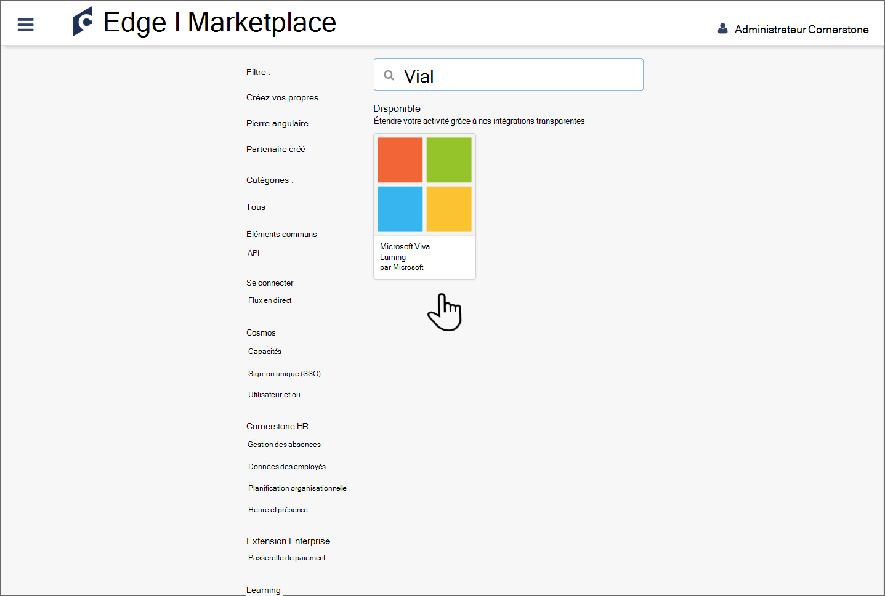
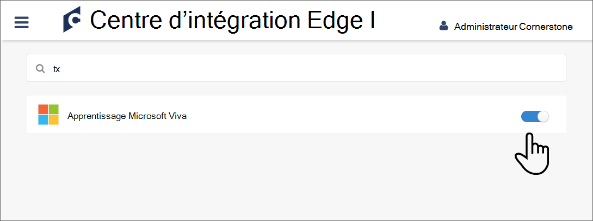

# Configurer La fonction OnDemand en tant que source de contenu pour Apprentissage Microsoft Viva

Cet article vous montre comment configurer La base de connaissances OnDemand en tant que source de contenu d’apprentissage tierce dans Learning. Tout d’abord, vous devez activer Learning et obtenir vos détails à partir de votre portail de base. Ensuite, vous devez terminer la configuration dans votre Centre d'administration Microsoft 365.

>[!NOTE]
>Le contenu accessible par le biais de Learning est soumis à des conditions autres que celles de Microsoft Product Terms. Le contenu OnDemand et tous les services associés sont soumis aux conditions de confidentialité et de service de Ce dernier.

## Configurer dans votre portail de base

1. Connectez-vous à votre portail de base en tant qu’administrateur.

    

2. Choisissez **Edge**.

    

3. Go to **Marketplace** and search for Market.

    

4. Sélectionnez la vignette Learning’Err.

    

5. Choisissez **installer**.

    

6. Cochez la case pour confirmer que vous acceptez les conditions générales et choisissez **Installer.**

    

7. Sélectionnez **Configurer maintenant.**

    

8. Copiez l’ID client, la secret, le nom du portail et l’URL de base. Ensuite, revenir en arrière et rechercher l’un des deux.

    

9. Faites glisser le curseur pour activer l’intégration Learning’équipe.

    

## Configurer dans votre Centre d'administration Microsoft 365

1. Connectez-vous à [votre Centre d'administration Microsoft 365](https://admin.microsoft.com).
2. Accédez **à Paramètres,** puis **aux paramètres org.** Sélectionnez Contrôle Learning, puis activez l’élément OnDemand dans le panneau.
3. Remplissez les détails de configuration que vous avez récupérés à partir de votre portail de base.

    >[!NOTE]
    >Le nom d’affichage est le nom du carrousel sous lequel le contenu d’apprentissage De la structure fondamentale apparaîtra pour votre organisation dans Learning. Si vous n’entrez pas de nom, celui-ci affiche le nom par défaut « C’est-à-dire OnDemand ».

4. Sélectionnez **Enregistrer** pour activer le contenu De la première ligne de la Learning. L’affichage du contenu dans l’application Learning prend jusqu’à 24 heures.

>[!NOTE]
>Actuellement, tous les utilisateurs au sein d’une organisation peuvent découvrir tous les cours spécifiques au client, mais ils pourront uniquement utiliser les cours qu’ils ont accès. La découverte de contenu spécifique à l’utilisateur basée sur les rôles et les autorisations est prévue pour les prochaines sorties.
