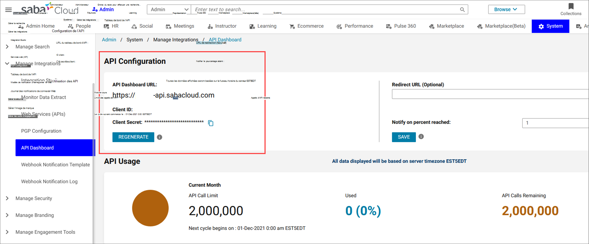
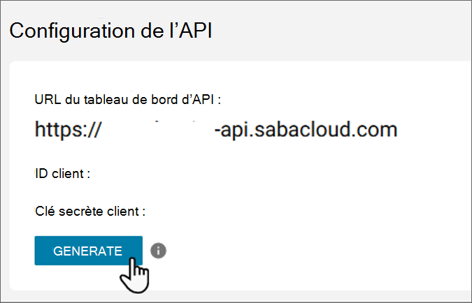

# Configurer Le nom d’une source de contenu pour Apprentissage Microsoft Viva

Cet article vous montre comment configurer Lasa comme source de contenu d’apprentissage tierce pour Apprentissage Microsoft Viva. Pour effectuer ces étapes, vous devez être administrateur système ou super utilisateur du système.

>[!NOTE]
>Le contenu accessible par le biais de Learning est soumis à des conditions autres que celles de Microsoft Product Terms. Le contenu de Domaine et les services associés sont soumis aux conditions de confidentialité et de service de Saby.

>[!NOTE]
>Grâce à Learning’intégration avecQuet, il utilisera les API de votre compartiment d’appels d’API par mois et comptera dans votre limite de limitation.

## Configurer dans votre portail DeNte

>[!NOTE]
>Vous devez avoir des autorisations d’administrateur dans Le Monde pour effectuer ces étapes.

### URL hôte du client

1. Identifiez votre URL cloud Principale (par exemple, « org ».sabacloud.com). Si l’URL du tableau de bord de votre API org-api.sabacloud.com, votre URL d’hôte sera org.sabacloud.com.
2. Identifiez l’URL de votre tableau de bord d’API en allant à **Cloud**  >  **Admin**  >  **System Admin Manage**  >  **Integrations** API  >  **Dashboard**. Recherchez l’URL du tableau de bord de l’API, puis supprimez « https:// » et « -api » pour obtenir votre URL d’hôte.

    

### ID client et secret client

1. Sur le même écran que celui où vous avez obtenu l’URL hôte, copiez l’ID client et la secret client s’ils ont déjà été générés.

2. Si la question secrète client n’existe pas encore, sélectionnez le **bouton GÉNÉRER** pour la générer.

    

## Configurer dans votre Centre d'administration Microsoft 365

Vous devez terminer la configuration dans votre Centre d'administration Microsoft 365.

>[!NOTE]
>Vous devez avoir des autorisations d’administrateur Microsoft 365 pour effectuer ces étapes.

1. Connectez-vous à [votre Centre d'administration Microsoft 365](https://admin.microsoft.com).
2. Accédez **à Paramètres,** puis **aux paramètres org.** Sélectionnez Contrôle Learning et activez Cloud Dans le panneau.
3. Remplissez les détails que vous avez obtenus à partir de votre portail DeNte.
    >[!NOTE]
    >Le nom d’affichage est le nom du carrousel sous lequel le contenu d’apprentissage de Contrôle apparaîtra pour les utilisateurs de votre organisation dans Le Learning. Si vous n’entrez pas de nouveau nom, il affiche le nom par défaut « Cloud Cloud ».
4. Sélectionnez **Enregistrer** pour activer le contenu Cloud de Cloud dans Apprentissage Microsoft Viva. L’affichage du contenu dans Le Learning peut prendre jusqu’à 24 heures.

> [!Note]
> Pour l’intégration de Cloud Cloud, vous devez avoir un domaine sabacloud.com dans votre URL d’hôte. Si vous avez un autre nom de domaine, vous devez lever un ticket de support pour autoriser votre nom de domaine.

>[!NOTE]
>Les métadonnées du client sont stockées de manière centralisée dans nos magasins de données et non dans des magasins de données spécifiques à la région.

>[!NOTE]
>Actuellement, tous les utilisateurs au sein d’une organisation peuvent découvrir tous les cours spécifiques au client, mais ils pourront uniquement utiliser les cours qu’ils ont accès. La découverte de contenu spécifique à l’utilisateur basée sur les rôles et les autorisations est prévue pour les prochaines sorties.
