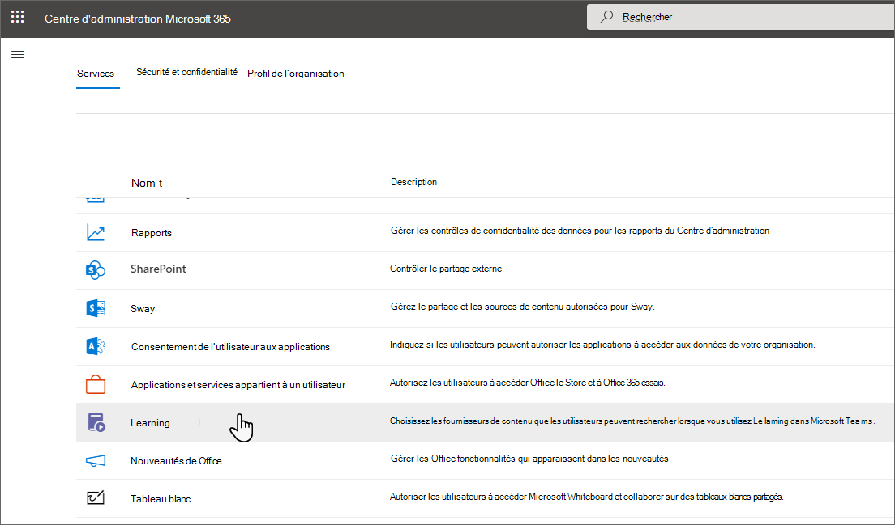
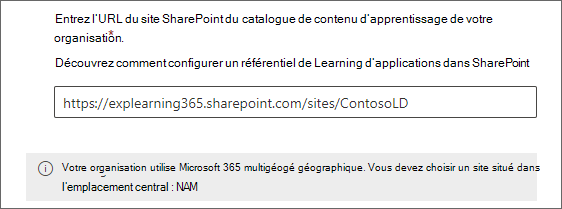
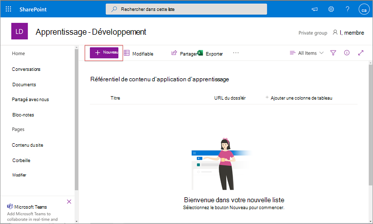
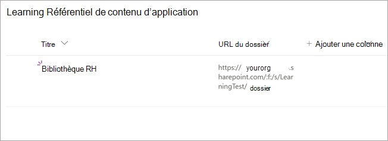
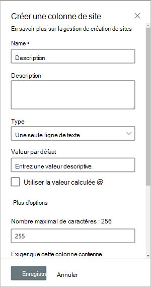
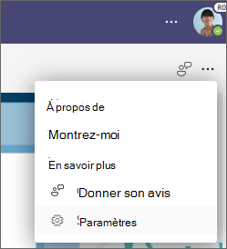

# Ajouter SharePoint en tant que source de contenu pour Apprentissage Microsoft Viva

Vous pouvez configurer SharePoint en tant que source de contenu d’apprentissage pour rendre le contenu propre à votre organisation disponible dans Learning.

>[!NOTE]
> Le contenu accessible par le biais de Learning est soumis à des conditions autres que celles de Microsoft Product Terms. Tout contenu que vous ajoutez à Learning, tel que le contenu hébergé SharePoint, est soumis aux conditions de confidentialité et de service associées à ce contenu.

## Aperçu

L’administrateur du savoir (ou administrateur général) fournit une URL de site où le [service Learning](configure-sharepoint-content-source.md#learning-service) peut créer un emplacement centralisé vide sous la forme d’une liste SharePoint structurée. Cette liste est appelée référentiel Learning contenu d’application. Votre organisation peut utiliser cette liste pour house links to cross-company SharePoint folders that contain learning content. Les administrateurs sont chargés de collecter et de organiser une liste d’URL pour les dossiers. Ces dossiers doivent inclure uniquement le contenu qui peut être mis à disposition dans Le Learning.

Learning prend en charge les types de documents suivants :

- Word, PowerPoint, Excel, PDF
- Audio (.m4a)
- Vidéo (.mov, .mp4, .avi)

Pour plus d’informations, [voir SharePoint limites.](/office365/servicedescriptions/sharepoint-online-service-description/sharepoint-online-limits?redirectSourcePath=%252farticle%252fSharePoint-Online-limits-8f34ff47-b749-408b-abc0-b605e1f6d498)

## Multi-Géo

Si vous utilisez [Microsoft 365 Multi-Géo,](/microsoft-365/enterprise/microsoft-365-multi-geo)l’URL de site fournie par l’administrateur du savoir (où se trouve le référentiel de contenu d’application Learning) doit appartenir à l’emplacement central où votre abonnement Microsoft 365 a été initialement provisioné. Les dossiers liés au référentiel doivent également appartenir à l’emplacement central. Learning a ajouté cette restriction pour se conformer aux exigences de résidence des données.

[Microsoft 365 Multi-Géo](/microsoft-365/enterprise/microsoft-365-multi-geo) est conçu pour répondre aux exigences de résidence des données. Pour plus d’informations, [voir fonctionnalités multigé géographiques dans SharePoint Online.](/microsoft-365/enterprise/multi-geo-capabilities-in-onedrive-and-sharepoint-online-in-microsoft-365)

## Autorisations

Les URL de dossier de bibliothèque de documents peuvent être collectées à partir de n’importe quel site SharePoint de l’organisation. Learning suit toutes les autorisations de contenu existantes. Par conséquent, seul le contenu pour lequel un utilisateur a l’autorisation d’accéder est accessible et visible dans Learning. Tout contenu de ces dossiers est utilisable dans une recherche, mais seul le contenu pour lequel l’employé dispose d’autorisations peut être utilisé.

La suppression de contenu du référentiel de votre organisation n’est actuellement pas prise en charge.

Pour supprimer le contenu accidentellement surface, suivez les étapes suivantes :

1. Pour restreindre l’accès à la bibliothèque de documents, sélectionnez l’option Afficher **les actions,** puis **sélectionnez Gérer l’accès.**

     

2. Supprimez le document d’origine dans la bibliothèque de documents.

Pour plus d’informations, [voir Partage et autorisations dans l’SharePoint moderne.](/sharepoint/modern-experience-sharing-permissions)

## Learning Service

Le service Learning utilise les URL de dossier fournies pour obtenir des métadonnées à partir de tout le contenu stocké dans ces dossiers. Dans un délai de 24 heures après la fourniture de l’URL du dossier dans le référentiel centralisé, les employés peuvent rechercher et utiliser le contenu de votre organisation au sein de Learning. Toutes les modifications apportées au contenu, y compris les métadonnées et autorisations mises à jour, seront également appliquées dans le service Learning dans les 24 heures.

## Configurer SharePoint en tant que source

Vous devez être un administrateur Microsoft 365 général, un administrateur SharePoint ou un administrateur du savoir pour effectuer ces tâches.

Pour configurer SharePoint en tant que sources de contenu d’apprentissage pour Learning, suivez les étapes suivantes :

1. Dans le navigation de gauche de la Centre d'administration Microsoft 365, Paramètres  >  **paramètres de l’organisation.**

2. Dans la page **Paramètres de l’organisation,** sous l’onglet **Services,** sélectionnez **Learning**.

     

3. Dans le **panneau Learning,** sous SharePoint, fournissez l’URL du site SharePoint où vous souhaitez que Le Learning crée un référentiel centralisé. Si votre site SharePoint est nouveau, vous devez attendre 1 heure après sa création pour l’ajouter ici. Vous devez également être le propriétaire du site SharePoint site.

     

     Si votre organisation utilise [Microsoft 365 multigéogé,](/microsoft-365/enterprise/microsoft-365-multi-geo)vous pouvez trouver votre région ou votre pays Microsoft 365 [disponibilité multigéogé.](/microsoft-365/enterprise/microsoft-365-multi-geo#microsoft-365-multi-geo-availability) Le **panneau Learning** Contrôles affiche également ces informations.

     

4. Une liste SharePoint est créée automatiquement dans le site SharePoint fourni.

     Dans le navigation gauche du site SharePoint, sélectionnez **Contenu** du site Learning de contenu  >  **d’application.**

     

5. Dans la page **Learning** de contenu d’application, SharePoint la liste des url vers les dossiers de contenu d’apprentissage.

   1. Sélectionnez **Nouveau** pour afficher le **panneau Nouvel** élément.

       

   2. Dans le **panneau Nouvel élément,** dans le champ **Titre,** ajoutez un nom de répertoire de votre choix. Dans le champ **URL du** dossier, ajoutez l’URL au dossier de contenu d’apprentissage. Sélectionnez **Enregistrer**. [Découvrez comment créer l’URL du dossier.](#folder-url-document-library-curation)

       

   3. La page Learning référentiel de contenu **d’application** est mise à jour avec le nouveau contenu d’apprentissage.

       

   4. Si votre organisation utilise [Microsoft 365 multigéographique](/microsoft-365/enterprise/microsoft-365-multi-geo) et que vous essayez d’ajouter un lien à un dossier qui n’appartient pas à l’emplacement central, vous recevrez un message d’erreur. Tous les dossiers doivent appartenir à l’emplacement central.
       

  > [!NOTE]
  > Pour permettre un accès plus large au référentiel de contenu d’application Learning, un lien vers la liste sera bientôt disponible dans l’interface Der Learning où les utilisateurs peuvent demander l’accès et, en fin de compte, remplir la liste. Les propriétaires de site et les administrateurs globaux doivent accorder l’accès à la liste. L’accès est spécifique à la liste uniquement et ne s’applique pas au site où la liste est stockée. Pour plus d’informations, [voir Fournir](#provide-your-own-organizations-content) le contenu de votre propre organisation plus loin dans cet article.

### Curation de bibliothèque de documents d’URL de dossier

Créez un dossier pour stocker du contenu d’apprentissage pour votre organisation.

1. Go to your Documents library and select **+ New**.

    

2. Choisissez **Dossier** et entrez un nom de dossier.

    

3. Sélectionnez **Créer**. Le dossier s’affiche désormais dans votre bibliothèque de documents.

    

4. Télécharger fichiers que vous souhaitez publier en tant que contenu d’apprentissage dans ce dossier.
5. Pour obtenir l’URL du dossier, choisissez ce dossier et sélectionnez **Copier le lien.**

    

Les métadonnées par défaut (telles que la date de modification, créées par, le nom du document, le type de contenu et le nom de l’organisation) sont automatiquement pullées dans Le Learning par l’API Microsoft Graph.

Pour améliorer la pertinence globale de la découverte et de la recherche du contenu, nous vous recommandons d’ajouter une **colonne Description.** Si une colonne de description est déjà présente, vous pouvez la supprimer et en ajouter une nouvelle en suivant les étapes ci-dessous.

Pour ajouter une **colonne Description** à la page de bibliothèque de documents, suivez les étapes suivantes :

1. Dans la page **Documents,** sélectionnez **Ajouter une colonne.**

2. Sélectionnez **l’option Afficher les actions,** puis **sélectionnez Une seule ligne de texte.**

    :::image type="content" alt-text="Page documents dans SharePoint les options Afficher les actions avec une seule ligne de texte en surbrillant." source="../media/learning/learning-sharepoint-curation1.png":::

3. Dans le **panneau Créer une colonne,** dans le champ **Nom,** ajoutez un nom descriptif pour la colonne. Sélectionnez **Enregistrer**.

    

4. Dans la page **Documents,** dans la **colonne Description,** ajoutez des descriptions personnalisées pour chaque élément. Si aucune description n’est fournie, Learning fournit un message par défaut qui met en évidence le contenu comme provenant de SharePoint bibliothèque.

     

### Fournir le contenu de votre propre organisation

Les administrateurs du savoir peuvent accéder au référentiel de contenu d’application Learning de leur organisation dans SharePoint, où ils peuvent fournir des références aux bibliothèques de documents entre les organisations. Le contenu de ces bibliothèques sera ensuite indiqué en tant que contenu d’apprentissage dans Learning.

1. Dans Le Learning, sélectionnez les ellipses (**...**), puis sélectionnez **Paramètres**.

    
  
2. Sous **Paramètres,** sélectionnez **Autorisations.**

    

3. Sélectionnez **Vérifier l’accès** pour vous connecter à la bibliothèque centralisée de votre organisation.

## Étape suivante

[Ajoutez des systèmes de gestion d’apprentissage pour Learning ou](configure-lms.md) [Ajoutez d’autres](configure-other-content-sources.md)fournisseurs de contenu pour Apprentissage Microsoft Viva .
