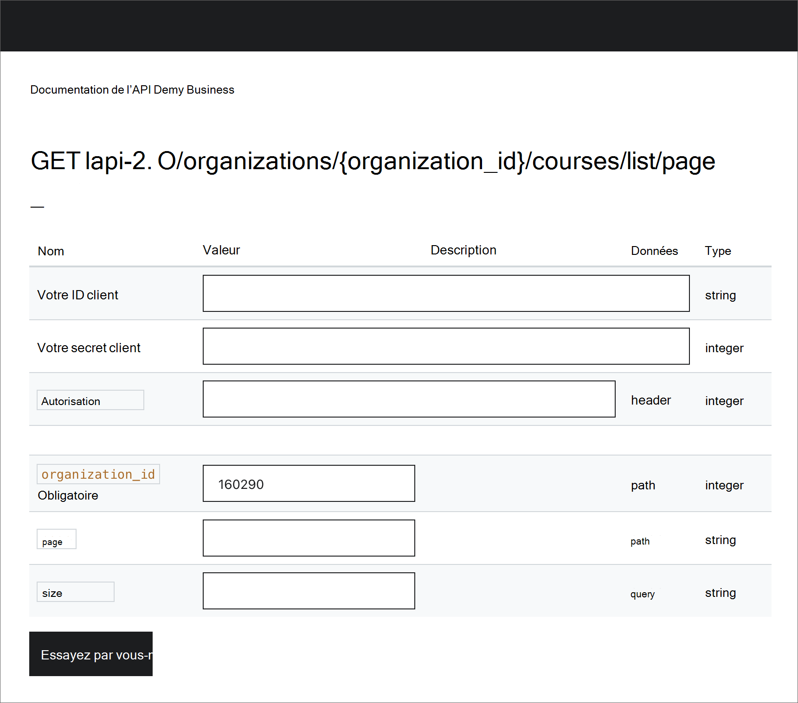

# Configurer Udemy en tant que source de contenu pour Apprentissage Microsoft Viva

>[!NOTE]
>Cette fonctionnalité n’est pas prise en charge en prévisualisation.

Cet article vous montre comment configurer Udemy en tant que source de contenu d’apprentissage tierce pour Apprentissage Microsoft Viva.

>[!NOTE]
>Le contenu accessible par le biais de Learning est soumis à des conditions autres que celles de Microsoft Product Terms. Le contenu Udemy et tous les services associés sont soumis aux conditions de confidentialité et de service d’Udemy.

Suivez ces étapes pour activer les API dans votre environnement Udemy Business et générer des informations d’identification client pour que votre application LMS/LXP y accède.

1. Accédez **à Gérer,** puis **Paramètres,** puis **API**. Vérifiez l’état de vos API. Si elles sont désactivées, vous pouvez contacter le support technique pour l’activer ou suivre les étapes ci-dessous pour les activer.

    <!---->

2. Si les API sont désactivées, accédez aux **intégrations LMS/LXP,** puis Démarrez la mise en **place,** puis **Autre**.

    <!---->

3. Dans l’écran suivant, tapez le nom de votre application LMS/LXP personnalisée ou tierce. Ensuite, activer ou désactiver l’option d’inscription automatique, puis sélectionnez **Enregistrer.** L’option d’inscription automatique permet aux utilisateurs qui lancent un cours via leur LMS/LXP d’être automatiquement inscrits à Udemy.

    <!---->

4. Une fois que vous avez enregistré, votre ID client et votre secret client sont générés et vous pouvez les copier à partir de l’écran. Vous pouvez désormais accéder aux API à l’aide des informations d’identification client fournies.

    <!---->

5. Pour accéder aux points de terminaison de l’API, vous devez avoir votre ACCOUNT_ID url de point de terminaison. Vous pouvez accéder à ces informations et également essayer les API en accédant à **Gérer,** **puis Paramètres**, puis **API**. Une fois que vous avez activé les API, vous devez voir l’état des API comme « Activé ». Sélectionnez le lien de documentation de l’API.

    <!---->

6. Obtenez l’URL et les ACCOUNT_ID de point de terminaison de l’API à partir de la page de vue d’ensemble. Accédez aux méthodes prise en charge pour essayer un appel d’API. Vous êtes désormais prêt à appeler les API Udemy Business.

    <!---->

    <!---->

## Configurer le Centre d'administration Microsoft 365

Une fois que vous avez reçu les détails de configuration requis du portail Udemy à l’aide des étapes précédentes, l’administrateur client doit configurer Udemy en tant que source d’apprentissage dans le Centre d'administration Microsoft 365 en suivant les étapes ci-après.

1. Accédez au [Centre d'administration Microsoft 365](https://admin.microsoft.com).

2. Accédez **à Paramètres,** puis **aux paramètres org.** Recherchez Learning et activez Udemy à partir des options.

3. Remplissez les détails de configuration requis suivants :

    - URL hôte du client : **IL s’agit** de l’URL du point de terminaison de l’API recueillie à partir du portail Udemy à l’étape 6.
    - **ID d’organisation**: il s’agit du ACCOUNT_ID collecté à partir du portail Udemy à l’étape 6.
    - **ID client :** il s’agit de l’ID client collecté à partir du portail Udemy à l’étape 4.
    - **Secret client**: il s’agit de la question secrète client recueillie à partir du portail Udemy à l’étape 4.

      <!---->

4. Sélectionnez **Enregistrer** pour activer le contenu Udemy dans Apprentissage Microsoft Viva. Le contenu peut prendre jusqu’à 24 heures pour être disponible dans Le Learning.
