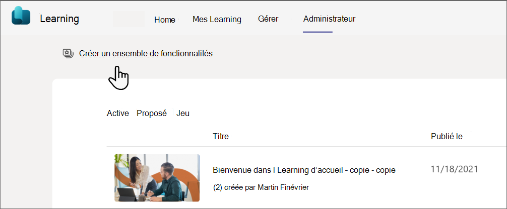

# Gérer le contenu dans l’onglet Administrateur

Vous pouvez gérer une partie de votre contenu Learning à partir de l’application dans Teams. Vous pouvez choisir le contenu à utiliser pour votre organisation dans l’onglet Administrateur. Pour voir l’onglet Administrateur, vous devez :

- Avoir une licence Premium pour Le Learning
- Se faire attribuer un rôle d’administrateur, d’administrateur du savoir ou de Gestionnaire de connaissances. [Découvrez comment attribuer des rôles](/exchange/permissions/role-group-members)

Pour créer un ensemble de contenu sélectionné qui s’affiche pour vos utilisateurs, sélectionnez l’ensemble Créer dans le coin supérieur gauche. 

## Comment le contenu s’affiche dans la page Mon Learning

La page Mon Learning permet aux utilisateurs de prendre le contrôle de leur parcours d’apprentissage. Les utilisateurs pourront suivre les devoirs, les recommandations, les signets, l’historique récent et les cours terminés sur cette page.

-**Recommandé : les Recommandations** de vos homologues s’afficheront ici.

-**Signets**: le contenu marqué par l’utilisateur s’affiche ici.

-**Dernièrement affiché**: les 20 derniers éléments affichés par l’utilisateur s’afficheront sous cet onglet. L’élément le plus récemment affiché est affiché en premier.

-**Terminé**: les cours terminés par l’utilisateur s’afficheront sous cet onglet.
