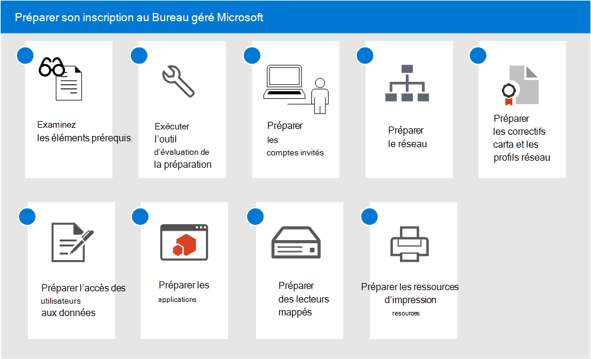

# Préparer son inscription au Bureau géré Microsoft

Ces sujets décrivent les étapes à suivre pour préparer l'inscription dans votre organisation, notamment la vérification du fait que votre environnement respecte les principales conditions préalables, la configuration des réseaux, la mise en place des certificats et la préparation de vos applications afin d’inclure ce service. Une fois que vous avez exécuté les outils d’évaluation de disponibilité, vous pouvez effectuer les autres étapes dans n’importe quel ordre ou en parallèle. Selon votre environnement, certaines étapes peuvent ne pas être pertinentes pour vous.

1. Examinez [Configuration requise pour le Bureau géré Microsoft](prerequisites.md).
2. Utiliser les [outils de préparation d’évaluation](readiness-assessment-tool.md).
3. [Conditions préalables pour les comptes invité](guest-accounts.md)
4. [Configuration du réseau pour Bureau géré Microsoft](network.md)
5. [Préparer les certificats et les profils réseau pour le Bureau géré Microsoft](certs-wifi-lan.md)
6. [Préparer l’accès aux ressources locales pour le Bureau géré Microsoft](authentication.md)
7. [Applications dans le Bureau géré Microsoft](apps.md)
8. [Préparer les lecteurs mappés pour le Bureau géré Microsoft](mapped-drives.md)
9. [Préparer des ressources d’impression pour le Bureau géré Microsoft](printing.md)
