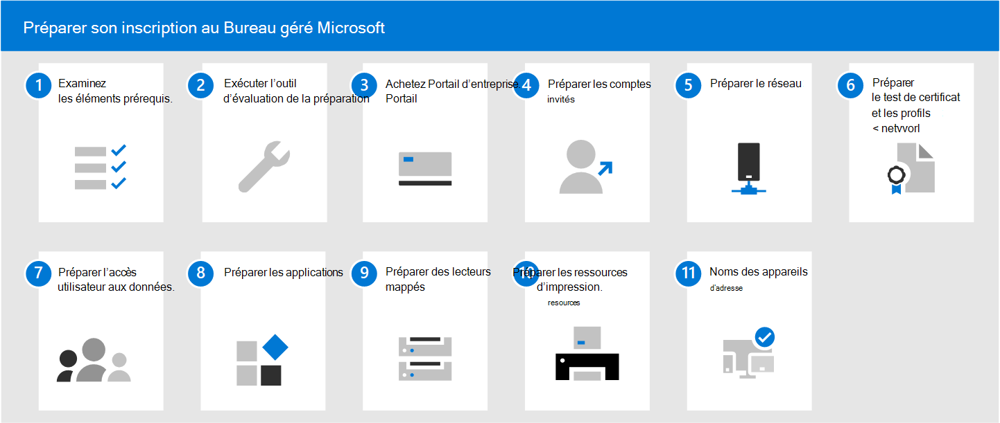

# Préparer son inscription au Bureau géré Microsoft

Ces sujets décrivent les étapes à suivre pour préparer l'inscription dans votre organisation, notamment la vérification du fait que votre environnement respecte les principales conditions préalables, la configuration des réseaux, la mise en place des certificats et la préparation de vos applications afin d’inclure ce service. Une fois que vous avez exécuté les outils d’évaluation de disponibilité, vous pouvez effectuer les autres étapes dans n’importe quel ordre ou en parallèle. Selon votre environnement, certaines étapes peuvent ne pas être pertinentes pour vous.

1. Examinez [Configuration requise pour le Bureau géré Microsoft](prerequisites.md).
2. Exécutez les [outils d’évaluation de la préparation](readiness-assessment-tool.md).
1. Achetez [Portail d’entreprise](../get-started/company-portal.md).
1. Passez en revue les [prérequis pour les comptes invités](guest-accounts.md).
1. Vérifiez la[configuration réseau](network.md).
1. [Préparer les certificats et les profils réseau](certs-wifi-lan.md).
1. [Préparer l’accès utilisateur aux données](authentication.md).
1. [Préparer les applications](apps.md).
1. [Préparer les lecteurs mappés](mapped-drives.md).
1. [Préparer les ressources d’impression](printing.md).
1. [noms d’appareil](address-device-names.md) d’une adresse.
