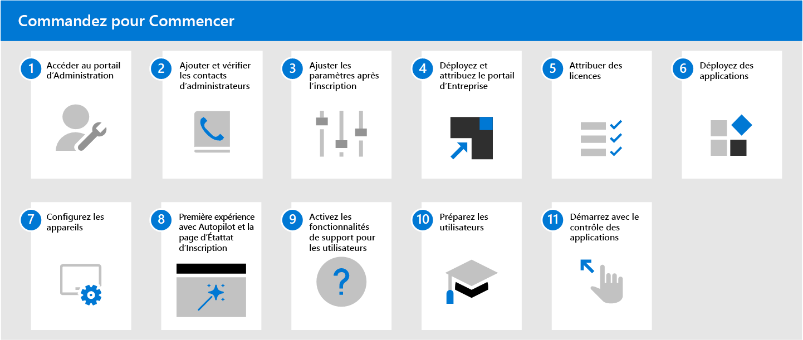

# Prise en main du Bureau géré Microsoft

Maintenant que vous êtes prêt à vous inscrire, ouvrez [ le gestionnaire de points de terminaison de Microsoft](https://endpoint.microsoft.com/)et naviguez vers **l'administration des locataires**. Sélectionnez **Inscription du locataire dans la** sous-section **Bureau géré Microsoft**, puis suivez l'assistant pour inscrire votre locataire dans le Bureau géré Microsoft.

> [!NOTE]
> Vous devez être connecté en tant qu'administrateur global pour compléter l'inscription. Pour plus d'informations, voir [l'accès au portail administratif ](access-admin-portal.md) pour plus de détails.

Une fois que vous avez terminé votre inscription, suivez les étapes ci-dessous pour configurer le service. Il s’agit de l’ordre recommandé pour suivre, mais vous disposez d’une certaine souplesse dans la séquence.

 

1. Accéder au[Portail d’administration](access-admin-portal.md).
1. [Ajouter et vérifier des contacts d’administrateur dans le portail d’administration](add-admin-contacts.md).
1. [Ajuster les paramètres après l’inscription](conditional-access.md).
1. Déployez et affectez le[Portail d’entreprise Intune](company-portal.md).
1. [Attribuer des licences](assign-licenses.md).
1. [Déployer des applications](deploy-apps.md).
1. [Configurer les appareils](set-up-devices.md).
1. Configurez l’[Expérience de première exécution avec Autopilot et la page d’état d’inscription](esp-first-run.md).
1. [Activer les fonctionnalités de support utilisateur](enable-support.md).
1. [Préparez vos utilisateurs à utiliser des appareils](get-started-devices.md).
1. [Démarrage avec le contrôle d’application](get-started-app-control.md).