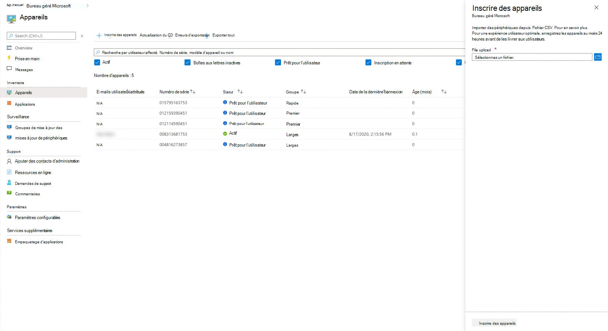

# <a name="register-existing-devices-yourself"></a>Inscrivez vous-même les appareils existant

>[!NOTE]
>Cette rubrique décrit les étapes à suivre pour réutiliser les appareils que vous avez déjà et les inscrire dans Bureau géré Microsoft. Si vous travaillez avec de nouveaux appareils, suivez plutôt les étapes de [l’Bureau géré Microsoft](register-devices-self.md) vous-même.

Le processus pour les partenaires est documenté dans la procédure [d’inscription](register-devices-partner.md)des appareils par les partenaires.

Bureau géré Microsoft peuvent fonctionner avec de nouveaux appareils ou vous pouvez réutiliser les appareils que vous avez peut-être déjà (ce qui nécessitera de les réimager). Vous pouvez inscrire des appareils avec des Bureau géré Microsoft dans le portail Microsoft Endpoint Manager web.

## <a name="prepare-to-register-existing-devices"></a>Préparer l’inscription des appareils existants


Pour inscrire des appareils existants, suivez les étapes suivantes :

1. [Obtenez le hachage matériel pour chaque appareil.](#obtain-the-hardware-hash)
2. [Fusionner les données de hachage](#merge-hash-data)
3. [Inscrivez les appareils dans Bureau géré Microsoft](#register-devices-by-using-the-admin-portal).
4. [Vérifiez que l’image est correcte.](#check-the-image)
5. [Remettre l’appareil](#deliver-the-device)

### <a name="obtain-the-hardware-hash"></a>Obtenir le hachage matériel

Bureau géré Microsoft identifie chaque appareil de manière unique en référentant son hachage matériel. Vous avez quatre options pour obtenir ces informations à partir des appareils que vous utilisez déjà :

- Demandez à votre fournisseur OEM le fichier d’inscription AutoPilot, qui inclut les hages matériels.
- Collectez des informations [dans Microsoft Endpoint Configuration Manager](#microsoft-endpoint-configuration-manager).
- Exécutez un Windows PowerShell script (à l’aide [](#manual-powershell-script-method) [d’Active Directory](#active-directory-powershell-script-method) ou manuellement sur chaque appareil) et collectez les résultats dans un fichier.
- Démarrez chaque appareil(mais ne terminez pas l’Windows de configuration) et collectez les hages sur un [lecteur flash amovible.](#flash-drive-method)

#### <a name="microsoft-endpoint-configuration-manager"></a>Microsoft Endpoint Configuration Manager

Vous pouvez utiliser Microsoft Endpoint Configuration Manager pour collecter les hages matériels à partir d’appareils existants que vous souhaitez inscrire auprès Bureau géré Microsoft.

> [!IMPORTANT]
> Tous les appareils pour qui vous souhaitez obtenir ces informations doivent être en cours d Windows 10 version 1703 ou ultérieure. 

Si vous avez satisfait à toutes ces conditions préalables, vous êtes prêt à collecter les informations en suivant les étapes suivantes :

1. Dans la console Configuration Manager, sélectionnez **Analyse.** 
2. Dans l’espace de  travail Surveillance, développez le nœud Rapports, développez **Rapports** et sélectionnez le nœud Matériel **-** Général. 
3. Exécutez le rapport, **Windows autopilot Device Information** et affichez les résultats.
4. Dans la visionneuse  de rapports, sélectionnez l’icône Exporter, puis choisissez l’option **CSV (délimitée** par des virgules).
5. Après avoir enregistré le fichier, vous devez filtrer les résultats uniquement sur les appareils que vous prévoyez d’inscrire auprès de Bureau géré Microsoft et télécharger les données sur Bureau géré Microsoft. Ouvrez Microsoft Endpoint Manager et accédez **au** menu Appareils, puis recherchez Bureau géré Microsoft section et sélectionnez **Appareils.** Sélectionnez **+ Inscrivez les** appareils, ce qui ouvre un fly-in pour inscrire de nouveaux appareils.


Pour plus [d’informations, voir Inscrire](#register-devices-by-using-the-admin-portal) des appareils à l’aide du portail d’administration.


#### <a name="active-directory-powershell-script-method"></a>Méthode de script PowerShell Active Directory

Dans un environnement Active Directory, vous pouvez utiliser l’applet de commande PowerShell pour collecter à distance les informations des appareils des groupes Active Directory à l’aide de `Get-WindowsAutoPilotInfo` WinRM. Vous pouvez également utiliser l’cmdlet et obtenir des résultats filtrés pour un nom de modèle matériel spécifique `Get-AD Computer` inclus dans le catalogue. Avant de poursuivre, confirmez d’abord ces conditions préalables, puis procédez comme vous le souhaitez :

- WinRM est activé.
- Les appareils que vous souhaitez inscrire sont actifs sur le réseau (c’est-à-dire qu’ils ne sont pas déconnectés ou désactivés).
- Assurez-vous que vous disposez d’un paramètre d’informations d’identification de domaine autorisé à s’exécuter à distance sur les appareils.
- Assurez-vous que Windows pare-feu autorise l’accès à WMI. Pour ce faire, procédez comme suit :

    1. Ouvrez le **Pare-feu Windows Defender** de contrôle et sélectionnez Autoriser une application ou **une fonctionnalité via Pare-feu Windows Defender**.
    
    2. Recherchez **Windows Management Instrumentation (WMI)** dans la liste, activez pour privé et **public,** puis sélectionnez **OK**.

1.  Ouvrez une invite PowerShell avec des droits d’administration.

2.  Exécutez *l’un* de ces scripts :

    ```powershell
    Install-script -name Get-WindowsAutoPilotInfo 
    #example one – leverage Get-ADComputer to enumerate devices 
    Get-ADComputer -filter * | powershell -ExecutionPolicy Unrestricted Get-WindowsAutoPilotInfo.ps1 -credential Domainname\<accountname>
    ```

    ```powershell 
    #example two – target specific devices: 
    Set-ExecutionPolicy powershell -ExecutionPolicy Unrestricted Get-WindowsAutoPilotInfo.ps1 -credential Domainname\<accountname> -Name Machine1,Machine2,Machine3
    ```

3. Accéder aux répertoires où il peut y avoir des entrées pour les appareils. Supprimez les entrées de chaque appareil de tous les répertoires, y compris Windows Services de domaine Active Directory server et Azure Active Directory.  N’ignorez pas que le processus de suppression peut prendre quelques heures.

4. Accéder aux services de gestion où il peut y avoir des entrées pour les appareils. Supprimez les entrées de chaque appareil de tous les services de gestion, y compris Microsoft Endpoint Configuration Manager, Microsoft Intune et Windows Autopilot.  N’ignorez pas que le processus de suppression peut prendre quelques heures.

Vous pouvez maintenant enregistrer [des appareils.](#register-devices-by-using-the-admin-portal)

#### <a name="manual-powershell-script-method"></a>Méthode de script PowerShell manuelle

1.  Ouvrez une invite PowerShell avec des droits d’administration.
2.  Exécuter `Install-Script -Name Get-WindowsAutoPilotInfo`
3.  Exécuter `powershell -ExecutionPolicy Unrestricted Get-WindowsAutoPilotInfo -OutputFile <path>\hardwarehash.csv`
4. [Fusionnez les données de hachage.](#merge-hash-data)

#### <a name="flash-drive-method"></a>Méthode de lecteur Flash

1. Sur un appareil autre que celui que vous inscrivez, insérez un lecteur USB.
2. Ouvrez une invite PowerShell avec des droits d’administration.
3. Exécuter `Save-Script -Name Get-WindowsAutoPilotInfo -Path <pathToUsb>`
4. Activer l’appareil que vous inscrivez, mais *ne démarrez pas l’expérience d’installation.* Si vous démarrez accidentellement l’expérience d’installation, vous devez réinitialiser ou réinitialiser l’appareil.
5. Insérez le lecteur USB, puis appuyez sur Shift + F10.
6. Ouvrez une invite PowerShell avec des droits d’administration, puis exécutez `cd <pathToUsb>` .
7. Exécuter `Set-ExecutionPolicy -ExecutionPolicy Unrestricted`
8. Exécuter `.\Get-WindowsAutoPilotInfo -OutputFile <path>\hardwarehash.csv`
9. Supprimez le lecteur USB, puis fermez l’appareil en exécutant `shutdown -s -t 0`
10. [Fusionnez les données de hachage.](#merge-hash-data)

>[!IMPORTANT]
>N’alimentation sur l’appareil que vous inscrivez à nouveau tant que vous n’avez pas terminé l’inscription pour celui-ci. 


### <a name="merge-hash-data"></a>Fusionner les données de hachage

Si vous avez collecté les données de hachage matériel par le manuel PowerShell ou les méthodes de disque mémoire flash, vous devez maintenant combiner les données dans les fichiers CSV en un seul fichier pour terminer l’inscription. Voici un exemple de script PowerShell pour faciliter l’accès :

```powershell
Import-CSV -Path (Get-ChildItem -Filter *.csv) | ConvertTo-Csv -NoTypeInformation | % {$_.Replace('"', '')} | Out-File .\aggregatedDevices.csv
```

Une fois les données de hachage fusionnées dans un fichier CSV, vous pouvez désormais enregistrer [les appareils.](#register-devices-by-using-the-admin-portal)


## <a name="register-devices-by-using-the-admin-portal"></a>Inscrire des appareils à l’aide du portail d’administration

Dans [Microsoft Endpoint Manager,](https://endpoint.microsoft.com/) **sélectionnez Appareils** dans le volet de navigation de gauche. Recherchez la Bureau géré Microsoft section du menu et sélectionnez **Appareils.** Dans l Bureau géré Microsoft de travail Appareils, sélectionnez **+** Inscrivez les appareils, qui ouvre un fly-in pour inscrire de nouveaux appareils.

<!-- Update with new picture [](../../media/new-registration-ui.png) -->


<!--Registering any existing devices with Managed Desktop will completely re-image them; make sure you've backed up any important data prior to starting the registration process.-->


Procédez comme suit :

1. Dans **le chargement de** fichier, fournissez un chemin d’accès au fichier CSV que vous avez créé précédemment.
2. Sélectionnez [un profil d’appareil](../service-description/profiles.md) dans le menu déroulant.
3. Sélectionnez **Enregistrer les appareils.** Le système ajoute les appareils à votre liste d’appareils sur le blade **Devices**, marqué comme **Étant en attente d’inscription.** L’inscription prend généralement moins de 10 minutes et, en cas de réussite, l’appareil s’affiche comme prêt pour l’utilisateur, ce qui signifie qu’il est prêt et attend qu’un utilisateur commence à l’utiliser. 

> [!NOTE]
> Si vous modifiez manuellement l’appartenance au groupe Azure Active Directory (AAD) d’un appareil, il sera automatiquement réassigné au groupe pour son profil d’appareil et supprimé des groupes en conflit.

Vous pouvez surveiller la progression de l’inscription de l’appareil sur la page principale. Les états possibles signalés sont les suivants :

| État | Description |
|---------------|-------------|
| Inscription en attente | L’inscription n’est pas encore terminée. Revenir plus tard. |
| Échec de l’inscription | L’inscription n’a pas pu être terminée. Pour plus [d’informations, voir](#troubleshooting-device-registration) Résolution des problèmes d’inscription de l’appareil. |
| Prêt pour l’utilisateur | L’inscription a réussi et l’appareil est maintenant prêt à être remis à l’utilisateur. Bureau géré Microsoft les guide tout au long de la première mise en place, il n’est donc pas nécessaire d’autres préparations. |
| Actif | L’appareil a été remis à l’utilisateur et il s’est inscrit auprès de votre client. Cela indique également qu’ils utilisent régulièrement l’appareil. |
| Inactif | L’appareil a été remis à l’utilisateur et il s’est inscrit auprès de votre client. Toutefois, ils n’ont pas utilisé l’appareil récemment (au cours des 7 derniers jours).  | 

### <a name="troubleshooting-device-registration"></a>Résolution des problèmes d’inscription de l’appareil

| Message d’erreur | Détails |
|---------------|-------------|
| Appareil in trouvé | Nous n’avons pas pu enregistrer cet appareil car nous n’avons pas pu trouver de correspondance pour le fabricant, le modèle ou le numéro de série fourni. Confirmez ces valeurs auprès de votre fournisseur d’appareils. |
| Hachage matériel non valide | Le hachage matériel que vous avez fourni pour cet appareil n’a pas été mis en forme correctement. Vérifiez à nouveau le hachage matériel, puis resoumettre. |
| Appareil déjà inscrit | Cet appareil est déjà inscrit dans votre organisation. Aucune action supplémentaire n’est requise. |
| Appareil revendiqué par une autre organisation | Cet appareil a déjà été revendiqué par une autre organisation. Vérifiez auprès de votre fournisseur d’appareils. |
| Erreur inattendue | Votre demande n’a pas pu être traitée automatiquement. Contactez le support technique et fournissez l’ID de demande : <requestId> |

## <a name="check-the-image"></a>Vérifier l’image

Si votre appareil est issu d’un fournisseur Bureau géré Microsoft partenaire, l’image doit être correcte.

Vous pouvez également appliquer l’image vous-même si vous le souhaitez. To get started, contact the Microsoft representative you’re working with and they will provide you the location and steps for applying the image.

## <a name="deliver-the-device"></a>Remettre l’appareil

> [!IMPORTANT]
> Avant de remettre l’appareil à votre utilisateur, assurez-vous que vous avez obtenu et appliqué les [licences](../get-ready/prerequisites.md) appropriées pour cet utilisateur.

Si toutes les licences sont appliquées, vous pouvez préparer vos utilisateurs à utiliser des [appareils,](get-started-devices.md)puis démarrer l’appareil et passer à l’expérience de Windows de configuration.


