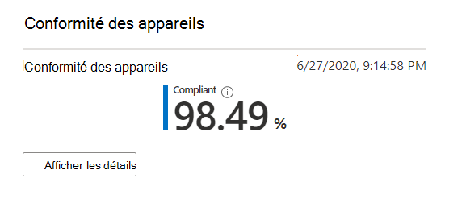

# Rapport de conformité de l'appareil.

Cette vue indique le pourcentage de vos appareils de bureau gérés par Microsoft qui sont conformes aux stratégies de conformité définies dans Microsoft Intune.

Sélectionnez **afficher les détails** pour afficher des informations spécifiques sur tous vos appareils de bureau gérés Microsoft ou uniquement sur les appareils qui ne sont pas conformes aux stratégies de conformité. Utilisez le menu déroulant pour basculer entre ces affichages. Pour apparaître dans cet affichage, un appareil doit être un ordinateur physique et être synchronisé avec Intune au cours des 30 derniers jours.

Dans cette vue, sélectionnez **Télécharger les données complètes** pour exporter un fichier délimité par des virgules avec les mêmes informations. Dans le fichier d’exportation, les zones affichées sous forme de **schéma** apparaissent sous forme de colonnes.