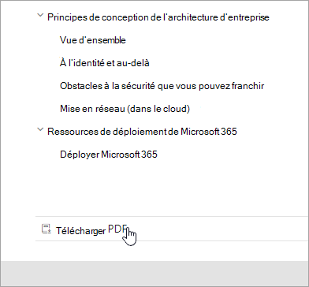
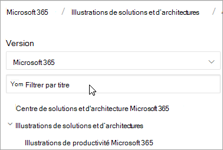
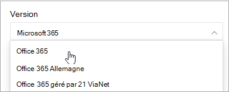
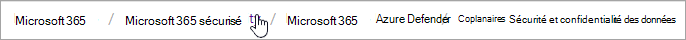
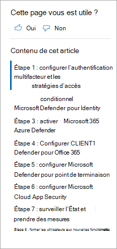
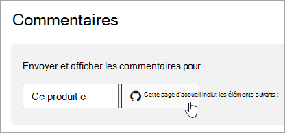

# Microsoft 365 de navigation de documents

Cette rubrique fournit des conseils et des astuces pour naviguer dans l’espace Microsoft 365 documentation technique.  

## Page hub

La page Microsoft 365 hub se trouve à l’endroit et constitue le point d’entrée pour la recherche de contenu [https://aka.ms/microsoft365docs](./index.yml) Microsoft 365 pertinent.

Vous pouvez toujours revenir à cette page en sélectionnant **Microsoft 365** dans l’en-tête en haut de chaque page de l’ensemble Microsoft 365 documentation technique suivante :

## Documentation hors connexion

Si vous souhaitez afficher la documentation Microsoft 365 sur un système hors connexion, vous pouvez créer un fichier PDF où que vous vous trouveriez dans la documentation Microsoft 365 technique.

Si vous souhaitez créer un fichier PDF, sélectionnez le lien Télécharger **pdf** en bas de chaque table des matières.

## Recherche TOC 
Sur docs.microsoft.com, vous pouvez effectuer une recherche dans le contenu de la table des matières à l’aide de la zone de recherche de filtre en haut :

## Filtre de version
La documentation Microsoft 365 fournit du contenu pour d’autres produits, notamment Office 365 Germany et Office 365 gérés par 21 Vianet (Chine). Les fonctionnalités peuvent varier d’une version à l’autre, parfois le contenu proprement dit peut varier.

Vous pouvez utiliser le filtre de version pour vous assurer que vous voyez le contenu de la version appropriée de Microsoft 365 :

## Breadcrumbs

Vous trouverez des barre de barre de chemin sous l’en-tête et au-dessus de la table des matières, et indiquez où se trouve l’article actuel dans la table des matières.  Cela permet non seulement de définir le contexte sur le type de contenu que vous lisez, mais il vous permet également de naviguer vers le haut de l’arborescence de la table des matières :

## Navigation dans la section Article

Le volet de navigation de droite vous permet d’accéder rapidement aux sections d’un article et d’identifier votre emplacement dans l’article.  

## Envoyer des commentaires sur les documents

Si vous trouvez un problème dans un article, vous pouvez envoyer des commentaires à l’équipe de contenu SQL pour cet article en faisant défiler vers le bas de la page et en sélectionnant commentaires sur le **contenu.**

## Contribuer à la Microsoft 365 documentation

Savez-vous que vous pouvez modifier le contenu sur docs.microsoft.com vous-même ? Si vous le faites, non seulement notre documentation s’améliorera, mais vous serez également crédité en tant que collaborateur de la page. Pour commencer, voir :

- [Guide de collaborateur Microsoft Docs](/contribute/)

## Étapes suivantes

- Mise en place de la [Microsoft 365 documentation technique.](index.yml)