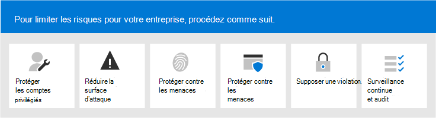
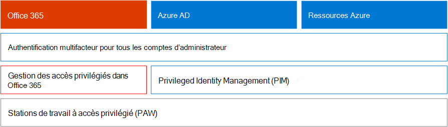
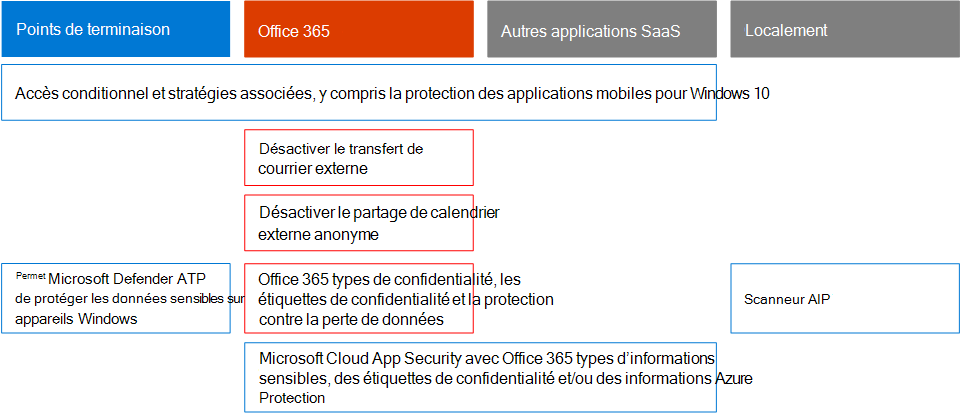

# Microsoft 365 Security for Business Decision Makers (BDMs)

Cet article décrit certains des scénarios de menace et d’attaque les plus courants auxquels sont confrontés les organisations pour leurs environnements Microsoft 365, ainsi que les actions recommandées pour atténuer ces risques. Bien que Microsoft 365 soit livré avec un large éventail de fonctionnalités de sécurité pré-configurées, vous devez également, en tant que client, prendre la responsabilité de sécuriser vos propres identités, données et appareils utilisés pour accéder aux services cloud. Ces conseils ont été développés par Kozeta Porte (architecte de sécurité Microsoft Cloud) et Thiagaraj Sundararajan (consultant senior Microsoft).

Cet article est organisé par priorité de travail, en commençant par la protection des comptes utilisés pour administrer les services et biens les plus critiques, tels que votre client, votre messagerie et SharePoint. Il fournit un moyen méthodique d’aborder la sécurité et fonctionne avec la feuille de calcul suivante afin que vous pouvez suivre votre progression avec les parties prenantes et les équipes au sein de votre organisation : sécurité [Microsoft 365](https://github.com/MicrosoftDocs/microsoft-365-docs/raw/public/microsoft-365/downloads/Microsoft-365-BDM-security-recommendations-spreadsheet.xlsx)pour les feuilles de calcul BDM . 

Microsoft vous fournit l’outil Score de sécurité au sein de votre client pour analyser automatiquement votre posture de sécurité en fonction de vos activités régulières, attribuer un score et fournir des recommandations d’amélioration de la sécurité. Avant d’agir sur les actions recommandées dans cet article, prenez note de votre score actuel et de vos recommandations. Les actions recommandées dans cet article augmenteront votre score. L’objectif n’est pas d’atteindre le score maximum, mais de prendre en compte les opportunités de protection de votre environnement d’une manière qui n’affecte pas la productivité de vos utilisateurs. Voir [Microsoft Secure Score](mtp/microsoft-secure-score.md).

Une chose de plus avant de commencer . . . n’oubliez [pas d’activer le journal d’audit.](../compliance/search-the-audit-log-in-security-and-compliance.md) Vous aurez besoin de ces données ultérieurement, dans le cas où vous devrez examiner un incident ou une violation. 

## Protéger les comptes privilégiés

Dans un premier temps, nous vous recommandons de vous assurer que les comptes critiques de l’environnement disposent d’une couche de protection supplémentaire, car ces comptes disposent d’accès et d’autorisations pour gérer et modifier les services et ressources critiques, ce qui peut avoir un impact négatif sur l’ensemble de l’organisation, en cas de compromission. La protection des comptes privilégiés est l’un des moyens les plus efficaces de se protéger contre une personne malveillante qui cherche à élever les autorisations d’un compte compromis à un compte administratif. 

|Recommandation  |E3 |E5  |
|---------|---------|---------|
|Appliquer l’authentification multifacteur (MFA) pour tous les comptes d’administration.||| 
|Implémentez Azure Active Directory (Azure AD) Privileged Identity Management (PIM) pour appliquer un accès privilégié juste-à-temps aux ressources Azure AD et Azure. Vous pouvez également découvrir qui a accès et passer en revue l’accès privilégié.|         | |
|Implémenter la gestion des accès privilégiés pour gérer le contrôle d’accès granulaire sur les tâches d’administration privilégiées dans Office 365. |         | |
|Configurer et utiliser des stations de travail à accès privilégié (PAW) pour administrer les services. N’utilisez pas les mêmes stations de travail pour naviguer sur Internet et vérifier les messages électroniques qui ne sont pas liés à votre compte d’administration.|  | | 

Le diagramme suivant illustre ces fonctionnalités.

Recommandations supplémentaires :
- Assurez-vous que les comptes synchronisés à partir de l’local ne se voit pas attribuer de rôles d’administrateur pour les services cloud. Cela permet d’empêcher un attaquant de tirer parti de comptes locaux pour obtenir un accès administratif aux services cloud. 
- Assurez-vous que les rôles d’administrateur ne sont pas attribués aux comptes de service. Ces comptes ne sont souvent pas surveillés et ne sont pas définies avec des mots de passe qui n’expirent pas. Commencez par vous assurer que les comptes de services AADConnect et ADFS ne sont pas des administrateurs globaux par défaut.
- Supprimez les licences des comptes d’administrateur. À moins qu’il n’existe un cas d’utilisation spécifique pour attribuer des licences à des comptes d’administrateur spécifiques, supprimez les licences de ces comptes. 

## Réduire la surface d’attaque

La zone de mise au point suivante consiste à réduire la surface d’attaque. Cela peut être réalisé avec un minimum d’efforts et d’impact sur vos utilisateurs et services. En réduisant la surface d’attaque, les attaquants ont moins de moyens de lancer une attaque contre votre organisation.

Voici quelques exemples :
- Désactivez les protocoles POP3, IMAP et SMTP. La plupart des organisations modernes n’utilisent plus ces anciens protocoles. Vous pouvez les désactiver en toute sécurité et autoriser les exceptions uniquement si nécessaire. 
- Réduisez et conservez le nombre minimal d’administrateurs globaux dans le client. Cela réduit directement la surface d’attaque pour toutes les applications cloud. 
- Retirez les serveurs et les applications qui ne sont plus utilisés dans votre environnement. 
- Implémenter un processus de désactivation et de suppression des comptes qui ne sont plus utilisés. 

## Se protéger contre les menaces connues

Les menaces connues incluent les programmes malveillants, les comptes compromis et le hameçonnage. Certaines protections contre ces menaces peuvent être implémentées rapidement sans impact direct sur vos utilisateurs, tandis que d’autres nécessitent plus de planification et de formation des utilisateurs. 

|Recommandation  |E3  |E5  |
|---------|---------|---------|
|**Configurer l’authentification multifacteur et utiliser les stratégies d’accès conditionnel recommandées,** y compris les stratégies de risque de la signature. Microsoft recommande et a testé un ensemble de stratégies qui fonctionnent ensemble pour protéger toutes les applications cloud, y compris les services Office 365 et Microsoft 365. Voir [configurations d’identité et d’accès aux appareils.](./office-365-security/microsoft-365-policies-configurations.md) | ||
|**Exiger l’authentification multifacteur pour tous les utilisateurs.** Si vous n’avez pas la licence requise pour implémenter les stratégies d’accès conditionnel recommandées, exigez au minimum une authentification multifacteur pour tous les utilisateurs.|||
|**Augmentez le niveau de protection contre les programmes malveillants dans la messagerie.** Votre environnement Office 365 ou Microsoft 365 inclut une protection contre les programmes malveillants, mais vous pouvez augmenter cette protection en bloquant les pièces jointes avec des types de fichiers couramment utilisés pour les programmes malveillants.|||
|**Protégez votre courrier électronique contre les attaques par hameçonnage ciblées.** Si vous avez configuré un ou plusieurs domaines personnalisés pour votre environnement Office 365 ou Microsoft 365, vous pouvez configurer une protection anti-hameçonnage ciblée. La protection anti-hameçonnage, qui fait partie de Defender pour Office 365, peut aider à protéger votre organisation contre les attaques par hameçonnage basées sur l’emprunt d’identité malveillant et d’autres attaques par hameçonnage. Si vous n’avez pas configuré de domaine personnalisé, vous n’avez pas besoin de le faire.| ||
|**Protégez-vous contre les attaques par ransomware dans le courrier électronique.** Un ransomware vous permet d’accéder à vos données en chiffrant des fichiers ou en verrouiller les écrans d’ordinateur. Il tente ensuite d’extorquer de l’argent à des personnes victime en demandant « rançon », généralement sous forme de cryptomonnaie telle que Cryptograph, en échange du renvoi de l’accès à vos données. Vous pouvez vous défendre contre les ransomware en créant une ou plusieurs règles de flux de messagerie pour bloquer les extensions de fichier couramment utilisées pour les ransomware, ou pour avertir les utilisateurs qui reçoivent ces pièces jointes par courrier électronique.|||
|Bloquez les connexions en provenance des pays avec qui vous **n’avez pas d’activité.** Créez une stratégie d’accès conditionnel Azure AD pour bloquer les connexions provenant de ces pays, créant ainsi efficacement un pare-feu géographique autour de votre client.| ||

Le diagramme suivant illustre ces fonctionnalités.

## Se protéger contre les menaces inconnues

Après avoir ajouté des protections supplémentaires à vos comptes privilégiés et protégé contre les attaques connues, faites attention à la protection contre les menaces inconnues. Les adversaires plus déterminés et avancés utilisent des méthodes innovantes et nouvelles et inconnues pour attaquer les organisations. Grâce à la grande télémétrie de données de Microsoft recueillie sur des milliards d’appareils, d’applications et de services, nous sommes en mesure d’effectuer Defender pour Office 365 sur Windows, Office 365 et Azure pour empêcher les attaques zero day, l’utilisation d’environnements de bac à sable et la vérification de la validité avant d’autoriser l’accès à votre contenu. 

|Recommandation  |E3  |E5  |
|---------|---------|---------|
|**Configurez Microsoft Defender pour Office 365**: * Pièces jointes sécurisées * Liens sécurisés * ATP pour SharePoint, OneDrive et Microsoft Teams * Anti-hameçonnage dans Defender pour la protection Office 365|         | |
|**Configurez Microsoft Defender pour les fonctionnalités de point de terminaison**: * Windows Defender Antivirus  * Exploit Protection   * Réduction de la surface d’attaque   * Isolation matérielle  * Accès contrôlé aux dossiers     |         | |
|**Utilisez Microsoft Cloud App Security pour** découvrir les applications SaaS et commencer à utiliser l’analyse du comportement et la détection des anomalies. |         | |

Le diagramme suivant illustre ces fonctionnalités.

Recommandations supplémentaires :
- Sécuriser les communications de canal partenaire telles que les e-mails à l’aide de TLS.
- Ouvrez Teams Federation uniquement pour les partenaires avec qui vous communiquez.
- N’ajoutez pas de domaines d’expéditeurs, d’expéditeurs individuels ou d’adresses IP sources à votre liste d’adresses électroniques, car cela permet de contourner les contrôles de courrier indésirable et de programmes malveillants . Une pratique courante chez les clients consiste à ajouter leurs propres domaines acceptés ou un certain nombre d’autres domaines où des problèmes de flux de messagerie peuvent avoir été signalés à la liste d’adresses. N’ajoutez pas de domaines dans la liste Filtrage du courrier indésirable et des connexions, car cela contourne potentiellement toutes les vérifications de courrier indésirable. 
- Activer les notifications de courrier indésirable sortant : activez les notifications de courrier indésirable sortant vers une liste de distribution en interne à l’équipe du service d’aide ou d’administration informatique pour signaler si l’un des utilisateurs internes envoie des courriers indésirables en externe. Il peut s’agit d’un indicateur de compromissions du compte.
- Désactivez Remote PowerShell pour tous les utilisateurs — Remote PowerShell est principalement utilisé par les administrateurs pour accéder aux services à des fins administratives ou à des fins d’accès à l’API par programme. Nous vous recommandons de désactiver cette option pour les utilisateurs non administrateurs afin d’éviter la reconnaissance, sauf s’ils ont besoin d’y accéder. 
- Bloquer l’accès au portail de gestion Microsoft Azure à tous les non-administrateurs. Pour ce faire, vous pouvez créer une règle d’accès conditionnel pour bloquer tous les utilisateurs, à l’exception des administrateurs. 

## Supposer une violation

Bien que Microsoft prenne toutes les mesures possibles pour empêcher les menaces et les attaques, nous vous recommandons de toujours travailler dans la logique « Supposer une violation ». Même si une personne malveillante a réussi à s’identiser dans l’environnement, nous devons nous assurer qu’elle ne peut pas exfiltrer les données ou les informations d’identité de l’environnement. Pour cette raison, nous vous recommandons d’activer la protection contre les fuites de données sensibles telles que les numéros de sécurité sociale, les numéros de cartes de crédit, les informations personnelles supplémentaires et d’autres informations confidentielles au niveau de l’organisation. 

La logique « Supposer une violation » nécessite l’implémentation d’une stratégie de réseau de confiance zéro, ce qui signifie que les utilisateurs ne sont pas entièrement fiables simplement parce qu’ils sont internes au réseau. Au lieu de cela, dans le cadre de l’autorisation de ce que les utilisateurs peuvent faire, des ensembles de conditions sont spécifiés et lorsque ces conditions sont remplies, certains contrôles sont appliqués. Les conditions peuvent inclure l’état d’état de l’appareil, l’accès à l’application, les opérations effectuées et les risques pour l’utilisateur. Par exemple, une action d’inscription d’appareil doit toujours déclencher l’authentification MFA pour s’assurer qu’aucun périphérique rouge n’est ajouté à votre environnement. 

Une stratégie de réseau de confiance zéro nécessite également que vous connaissiez l’endroit où vos informations sont stockées et que vous appliquiez les contrôles appropriés pour la classification, la protection et la rétention. Pour protéger efficacement vos biens les plus critiques et sensibles, vous devez d’abord identifier où ils se trouvent et faire l’inventaire, ce qui peut être difficile. Ensuite, travaillez avec votre organisation pour définir une stratégie de gouvernance. La définition d’un schéma de classification pour une organisation et la configuration de stratégies, d’étiquettes et de conditions nécessitent une planification et une préparation minutieuses. Il est important de savoir qu’il ne s’agit pas d’un processus piloté par l’it. N’oubliez pas de travailler avec votre équipe juridique et de conformité pour développer une classification et un schéma d’étiquetage appropriés pour les données de votre organisation.

Les fonctionnalités de protection des informations de Microsoft 365 peuvent vous aider à découvrir les informations dont vous avez besoin, l’endroit où elles sont stockées et les informations qui nécessitent une protection supplémentaire. La protection des informations est un processus continu et les fonctionnalités de Microsoft 365 vous offrent une visibilité sur la façon dont les utilisateurs utilisent et distribuent des informations sensibles, l’endroit où vos informations sont actuellement stockées et où elles circulent. Vous pouvez également voir comment les utilisateurs gèrent les informations réglementées pour s’assurer que les étiquettes et protections appropriées sont appliquées.

|Recommandation |E3|E5 |
|---------|---------|---------|
|**Examinez et optimisez votre accès conditionnel et les stratégies associées** pour vous aligner sur vos objectifs pour un réseau de confiance zéro . La protection contre les menaces connues inclut l’implémentation d’un ensemble de [stratégies recommandées.](./office-365-security/microsoft-365-policies-configurations.md) Examinez votre implémentation de ces stratégies pour vous assurer que vous protégez vos applications et vos données contre les pirates informatiques qui ont accédé à votre réseau. Notez que la stratégie recommandée de protection des applications Intune pour Windows 10 active la Protection des informations Windows (WIP). Wip protège contre les fuites accidentelles de données de votre organisation par le biais d’applications et de services, tels que le courrier électronique, les réseaux sociaux et le cloud public. |         ||
|**Désactiver le forwarding de courrier externe.** Les pirates informatiques qui accèdent à la boîte aux lettres d’un utilisateur peuvent dérober votre courrier en la faisant automatiquement suivre. Cela peut se produire même sans la sensibilisation de l’utilisateur. Vous pouvez empêcher cela en configurant une règle de flux de messagerie.| ||
|**Désactiver le partage de calendrier externe anonyme.** Par défaut, le partage de calendrier anonyme externe est autorisé. [Désactivez le partage de calendrier](/exchange/sharing/sharing-policies/modify-a-sharing-policy) pour réduire les fuites potentielles d’informations sensibles.| ||
|**Configurer des stratégies de protection contre la perte de données pour les données sensibles.** Créez une stratégie de protection contre la perte de données dans le Centre de conformité de la sécurité pour découvrir et protéger les données sensibles telles que les numéros de carte de crédit, les numéros de sécurité sociale et les numéros &amp; de compte bancaire. Microsoft 365 inclut de nombreux types d’informations sensibles prédéfincis que vous pouvez utiliser dans les stratégies de protection contre la perte de données. Vous pouvez également créer vos propres types d’informations sensibles pour les données sensibles personnalisées dans votre environnement. |||
|**Implémenter des stratégies de classification des données et de protection des informations.** Implémentez des étiquettes de niveau de sensibilité et utilisez-les pour classer et appliquer la protection aux données sensibles. Vous pouvez également utiliser ces étiquettes dans les stratégies de protection contre la perte de données. Si vous utilisez des étiquettes Azure Information Protection, nous vous recommandons d’éviter de créer de nouvelles étiquettes dans d’autres centres d’administration.|         ||
|**Protéger les données dans les applications et services tiers à l’aide de Cloud App Security**. Configurez les stratégies Cloud App Security pour protéger les informations sensibles sur des applications cloud tierces, telles que Salesforce, Box ou Dropbox. Vous pouvez utiliser les types d’informations sensibles et les étiquettes de confidentialité que vous avez créées dans les stratégies Cloud App Security et les appliquer à vos applications SaaS.   Microsoft Cloud App Security vous permet d’appliquer un large éventail de processus automatisés. Les stratégies peuvent être définies pour fournir des analyses de conformité continues, des tâches eDiscovery juridiques, la protection contre la protection contre la courrier électronique (DLP) pour le contenu sensible partagé publiquement, et bien plus encore. Cloud App Security peut surveiller n’importe quel type de fichier en fonction de plus de 20 filtres de métadonnées (par exemple, niveau d’accès, type de fichier). |         ||
|**Utilisez [Microsoft Defender pour le point de terminaison pour](/windows/security/threat-protection/microsoft-defender-atp/information-protection-in-windows-overview) identifier si les utilisateurs stockent des informations sensibles sur leurs appareils Windows.** |         ||
|**Utilisez le [scanneur AIP](/azure/information-protection/deploy-aip-scanner) pour identifier et classer les informations sur les serveurs et les partages de fichiers.** Utilisez l’outil de rapports AIP pour afficher les résultats et prendre les mesures appropriées.|         ||

Le diagramme suivant illustre ces fonctionnalités.

## Surveillance et audit continus

Enfin, la surveillance et l’audit continus de l’environnement Microsoft 365 avec Windows et les appareils sont essentiels pour vous assurer que vous êtes en mesure de détecter et de corriger rapidement les intrusions. Les outils tels que le Score de sécurité, le Centre de sécurité et l’analyse avancée de Microsoft Intelligent Graph fournissent des informations précieuses sur votre client et lier de grandes quantités de données sur la sécurité et l’intelligence des menaces pour vous fournir une protection et une détection contre les menaces inédites.

|Recommandation |E3 |E5 |
|---------|---------|---------|
|Assurez-vous **que le journal d’audit** est allumé.|||
|**Examiner le score de sécurisation** toutes les semaines — Le score de sécurité est un emplacement central pour accéder au statut de sécurité de votre entreprise et prendre des mesures en fonction des recommandations de niveau de sécurité. Il est recommandé d’effectuer cette vérification toutes les semaines.|||
|Utilisez **les outils Microsoft Defender pour Office 365** : * Fonctionnalités d’examen et de réponse aux menaces  * Examen et réponse automatisés |         ||
|Utilisez **Microsoft Defender pour le point de terminaison**:  *    [Détection et réponse des points de terminaison](/windows/security/threat-protection/microsoft-defender-atp/overview-endpoint-detection-response)   * Examen automatisé et score de sécurisation de correction  *    [Recherche avancée](/windows/security/threat-protection/microsoft-defender-atp/advanced-hunting-overview)  |         ||
|Utilisez **Microsoft Cloud App Security** pour détecter des comportements inhabituels dans les applications cloud afin d’identifier les ransomware, les utilisateurs compromis ou les applications malveillantes, d’analyser l’utilisation à risque élevé et de corriger automatiquement les risques pour votre organisation.|         ||
|Utilisez **Microsoft Azure Sentinel ou** votre outil SIEM actuel pour surveiller les menaces au sein de votre environnement. |         ||
|**Déployez [Microsoft Defender pour l’identité](/azure-advanced-threat-protection/what-is-atp)** pour surveiller et protéger contre les menaces ciblant votre environnement Active Directory local.   |         | |
|Utilisez **Azure Defender** _ pour surveiller les menaces sur les charges de travail hybrides et cloud. Azure Defender_ inclut un niveau gratuit de fonctionnalités et un niveau standard de fonctionnalités qui sont payés en fonction des heures de ressources ou des transactions.|         |         |

Le diagramme suivant illustre ces fonctionnalités.

Principales actions de surveillance recommandées :
- **Examinez le Score de sécurité Microsoft** toutes les semaines — Le niveau de sécurité est un emplacement central pour accéder à l’état de sécurité de votre client et prendre des mesures en fonction des recommandations les plus importantes. Il est recommandé d’effectuer cette vérification toutes les semaines. Le niveau de sécurisation inclut des recommandations d’Azure AD, d’Intune, de Cloud App Security et de Microsoft Defender pour endpoint, ainsi que d’Office 365. 
- **Passer en revue les connexions risquées** toutes les semaines : utilisez le Centre d’administration Azure AD pour passer en revue les connexions risquées toutes les semaines. L’ensemble de règles d’accès aux identités et appareils recommandé inclut une stratégie pour appliquer la modification du mot de passe aux connecteurs à risque.  
-  Passer en revue les principaux utilisateurs de programmes malveillants et de hameçonnage chaque semaine : utilisez Microsoft Defender pour l’Explorateur de menaces Office 365 pour passer en revue les principaux utilisateurs ciblés avec des programmes malveillants et le hameçonnage et pour connaître la cause première de l’impact de ces utilisateurs.