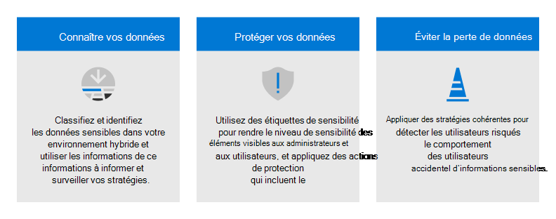

# Plan de déploiement zéro trust Microsoft 365

Cet article fournit un plan de déploiement pour la création **d’une sécurité De confiance** zéro avec Microsoft 365. La confiance zéro est un nouveau modèle de sécurité qui suppose une violation et vérifie chaque demande comme si elle provenait d’un réseau non contrôlé. Quel que soit l’origine de la demande ou la ressource à laquelle elle accède, le modèle de confiance zéro nous apprend à « ne jamais faire confiance, toujours vérifier ».

## Architecture de sécurité de confiance zéro

Une approche de confiance zéro s’étend à l’ensemble du patrimoine numérique et fait office de philosophie de sécurité intégrée et de stratégie de bout en bout. 

Cette illustration fournit une représentation des principaux éléments qui contribuent à la confiance zéro.

<!---

-->

:::image type="content" source="../media/zero-trust/zero-trust-architecture.png" alt-text="Architecture de sécurité de confiance zéro" lightbox="../media/zero-trust/zero-trust-architecture.png":::

Dans cette illustration :
- L’application de la stratégie de sécurité est au centre d’une architecture de confiance zéro. Cela inclut l’authentification multifacteur avec accès conditionnel qui prend en compte les risques de compte d’utilisateur, l’état de l’appareil et d’autres critères et stratégies que vous définissez.
- Les identités, les appareils, les données, les applications, le réseau et d’autres composants d’infrastructure sont tous configurés avec une sécurité appropriée. Les stratégies configurées pour chacun de ces composants sont coordonnées avec votre stratégie de confiance zéro globale. Par exemple, les stratégies d’appareil déterminent les critères d’appareils sains et les stratégies d’accès conditionnel nécessitent des appareils sains pour accéder à des applications et données spécifiques.
- La protection contre les menaces et l’intelligence surveillent l’environnement, les risques actuels et prennent des mesures automatisées pour corriger les attaques.

<!---
For more information about this architecture, including deployment objectives for your entire digital estate, see [Zero Trust Rapid Modernization Plan (RaMP)](https://review.docs.microsoft.com/security/zero-trust/zero-trust-ramp-overview?branch=zt-content-prototype). 
-->

Pour plus d’informations sur la confiance zéro, voir le Centre d’aide sur la confiance [**zéro de**](/security/zero-trust) Microsoft.

## Déploiement de la confiance zéro pour Microsoft 365

Microsoft 365 est conçue intentionnellement avec de nombreuses fonctionnalités de sécurité et de protection des informations pour vous aider à créer une confiance zéro dans votre environnement. De nombreuses fonctionnalités peuvent être étendues pour protéger l’accès aux autres applications SaaS utilisées par votre organisation et aux données de ces applications.

Cette illustration représente le travail de déploiement des fonctionnalités de confiance zéro. Ce travail est divisé en unités de travail qui peuvent être configurées ensemble, en partant du bas et en travaillant jusqu’en haut pour s’assurer que le travail prérequis est terminé.

:::image type="content" source="../media/zero-trust/m365-zero-trust-deployment-stack.png" alt-text="Pile de déploiement Microsoft 365 de confiance zéro" lightbox="../media/zero-trust/m365-zero-trust-deployment-stack.png":::

Dans cette illustration :
- La confiance zéro commence par une base de protection des identités et des appareils. 
- Les fonctionnalités de protection contre les menaces reposent sur ces bases pour fournir une surveillance et une correction en temps réel des menaces de sécurité. 
- La protection et la gouvernance des informations fournissent des contrôles sophistiqués destinés à des types spécifiques de données afin de protéger vos informations les plus précieuses et de vous aider à respecter les normes de conformité, y compris la protection des informations personnelles.

## Étape 1. Configurer la protection des identités et de l’accès aux appareils avec confiance zéro : stratégies de départ

La première étape consiste à créer votre base de confiance zéro en configurant la protection des identités et de l’accès aux appareils. 

:::image type="content" source="../media/zero-trust/m365-zero-trust-architecture-step-1b.png" alt-text="Configurer la protection d’accès aux appareils et aux identités de confiance zéro" lightbox="../media/zero-trust/m365-zero-trust-architecture-step-1b.png":::

Accédez [**à la protection d’accès**](office-365-security/microsoft-365-policies-configurations.md) aux identités et aux appareils Confiance Zéro pour obtenir des instructions pour y parvenir. Cette série d’articles décrit un ensemble de configurations requises pour l’accès aux identités et aux appareils, ainsi qu’un ensemble de stratégies d’accès conditionnel Azure Active Directory (Azure AD), de Microsoft Intune et d’autres stratégies pour sécuriser l’accès aux Microsoft 365  pour les applications et services cloud d’entreprise, d’autres services SaaS et les applications sur site publiées avec Azure AD proxy d’application.

|Inclut  |Configuration requise  |N’inclut pas  |
|---------|---------|---------|
|Stratégies d’accès aux identités et appareils recommandées pour trois niveaux de protection : - Point de départ - Enterprise (recommandé) - Spécialisé  Recommandations supplémentaires pour : - Utilisateurs externes (invités) - Microsoft Teams - SharePoint Online - Microsoft Defender pour les applications cloud| Microsoft E3 ou E5  Azure Active Directory dans l’un de ces modes : - Cloud uniquement - Hybride avec authentification de synchronisation de hachage de mot de passe (PHS) - Hybride avec authentification directe (PTA) - Fédéré     |Inscription des appareils pour les stratégies qui nécessitent des appareils gérés. Voir « Gérer les points de terminaison avec Intune » pour inscrire des appareils |
| | | |

Commencez par implémenter le niveau de départ. Ces stratégies ne nécessitent pas l’inscription d’appareils à la gestion. 

:::image type="content" source="../media/zero-trust/identity-access-starting-point-tier.png" alt-text="Stratégies d’accès aux identités et appareils de confiance zéro : niveau de départ" lightbox="../media/zero-trust/identity-access-starting-point-tier.png":::

## Étape 2. Gérer les points de terminaison avec Intune

Ensuite, inscrivez vos appareils à la gestion et commencez à les protéger avec des contrôles plus sophistiqués. 

:::image type="content" source="../media/zero-trust/m365-zero-trust-architecture-step-2.png" alt-text="Gérer les points de terminaison avec Intune" lightbox="../media/zero-trust/m365-zero-trust-architecture-step-2.png":::

Go to [**Manage devices with Intune**](../solutions/manage-devices-with-intune-overview.md) for prescriptive guidance to accomplish this. 

|Inclut  |Configuration requise  |N’inclut pas  |
|---------|---------|---------|
|Inscrire des appareils avec Intune - Appareils d’entreprise - Autopilot/automated - inscription  Configurer des stratégies - Stratégies de protection des applications - Stratégies de conformité - Stratégies de profil d’appareil | Inscrire les points de terminaison avec Azure AD     | Configuration des fonctionnalités de protection des informations, notamment : - Types d’informations sensibles - Étiquettes - Stratégies DLP Pour ces fonctionnalités, voir l’étape 5. Protéger et régir les données (plus loin dans cet article).       |
|    |         |         |

## Étape 3. Ajouter une protection d’identité et d’accès aux appareils de confiance Enterprise stratégies

Une fois les appareils inscrits à la gestion, vous pouvez désormais implémenter l’ensemble complet des stratégies d’accès aux appareils et aux identités Zero Trust recommandées, nécessitant des appareils conformes.

:::image type="content" source="../media/zero-trust/m365-zero-trust-architecture-enterprise-policies.png" alt-text="Stratégies d’accès et d’identité de confiance zéro avec la gestion des appareils" lightbox="../media/zero-trust/m365-zero-trust-architecture-enterprise-policies.png":::

Revenir aux [**stratégies communes d’accès aux**](office-365-security/identity-access-policies.md) appareils et aux identités et ajouter les stratégies dans le Enterprise niveau.  

:::image type="content" source="../media/zero-trust/identity-access-enterprise-tier.png" alt-text="Stratégies d’accès et d’identité Enterprise confiance zéro — niveau de confiance Enterprise (recommandé)" lightbox="../media/zero-trust/identity-access-enterprise-tier.png":::

## Étape 4. Évaluer, piloter et déployer des Microsoft 365 Defender

Microsoft 365 Defender est une solution XDR (détection et réponse étendue) qui collecte, met en corrélation et analyse automatiquement les données de signal, de menace et d’alerte à partir de votre environnement Microsoft 365, y compris les points de terminaison, la messagerie électronique, les applications et les identités.

:::image type="content" source="../media/zero-trust/m365-zero-trust-architecture-defender.png" alt-text="Ajout de Microsoft 365 Defender à l’architecture de confiance zéro" lightbox="../media/zero-trust/m365-zero-trust-architecture-defender.png":::

Go to [**Evaluate and pilot Microsoft 365 Defender**](defender/eval-overview.md) for a methodical guide to piloting and deploying Microsoft 365 Defender components. 

|Inclut  |Configuration requise  |N’inclut pas  |
|---------|---------|---------|
| Configurer l’environnement d’évaluation et pilote pour tous les composants : - Defender pour l’identité - Defender for Office 365 - Defender pour le point de terminaison - Microsoft Defender pour les applications cloud  Protéger contre les menaces   Examiner les menaces et y répondre   | Consultez les instructions pour en savoir plus sur les exigences en matière d’architecture pour chaque composant de Microsoft 365 Defender.        | Azure AD Identity Protection n’est pas inclus dans ce guide de solution. Elle est incluse à l’étape 1 : Configurer la protection d’accès aux appareils et aux identités de confiance zéro.        |
|    |         |         |

## Étape 5. Protéger et régir les données sensibles

Implémentez Microsoft Information Protection (MIP) pour vous permettre de découvrir, classifier et protéger les informations sensibles où qu’elles se trouvent.

Les fonctionnalités MIP sont incluses dans la Conformité Microsoft 365 et vous donnent les outils nécessaires pour vous permettre de connaître vos données, protéger vos données et éviter la perte de vos données.

:::image type="content" source="../media/zero-trust/m365-zero-trust-architecture-info-protect.png" alt-text="Les fonctionnalités de protection des informations protègent les données par le biais de l’application de la stratégie" lightbox="../media/zero-trust/m365-zero-trust-architecture-info-protect.png":::

Bien que ce travail soit représenté en haut de la pile de déploiement illustrée plus haut dans cet article, vous pouvez commencer ce travail à tout moment. 

Protection des données Microsoft fournit une infrastructure, un processus et des fonctionnalités que vous pouvez utiliser pour atteindre vos objectifs métier spécifiques.

Pour plus d’informations sur la façon de planifier et de déployer la protection des informations, voir [**Deploy a Protection des données Microsoft solution**](../compliance/information-protection-solution.md). 

Si vous déployez la protection des informations pour les réglementations en matière de confidentialité des données, ce guide de solution fournit une infrastructure recommandée pour l’ensemble du processus : déployer la protection des informations pour les réglementations en matière de confidentialité des données avec [**Microsoft 365**](../solutions/information-protection-deploy.md).