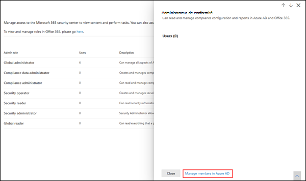
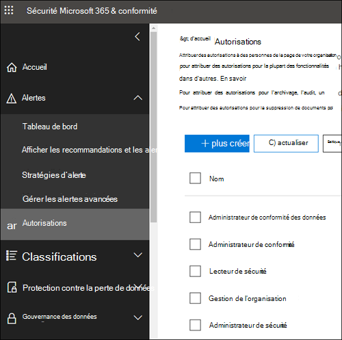

# Autorisations dans le Centre de conformité Microsoft 365 et le Centre de sécurité Microsoft 365

[!INCLUDE [Microsoft 365 Defender rebranding](../includes/microsoft-defender-for-office.md)]

**S’applique à**
- [Exchange Online Protection](exchange-online-protection-overview.md)
- [Microsoft Defender pour Office 365 Plan 1 et Plan 2](defender-for-office-365.md)
- [Microsoft 365 Defender](../defender/microsoft-365-defender.md)

Votre organisation doit gérer les scénarios de sécurité et de conformité qui s’étendent sur tous les services Microsoft 365. Vous aurez besoin de flexibilité requise pour accorder les autorisations d’administrateur aux bonnes personnes du groupe informatique de votre organisation. En utilisant le Centre de sécurité Microsoft 365 ou le Centre de conformité Microsoft 365, vous pouvez gérer les autorisations de façon centralisée pour toutes les tâches liées à la sécurité ou à la conformité.

Une fois que l’administrateur général a attribué ces rôles d’administrateur, les administrateurs ont accès à des fonctionnalités et données qui couvrent tous les services dans Microsoft 365, tels que le Centre de sécurité Microsoft 365, le Centre de conformité Microsoft 365, Azure, Office 365 et Enterprise Mobility + Security.

## Quels sont les rôles Microsoft 365 ?

Les rôles qui apparaissent dans le Centre de conformité Microsoft 365 et le Centre de sécurité Microsoft 365 sont les rôles Azure Active Directory. Ces rôles sont conçus pour s’aligner sur les fonctions du groupe informatique de votre organisation, ce qui permet de donner à vos utilisateurs les autorisations nécessaires pour accomplir leur travail.

****

|Role|Description|
|---|---|
|**Administrateur général**|Accède à toutes les fonctionnalités d’administration de tous les services Microsoft 365. Seuls les administrateurs généraux peuvent affecter d’autres rôles d’administrateur. Pour plus d’informations, consultez la section [Administrateur Général / Administrateur d’entreprise](/azure/active-directory/roles/permissions-reference#global-administrator--company-administrator).|
|**Administrateur de conformité des données**|Effectue un suivi des données de votre organisation dans Microsoft 365, vérifie qu’elles sont protégées et obtient des informations sur les problèmes liés à l’atténuation des risques. Pour en savoir plus, consultez la section [Administrateur de conformité des données](/azure/active-directory/roles/permissions-reference#compliance-data-administrator).|
|**Administrateur de conformité**|Aide votre organisation à respecter les exigences réglementaires, gère les cas de découverte électronique et gère les stratégies de gouvernance des données sur les emplacements, les identités et les applications Microsoft 365. Pour en savoir plus, consultez la section [Administrateur de conformité](/azure/active-directory/roles/permissions-reference#compliance-administrator).|
|**Opérateur de sécurité**|Consulter, examiner et répondre aux menaces actives envers vos utilisateurs, appareils et contenus Microsoft 365. Pour plus d’informations, voir la section [Opérateur de sécurité](/azure/active-directory/roles/permissions-reference#security-operator).|
|**Lecteur de sécurité**|Consulte et examine les menaces actives envers vos utilisateurs, appareils et contenus Microsoft 365, mais, contrairement à l’opérateur de sécurité, il n’est pas autorisé à répondre par une action. Pour plus d’informations, voir la section [Lecteur de sécurité](/azure/active-directory/roles/permissions-reference#security-reader).|
|**Administrateur de sécurité**|Contrôle la sécurité globale de votre organisation en gérant les stratégies de sécurité, en examinant les analyses de la sécurité et les rapports sur les produits Microsoft 365 et en se tenant à jour sur les menaces. Pour plus d’informations, voir la section [Administrateur de sécurité](/azure/active-directory/roles/permissions-reference#security-administrator).|
|**Lecteur général**|Version en lecture seule du rôle **Administrateur général**. Affiche tous les paramètres et informations administratives dans Microsoft 365. Pour plus d’informations, consultez [Lecteur général](/azure/active-directory/roles/permissions-reference#global-reader).|
|

## Les administrateurs généraux peuvent gérer les rôles dans Azure Active Directory

Dans le Centre de conformité Microsoft 365 et le Centre de sécurité Microsoft 365, lorsque vous sélectionnez un rôle, vous pouvez afficher ses affectations. Toutefois, pour gérer ces affectations, vous devez accéder à Azure Active Directory.

Pour plus d’informations, consultez [Affichage et attribution des rôles d’administrateur dans Azure Active Directory](/azure/active-directory/users-groups-roles/directory-manage-roles-portal).

## Gestion des rôles dans un service à la place d’Azure Active Directory

Les rôles qui apparaissent dans le Centre de conformité Microsoft 365 et le Centre de sécurité Microsoft 365 apparaissent également dans les services où ils disposent d’autorisations. Par exemple, vous pouvez voir ces rôles dans le Centre de sécurité et de conformité.

Pour des informations sur la façon dont ces rôles sont utilisés dans le Centre de sécurité et conformité, voir [Autorisations dans le Centre de sécurité et conformité](permissions-in-the-security-and-compliance-center.md).

### Annulation de l’héritage

Il est important de comprendre que lorsque vous gérez ces rôles dans Azure Active Directory, vous travaillez de façon centralisée pour **tous** les services Microsoft 365. Toutefois, lorsque vous gérez un rôle dans un service spécifique, comme le Centre de sécurité et de conformité, vous gérez **uniquement** ce service spécifique. Les affectations et autorisations d’un rôle dans un service remplacent toutes les autorisations accordées au rôle Azure Active Directory.

Elles peuvent être utiles. Par exemple, si une personne est affectée un rôle administrateur de sécurité, elle ne dispose pas des autorisations nécessaires pour gérer les incidents. Vous pouvez toutefois utiliser les autorisations dans Microsoft Defender pour point de terminaison pour leur octroyer l’autorisation spécifique de gestion des incidents au sein de ce service.

## Où trouver les informations de rôle pour chaque service Microsoft 365

En attribuant un utilisateur à l’un des rôles d’administrateur de conformité ou de sécurité Microsoft 365, vous accordez à cet utilisateur les autorisations d’accès à une plage de services Microsoft 365. Utilisez les liens ci-dessous pour trouver des informations supplémentaires sur les autorisations spécifiques d’un rôle dans chaque service.

****

|Service Microsoft 365|Informations sur le rôle|
|---|---|
|Rôles d’administrateur dans Office 365 et Microsoft 365 pour les offres d’entreprise|[Rôles d’administrateur Microsoft 365](../../admin/add-users/about-admin-roles.md)|
|Azure Active Directory (Azure AD) et Azure AD Identity Protection|[Rôles d’administrateur Azure AD](/azure/active-directory/users-groups-roles/directory-assign-admin-roles)|
|Microsoft Defender pour l’identité|[Groupes de rôles dans Microsoft Defender pour Identity](/azure-advanced-threat-protection/atp-role-groups)|
|Azure Information Protection|[Rôles d’administrateur Azure AD](/azure/active-directory/users-groups-roles/directory-assign-admin-roles)|
|Gestionnaire de conformité|[Gestionnaire de conformité](../../compliance/compliance-manager-setup.md#set-user-permissions-and-assign-roles)|
|Exchange Online|[Contrôle d’accès en fonction du rôle Exchange](/exchange/permissions-exo/permissions-exo)|
|Intune|[Contrôle d’accès en fonction du rôle Intune](/intune/role-based-access-control)|
|Ordinateur de bureau managé|[Rôles d’administrateur Azure AD](/azure/active-directory/users-groups-roles/directory-assign-admin-roles)|
|Microsoft Cloud App Security|[Contrôle d’accès en fonction du rôle](/cloud-app-security/manage-admins)|
|Centre de sécurité et de conformité|[Rôles d’administrateur Microsoft 365](permissions-in-the-security-and-compliance-center.md)|
|Privileged Identity Management|[Rôles d’administrateur Azure AD](/azure/active-directory/users-groups-roles/directory-assign-admin-roles)|
|Degré de sécurisation|[Rôles d’administrateur Azure AD](/azure/active-directory/users-groups-roles/directory-assign-admin-roles)|
|SharePoint Online|[Rôles d’administrateur Azure AD](/azure/active-directory/users-groups-roles/directory-assign-admin-roles) 
 [À propos du rôle d’administrateur SharePoint dans Office 365](/sharepoint/sharepoint-admin-role)|
|Teams/Skype Entreprise|[Rôles d’administrateur Azure AD](/azure/active-directory/users-groups-roles/directory-assign-admin-roles)|
|Microsoft Defender pour point de terminaison|[Contrôle d’accès en fonction du rôle de Microsoft Defender pour point de terminaison](/windows/security/threat-protection/windows-defender-atp/rbac-windows-defender-advanced-threat-protection)|
|

## Bientôt disponible

Nous travaillons sur les autorisations du Centre de conformité Microsoft 365 et du Centre de sécurité Microsoft 365. Par exemple, nous travaillons à la prise en charge pour effectuer les opérations suivantes :

- Gestion des rôles depuis le Centre de conformité Microsoft 365 et le Centre de sécurité Microsoft 365, au lieu de passer par Azure Active Directory.
- Personnalisez les rôles en ajoutant ou en supprimant des autorisations spécifiques.
- Créez des rôles personnalisés avec les autorisations que vous choisissez.