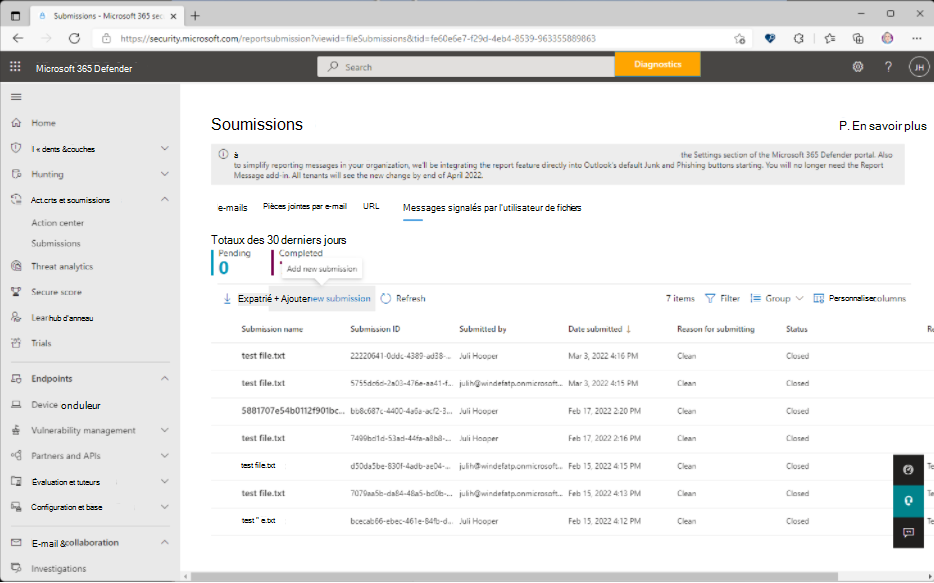
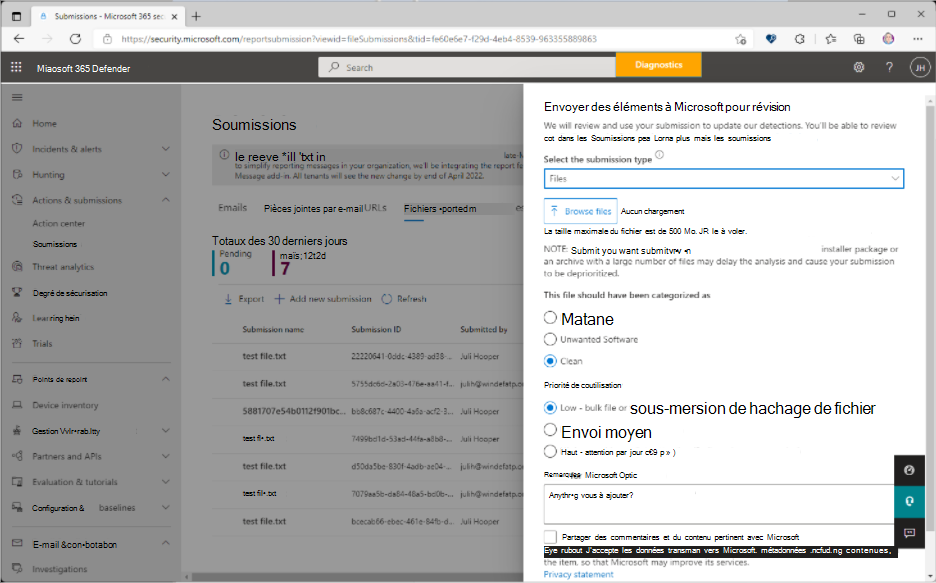
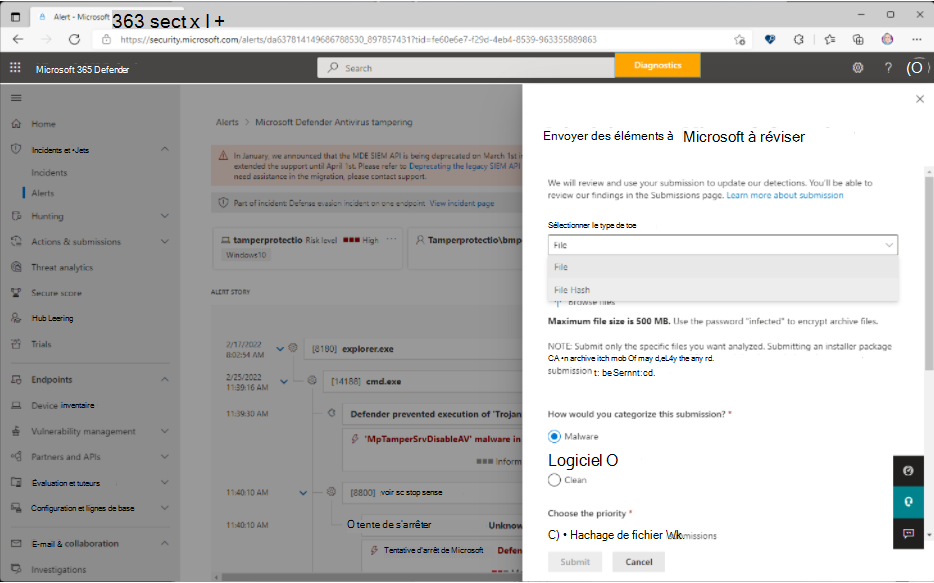

# Envoyer des fichiers dans Microsoft Defender pour point de terminaison

[!INCLUDE [Microsoft 365 Defender rebranding](../../includes/microsoft-defender.md)]

**S’applique à**

- [Microsoft Defender pour point de terminaison](https://go.microsoft.com/fwlink/p/?linkid=2146806)
- [Microsoft 365 Defender](https://go.microsoft.com/fwlink/?linkid=2118804)

>Vous voulez découvrir Microsoft Defender pour point de terminaison ? [Inscrivez-vous pour un essai gratuit](https://www.microsoft.com/microsoft-365/windows/microsoft-defender-atp?ocid=docs-wdatp-usewdatp-abovefoldlink).

Dans Microsoft Defender pour point de terminaison, les administrateurs peuvent utiliser la fonctionnalité d’envoi unifiée pour envoyer des fichiers et des hachages de fichiers à Microsoft à des fins de révision. L’expérience de soumission unifiée est un guichet unique pour l’envoi d’e-mails, d’URL, de pièces jointes et de fichiers dans une expérience de soumission facile à utiliser. Les administrateurs peuvent utiliser le portail Microsoft 365 Defender ou la page d’alerte Microsoft Defender pour point de terminaison pour envoyer des fichiers suspects.

## Ce qu'il faut savoir avant de commencer

- La nouvelle expérience de soumission unifiée est disponible uniquement dans les abonnements qui incluent Microsoft 365 Defender, Microsoft Defender pour point de terminaison Plan 2 ou Microsoft Defender pour Office Plan 2.

- Pour envoyer des fichiers à Microsoft, vous devez être membre de l’un des groupes de rôles suivants :

  - **Gestion de l’organisation**, **administrateur de la sécurité** ou **Lecteur sécurité** dans le [portail Microsoft 365 Defender](../office-365-security/permissions-microsoft-365-security-center.md).

- Pour plus d’informations sur la façon dont vous pouvez envoyer des courriers indésirables, des hameçonnages, des URL et des pièces jointes à Microsoft, consultez [les messages de rapport et les fichiers à Microsoft](../office-365-security/report-junk-email-messages-to-microsoft.md).

## Signaler des éléments à Microsoft à partir du portail

Si vous avez un fichier que vous soupçonnez être un programme malveillant ou est mal détecté (faux positif), vous pouvez l’envoyer à Microsoft pour analyse à l’aide du portail Microsoft 365 Defender à l’adresse https://security.microsoft.com/.

### Envoyer un fichier ou un hachage de fichier

1. Ouvrez Microsoft 365 Defender, <https://security.microsoft.com/>cliquez sur **Actions & soumissions**, cliquez sur **Soumissions**, accédez à l’onglet **Fichiers**, puis **sélectionnez Ajouter une nouvelle soumission**.

    > [!div class="mx-imgBorder"]
    > 

2. Utilisez les **éléments Submit à Microsoft pour passer en revue** le menu volant qui semble envoyer le **hachage** **de fichier** ou de fichier.

3. Dans la zone **Sélectionner le type de soumission** , sélectionnez Le hachage **de fichier** ou **de fichier** dans la liste déroulante.

4. Lors de l’envoi d’un fichier, cliquez sur **Parcourir les fichiers**. Dans la boîte de dialogue qui s’ouvre, recherchez et sélectionnez le fichier, puis cliquez sur **Ouvrir**. Notez que pour les soumissions de **hachage** de fichier, vous devez copier ou taper dans le hachage de fichier.

5. Dans **ce fichier, vous devriez avoir été classé dans la** catégorie « **Programme malveillant** » (faux négatif) ou **« Logiciel indésirable** » ou **« Clean** » (faux positif).

6. Ensuite, **choisissez la priorité**. Notez que pour les soumissions de **hachage** de fichier, **l’envoi de fichier ou de hachage de fichier en bloc** est le seul choix et est automatiquement sélectionné.

    > [!div class="mx-imgBorder"]
    > 

7. Cliquez sur **Envoyer**.

   Si vous souhaitez afficher les détails de votre soumission, sélectionnez votre soumission dans la liste **des noms des soumissions** pour ouvrir le menu volant **Détails du** résultat.

## Signaler des éléments à Microsoft à partir de la page Alertes

Vous pouvez également envoyer un fichier ou un hachage de fichier directement à partir de la liste des alertes sur la page **Alertes** .

1. Ouvrez l’Microsoft 365 Defender à <https://security.microsoft.com/>, cliquez sur **Incidents & alertes**, puis cliquez sur **Alertes** pour afficher la liste des alertes.

2. Sélectionnez l’alerte à signaler. Notez que vous soumettez un fichier qui est niché dans l’alerte.

3. Cliquez sur les points de suspension en regard de **Gérer l’alerte** pour afficher des options supplémentaires. Sélectionnez **Envoyer des éléments à Microsoft pour révision**.

    > [!div class="mx-imgBorder"]
    > 

4. Dans le menu volant suivant qui s’ouvre, sélectionnez le type de soumission.

    > [!div class="mx-imgBorder"]
    > 

    Si vous sélectionnez **Fichier** comme type d’envoi, chargez le fichier, classez votre soumission et choisissez la priorité.

    Si **vous sélectionnez** le hachage de fichier comme type d’envoi, choisissez les hachages de fichier disponibles dans la liste déroulante. Vous pouvez sélectionner plusieurs hachages de fichier.

5. Cliquez sur **Envoyer**.

## Informations connexes

- [Microsoft Defender pour point de terminaison dans Microsoft 365 Defender](../defender/microsoft-365-security-center-mde.md)
- [Résoudre les faux positifs/négatifs](defender-endpoint-false-positives-negatives.md)
- [Afficher et organiser la file d’attente des alertes dans Microsoft Defender pour point de terminaison](alerts-queue.md)
