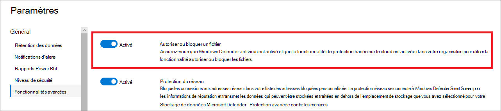

# Configurer des fonctionnalités avancées dans Defender pour le point de terminaison

**S’applique à :**
- [Microsoft Defender pour point de terminaison](https://go.microsoft.com/fwlink/p/?linkid=2154037)
- [Microsoft 365 Defender](https://go.microsoft.com/fwlink/?linkid=2118804)

[!INCLUDE [Microsoft 365 Defender rebranding](../../includes/microsoft-defender.md)]

> Vous souhaitez faire l’expérience de Defender for Endpoint ? [Inscrivez-vous à un essai gratuit.](https://www.microsoft.com/microsoft-365/windows/microsoft-defender-atp?ocid=docs-wdatp-advancedfeats-abovefoldlink)

Selon les produits de sécurité Microsoft que vous utilisez, certaines fonctionnalités avancées peuvent vous être disponibles pour intégrer Defender for Endpoint.

## Activer les fonctionnalités avancées

1. Dans le volet de navigation, sélectionnez **Préférences configurer les**  >  **fonctionnalités avancées.**
2. Sélectionnez la fonctionnalité avancée que vous souhaitez configurer et basculez le paramètre entre **« On** » et **« Off**».
3. Cliquez **sur Enregistrer les préférences.**

Utilisez les fonctionnalités avancées suivantes pour être mieux protégés contre les fichiers potentiellement malveillants et obtenir une meilleure compréhension lors des enquêtes de sécurité.

## Examen automatisé

Activer cette fonctionnalité pour tirer parti des fonctionnalités automatisées d’examen et de correction du service. Pour plus d’informations, voir [Examen automatisé.](automated-investigations.md)

## Réponse en direct

Activer cette fonctionnalité afin que les utilisateurs disposent des autorisations appropriées peuvent démarrer une session de réponse en direct sur les appareils.

Pour plus d’informations sur les attributions de rôles, voir [Créer et gérer des rôles.](user-roles.md)

## Réponse en direct pour les serveurs
Activer cette fonctionnalité afin que les utilisateurs disposent des autorisations appropriées peuvent démarrer une session de réponse en direct sur les serveurs.

Pour plus d’informations sur les attributions de rôles, voir [Créer et gérer des rôles.](user-roles.md)

## Exécution de script non signé de réponse en direct

L’activation de cette fonctionnalité vous permet d’exécuter des scripts non signés dans une session de réponse en direct.

## Correction automatique des alertes

Pour les locataires créés sur ou après Windows 10, version 1809, la fonctionnalité d’examen et de correction automatisée est configurée par défaut pour résoudre les alertes où l’état des résultats de l’analyse automatisée est « Aucune menace trouvée » ou « Corrigé ».  Si vous ne souhaitez pas que les alertes se résolvent automatiquement, vous devez désactiver manuellement la fonctionnalité.

> [!TIP]
> Pour les locataires créés avant cette version, vous devez activer manuellement cette fonctionnalité à partir de la page [Fonctionnalités avancées.](https://securitycenter.windows.com/preferences2/integration)

> [!NOTE]
>
> - Le résultat de l’action de résolution automatique peut influencer le calcul du niveau de risque de l’appareil, qui est basé sur les alertes actives trouvées sur un appareil.
> - Si un analyste d’opérations de sécurité définit manuellement l’état d’une alerte sur « En cours » ou « Résolu », la fonctionnalité de résolution automatique ne l’est pas.

## Autoriser ou bloquer un fichier

Le blocage n’est disponible que si votre organisation remplit les conditions ci-après :

- Utilise l’Antivirus Microsoft Defender comme solution anti-programme malveillant active et,
- La fonctionnalité de protection basée sur le cloud est activée

Cette fonctionnalité vous permet de bloquer les fichiers potentiellement malveillants dans votre réseau. Le blocage d’un fichier l’empêchera d’être lu, écrit ou exécuté sur les appareils de votre organisation.

Pour activer **ou bloquer les fichiers** :

1. Dans le volet de navigation, sélectionnez **Paramètres**  >  **avancés fonctionnalités**  >  **autoriser ou bloquer le fichier**.

1. Basculez le paramètre entre **« On** » et **« Off**».

    

1. Sélectionnez **Enregistrer les préférences** en bas de la page.

Après avoir mis en place cette  fonctionnalité, vous pouvez bloquer [des](respond-file-alerts.md#allow-or-block-file) fichiers via l’onglet Ajouter un indicateur sur la page de profil d’un fichier.

## Indicateurs réseau personnalisés

Cette fonctionnalité vous permet de créer des indicateurs pour les adresses IP, les domaines ou les URL, qui déterminent s’ils seront autorisés ou bloqués en fonction de votre liste d’indicateurs personnalisée.

Pour utiliser cette fonctionnalité, les appareils doivent utiliser Windows 10 version 1709 ou ultérieure. Ils doivent également avoir une protection réseau en mode blocage et la version 4.18.1906.3 ou ultérieure de la plateforme anti-programme malveillant. Voir la [KB 4052623](https://go.microsoft.com/fwlink/?linkid=2099834).

Pour plus d’informations, [voir Gérer les indicateurs.](manage-indicators.md)

> [!NOTE]
> La protection du réseau tire parti des services de réputation qui traiter les demandes à des emplacements qui peuvent se trouve en dehors de l’emplacement que vous avez sélectionné pour vos données Defender pour le point de terminaison.

## Afficher les détails de l’utilisateur

Activez cette fonctionnalité pour que vous pouvez voir les détails de l’utilisateur stockés dans Azure Active Directory. Les détails incluent l’image, le nom, le titre et les informations de service d’un utilisateur lors de l’enquête sur les entités de compte d’utilisateur. Les informations de compte d’utilisateur sont disponibles dans les affichages suivants :

- Tableau de bord des opérations de sécurité
- File d’attente des alertes
- Page Détails de l’appareil

Pour plus d’informations, voir [Examiner un compte d’utilisateur.](investigate-user.md)

## Intégration de Skype Entreprise

L’activation de l’intégration de Skype Entreprise vous permet de communiquer avec des utilisateurs à l’aide de Skype Entreprise, du courrier électronique ou du téléphone. Cela peut être pratique lorsque vous avez besoin de communiquer avec l’utilisateur et d’atténuer les risques.

> [!NOTE]
> Lorsqu’un appareil est isolé du réseau, vous pouvez choisir d’activer les communications Outlook et Skype dans une fenêtre pop-up, ce qui permet de communications à l’utilisateur pendant qu’il est déconnecté du réseau. Ce paramètre s’applique aux communications Skype et Outlook lorsque les appareils sont en mode d’isolation.

## Intégration d’Azure Advanced Threat Protection

L’intégration à Azure Advanced Threat Protection vous permet de pivoter directement dans un autre produit de sécurité Microsoft Identity. Azure Advanced Threat Protection complète une enquête avec des informations supplémentaires sur un compte suspecté d’être compromis et les ressources associées. En activant cette fonctionnalité, vous enrichirez la fonctionnalité d’examen basé sur l’appareil en pivotant sur le réseau d’un point de vue d’identification.

> [!NOTE]
> Vous devez avoir la licence appropriée pour activer cette fonctionnalité.

## Connexion à Office 365 Threat Intelligence

Cette fonctionnalité n’est disponible que si vous disposez d’un module office 365 E5 ou d’un module add-on Threat Intelligence actif. Pour plus d’informations, voir la page du produit Office 365 Entreprise E5.

Lorsque vous activerez cette fonctionnalité, vous serez en mesure d’incorporer des données d’Office 365 - Protection avancée contre les menaces dans le Centre de sécurité Microsoft Defender pour mener une enquête de sécurité complète sur les boîtes aux lettres Office 365 et les appareils Windows.

> [!NOTE]
> Vous devez avoir la licence appropriée pour activer cette fonctionnalité.

Pour recevoir l’intégration d’appareils contextuels dans Office 365 Threat Intelligence, vous devez activer les paramètres Defender pour le point de terminaison dans le tableau de bord sécurité & conformité. Pour plus d’informations, voir [Examen et réponse aux menaces.](https://docs.microsoft.com/microsoft-365/security/office-365-security/office-365-ti)

## Spécialistes des menaces Microsoft

Sur les deux composants De l’Expert en menaces Microsoft, la notification d’attaque ciblée est disponible en général. La fonctionnalité Experts à la demande est toujours en prévisualisation. Vous ne pouvez utiliser la fonctionnalité d’experts à la demande que si vous avez appliqué la prévisualisation et que votre application a été approuvée. Vous pouvez recevoir des notifications d’attaque ciblées d’experts microsoft en matière de menaces via le tableau de bord des alertes de votre portail Defender for Endpoint et par courrier électronique si vous le configurez.

> [!NOTE]
> La fonctionnalité Experts microsoft en matière de menaces dans Defender pour point de terminaison est disponible avec une licence E5 pour [Enterprise Mobility + Security](https://www.microsoft.com/cloud-platform/enterprise-mobility-security).

## Microsoft Cloud App Security

L’activation de ce paramètre a pour effet de faire suivre les signaux de Defender for Endpoint à Microsoft Cloud App Security pour fournir une visibilité plus approfondie de l’utilisation des applications cloud. Les données forwarded sont stockées et traitées au même emplacement que vos données Cloud App Security.

> [!NOTE]
> Cette fonctionnalité sera disponible avec une licence E5 pour [Enterprise Mobility + Security](https://www.microsoft.com/cloud-platform/enterprise-mobility-security) sur les appareils exécutant Windows 10, version 1709 (os Build 16299.1085 avec [KB4493441](https://support.microsoft.com/help/4493441)), Windows 10, version 1803 (os build 17134.704 avec [KB4493464](https://support.microsoft.com/help/4493464)), Windows 10, version 1809 (os build 17763.379 avec [KB4489899](https://support.microsoft.com/help/4489899)) ou versions ultérieures de Windows 10.

## Azure Information Protection

L’turning on this setting allows signals to be forwarded to Azure Information Protection. Il offre aux propriétaires et aux administrateurs de données une visibilité sur les données protégées sur les appareils intégrés et les évaluations des risques des appareils.

## Degré de sécurisation Microsoft

Envoie les signaux Microsoft Defender for Endpoint au Niveau de sécurité Microsoft dans le Centre de sécurité Microsoft 365. L’turning on this feature gives Microsoft Secure Score visibility into the device’s security posture. Les données forwardées sont stockées et traitées au même emplacement que vos données du Score de sécurisation Microsoft.

### Activer l’intégration de Microsoft Defender pour les points de terminaison à partir du portail Microsoft Defender pour l’identité

Pour recevoir l’intégration d’appareils contextuels dans Microsoft Defender pour l’identité, vous devez également activer la fonctionnalité dans le portail Microsoft Defender pour l’identité.

1. Connectez-vous au [portail Microsoft Defender pour l’identité](https://portal.atp.azure.com/) à l’aide d’un rôle Administrateur général ou Administrateur de la sécurité.

2. Cliquez **sur Créer votre instance.**

3. Toggle the Integration setting to **On** and click **Save**.

Après avoir effectué les étapes d’intégration sur les deux portails, vous pourrez voir les alertes pertinentes dans la page Détails de l’appareil ou Détails de l’utilisateur.

## Connexion Microsoft Intune

Defender pour le point de terminaison peut être intégré [à Microsoft Intune](https://docs.microsoft.com/intune/what-is-intune) pour activer l’accès conditionnel basé sur les risques [de l’appareil.](https://docs.microsoft.com/intune/advanced-threat-protection#enable-windows-defender-atp-in-intune) Lorsque vous [activerez cette fonctionnalité,](configure-conditional-access.md)vous serez en mesure de partager des informations sur l’appareil Defender for Endpoint avec Intune, ce qui améliore l’application de la stratégie.

> [!IMPORTANT]
> Vous devez activer l’intégration sur Intune et Defender pour le point de terminaison pour utiliser cette fonctionnalité. Pour plus d’informations sur les étapes spécifiques, voir [Configurer l’accès conditionnel dans Defender pour le point de terminaison.](configure-conditional-access.md)

Cette fonctionnalité est disponible uniquement si vous disposez des fonctionnalités suivantes :

- Un client sous licence pour Enterprise Mobility + Security E3 et Windows E5 (ou Microsoft 365 Entreprise E5)
- Un environnement Microsoft Intune actif, avec des appareils Windows 10 gérés par Intune joints [à Azure AD.](https://docs.microsoft.com/azure/active-directory/devices/concept-azure-ad-join/)

### Stratégie d’accès conditionnel

Lorsque vous activez l’intégration Intune, Intune crée automatiquement une stratégie d’accès conditionnel (CA) classique. Cette stratégie d’ac classique est une condition préalable à la configuration des rapports d’état dans Intune. Elle ne doit pas être supprimée.

> [!NOTE]
> La stratégie d’ac classique créée par Intune est distincte des stratégies d’accès conditionnel [modernes,](https://docs.microsoft.com/azure/active-directory/conditional-access/overview/)qui sont utilisées pour configurer les points de terminaison.

## Fonctionnalités en préversion

Découvrez les nouvelles fonctionnalités de la version d’évaluation de Defender for Endpoint et soyez parmi les premiers à essayer les fonctionnalités à venir en 2013.

Vous aurez accès aux fonctionnalités à venir, sur lesquelles vous pourrez nous faire part de vos commentaires afin d’améliorer l’expérience globale avant que les fonctionnalités ne soient généralement disponibles.

## Partager des alertes de point de terminaison avec le Centre de conformité Microsoft

Permet de remettre les alertes de sécurité des points de terminaison et leur état de triage au Centre de conformité Microsoft, ce qui vous permet d’améliorer les stratégies de gestion des risques internes avec des alertes et de corriger les risques internes avant qu’ils ne causent des dommages. Les données forwardées sont traitées et stockées au même emplacement que vos données Office 365.

Après avoir configuré les indicateurs de violation de la stratégie de sécurité dans les [paramètres](https://docs.microsoft.com/microsoft-365/compliance/insider-risk-management-settings.md#indicators) de gestion des risques internes, les alertes Defender for Endpoint sont partagées avec la gestion des risques internes pour les utilisateurs applicables.

## Voir aussi

- [Mettre à jour les paramètres de rétention des données](data-retention-settings.md)
- [Configurer les notifications d’alerte](configure-email-notifications.md)
