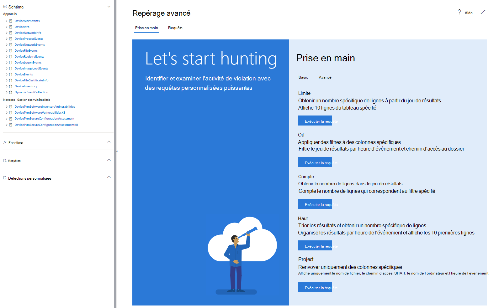

# <a name="learn-the-advanced-hunting-query-language"></a>Découvrir le langage de requête de repérage avancé

[!INCLUDE [Microsoft 365 Defender rebranding](../../includes/microsoft-defender.md)]

**S’applique à :**
- [Defender pour point de terminaison](https://go.microsoft.com/fwlink/?linkid=2154037)

> Vous souhaitez faire l’expérience de Defender pour point de terminaison ? [Inscrivez-vous à un essai gratuit.](https://www.microsoft.com/microsoft-365/windows/microsoft-defender-atp?ocid=docs-wdatp-advancedhunting-abovefoldlink)

Le repérage avancé est basé sur le [langage de requête Kusto](https://docs.microsoft.com/azure/kusto/query/). Vous pouvez utiliser des opérateurs et des instructions Kusto pour créer des requêtes qui recherchent des informations dans un [schéma spécialisé.](advanced-hunting-schema-reference.md) Pour mieux comprendre ces concepts, exécutez votre première requête.

## <a name="try-your-first-query"></a>Essayez votre première requête

Dans le Centre de sécurité Microsoft Defender, allez à la recherche **avancée** pour exécuter votre première requête. Consultez l’exemple qui suit :

```kusto
// Finds PowerShell execution events that could involve a download
union DeviceProcessEvents, DeviceNetworkEvents
| where Timestamp > ago(7d)
// Pivoting on PowerShell processes
| where FileName in~ ("powershell.exe", "powershell_ise.exe")
// Suspicious commands
| where ProcessCommandLine has_any("WebClient",
    "DownloadFile",
    "DownloadData",
    "DownloadString",
    "WebRequest",
    "Shellcode",
    "http",
    "https")
| project Timestamp, DeviceName, InitiatingProcessFileName, InitiatingProcessCommandLine, 
FileName, ProcessCommandLine, RemoteIP, RemoteUrl, RemotePort, RemoteIPType
| top 100 by Timestamp
```
**[Exécuter cette requête dans un recherche avancée](https://securitycenter.windows.com/hunting?query=H4sIAAAAAAAEAI2TT0vDQBDF5yz4HUJPFcTqyZsXqyCIBFvxKNGWtpo_NVlbC8XP7m8mado0K5Zls8nkzdu3b2Z70pNAbmUmqYyk4D2UTJYyllwGMmWNGQHrN_NNvsSBzUBrbMFMiWieAx3xDEBl4GL4AuNd8B0bNgARENcdUmIZ3yM5liPwac3bN-YZPGPU5ET1rWDc7Ox4uod8YDp4MzI-GkjlX4Ne2nly0zEkKzFWh4ZE5sSuTN8Ehq5couvEMnvmUAhez-HsRBMipVa_W_OG6vEfGtT12JRHpqV064e1Kx04NsxFzXxW1aFjp_djXmDRPbfY3XMMcLogTz2bWZ2KqmIJI6q6wKe2WYnrRsa9KVeU9kCBBo2v7BzPxF_Bx2DKiqh63SGoRoc6Njti48z_yL71XHQAcgAur6rXRpcqH3l-4knZF23Utsbq2MircEqmw-G__xR1TdZ1r7zb7XLezmx3etkvGr-ze6NdGdW92azUfpcdluWvr-aqbh_nofnqcWI3aYyOsBV7giduRUO7187LMKTT5rxvHHX80_t8IeeMgLquvL7-Ak3q-kz8BAAA&runQuery=true&timeRangeId=week)**

### <a name="describe-the-query-and-specify-the-tables-to-search"></a>Décrire la requête et spécifier les tables à rechercher
Un commentaire court a été ajouté au début de la requête pour décrire son objectif. Ce commentaire est utile si vous décidez ultérieurement d’enregistrer la requête et de la partager avec d’autres membres de votre organisation.

```kusto
// Finds PowerShell execution events that could involve a download
```
La requête elle-même commence généralement par un nom de table suivi de plusieurs éléments qui commencent par un canal ( `|` ). Dans cet exemple, nous commençons par créer une union de deux tables et, si nécessaire, nous ajoutons des  `DeviceProcessEvents` `DeviceNetworkEvents` éléments canalés.

```kusto
union DeviceProcessEvents, DeviceNetworkEvents
```
### <a name="set-the-time-range"></a>Définir la plage de temps
Le premier élément canal est un filtre de temps dont l’étendue est limitée aux sept jours précédents. La limitation de la plage de temps permet de s’assurer que les requêtes s’exécutent bien, retournent des résultats gérables et n’ont pas de délai d’délai.

```kusto
| where Timestamp > ago(7d)
```

### <a name="check-specific-processes"></a>Vérifier des processus spécifiques
La période est immédiatement suivie d’une recherche de noms de fichiers de processus représentant l’application PowerShell.

```kusto
// Pivoting on PowerShell processes
| where FileName in~ ("powershell.exe", "powershell_ise.exe")
```

### <a name="search-for-specific-command-strings"></a>Rechercher des chaînes de commandes spécifiques
Ensuite, la requête recherche des chaînes dans les lignes de commande qui sont généralement utilisées pour télécharger des fichiers à l’aide de PowerShell.

```kusto
// Suspicious commands
| where ProcessCommandLine has_any("WebClient",
    "DownloadFile",
    "DownloadData",
    "DownloadString",
    "WebRequest",
    "Shellcode",
    "http",
    "https")
```

### <a name="customize-result-columns-and-length"></a>Personnaliser les colonnes de résultats et la longueur 
Maintenant que votre requête identifie clairement les données que vous souhaitez localiser, vous pouvez définir à quoi ressemblent les résultats. `project` renvoie des `top` colonnes spécifiques et limite le nombre de résultats. Ces opérateurs permettent de s’assurer que les résultats sont bien formatés, raisonnablement grands et faciles à traiter.

```kusto
| project Timestamp, DeviceName, InitiatingProcessFileName, InitiatingProcessCommandLine, 
FileName, ProcessCommandLine, RemoteIP, RemoteUrl, RemotePort, RemoteIPType
| top 100 by Timestamp
```

Sélectionnez **Exécuter la requête** pour voir les résultats. Utilisez l’icône développer en haut à droite de l’éditeur de requête pour vous concentrer sur votre requête de recherche et les résultats. 


>[!TIP]
>Vous pouvez afficher les résultats de la requête sous la mesure de graphiques et ajuster rapidement les filtres. Pour obtenir des [conseils, voir l’aide sur l’working with query results](advanced-hunting-query-results.md)

## <a name="learn-common-query-operators-for-advanced-hunting"></a>Découvrir les opérateurs de requête courants pour le repérage avancé

Vous viennent d’exécuter votre première requête et vous avez une idée générale de ses composants. Il est temps de revenir en arrière légèrement et d’apprendre quelques principes de base. Le langage de requête Kusto utilisé par le repérage avancé prend en charge divers opérateurs, notamment les opérateurs communs suivants.

| Opérateur | Description et utilisation |
|--|--|
| `where` | Filtre une table sur le sous-ensemble de lignes qui répondent à un prédicat. |
| `summarize` | Produit une table qui agrège le contenu de la table d’entrée. |
| `join` | Fusionne les lignes de deux tables pour former une nouvelle table en faisant correspondre les valeurs des colonnes spécifiées de chaque table. |
| `count` | Renvoie le nombre d’enregistrements dans le groupe d’enregistrements d’entrée. |
| `top` | Renvoie les N premiers enregistrements triés par les colonnes spécifiées. |
| `limit` | Renvoie jusqu’au nombre de lignes spécifié. |
| `project` | Sélectionne les colonnes à inclure, renommer ou déplacer et insère de nouvelles colonnes calculées. |
| `extend` | Crée des colonnes calculées et les ajoute au jeu de résultats. |
| `makeset` |  Renvoie un tableau dynamique (JSON) de l’ensemble de valeurs distinctes prise par Expr dans le groupe. |
| `find` | Recherche des lignes qui correspondent à un prédicat dans un ensemble de tables. |

Pour voir un exemple en direct de ces opérateurs, exécutez-les à partir de la **section** Commencer de la page de recherche avancée.

## <a name="understand-data-types"></a>Comprendre les types de données

Le recherche avancée prend en charge les types de données Kusto, y compris les types courants suivants :

| Type de données | Description et implications dans les requêtes |
|--|--|
| `datetime` | Les données et les informations d’heure représentent généralement des timestamps d’événement. [Voir les formats de date/heure pris en charge](https://docs.microsoft.com/azure/data-explorer/kusto/query/scalar-data-types/datetime) |
| `string` | Chaîne de caractères en UTF-8 entre guillemets simples ( `'` ) ou guillemets doubles ( `"` ). [En savoir plus sur les chaînes](https://docs.microsoft.com/azure/data-explorer/kusto/query/scalar-data-types/string) |
| `bool` | Ce type de données prend en charge `true` ou `false` indique. [Voir les opérateurs et les littéraux pris en charge](https://docs.microsoft.com/azure/data-explorer/kusto/query/scalar-data-types/bool) |
| `int` | Integer 32 bits  |
| `long` | Integer 64 bits |

Pour en savoir plus sur ces types de données, consultez les types de données [scalar Kusto.](https://docs.microsoft.com/azure/data-explorer/kusto/query/scalar-data-types/)

## <a name="get-help-as-you-write-queries"></a>Obtenez de l’aide lorsque vous rédigez des requêtes
Tirez parti des fonctionnalités suivantes pour rédiger des requêtes plus rapidement :

- **Suggestion automatique : lorsque** vous écrivez des requêtes, le recherche avancée fournit des suggestions de IntelliSense.
- **Arborescence de schéma**: une représentation de schéma qui inclut la liste des tableaux et leurs colonnes est fournie en de côté de votre zone de travail. Si vous souhaitez en savoir plus, veuillez placer le pointeur sur un élément. Double-cliquez sur un élément pour l’insérer dans l’éditeur de requête.
- **[Référence de schéma :](advanced-hunting-schema-reference.md#get-schema-information-in-the-security-center)** référence dans le portail avec des descriptions de tableau et de colonne, ainsi que des types d’événements pris en charge (valeurs) et `ActionType` des exemples de requêtes

## <a name="work-with-multiple-queries-in-the-editor"></a>Utilisation de plusieurs requêtes dans l’éditeur
Vous pouvez utiliser l’éditeur de requête pour expérimenter plusieurs requêtes. Pour utiliser plusieurs requêtes :

- Séparez chaque requête par une ligne vide.
- Placez le curseur sur n’importe quelle partie d’une requête pour sélectionner cette requête avant de l’exécutez. Cette requête n’exécutera que la requête sélectionnée. Pour exécuter une autre requête, déplacez le curseur en conséquence et sélectionnez **Exécuter la requête.**


 _plusieurs requêtes_

## <a name="use-sample-queries"></a>Utiliser des exemples de requêtes

La section **Prise en main** fournit quelques requêtes simples utilisant des opérateurs fréquemment utilisés. Essayez d’exécuter ces requêtes et de leur apporter de légères modifications.



> [!NOTE]
> Hormis les exemples de requête de base, vous pouvez également accéder à des [requêtes partagées](advanced-hunting-shared-queries.md) pour des scénarios de repérage de menace spécifiques. Explorez les requêtes partagées sur le côté gauche de la page ou le référentiel de requêtes [GitHub.](https://aka.ms/hunting-queries)

## <a name="access-comprehensive-query-language-reference"></a>Accéder à une référence de langage de requête complète

Pour plus d’informations sur le langage de requête, voir la documentation du langage de requête [Kusto.](https://docs.microsoft.com/azure/kusto/query/)

## <a name="related-topics"></a>Voir aussi
- [Vue d’ensemble du repérage avancé](advanced-hunting-overview.md)
- [Utiliser les résultats d’une requête](advanced-hunting-query-results.md)
- [Utiliser des requêtes partagées](advanced-hunting-shared-queries.md)
- [Comprendre le schéma](advanced-hunting-schema-reference.md)
- [Appliquer les meilleures pratiques de requête](advanced-hunting-best-practices.md)
