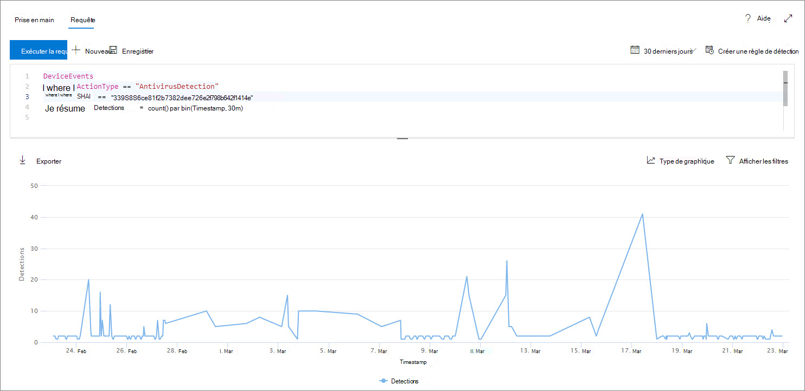
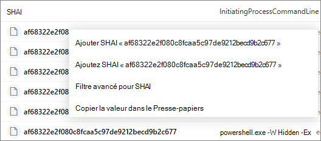

# <a name="work-with-advanced-hunting-query-results"></a>Travailler avec des résultats de requête de recherche avancés

[!INCLUDE [Microsoft 365 Defender rebranding](../../includes/microsoft-defender.md)]

**S’applique à :**
- [Microsoft Defender pour point de terminaison](https://go.microsoft.com/fwlink/?linkid=2154037)

>Vous souhaitez faire l’expérience de Defender for Endpoint ? [Inscrivez-vous à un essai gratuit.](https://www.microsoft.com/microsoft-365/windows/microsoft-defender-atp?ocid=docs-wdatp-advancedhunting-abovefoldlink)

Bien que vous [](advanced-hunting-overview.md) pouvez construire vos requêtes de recherche avancées pour renvoyer des informations très précises, vous pouvez également travailler avec les résultats de la requête pour obtenir des informations supplémentaires et examiner des activités et des indicateurs spécifiques. Vous pouvez prendre les mesures suivantes sur les résultats de votre requête :

- Afficher les résultats sous la mesure d’un tableau ou d’un graphique
- Exporter des tableaux et des graphiques
- Accès aux informations détaillées sur l’entité
- Ajustez vos requêtes directement à partir des résultats ou appliquez des filtres

## <a name="view-query-results-as-a-table-or-chart"></a>Afficher les résultats d’une requête sous la mesure d’un tableau ou d’un graphique
Par défaut, le recherche avancée affiche les résultats de la requête sous la mesure de données tabulaires. Vous pouvez également afficher les mêmes données qu’un graphique. Le recherche avancée prend en charge les affichages suivants :

| Type d’affichage | Description |
| -- | -- |
| **Tableau** | Affiche les résultats de la requête au format tabulaire |
| **Graphique en colonnes** | Restituer une série d’éléments uniques sur l’axe des x sous forme de barres verticales dont les hauteurs représentent des valeurs numériques d’un autre champ |
| **Graphique en colonnes empilées** | Restituer une série d’éléments uniques sur l’axe des X sous forme de barres verticales empilées dont les hauteurs représentent des valeurs numériques d’un ou plusieurs autres champs |
| **Graphique en secteurs** | Restituer les secteurs de section représentant des éléments uniques. La taille de chaque secteur représente les valeurs numériques d’un autre champ. |
| **Graphique de donut** | Restituer les arcs sectionnels représentant des éléments uniques. La longueur de chaque arc représente les valeurs numériques d’un autre champ. |
| **Graphique en lignes** | Trace les valeurs numériques d’une série d’éléments uniques et connecte les valeurs tracées |
| **Graphique en nuages de points** | Trace les valeurs numériques d’une série d’éléments uniques |
| **Graphique en zone** | Trace les valeurs numériques d’une série d’éléments uniques et remplit les sections sous les valeurs tracées |

### <a name="construct-queries-for-effective-charts"></a>Créer des requêtes pour des graphiques efficaces
Lors du rendu des graphiques, le recherche avancée identifie automatiquement les colonnes d’intérêt et les valeurs numériques à agréger. Pour obtenir des graphiques significatifs, construisez vos requêtes pour renvoyer les valeurs spécifiques que vous souhaitez visualiser. Voici quelques exemples de requêtes et les graphiques qui en résultent.

#### <a name="alerts-by-severity"></a>Alertes par gravité
Utilisez `summarize` l’opérateur pour obtenir un nombre numérique des valeurs que vous souhaitez graphiquer. La requête ci-dessous utilise `summarize` l’opérateur pour obtenir le nombre d’alertes par gravité.

```kusto
DeviceAlertEvents
| summarize Total = count() by Severity
```
Lors de l’affichage des résultats, un graphique en colonnes affiche chaque valeur de gravité en tant que colonne distincte :


 *d’un graphique en colonnes*

#### <a name="alert-severity-by-operating-system"></a>Gravité des alertes par système d’exploitation
Vous pouvez également utiliser l’opérateur pour préparer les résultats pour la graphique `summarize` des valeurs de plusieurs champs. Par exemple, vous souhaitez peut-être comprendre comment les gravités des alertes sont distribuées entre les systèmes d’exploitation. 

La requête ci-dessous utilise un opérateur pour tirer les informations du système d’exploitation du tableau, puis pour compter les valeurs dans les colonnes `join` `DeviceInfo` et les `summarize` `OSPlatform` `Severity` colonnes :

```kusto
DeviceAlertEvents
| join DeviceInfo on DeviceId
| summarize Count = count() by OSPlatform, Severity
```
Ces résultats sont mieux visualisés à l’aide d’un graphique en colonnes empilées :


 *d’un graphique empilé*

#### <a name="top-ten-device-groups-with-alerts"></a>Dix principaux groupes d’appareils avec alertes
Si vous avez affaire à une liste de valeurs qui n’est pas finie, vous pouvez utiliser l’opérateur pour graphiquer uniquement les valeurs avec le plus grand nombre `Top` d’instances. Par exemple, pour obtenir les dix premiers groupes d’appareils avec le plus d’alertes, utilisez la requête ci-dessous :

```kusto
DeviceAlertEvents
| join DeviceInfo on DeviceId
| summarize Count = count() by MachineGroup
| top 10 by Count
```
Utilisez l’affichage graphique en secteurs pour afficher efficacement la distribution dans les groupes supérieurs :


 *alertes entre les groupes d’appareils*

#### <a name="malware-detections-over-time"></a>Détections de programmes malveillants au fil du temps
À `summarize` l’aide de l’opérateur avec la fonction, vous pouvez vérifier les événements `bin()` impliquant un indicateur particulier au fil du temps. La requête ci-dessous compte les détections d’un fichier de test EICAR à intervalles de 30 minutes pour afficher les pics de détection de ce fichier :

```kusto
DeviceEvents
| where ActionType == "AntivirusDetection"
| where SHA1 == "3395856ce81f2b7382dee72602f798b642f14140"
| summarize Detections = count() by bin(Timestamp, 30m)
```
Le graphique en lignes ci-dessous met clairement en évidence les périodes avec davantage de détections de programmes malveillants de test : 


 *de test au fil du temps*


## <a name="export-tables-and-charts"></a>Exporter des tableaux et des graphiques
Après avoir exécute une requête, **sélectionnez Exporter** pour enregistrer les résultats dans le fichier local. L’affichage choisi détermine la façon dont les résultats sont exportés :

- **Mode Tableau** : les résultats de la requête sont exportés sous forme tabulaire en tant que workbook Microsoft Excel
- **N’importe** quel graphique : les résultats de la requête sont exportés en tant qu’image JPEG du graphique rendu

## <a name="drill-down-from-query-results"></a>Descendre des résultats de requête
Pour afficher plus d’informations sur les entités, telles que les appareils, les fichiers, les utilisateurs, les adresses IP et les URL, dans les résultats de votre requête, cliquez simplement sur l’identificateur d’entité. Cela ouvre une page de profil détaillée pour l’entité sélectionnée.

Pour inspecter rapidement un enregistrement dans les résultats de votre requête, sélectionnez la ligne correspondante pour ouvrir le panneau Inspecter l’enregistrement. Le panneau fournit les informations suivantes en fonction de l’enregistrement sélectionné :

- Ressources : vue récapitulée des principaux biens (boîtes aux lettres, appareils et **utilisateurs)** trouvés dans l’enregistrement, enrichis d’informations disponibles, telles que les niveaux de risque et d’exposition
- **Arborescence de processus** : graphique généré pour les enregistrements avec des informations de processus et enrichi à l’aide d’informations contextuelles disponibles ; en règle générale, les requêtes qui retournent plus de colonnes peuvent entraîner des arbre de processus plus riches.
- **Tous les détails** : répertorie toutes les valeurs des colonnes de l’enregistrement

## <a name="tweak-your-queries-from-the-results"></a>Adaptez vos requêtes à partir des résultats
Cliquez avec le bouton droit de la souris sur une valeur du jeu de résultats pour améliorer rapidement votre requête. Vous pouvez utiliser les options suivantes pour :

- Rechercher explicitement la valeur sélectionnée (`==`)
- Exclure la valeur sélectionnée de la requête (`!=`)
- Obtenez des opérateurs plus avancés pour ajouter la valeur à votre requête (par exemple, `contains`, `starts with` et `ends with`) 



## <a name="filter-the-query-results"></a>Filtrer les résultats de la requête
Les filtres affichés dans le volet droit fournissent un résumé du jeu de résultats. Chaque colonne possède sa propre section dans le volet, chacune répertoriant les valeurs trouvées dans cette colonne et le nombre d’instances.

Affinez votre requête en sélectionnant le ou les boutons sur les valeurs que vous `+` `-` souhaitez inclure ou exclure. Ensuite, **sélectionnez Exécuter la requête.**


Une fois le filtre appliqué pour modifier la requête, puis exécuter la requête, les résultats sont mis à jour en conséquence.

## <a name="related-topics"></a>Sujets associés
- [Vue d’ensemble du repérage avancé](advanced-hunting-overview.md)
- [Apprendre le langage de requête](advanced-hunting-query-language.md)
- [Utiliser des requêtes partagées](advanced-hunting-shared-queries.md)
- [Comprendre le schéma](advanced-hunting-schema-reference.md)
- [Appliquer les meilleures pratiques de requête](advanced-hunting-best-practices.md)
- [Vue d’ensemble des détections personnalisées](overview-custom-detections.md)
