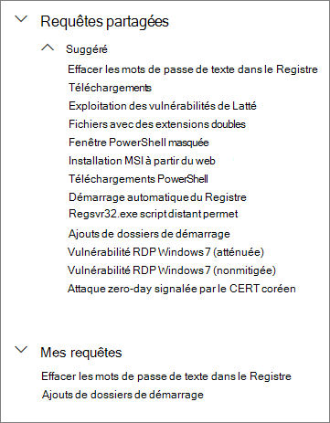
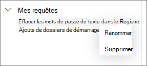

# Utiliser des requêtes partagées dans un repérage avancé

[!INCLUDE [Microsoft 365 Defender rebranding](../../includes/microsoft-defender.md)]

**S’applique à :**
- [Microsoft Defender pour point de terminaison](https://go.microsoft.com/fwlink/p/?linkid=2154037)

>Vous souhaitez faire l’expérience de Defender pour point de terminaison ? [Inscrivez-vous à un essai gratuit.](https://www.microsoft.com/microsoft-365/windows/microsoft-defender-atp?ocid=docs-wdatp-advancedhunting-abovefoldlink)

Les requêtes de [repérage avancé](advanced-hunting-overview.md) peuvent être partagées entre les utilisateurs au sein de la même organisation. Vous pouvez également trouver des requêtes partagées publiquement sur GitHub. Ces requêtes vous permettent d’effectuer rapidement des scénarios de repérage de menace spécifiques sans avoir à créer des requêtes.

## Enregistrer, modifier et partager une requête
Vous pouvez enregistrer une requête nouvelle ou existante pour qu’elle soit uniquement accessible à vous-même ou partagée avec d’autres utilisateurs au sein de votre organisation.

1. Tapez une nouvelle requête ou chargez une requête existante sous Requêtes **partagées** ou **Mes requêtes.**

2. Sélectionnez **Enregistrer** ou **Enregistrer en tant que dans** les options d’enregistrer. Pour éviter l’écriture d’une requête existante, choisissez **Enregistrer sous**.

3. Entrez un nom pour la requête.

   

4. Sélectionnez le dossier dans lequel vous voulez enregistrer la requête.
    - **Requêtes partagées** : partagées avec tous les utilisateurs de votre organisation
    - **Mes requêtes** : accessibles uniquement à vous
    
5. Cliquez sur **Enregistrer**.

## Supprimer ou renommer une requête
1. Cliquez avec le bouton droit de la souris sur une requête que vous voulez renommer ou supprimer.

    

2. Sélectionnez **Supprimer** et confirmer la suppression. Ou sélectionnez **Renommer** et attribuer un nouveau nom à la requête.

## Créer un lien direct vers une requête
Pour générer un lien qui ouvre votre requête directement dans l’éditeur de requête de recherche avancée, finalisez votre requête et sélectionnez **Le lien partager.**

## Accéder aux requêtes dans le référentiel GitHub  
Les chercheurs en matière de sécurité Microsoft partagent régulièrement des requêtes de repérage avancée dans un [référentiel public désigné sur GitHub](https://github.com/Microsoft/WindowsDefenderATP-Hunting-Queries). Ce référentiel est ouvert aux contributions. Si vous souhaitez contribuer, [ veuillez rejoindre GitHub gratuitement](https://github.com/). 

>[!TIP]
>Les chercheurs en matière de sécurité Microsoft proposent également des requêtes de repérage avancé que vous pouvez utiliser pour localiser les activités et indicateurs associés aux menaces émergentes. Ces requêtes sont fournies dans le cadre du rapport de l’[analyse des menaces](threat-analytics.md) dans le Centre de sécurité Microsoft Defender.

## Sujets associés
- [Vue d’ensemble du repérage avancé](advanced-hunting-overview.md)
- [Apprendre le langage de requête](advanced-hunting-query-language.md)
- [Utiliser les résultats d’une requête](advanced-hunting-query-results.md)
- [Comprendre le schéma](advanced-hunting-schema-reference.md)
- [Appliquer les meilleures pratiques de requête](advanced-hunting-best-practices.md)
- [Vue d’ensemble des détections personnalisées](overview-custom-detections.md)
