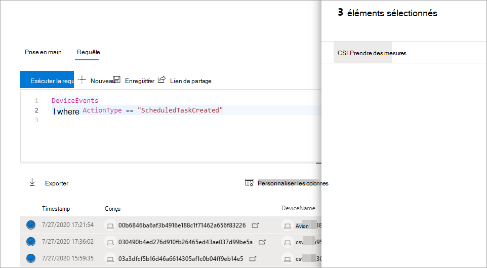

# Prendre des mesures sur les résultats de requête de recherche avancée

**S’applique à :**
- [Microsoft Defender pour point de terminaison](https://go.microsoft.com/fwlink/p/?linkid=2154037)

> Vous souhaitez faire l’expérience de Defender pour point de terminaison ? [Inscrivez-vous à un essai gratuit.](https://www.microsoft.com/microsoft-365/windows/microsoft-defender-atp?ocid=docs-wdatp-advancedhuntingref-abovefoldlink)

Vous pouvez rapidement contenir des menaces ou  traiter les ressources compromises que vous trouvez dans le recherche avancée à l’aide d’options d’action puissantes et complètes. Avec ces options, vous pouvez :

- Prendre différentes mesures sur les appareils
- Fichiers de mise en quarantaine

## Autorisations requises

Pour être en mesure d’agir par le biais d’une recherche avancée, vous avez besoin d’un rôle dans Defender pour le point de terminaison avec des autorisations pour soumettre des actions de correction [sur les appareils.](https://docs.microsoft.com/microsoft-365/security/defender-endpoint/user-roles#permission-options) Si vous ne pouvez pas agir, contactez un administrateur général pour obtenir l’autorisation suivante :

*Actions de correction actives > gestion des menaces et des vulnérabilités : gestion des corrections*

## Prendre différentes mesures sur les appareils

Vous pouvez prendre les mesures suivantes sur les appareils identifiés par la `DeviceId` colonne dans les résultats de votre requête :

- Isoler les appareils affectés pour contenir une infection ou empêcher les attaques de se déplacer ultérieurement
- Collecter un package d’enquête pour obtenir plus d’informations d’investigation
- Exécuter une analyse antivirus pour rechercher et supprimer les menaces à l’aide des dernières mises à jour de l’intelligence de la sécurité
- Lancer une enquête automatisée pour vérifier et corriger les menaces sur l’appareil et éventuellement sur d’autres appareils concernés
- Restreindre l’exécution de l’application uniquement aux fichiers exécutables signés par Microsoft, ce qui empêche toute activité de menace ultérieure par le biais de programmes malveillants ou d’autres fichiers exécutables non signés

Pour en savoir plus sur la façon dont ces actions de réponse sont effectuées via Defender pour le point de terminaison, lisez la suite sur les actions de [réponse sur les appareils.](respond-machine-alerts.md)

## Fichiers de mise en quarantaine

Vous pouvez déployer l’action *de* mise en quarantaine sur les fichiers afin qu’ils soient automatiquement mis en quarantaine lorsqu’ils sont rencontrés. Lorsque vous sélectionnez cette action, vous pouvez choisir entre les colonnes suivantes pour identifier les fichiers de votre requête qui sont mis en quarantaine :

- `SHA1` — Dans la plupart des tables de recherche avancées, il s’agit du SHA-1 du fichier affecté par l’action enregistrée. Par exemple, si un fichier a été copié, il s’agit du fichier copié.
- `InitiatingProcessSHA1` — Dans la plupart des tables de recherche avancées, il s’agit du fichier responsable de l’initiative de l’action enregistrée. Par exemple, si un processus enfant a été lancé, il s’agit du processus parent. 
- `SHA256` — Il s’agit de l’équivalent SHA-256 du fichier identifié par la `SHA1` colonne.
- `InitiatingProcessSHA256` — Il s’agit de l’équivalent SHA-256 du fichier identifié par la `InitiatingProcessSHA1` colonne.

Pour en savoir plus sur la façon dont les actions de mise en quarantaine sont prises et sur la façon dont les fichiers peuvent être restaurés, consultez les actions de [réponse sur les fichiers.](respond-file-alerts.md)

>[!NOTE]
>Pour localiser des fichiers et les mettre en quarantaine, les résultats de la requête doivent également inclure des valeurs en tant `DeviceId` qu’identificateurs d’appareil.  

## Prendre action

Pour prendre l’une des actions décrites, sélectionnez un ou plusieurs enregistrements dans les résultats de votre requête, puis **sélectionnez Actions.** Un Assistant vous guide tout au long du processus de sélection, puis d’envoi de vos actions préférées.

## Examiner les actions entreprises

Chaque action est enregistrée individuellement dans le centre de actions, sous Historique du **centre** de security.microsoft.com/action-center/history  >   ). Go to the action center to check the status of each action.
 
## Voir aussi

- [Vue d’ensemble du repérage avancé](advanced-hunting-overview.md)
- [Apprendre le langage de requête](advanced-hunting-query-language.md)
- [Comprendre le schéma](advanced-hunting-schema-reference.md)
- [Travailler avec les résultats de la requête](advanced-hunting-query-results.md)
- [Appliquer les meilleures pratiques de requête](advanced-hunting-best-practices.md)
- [Vue d’ensemble des détections personnalisées](overview-custom-detections.md)
