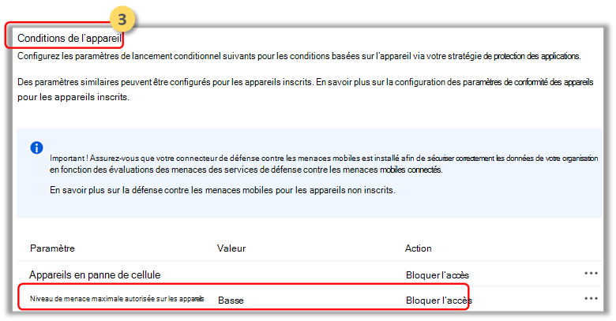

# Configurer Microsoft Defender pour les signaux de risque de point de terminaison à l’aide de la stratégie de protection des applications (MAM)

[!INCLUDE [Microsoft 365 Defender rebranding](../../includes/microsoft-defender.md)]

**S’applique à :**
- [Microsoft Defender pour point de terminaison](https://go.microsoft.com/fwlink/p/?linkid=2154037)
- [Microsoft 365 Defender](https://go.microsoft.com/fwlink/?linkid=2118804)

Microsoft Defender pour Endpoint Android, qui protège déjà les utilisateurs d’entreprise sur les scénarios de gestion des périphériques mobiles (MDM), étend désormais la prise en charge de la gestion des applications mobiles (MAM). Cette fonctionnalité vous permet de gérer et de protéger les données de votre organisation au sein d’une application.

Les informations sur les menaces Microsoft Defender pour Endpoint Android sont utilisées par les stratégies Intune App Protection pour protéger ces applications. Les stratégies de protection des applications (APP) sont des règles qui garantissent que les données d’une organisation restent sécurisées ou contenues dans une application gérée. Une application gérée dispose de stratégies de protection des applications qui lui sont appliquées et peut être gérée par Intune.  

Microsoft Defender pour point de terminaison (mobile) prend en charge les deux configurations de MAM
- **Intune MDM + MAM**: les administrateurs informatiques peuvent uniquement gérer les applications à l’aide des stratégies de protection des applications sur les appareils inscrits auprès de la gestion des périphériques mobiles Intune.
- **MAM sans** inscription d’appareils : MAM sans inscription d’appareil, ou MAM-WE, permet aux administrateurs informatiques de gérer les applications à l’aide de stratégies de [protection](/mem/intune/app/app-protection-policy) des applications sur les appareils non inscrits auprès de la gestion des appareils mobiles Intune. Cela signifie que les applications peuvent être gérées par Intune sur les appareils inscrits auprès de fournisseurs EMM tiers. Pour gérer les applications à l’aide des deux configurations ci-dessus, les clients doivent utiliser Intune [dans Microsoft Endpoint Manager’administration centrale](https://go.microsoft.com/fwlink/?linkid=2109431)

Pour activer cette fonctionnalité, un administrateur doit configurer la connexion entre Microsoft Defender pour Endpoint et Intune, créer la stratégie de protection des applications et appliquer la stratégie sur les appareils et applications ciblés. 
 
Les utilisateurs finaux doivent également prendre des mesures pour installer Microsoft Defender pour le point de terminaison sur leur appareil et activer le flux d’intégration.

## Conditions préalables pour l’administrateur

- **Vérifier que le connecteur Microsoft Defender pour Endpoint-Intune est activé**

  a. Go to security.microsoft.com. 

  b. Sélectionnez **Paramètres > points de terminaison> fonctionnalités** avancées > Microsoft Intune connexion est allumée.

  c. Si la connexion n’est pas allumée, sélectionnez le basculement pour l’activer, puis **sélectionnez Enregistrer les préférences.**

  

  d. Go to **Microsoft Endpoint Manager (Intune)** and Validate whether Microsoft Defender for Endpoint-Intune connector is enabled.

  

- **Activer microsoft Defender pour le connecteur de point de terminaison (mobile) pour la stratégie de protection des applications (APP)**
  
  Configurez le connecteur sur Intune Microsoft Endpoint Manager stratégies de protection des applications :

  a. Go to **Tenant Administration > Connectors and Tokens > Microsoft Defender for Endpoint**.

  b. Activer les boutons bascule pour la stratégie de protection des applications pour Android et iOS (comme indiqué dans la capture d’écran suivante).

  c. Sélectionnez **Enregistrer**.

  

- **Créer une stratégie de protection des applications** 
 
Bloquez l’accès ou effacez les données d’une application gérée en fonction des signaux de risque de Microsoft Defender for Endpoint en créant une stratégie de protection des applications.
Microsoft Defender pour le point de terminaison peut être configuré pour envoyer des signaux de menace à utiliser dans les stratégies de protection des applications (APP, également appelée MAM). Avec cette fonctionnalité, vous pouvez utiliser Microsoft Defender pour point de terminaison pour protéger les applications gérées.

1. Créer une stratégie  
Les stratégies de protection des applications (APP) sont des règles qui garantissent que les données d’une organisation restent sécurisées ou contenues dans une application gérée. Une stratégie peut être une règle appliquée lorsque l’utilisateur tente d’accéder ou de déplacer des données « d’entreprise », ou un ensemble d’actions qui sont interdites ou surveillées lorsque l’utilisateur se trouve à l’intérieur de l’application. 

2. Ajouter des applications  
    a. Choisissez la façon dont vous souhaitez appliquer cette stratégie aux applications sur différents appareils. Ajoutez ensuite au moins une application.  
    Utilisez cette option pour spécifier si cette stratégie s’applique aux appareils non utilisés. Dans le cas d’Android, vous pouvez spécifier que la stratégie s’applique aux appareils Android Enterprise, Administrateur d’appareil ou Appareils non utilisés. Vous pouvez également choisir de cibler votre stratégie sur les applications sur les appareils de n’importe quel état de gestion.
Étant donné que la gestion des applications mobiles ne nécessite pas la gestion des appareils, vous pouvez protéger les données d’entreprise sur les appareils gérés et non gérés. La gestion est centrée sur l’identité de l’utilisateur, ce qui supprime l’exigence de gestion des appareils. Les entreprises peuvent utiliser des stratégies de protection des applications avec ou sans mdm en même temps. Par exemple, considérez un employé qui utilise à la fois un téléphone émis par l’entreprise et sa propre tablette personnelle. Le téléphone de l’entreprise est inscrit dans la gestion des périphériques de gestion des périphériques et protégé par les stratégies de protection des applications, tandis que l’appareil personnel est protégé uniquement par les stratégies de protection des applications.

    b. Sélectionner des applications 
    Une application gérée est une application qui dispose de stratégies de protection d’application qui lui sont appliquées et qui peut être gérée par Intune. Toute application qui a été intégrée au [SDK Intune](/mem/intune/developer/app-sdk) ou enveloppée par le App Wrapping Tool [Intune](/mem/intune/developer/apps-prepare-mobile-application-management) peut être gérée à l’aide de stratégies de protection des applications Intune. Consultez la liste officielle des [applications Microsoft Intune](/mem/intune/apps/apps-supported-intune-apps) qui ont été conçues à l’aide de ces outils et sont disponibles pour une utilisation publique.

    *Exemple : Outlook en tant qu’application gérée*

    

 3. Définissez les exigences de sécurité de la signature pour votre stratégie de protection.  
Sélectionnez **Paramètre > niveau de menace** maximum autorisé de l’appareil dans Les **conditions** d’appareil et entrez une valeur. Ensuite,  **sélectionnez Action : « Bloquer l’accès**». Microsoft Defender pour point de terminaison (mobile) partage ce niveau de menace d’appareil.

    

- **Affecter des groupes d’utilisateurs auxquels la stratégie doit être appliquée.** 
  Sélectionnez **Groupes inclus.** Ajoutez ensuite les groupes appropriés. 

    

## Conditions préalables pour l’utilisateur final
- L’application Broker doit être installée
    - Android : Portail d'entreprise Intune
    
- Les utilisateurs disposent des licences requises pour l’application gérée et l’application est installée.

### Intégration des utilisateurs finaux 

1. Connectez-vous à une application gérée, par exemple, Outlook. L’appareil est inscrit et la stratégie de protection de l’application est synchronisée avec l’appareil. La stratégie de protection des applications reconnaît l’état d’état d’état de l’appareil.  

2. Cliquez sur **Continuer**. Un écran s’affiche, qui recommande le téléchargement et la configuration de l’application Microsoft Defender pour Endpoint Android.

3. Sélectionnez **Télécharger**. Vous serez redirigé vers l’App Store (Google Play). 

4.  Installez l’application Microsoft Defender pour point de terminaison (mobile) et lancez à nouveau l’écran d’intégration de l’application gérée.

  

5.  Cliquez **sur Continuer > lancer.** Le flux d’intégration/activation de l’application Microsoft Defender for Endpoint est lancé. Suivez les étapes pour terminer l’intégration. Vous serez automatiquement redirigé vers l’écran d’intégration d’application gérée, ce qui indique maintenant que l’appareil est sain.

6. Sélectionnez **Continuer** à vous connecter à l’application gérée. 

## Rubriques connexes

- [Vue d’ensemble de Microsoft Defender pour point de terminaison Android](microsoft-defender-endpoint-android.md)
- [Déployer Microsoft Defender pour point de terminaison Android via Microsoft Intune](android-intune.md)
