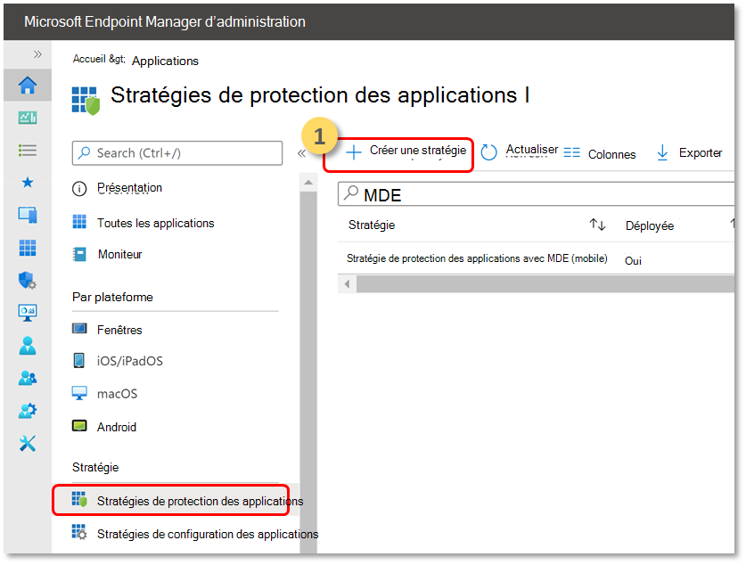

# Configurer Defender pour point de terminaison pour des fonctionnalités Android

[!INCLUDE [Microsoft 365 Defender rebranding](../../includes/microsoft-defender.md)]

**S’applique à :**
- [Microsoft Defender pour point de terminaison Plan 1](https://go.microsoft.com/fwlink/p/?linkid=2154037)
- [Microsoft Defender pour point de terminaison Plan 2](https://go.microsoft.com/fwlink/p/?linkid=2154037)
- [Microsoft 365 Defender](https://go.microsoft.com/fwlink/?linkid=2118804)

## Accès conditionnel avec Defender pour point de terminaison sur Android

Microsoft Defender pour point de terminaison sur Android avec Microsoft Intune et Azure Active Directory permet d’appliquer la conformité des appareils et les stratégies d’accès conditionnel en fonction des niveaux de risque des appareils. Defender pour point de terminaison est une solution MTD (Mobile Threat Defense) que vous pouvez déployer pour tirer parti de cette fonctionnalité via Intune.

Pour plus d’informations sur la configuration de Defender pour point de terminaison sur Android et l’accès conditionnel, consultez [Defender pour point de terminaison et Intune](/mem/intune/protect/advanced-threat-protection).

## Configurer des indicateurs personnalisés

> [!NOTE]
> Defender pour point de terminaison sur Android prend uniquement en charge la création d’indicateurs personnalisés pour les adresses IP et les URL/domaines.

Defender pour point de terminaison sur Android permet aux administrateurs de configurer des indicateurs personnalisés pour prendre également en charge les appareils Android. Pour plus d’informations sur la configuration des indicateurs personnalisés, consultez [Gérer les indicateurs](manage-indicators.md).

## Configurer la protection web
Defender pour point de terminaison sur Android permet aux administrateurs informatiques de configurer la fonctionnalité de protection web. Cette fonctionnalité est disponible dans le Centre d’administration Microsoft Endpoint Manager.

> [!NOTE]
> Defender pour point de terminaison sur Android utiliserait un VPN pour fournir la fonctionnalité Protection Web. Il ne s’agit pas d’un VPN normal et d’un VPN local/auto-bouclage qui ne prend pas le trafic en dehors de l’appareil.
> Pour plus d’informations, consultez [Configurer la protection web sur les appareils qui exécutent Android](/mem/intune/protect/advanced-threat-protection-manage-android).

## Protection réseau
>[!NOTE]
>La protection réseau sur Microsoft Defender pour point de terminaison est désormais en préversion publique. Les informations suivantes concernent le produit pré-publié qui peut être considérablement modifié avant sa publication commerciale. Microsoft n’offre aucune garantie, explicite ou implicite, concernant les informations fournies ici.

Cette fonctionnalité offre une protection contre les menaces non autorisées Wi-Fi et les certificats non autorisés qui sont le principal vecteur d’attaque pour les réseaux Wi-Fi. Les administrateurs peuvent répertorier les certificats d’autorité de certification racine et d’autorité de certification racine privée dans le Centre d’administration Microsoft Endpoint Manager et établir une confiance avec les points de terminaison. Il fournit à l’utilisateur une expérience guidée pour se connecter à des réseaux sécurisés et l’avertit également si une menace associée est détectée. 

Il inclut plusieurs contrôles d’administration pour offrir de la flexibilité, tels que la possibilité de configurer la fonctionnalité à partir du Centre d’administration Microsoft Endpoint Manager, ainsi que d’ajouter des certificats approuvés. Les administrateurs peuvent également activer [les contrôles de confidentialité](android-configure.md) pour configurer les données envoyées par Defender pour point de terminaison à partir d’appareils Android.

La protection réseau dans Microsoft Defender pour point de terminaison est activée par défaut. Les administrateurs peuvent utiliser les étapes suivantes pour **configurer la protection réseau sur les appareils Android.**

1. Dans l’administrateur Microsoft Endpoint Manager, accédez à Applications > stratégies de configuration d’application. Créez une stratégie de configuration d’application.
    > [!div class="mx-imgBorder"]
    > 
1. Fournissez un nom et une description pour identifier de manière unique la stratégie. Sélectionnez **« Android Enterprise »** comme plateforme et **« Profil professionnel appartenant à l’utilisateur uniquement »** comme type de profil et **« Microsoft Defender »** comme application ciblée.
    > [!div class="mx-imgBorder"]
    > 
1. Dans la page Paramètres, sélectionnez **« Utiliser le concepteur de configuration »** et ajoutez **« Activer la protection réseau dans Microsoft Defender »** comme clé et valeur **« 0 »** à diable Network Protection. (La protection réseau est activée par défaut)
    > [!div class="mx-imgBorder"]
    > 
    
    > [!div class="mx-imgBorder"]
    > 
1. Si votre organisation utilise des autorités de certification racine qui peuvent être privées par nature, une approbation explicite doit être établie entre Intune (solution GPM) et les appareils de l’utilisateur afin que Defender ne les détecte pas comme des certificats non autorisés.  

    Pour établir l’approbation pour les autorités de certification racine, utilisez **« Liste de certificats d’autorité de certification approuvée pour la protection réseau (préversion) »** comme clé et ajoutez la **« liste séparée par des virgules des empreintes de certificat** ».
    > [!div class="mx-imgBorder"]
    > 

1. Pour d’autres configurations liées à la protection réseau, ajoutez les clés suivantes et la valeur correspondante appropriée.
 

    | Clé de configuration| Description|
    |---|---|
    |Activer la confidentialité de la protection du réseau|1 - Activer , 0 - Désactiver ; Ce paramètre est géré par les administrateurs informatiques pour activer ou désactiver la confidentialité dans la protection du réseau.|
    |Autoriser les utilisateurs à approuver des réseaux et des certificats|1 - Activer , 0 - Désactiver ; Ce paramètre est utilisé par les administrateurs informatiques pour activer ou désactiver l’expérience de l’utilisateur final dans l’application afin d’approuver et de déstruiser les réseaux non sécurisés et suspects et les certificats malveillants.|
    |Correction automatique des alertes de protection réseau|1 - Activer , 0 - Désactiver ; Ce paramètre est utilisé par les administrateurs informatiques pour activer ou désactiver les alertes de correction envoyées lorsqu’un utilisateur effectue des activités de correction, telles que le passage à un point d’accès Wi-Fi plus sûr ou la suppression de certificats suspects détectés par Defender|
1. Ajoutez les groupes requis sur lesquels la stratégie doit être appliquée. Examinez et créez la stratégie.

## Contrôles de confidentialité

> [!IMPORTANT]
> Les contrôles de confidentialité pour Microsoft Defender pour point de terminaison sur Android sont en préversion. Les informations suivantes concernent le produit pré-publié qui peut être considérablement modifié avant sa publication commerciale. Microsoft n’offre aucune garantie, explicite ou implicite, concernant les informations fournies ici.

Les contrôles de confidentialité suivants sont disponibles pour configurer les données envoyées par Defender pour point de terminaison à partir d’appareils Android :

|Rapport sur les menaces     |Détails      |
|--------------------|-------------|
|Rapport sur les programmes malveillants |Les administrateurs peuvent configurer le contrôle de confidentialité pour le rapport sur les programmes malveillants . Si la confidentialité est activée, Defender pour point de terminaison n’envoie pas le nom de l’application malveillante et les autres détails de l’application dans le cadre du rapport d’alerte de programme malveillant |
|Rapport de hameçonnage |Les administrateurs peuvent configurer le contrôle de confidentialité pour le rapport de hameçonnage . Si la confidentialité est activée, Defender pour point de terminaison n’envoie pas le nom de domaine et les détails du site web non sécurisé dans le cadre du rapport d’alerte de hameçonnage |
|Évaluation des vulnérabilités des applications (Android uniquement) |Par défaut, seules les informations sur les applications installées dans le profil professionnel sont envoyées pour l’évaluation des vulnérabilités. Les administrateurs peuvent désactiver la confidentialité pour inclure des applications personnelles|

## Configurer l’évaluation des vulnérabilités des applications pour les appareils BYOD

À partir de la version 1.0.3425.0303 de Microsoft Defender pour point de terminaison sur Android, vous pourrez exécuter des évaluations des vulnérabilités du système d’exploitation et des applications installées sur les appareils mobiles intégrés.

> [!NOTE]
> L’évaluation des vulnérabilités fait partie de [la gestion des vulnérabilités De Microsoft Defender](../defender-vulnerability-management/defender-vulnerability-management.md) dans Microsoft Defender pour point de terminaison. 

**Remarques sur la confidentialité liée aux applications à partir d’appareils personnels (BYOD) :**

- Pour Android Enterprise avec un profil professionnel, seules les applications installées sur le profil professionnel sont prises en charge.
- Pour les autres modes BYOD, par défaut, l’évaluation des vulnérabilités des applications **n’est pas** activée. Toutefois, lorsque l’appareil est en mode administrateur, les administrateurs peuvent activer explicitement cette fonctionnalité via Microsoft Endpoint Manager pour obtenir la liste des applications installées sur l’appareil. Pour plus d’informations, consultez les détails ci-dessous.

### Configurer la confidentialité pour le mode Administrateur d’appareil

Utilisez les étapes suivantes pour **activer l’évaluation des vulnérabilités des applications à partir d’appareils** en mode **Administrateur d’appareil** pour les utilisateurs ciblés. 

> [!NOTE]
> Par défaut, cette option est désactivée pour les appareils inscrits en mode administrateur d’appareil.

1. Dans le [Centre d’administration Microsoft Endpoint Manager](https://go.microsoft.com/fwlink/?linkid=2109431), accédez aux **profils** >  de configuration **des appareils** > **Créer un profil** et entrez les paramètres suivants :

   - **Plateforme** : Sélectionner l’administrateur d’appareil Android
   - **Profil** : sélectionnez « Personnalisé », puis cliquez sur Créer

2. Dans la section **De base** , spécifiez un nom et une description du profil.

3. Dans les **paramètres de configuration**, sélectionnez Ajouter un paramètre **OMA-URI** :

   - **Nom** : entrez un nom et une description uniques pour ce paramètre OMA-URI afin de pouvoir le trouver facilement plus tard.
   - OMA-URI : **./Vendor/MSFT/DefenderATP/DefenderTVMPrivacyMode**
   - Type de données : sélectionnez Entier dans la liste déroulante.
   - Valeur : entrez 0 pour désactiver le paramètre de confidentialité (par défaut, la valeur est 1)

4. Cliquez sur **Suivant** et affectez ce profil aux appareils/utilisateurs ciblés.

### Configurer la confidentialité pour le profil professionnel Android Enterprise

Defender pour point de terminaison prend en charge l’évaluation des vulnérabilités des applications dans le profil professionnel. Toutefois, si vous souhaitez désactiver cette fonctionnalité pour les utilisateurs ciblés, vous pouvez effectuer les étapes suivantes :

1. Dans le [Centre d’administration Microsoft Endpoint Manager](https://go.microsoft.com/fwlink/?linkid=2109431), accédez **aux** >  stratégies  >  de **configuration d’applications****Ajouter** >  des **appareils gérés**.
2. Donnez un nom à la stratégie ; **Plateforme > Android Enterprise** ; sélectionnez le type de profil.
3. Sélectionnez **Microsoft Defender pour point de terminaison** comme application cible.
4. Dans la page Paramètres, **sélectionnez Utiliser le concepteur de configuration** et ajoutez **DefenderTVMPrivacyMode** comme clé et type valeur **en tant qu’entier**
   - Pour désactiver la vulnérabilité des applications dans le profil professionnel, entrez la valeur `1` et attribuez cette stratégie aux utilisateurs. Par défaut, cette valeur est définie sur `0`.
   - Pour les utilisateurs avec la clé définie comme `0`, Defender pour point de terminaison envoie la liste des applications du profil professionnel au service principal pour l’évaluation des vulnérabilités.
5. Cliquez sur **Suivant** et affectez ce profil aux appareils/utilisateurs ciblés.

L’activation ou la désactivation des contrôles de confidentialité ci-dessus n’aura pas d’impact sur la vérification de la conformité de l’appareil ou l’accès conditionnel.

## Configurer la confidentialité pour le rapport d’alerte de hameçonnage

Le contrôle de la confidentialité des rapports de hameçonnage peut être utilisé pour désactiver la collecte des informations de nom de domaine ou de site web dans le rapport de menaces de hameçonnage. Cela donne aux organisations la possibilité de choisir si elles souhaitent collecter le nom de domaine lorsqu’un site web malveillant ou hameçonnage est détecté et bloqué par Defender pour point de terminaison.

### Configurez la confidentialité pour le rapport d’alerte d’hameçonnage sur les appareils inscrits par l’administrateur d’appareils Android :

Utilisez les étapes suivantes pour l’activer pour les utilisateurs ciblés :

1. Dans le [Centre d’administration Microsoft Endpoint Manager](https://go.microsoft.com/fwlink/?linkid=2109431), accédez aux **profils** >  de configuration **des appareils** > **Créer un profil** et entrez les paramètres suivants :

   - **Plateforme** : Sélectionnez l’administrateur d’appareil Android.
   - **Profil** : sélectionnez « Personnalisé », puis cliquez sur **Créer**.

2. Dans la section **De base** , spécifiez un nom et une description du profil.

3. Dans les **paramètres de configuration**, sélectionnez Ajouter un paramètre **OMA-URI** :

   - **Nom** : entrez un nom et une description uniques pour ce paramètre OMA-URI afin de pouvoir le trouver facilement plus tard.
   - OMA-URI : **./Vendor/MSFT/DefenderATP/DefenderExcludeURLInReport**
   - Type de données : sélectionnez Entier dans la liste déroulante.
   - Valeur : Entrez 1 pour activer le paramètre de confidentialité. La valeur par défaut est 0.

4. Cliquez sur **Suivant** et affectez ce profil aux appareils/utilisateurs ciblés.

L’utilisation de ce contrôle de confidentialité n’aura pas d’impact sur la vérification de conformité de l’appareil ou l’accès conditionnel.

### Configurer la confidentialité pour le rapport d’alerte d’hameçonnage sur le profil professionnel Android Entreprise

Utilisez les étapes suivantes pour activer la confidentialité pour les utilisateurs ciblés dans le profil professionnel :

1. Dans le [Centre d’administration Microsoft Endpoint Manager](https://go.microsoft.com/fwlink/?linkid=2109431), accédez **aux** >  stratégies  >  de **configuration d’applications****Ajouter** >  des **appareils gérés**.
2. Donnez un nom à la stratégie, **Platform > Android Enterprise**, sélectionnez le type de profil.
3. Sélectionnez **Microsoft Defender pour point de terminaison** comme application cible.
4. Dans la page Paramètres, sélectionnez **Utiliser le concepteur de configuration** et ajoutez **DefenderExcludeURLInReport** comme clé et type valeur en tant qu’entier.
   - Entrez **1 pour activer la confidentialité**. La valeur par défaut est 0.
5. Cliquez sur **Suivant** et affectez ce profil aux appareils/utilisateurs ciblés.

L’activation ou la désactivation des contrôles de confidentialité ci-dessus n’aura pas d’impact sur la vérification de la conformité de l’appareil ou l’accès conditionnel.

## Configurer la confidentialité pour le rapport sur les menaces de programmes malveillants

Le contrôle de confidentialité pour le rapport sur les menaces de programmes malveillants peut être utilisé pour désactiver la collecte des détails de l’application (nom et informations de package) à partir du rapport sur les menaces de programmes malveillants. Cela donne aux organisations la possibilité de choisir si elles souhaitent collecter le nom de l’application lorsqu’une application malveillante est détectée.

### Configurer la confidentialité pour le rapport d’alerte de programme malveillant sur les appareils inscrits par l’administrateur d’appareils Android :

Utilisez les étapes suivantes pour l’activer pour les utilisateurs ciblés :

1. Dans le [Centre d’administration Microsoft Endpoint Manager](https://go.microsoft.com/fwlink/?linkid=2109431), accédez aux **profils** >  de configuration **des appareils** > **Créer un profil** et entrez les paramètres suivants :

   - **Plateforme** : Sélectionnez l’administrateur d’appareil Android.
   - **Profil** : sélectionnez « Personnalisé », puis cliquez sur **Créer**.

2. Dans la section **De base** , spécifiez un nom et une description du profil.

3. Dans les **paramètres de configuration**, sélectionnez Ajouter un paramètre **OMA-URI** :

   - **Nom** : entrez un nom et une description uniques pour ce paramètre OMA-URI afin de pouvoir le trouver facilement plus tard.
   - OMA-URI : **./Vendor/MSFT/DefenderATP/DefenderExcludeAppInReport**
   - Type de données : sélectionnez Entier dans la liste déroulante.
   - Valeur : Entrez 1 pour activer le paramètre de confidentialité. La valeur par défaut est 0.

4. Cliquez sur **Suivant** et affectez ce profil aux appareils/utilisateurs ciblés.

L’utilisation de ce contrôle de confidentialité n’aura pas d’impact sur la vérification de conformité de l’appareil ou l’accès conditionnel. Par exemple, les appareils avec une application malveillante ont toujours un niveau de risque « Moyen ».

### Configurer la confidentialité pour le rapport d’alerte de programmes malveillants sur le profil professionnel Android Entreprise

Utilisez les étapes suivantes pour activer la confidentialité pour les utilisateurs ciblés dans le profil professionnel :

1. Dans le [Centre d’administration Microsoft Endpoint Manager](https://go.microsoft.com/fwlink/?linkid=2109431), accédez **aux** >  stratégies  >  de **configuration d’applications****Ajouter** >  des **appareils gérés**.
2. Donnez un nom à la stratégie, **Platform > Android Enterprise**, sélectionnez le type de profil.
3. Sélectionnez **Microsoft Defender pour point de terminaison** comme application cible.
4. Dans la page Paramètres, sélectionnez **Utiliser le concepteur de configuration** et ajoutez **DefenderExcludeAppInReport** comme clé et type valeur en tant **qu’entier**
   - Entrez **1 pour activer la confidentialité**. La valeur par défaut est 0.
5. Cliquez sur **Suivant** et affectez ce profil aux appareils/utilisateurs ciblés.

L’utilisation de ce contrôle de confidentialité n’aura pas d’impact sur la vérification de conformité de l’appareil ou l’accès conditionnel. Par exemple, les appareils avec une application malveillante ont toujours un niveau de risque « Moyen ».

## Rubriques connexes

- [Vue d’ensemble de Microsoft Defender pour point de terminaison Android](microsoft-defender-endpoint-android.md)
- [Déployer Microsoft Defender pour point de terminaison Android via Microsoft Intune](android-intune.md)
