# Déployer Microsoft Defender pour point de terminaison Android via Microsoft Intune

[!INCLUDE [Microsoft 365 Defender rebranding](../../includes/microsoft-defender.md)]

**S’applique à :**
- [Microsoft Defender pour point de terminaison Plan 1](https://go.microsoft.com/fwlink/p/?linkid=2154037)
- [Microsoft Defender pour point de terminaison Plan 2](https://go.microsoft.com/fwlink/p/?linkid=2154037)
- [Microsoft 365 Defender](https://go.microsoft.com/fwlink/?linkid=2118804)

> Vous voulez découvrir Microsoft Defender pour point de terminaison ? [Inscrivez-vous pour bénéficier d’un essai gratuit.](https://signup.microsoft.com/create-account/signup?products=7f379fee-c4f9-4278-b0a1-e4c8c2fcdf7e&ru=https://aka.ms/MDEp2OpenTrial?ocid=docs-wdatp-exposedapis-abovefoldlink)

Découvrez comment déployer Defender pour Endpoint sur Android sur Portail d'entreprise Intune des appareils inscrits. Pour plus d’informations sur l’inscription d’appareils Intune, voir [Inscrire votre appareil.](/mem/intune/user-help/enroll-device-android-company-portal)

> [!NOTE]
> **Defender pour le point de terminaison sur Android est désormais disponible sur [Google Play](https://play.google.com/store/apps/details?id=com.microsoft.scmx)**
>
> Vous pouvez vous connecter à Google Play à partir d’Intune pour déployer l’application Defender for Endpoint sur les modes d’inscription de l’administrateur d’appareil Enterprise Android.
>
> Les mises à jour de l’application sont automatiques via Google Play.

## Déployer sur les appareils inscrits à l’administrateur de périphérique

**Deploy Defender for Endpoint on Android on Portail d'entreprise Intune - Device Administrator enrolled devices**

Découvrez comment déployer Defender pour le point de terminaison sur Android sur Portail d'entreprise Intune - Appareils inscrits par l’administrateur d’appareil.

### Ajouter en tant qu’application de l’Android Store

1. In [Microsoft Endpoint Manager admin center](https://go.microsoft.com/fwlink/?linkid=2109431) , go to **Apps** \> **Android Apps** Add Android store \> **\> app** and choose **Select**.

   :::image type="content" alt-text="Image de l’Microsoft Endpoint Manager centre d’administration ajouter une application de magasin Android." source="images/mda-addandroidstoreapp.png" lightbox="images/mda-addandroidstoreapp.png":::

2. Dans la page **Ajouter une** application et dans la section Informations sur *l’application,* entrez :

   - **Nom**
   - **Description**
   - **Publisher** microsoft.
   - **URL du Magasin d’applications** sous (URL du Google Play Store de l’application https://play.google.com/store/apps/details?id=com.microsoft.scmx Defender for Endpoint)

   Les autres champs sont facultatifs. Sélectionnez **Suivant**.

   :::image type="content" alt-text="Image d’Microsoft Endpoint Manager centre d’administration pour ajouter des informations sur l’application." source="images/mda-addappinfo.png" lightbox="images/mda-addappinfo.png":::

3. Dans la section *Affectations,* allez à la section **Obligatoire** et **sélectionnez Ajouter un groupe.** Vous pouvez ensuite choisir le ou les groupes d’utilisateurs que vous souhaitez cibler Defender pour le point de terminaison sur l’application Android. Sélectionnez **Sélectionner,** puis **Suivant**.

    > [!NOTE]
    > Le groupe d’utilisateurs sélectionné doit être constitué d’utilisateurs inscrits à Intune.
    >
    > :::image type="content" alt-text="Image du centre d Microsoft Endpoint Manager d’administration sélectionné." source="images/363bf30f7d69a94db578e8af0ddd044b.png" lightbox="images/363bf30f7d69a94db578e8af0ddd044b.png":::

4. Dans la section **Révision+Créer,** vérifiez que toutes les informations entrées sont correctes, puis sélectionnez **Créer.**

    Dans quelques instants, l’application Defender pour point de terminaison sera correctement créée et une notification s’affichera dans le coin supérieur droit de la page.

    :::image type="content" alt-text="Image de la Microsoft Endpoint Manager notification du Centre d’administration De Defender pour l’application Point de terminaison." source="images/86cbe56f88bb6e93e9c63303397fc24f.png" lightbox="images/86cbe56f88bb6e93e9c63303397fc24f.png":::

5. Dans la page d’informations sur l’application  qui s’affiche, dans la **section** Moniteur, sélectionnez État de l’installation de l’appareil pour vérifier que l’installation de l’appareil s’est correctement terminée.

    :::image type="content" alt-text="Image de l Microsoft Endpoint Manager’installation de l’appareil du Centre d’administration." source="images/513cf5d59eaaef5d2b5bc122715b5844.png" lightbox="images/513cf5d59eaaef5d2b5bc122715b5844.png":::

### Terminer l’intégration et vérifier l’état

1. Une fois Que Defender pour le point de terminaison sur Android a été installé sur l’appareil, vous verrez l’icône de l’application.

    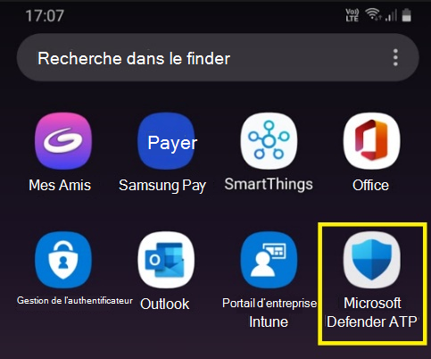

2. Appuyez sur l’icône de l’application Microsoft Defender for Endpoint et suivez les instructions à l’écran pour terminer l’intégration de l’application. Les détails incluent l’acceptation par l’utilisateur final des autorisations Android requises par Defender pour Endpoint sur Android.

3. Une fois l’intégration réussie, l’appareil commence à s’afficher dans la liste Appareils du portail Microsoft 365 Defender web.

    :::image type="content" alt-text="Image de l’appareil dans le portail Defender for Endpoint." source="images/9fe378a1dce0f143005c3aa53d8c4f51.png" lightbox="images/9fe378a1dce0f143005c3aa53d8c4f51.png":::

## Déployer sur les appareils Enterprise Android

Defender pour le point de terminaison sur Android prend en charge les Enterprise android inscrits.

Pour plus d’informations sur les options d’inscription pris en charge par Intune, voir [Options d’inscription.](/mem/intune/enrollment/android-enroll)

**Actuellement, les appareils personnels avec profil de travail et les inscriptions d’appareils utilisateur entièrement gérées par l’entreprise sont pris en charge pour le déploiement.**

## Ajouter Microsoft Defender pour le point de terminaison sur Android en tant qu’application Google Play gérée

Suivez les étapes ci-dessous pour ajouter l’application Microsoft Defender for Endpoint à votre Google Play géré.

1. In [Microsoft Endpoint Manager admin center](https://go.microsoft.com/fwlink/?linkid=2109431) , go to **Apps** \> **Android Apps** \> **Add** and select Managed Google **Play app**.

    :::image type="content" alt-text="Image du Microsoft Endpoint Manager d’administration géré google play." source="images/579ff59f31f599414cedf63051628b2e.png" lightbox="images/579ff59f31f599414cedf63051628b2e.png":::

2. Sur votre page Google Play gérée qui se charge par la suite, allez dans la zone de recherche et entrez `Microsoft Defender` . Votre recherche doit afficher l’application Microsoft Defender for Endpoint dans votre Google Play géré. Cliquez sur l’application Microsoft Defender pour le point de terminaison à partir du résultat de recherche Applications.

    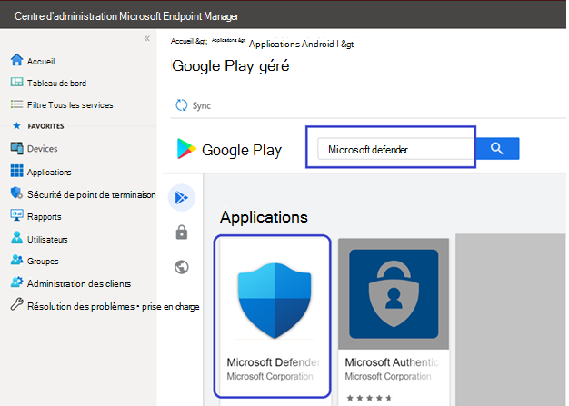

3. Dans la page de description de l’application qui arrive ensuite, vous devriez être en mesure de voir les détails de l’application sur Defender for Endpoint. Examinez les informations sur la page, puis sélectionnez **Approuver.**

    > [!div class="mx-imgBorder"]
    > 

4. Les autorisations obtenues par Defender for Endpoint vous seront présentées pour qu’il fonctionne. Examinez-les, puis sélectionnez **Approuver.**

    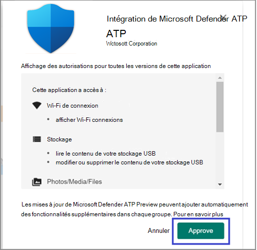

5. La page Paramètres d’approbation s’présente. La page confirme votre préférence pour gérer les nouvelles autorisations d’application que Defender pour le point de terminaison sur Android peut demander. Examinez les choix et sélectionnez votre option préférée. Sélectionnez **Terminé**.

    Par défaut, la fonctionnalité Google Play gérée sélectionne **Conserver approuvé lorsque l’application demande de nouvelles autorisations.**

    > [!div class="mx-imgBorder"]
    > 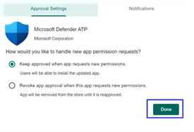

6. Après avoir sélectionné la gestion des autorisations, sélectionnez **Synchroniser** pour synchroniser Microsoft Defender pour le point de terminaison avec votre liste d’applications.

    > [!div class="mx-imgBorder"]
    > 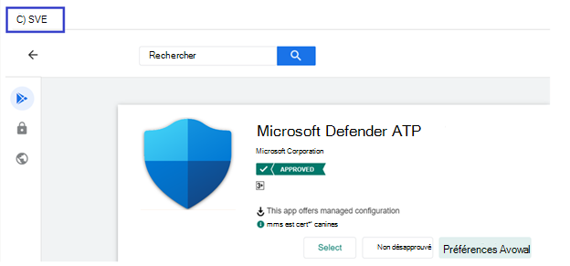

7. La synchronisation se terminera dans quelques minutes.

    :::image type="content" alt-text="Image de l’application Android." source="images/9fc07ffc150171f169dc6e57fe6f1c74.png" lightbox="images/9fc07ffc150171f169dc6e57fe6f1c74.png":::

8. Sélectionnez **le bouton** Actualiser dans l’écran des applications Android et Microsoft Defender pour le point de terminaison doit être visible dans la liste des applications.

    :::image type="content" alt-text="Image de la liste des applications Android." source="images/fa4ac18a6333335db3775630b8e6b353.png" lightbox="images/fa4ac18a6333335db3775630b8e6b353.png":::

9. Defender pour le point de terminaison prend en charge les stratégies de configuration d’application pour les appareils gérés via Intune. Cette fonctionnalité peut être mise à profit pour obtenir automatiquement les autorisations Android applicables, de sorte que l’utilisateur final n’a pas besoin d’accepter ces autorisations.

    1. Dans la page **Applications,** go to **Policy > App configuration policies > Add > Managed devices**.

       :::image type="content" alt-text="Image des appareils gérés android Microsoft Endpoint Manager centre d’administration." source="images/android-mem.png":::

    1. Dans la page **Créer une stratégie de configuration d’application,** entrez les détails suivants :

        - Nom : Microsoft Defender pour le point de terminaison.
        - Choisissez **Android Enterprise** en tant que plateforme.
        - Choisissez **Profil de travail uniquement en** tant que type de profil.
        - Cliquez **sur Sélectionner l’application,** choisissez **Microsoft Defender ATP,** **sélectionnez OK,** puis **Suivant**.

        :::image type="content" alt-text="Image de la page créer une stratégie de configuration d’application." source="images/android-create-app.png" lightbox="images/android-create-app.png":::

    1. Dans la page **Paramètres,** cliquez sur Ajouter dans la section Autorisations pour afficher la liste des autorisations prise en charge. Dans la section Ajouter des autorisations, sélectionnez les autorisations suivantes :

       - Stockage externe (lecture)
       - Stockage externe (écriture)

       Puis sélectionnez **OK**.

       :::image type="content" alt-text="Image de la stratégie de configuration de création d’application Android." source="images/android-create-app-config.png" lightbox="images/android-create-app-config.png":::

    1. Vous devez maintenant voir les autorisations répertoriées et maintenant vous pouvezgrant  automatiquement à la fois en choisissant legrant automatique dans la liste d’état d’autorisation, puis en sélectionnant **Suivant**.

       :::image type="content" alt-text="Image de l’octroi automatique android pour créer une stratégie de configuration d’application." source="images/android-auto-grant.png" lightbox="images/android-auto-grant.png":::

    1. Dans la page **Affectations,** sélectionnez le groupe d’utilisateurs auquel cette stratégie de config d’application sera affectée. Cliquez **sur Sélectionner les groupes à inclure** et en sélectionnant le groupe applicable, puis sélectionnez **Suivant**. Le groupe sélectionné ici est généralement le même groupe que celui auquel vous affecteriez l’application Microsoft Defender pour Endpoint Android.

       :::image type="content" alt-text="Image de la stratégie de configuration de création d’application." source="images/android-select-group.png" lightbox="images/android-select-group.png":::

    1. Dans la page **Révision + Créer** qui arrive ensuite, examinez toutes les informations, puis sélectionnez **Créer.**

        La stratégie de configuration de l’application pour Defender for Endpoint autogranting l’autorisation de stockage est désormais attribuée au groupe d’utilisateurs sélectionné.

        > [!div class="mx-imgBorder"]
        > 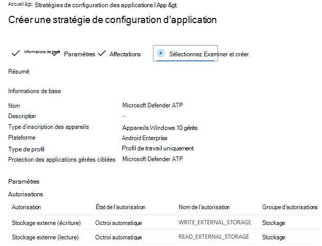

10. Sélectionnez **l’application Microsoft Defender ATP** dans la liste \> **Propriétés** modifier les \> **affectations.** \> 

    :::image type="content" alt-text="Image de la liste des applications." source="images/mda-properties.png" lightbox="images/mda-properties.png":::

11. Affectez l’application en *tant qu’application obligatoire* à un groupe d’utilisateurs. Il est automatiquement installé  dans le profil de travail lors de la synchronisation suivante de l’appareil via Portail d'entreprise application. Cette affectation peut être effectuée en naviguant vers la section *Obligatoire* Ajouter un groupe, en sélectionnant le groupe d’utilisateurs, \>  puis en cliquant sur **Sélectionner.**

    > [!div class="mx-imgBorder"]
    > 

12. Dans la page **Modifier l’application,** examinez toutes les informations entrées ci-dessus. Sélectionnez **Ensuite Révision + Enregistrer,** puis **Réesser pour** commencer l’affectation.

### Configuration automatique du VPN toujours en service

Defender pour le point de terminaison prend en charge les stratégies de configuration des appareils gérés via Intune. Cette fonctionnalité peut être mise à profit pour la configuration automatique du **VPN** toujours connecté sur les appareils Enterprise Android, de sorte que l’utilisateur final n’a pas besoin de configurer le service VPN lors de l’intégration.

1. Sur les **appareils,** sélectionnez **Profils de configuration** \> **Créer une** \> **plateforme** \> **de profil Android Enterprise**

   Sélectionnez **les restrictions d’appareil** sous l’une des conditions suivantes, en fonction du type d’inscription de votre appareil :
   - **Profil de travail entièrement géré, dédié Corporate-Owned travail**
   - **Profil de travail personnel**

   Sélectionnez **Créer**.

   :::image type="content" alt-text="Image du profil de configuration des appareils Créer." source="images/1autosetupofvpn.png":::

2. **Configuration Paramètres** fournir un **nom et** une **description pour** identifier le profil de configuration de manière unique.

   :::image type="content" alt-text="Image du nom et de la description du profil de configuration des appareils." source="images/2autosetupofvpn.png":::

3. Sélectionnez **Connectivité et** configurez vpn :

   - Activer **VPN toujours activé**

     Configurer un client VPN dans le profil professionnel pour qu’il se connecte et se reconnecte automatiquement au VPN dès que possible. Un seul client VPN peut être configuré pour un VPN toujours connecté sur un appareil donné. Assurez-vous donc de n’avoir qu’une seule stratégie VPN toujours en service déployée sur un seul appareil.

   - Sélectionner personnalisé **dans** la liste de listes de listes listes des clients VPN

     Vpn personnalisé dans ce cas est Defender pour le VPN de point de terminaison qui est utilisé pour fournir la fonctionnalité de protection web.

     > [!NOTE]
     > Microsoft Defender pour l’application De point de terminaison doit être installé sur l’appareil de l’utilisateur, afin de fonctionner automatiquement la configuration de ce VPN.

   - Entrez **l’ID de package** de l’application Microsoft Defender for Endpoint dans le Google Play Store. Pour l’URL de l’application <https://play.google.com/store/apps/details?id=com.microsoft.scmx> Defender, l’ID de package **est com.microsoft.scmx**

   - **Mode verrouillage** Non configuré (valeur par défaut)

     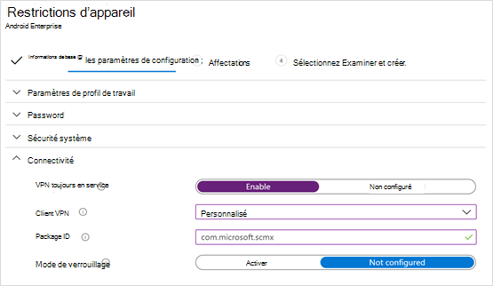
      :::image type="content" alt-text="Image du profil de configuration des appareils qui activent vpn toujours activé." source="images/3autosetupofvpn.png":::

4. **Assignment**

   Dans la page **Affectations,** sélectionnez le groupe d’utilisateurs auquel cette stratégie de config d’application sera affectée. Sélectionnez **Sélectionner les** groupes à inclure et sélectionner le groupe applicable, puis sélectionnez **Suivant**. Le groupe sélectionné ici est généralement le même groupe que celui auquel vous affecteriez l’application Microsoft Defender pour Endpoint Android.

   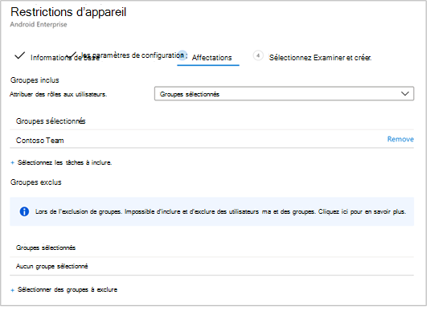

5. Dans la page **Révision + Créer** qui arrive ensuite, examinez toutes les informations, puis sélectionnez **Créer.**
Le profil de configuration de l’appareil est maintenant affecté au groupe d’utilisateurs sélectionné.

   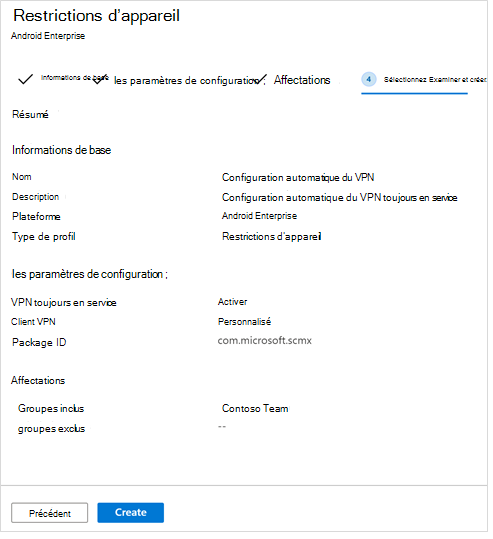

## Vérifier l’état et terminer l’intégration

1. Confirmez l’état d’installation de Microsoft Defender pour le point de terminaison sur Android en cliquant sur l’état **d’installation de l’appareil.** Vérifiez que l’appareil s’affiche ici.

    > [!div class="mx-imgBorder"]
    > 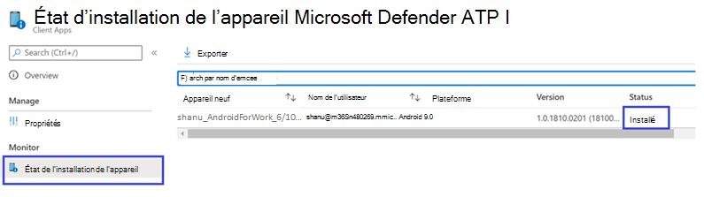

2. Sur l’appareil, vous pouvez valider l’état d’intégration en allant au **profil professionnel.** Confirmez que Defender pour le point de terminaison est disponible et que vous êtes inscrit sur les appareils personnels **avec profil de travail.** Si vous êtes inscrit à un appareil utilisateur entièrement géré par l’entreprise, vous disposez d’un profil unique sur l’appareil où vous pouvez confirmer que Defender pour le point de terminaison est disponible.

    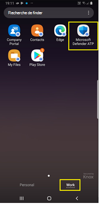

3. Lorsque l’application est installée, ouvrez l’application et acceptez les autorisations, puis votre intégration doit réussir.

    

4. À ce stade, l’appareil est correctement intégré à Defender for Endpoint sur Android. Vous pouvez le vérifier sur le [portail Microsoft 365 Defender en](https://security.microsoft.com) naviguant vers la page Inventaire **des** appareils.

    :::image type="content" alt-text="Image du portail Microsoft Defender pour points de terminaison." source="images/9fe378a1dce0f143005c3aa53d8c4f51.png" lightbox="images/9fe378a1dce0f143005c3aa53d8c4f51.png":::

## Voir aussi

- [Vue d’ensemble de Microsoft Defender pour point de terminaison Android](microsoft-defender-endpoint-android.md)
- [Configurer Microsoft Defender pour point de terminaison pour des fonctionnalités Android](android-configure.md)
