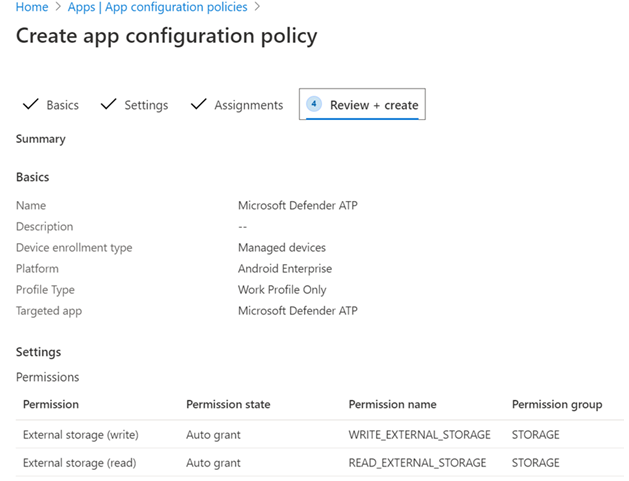
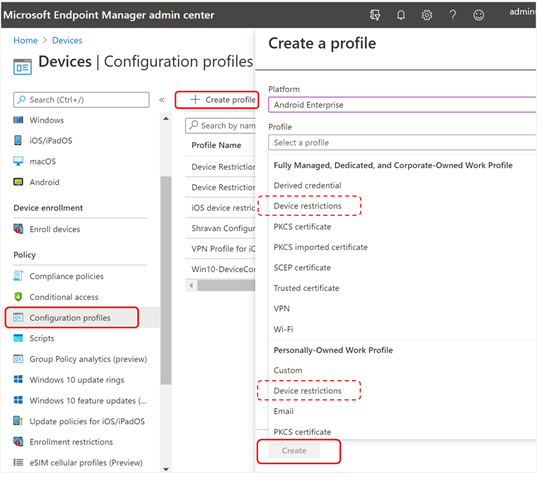

# Déployer Microsoft Defender pour endpoint pour Android avec Microsoft Intune 

[!INCLUDE [Microsoft 365 Defender rebranding](../../includes/microsoft-defender.md)]

**S’applique à :**
- [Microsoft Defender pour point de terminaison](https://go.microsoft.com/fwlink/p/?linkid=2154037)
- [Microsoft 365 Defender](https://go.microsoft.com/fwlink/?linkid=2118804)

> Vous souhaitez découvrir Microsoft Defender pour le point de terminaison ? [Inscrivez-vous à un essai gratuit.](https://www.microsoft.com/microsoft-365/windows/microsoft-defender-atp?ocid=docs-wdatp-exposedapis-abovefoldlink) 

Découvrez comment déployer Defender pour endpoint pour Android sur les appareils inscrits au portail d’entreprise Intune. Pour plus d’informations sur l’inscription d’appareils Intune, voir [Inscrire votre appareil.](https://docs.microsoft.com/mem/intune/user-help/enroll-device-android-company-portal)

> [!NOTE]
> **Defender pour le point de terminaison pour Android est désormais disponible sur [Google Play](https://play.google.com/store/apps/details?id=com.microsoft.scmx)**  
> Vous pouvez vous connecter à Google Play à partir d’Intune pour déployer l’application Defender pour Endpoint sur les modes d’inscription Administrateur d’appareil et Android Entreprise.
Les mises à jour de l’application sont automatiques via Google Play.

## Déployer sur les appareils inscrits à l’administrateur de périphérique

**Deploy Defender for Endpoint for Android on Intune Company Portal - Device Administrator enrolled devices**

Découvrez comment déployer Defender pour endpoint pour Android sur le portail d’entreprise Intune - Appareils inscrits par l’administrateur d’appareil. 

### Ajouter en tant qu’application de l’Android Store

1. Dans [le Centre d’administration Microsoft Endpoint Manager,](https://go.microsoft.com/fwlink/?linkid=2109431) sélectionnez **Applications** Android Apps Ajouter une \>  \> **application de \> l’Android Store** et **sélectionnez Sélectionner.**

   

2. Dans la page **Ajouter une** application et dans la section Informations sur *l’application,* entrez : 

   - **Name** 
   - **Description**
   - **Éditeur** en tant que Microsoft.
   - **URL du Magasin d’applications** sous (URL du Google Play Store de l’application https://play.google.com/store/apps/details?id=com.microsoft.scmx Defender for Endpoint) 

   Les autres champs sont facultatifs. Sélectionnez **Suivant**.

   

3. Dans la section *Affectations,* allez à la section **Obligatoire** et **sélectionnez Ajouter un groupe.** Vous pouvez ensuite choisir le ou les groupes d’utilisateurs que vous souhaitez cibler Defender pour l’application Endpoint pour Android. Sélectionnez **Sélectionner,** puis **Suivant**.

    >[!NOTE]
    >Le groupe d’utilisateurs sélectionné doit être constitué d’utilisateurs inscrits à Intune.

    > [!div class="mx-imgBorder"]

    > 

4. Dans la section **Révision+Créer,** vérifiez que toutes les informations entrées sont correctes, puis sélectionnez **Créer.**

    Dans quelques instants, l’application Defender pour point de terminaison sera correctement créée et une notification s’affichera dans le coin supérieur droit de la page.

    

5. Dans la page d’informations sur l’application  qui s’affiche, dans la **section** Moniteur, sélectionnez État de l’installation de l’appareil pour vérifier que l’installation de l’appareil s’est correctement terminée.

    > [!div class="mx-imgBorder"]
    > 

### Terminer l’intégration et vérifier l’état

1. Une fois Que Defender pour le point de terminaison pour Android a été installé sur l’appareil, vous verrez l’icône de l’application.

    

2. Appuyez sur l’icône de l’application Microsoft Defender ATP et suivez les instructions à l’écran pour terminer l’intégration de l’application. Les détails incluent l’acceptation par l’utilisateur final des autorisations Android requises par Defender pour Endpoint pour Android.

3. Une fois l’intégration réussie, l’appareil commence à s’afficher dans la liste Appareils dans le Centre de sécurité Microsoft Defender.

    

## Déployer sur les appareils inscrits à Android Enterprise

Defender pour le point de terminaison pour Android prend en charge les appareils inscrits à Android Enterprise.

Pour plus d’informations sur les options d’inscription pris en charge par Intune, voir [Options d’inscription.](https://docs.microsoft.com/mem/intune/enrollment/android-enroll)

**Actuellement, les appareils personnels avec profil de travail et les inscriptions d’appareils utilisateur entièrement gérées par l’entreprise sont pris en charge pour le déploiement.**

## Ajouter Microsoft Defender pour le point de terminaison pour Android en tant qu’application Google Play gérée

Suivez les étapes ci-dessous pour ajouter l’application Microsoft Defender for Endpoint à votre Google Play géré.

1. Dans [le Centre d’administration Microsoft Endpoint Manager,](https://go.microsoft.com/fwlink/?linkid=2109431) allez à Apps  \> **Android Apps** \> **Add** et **sélectionnez Managed Google Play app**.

    > [!div class="mx-imgBorder"]
    > 

2. Sur votre page Google Play gérée qui se charge par la suite, allez dans la zone de recherche et **recherchez Microsoft Defender.** Votre recherche doit afficher l’application Microsoft Defender for Endpoint dans votre Google Play géré. Cliquez sur l’application Microsoft Defender pour le point de terminaison à partir du résultat de recherche Applications.

    

3. Dans la page de description de l’application qui arrive ensuite, vous devriez être en mesure de voir les détails de l’application sur Defender for Endpoint. Examinez les informations sur la page, puis sélectionnez **Approuver.**

    > [!div class="mx-imgBorder"]
    > 

4. Les autorisations obtenues par Defender for Endpoint vous seront présentées pour qu’il fonctionne. Examinez-les, puis sélectionnez **Approuver.**

    

5. La page Paramètres d’approbation s’présente. La page confirme votre préférence pour gérer les nouvelles autorisations d’application que Defender pour endpoint pour Android peut demander. Examinez les choix et sélectionnez votre option préférée. Sélectionnez **Terminé**.

    Par défaut, Google Play géré sélectionne *Conserver approuvé lorsque l’application demande de nouvelles autorisations*

    > [!div class="mx-imgBorder"]
    > 

6. Après avoir sélectionné la gestion des autorisations, sélectionnez **Synchroniser** pour synchroniser Microsoft Defender pour le point de terminaison avec votre liste d’applications.

    > [!div class="mx-imgBorder"]
    > 

7. La synchronisation se terminera dans quelques minutes.

    

8. Sélectionnez **le bouton** Actualiser dans l’écran des applications Android et Microsoft Defender ATP doit être visible dans la liste des applications.

    > [!div class="mx-imgBorder"]
    > 

9. Defender pour le point de terminaison prend en charge les stratégies de configuration d’application pour les appareils gérés via Intune. Cette fonctionnalité peut être mise à profit pour obtenir automatiquement les autorisations Android applicables, de sorte que l’utilisateur final n’a pas besoin d’accepter ces autorisations.

    1. Dans la page **Applications,** go to **Policy > App configuration policies > Add > Managed devices**.

       

    1. Dans la page **Créer une stratégie de configuration d’application,** entrez les détails suivants :
    
        - Nom : Microsoft Defender ATP.
        - Choisissez **Android Entreprise comme** plateforme.
        - Choisissez **Profil de travail uniquement en** tant que type de profil.
        - Cliquez **sur Sélectionner l’application,** choisissez **Microsoft Defender ATP,** **sélectionnez OK,** puis **Suivant**.
    
        > [!div class="mx-imgBorder"]
        > 

    1. Dans la page **Paramètres,** cliquez sur Ajouter pour afficher la liste des autorisations prise en charge dans la section Autorisations. Dans la section Ajouter des autorisations, sélectionnez les autorisations suivantes :

       - Stockage externe (lecture)
       - Stockage externe (écriture)

       Puis sélectionnez **OK**.

       > [!div class="mx-imgBorder"]
      > 

    1. Vous devez maintenant voir les autorisations répertoriées et maintenant vous pouvezgrant  automatiquement à la fois en choisissant legrant automatique dans la liste d’état d’autorisation, puis en sélectionnant **Suivant**.

       > [!div class="mx-imgBorder"]
       > 

    1. Dans la page **Affectations,** sélectionnez le groupe d’utilisateurs auquel cette stratégie de config d’application sera affectée. Cliquez **sur Sélectionner les groupes à inclure** et en sélectionnant le groupe applicable, puis sélectionnez **Suivant**.  Le groupe sélectionné ici est généralement le même groupe que celui auquel vous affecteriez l’application Microsoft Defender pour Endpoint Android. 

       > [!div class="mx-imgBorder"]
       > 
    

     1. Dans la page **Révision + Créer** qui arrive ensuite, examinez toutes les informations, puis sélectionnez **Créer.**  
    
        La stratégie de configuration de l’application pour Defender for Endpoint autogranting l’autorisation de stockage est désormais attribuée au groupe d’utilisateurs sélectionné.

        > [!div class="mx-imgBorder"]
        > 

10. Sélectionnez **l’application Microsoft Defender ATP** dans la liste \> **Propriétés** modifier les \> **affectations.** \> 

    

11. Affectez l’application en *tant qu’application obligatoire* à un groupe d’utilisateurs. Il est automatiquement installé  dans le profil de travail lors de la synchronisation suivante de l’appareil via l’application Portail d’entreprise. Cette affectation peut être effectuée en naviguant vers la section *Obligatoire* Ajouter un groupe, en sélectionnant le groupe d’utilisateurs, \>  puis en cliquant sur **Sélectionner.**

    > [!div class="mx-imgBorder"]
    > 

12. Dans la page **Modifier l’application,** examinez toutes les informations entrées ci-dessus. Sélectionnez **Ensuite Révision + Enregistrer,** puis **Réesser pour** commencer l’affectation.

### Configuration automatique du VPN toujours en service 
Defender pour le point de terminaison prend en charge les stratégies de configuration des appareils gérés via Intune. Cette fonctionnalité peut être mise à profit pour la configuration automatique du **VPN** toujours connecté sur les appareils inscrits à Android Enterprise, de sorte que l’utilisateur final n’a pas besoin de configurer le service VPN lors de l’intégration.
1.  Sur **les appareils,** sélectionnez **Profils** de configuration Créer une plateforme de profil Android Enterprise Sélectionner des restrictions d’appareil sous l’une des conditions  >    >    >   **suivantes,** en fonction du type d’inscription de votre appareil 
- **Profil de travail entièrement géré, dédié Corporate-Owned travail**
- **Profil de travail personnel**

Sélectionnez **Créer**.
 
   > 
    
2. **Paramètres de configuration** Fournissez **un nom et** une description **pour** identifier le profil de configuration de manière unique. 

   > 
   
 3. Sélectionnez **Connectivité et** configurez vpn :
- Activez **le programme d’installation VPN** toujours activé d’un client VPN dans le profil professionnel pour vous connecter et vous reconnecter automatiquement au VPN dès que possible. Un seul client VPN peut être configuré pour un VPN toujours connecté sur un appareil donné. Assurez-vous donc de n’avoir qu’une seule stratégie VPN toujours en service déployée sur un seul appareil. 
- Select **Custom** in VPN client dropdown list Custom VPN in this case is Defender for Endpoint VPN which is used to provide the Web Protection feature. 
    > [!NOTE]
    > L’application Microsoft Defender ATP doit être installée sur l’appareil de l’utilisateur pour que la configuration automatique de ce VPN fonctionne.

- Entrez **l’ID de package** de l’application Microsoft Defender ATP dans le Google Play Store. Pour l’URL de l’application https://play.google.com/store/apps/details?id=com.microsoft.scmx Defender, l’ID de package **est com.microsoft.scmx**  
- **Mode verrouillage** Non configuré (valeur par défaut) 

     
   
4. **Affectation** Dans la page  **Affectations,** sélectionnez le groupe d’utilisateurs auquel cette stratégie de config d’application   sera affectée. Cliquez **sur Sélectionner les** groupes à inclure et en sélectionnant le groupe applicable, puis cliquez sur **Suivant**. Le groupe sélectionné ici est généralement le même groupe que celui auquel vous affecteriez l’application Microsoft Defender pour Endpoint Android. 

     

5. Dans la page **Révision + Créer** qui arrive ensuite, examinez toutes les informations, puis sélectionnez **Créer.** Le profil de configuration de l’appareil est maintenant affecté au groupe d’utilisateurs sélectionné.    

    

## Terminer l’intégration et vérifier l’état

1. Confirmez l’état d’installation de Microsoft Defender pour le point de terminaison pour Android en cliquant sur l’état **d’installation de l’appareil.** Vérifiez que l’appareil s’affiche ici.

    > [!div class="mx-imgBorder"]
    > 

2. Sur l’appareil, vous pouvez valider l’état d’intégration en allant au **profil professionnel.** Confirmez que Defender pour le point de terminaison est disponible et que vous êtes inscrit sur les appareils personnels **avec profil de travail.**  Si vous êtes inscrit à un appareil utilisateur entièrement géré par l’entreprise, vous disposez d’un profil unique sur l’appareil où vous pouvez confirmer que Defender pour le point de terminaison est disponible.

    

3. Lorsque l’application est installée, ouvrez l’application et acceptez les autorisations, puis votre intégration doit réussir.

    

4. À ce stade, l’appareil est correctement intégré à Defender for Endpoint pour Android. Vous pouvez le vérifier dans le Centre de sécurité [Microsoft Defender](https://securitycenter.microsoft.com) en naviguant vers la page **Appareils.**

    

## Voir aussi
- [Vue d’ensemble de Microsoft Defender pour point de terminaison pour Android](microsoft-defender-endpoint-android.md)
- [Configurer Microsoft Defender pour les fonctionnalités Endpoint pour Android](android-configure.md)
