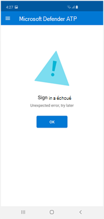
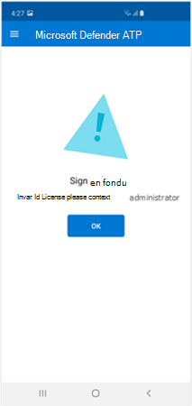
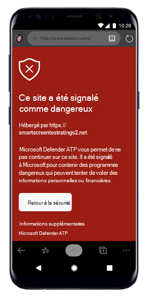
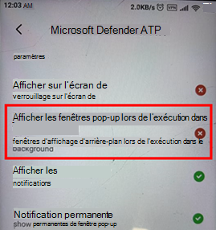

# Résolution des problèmes sur Microsoft Defender pour point de terminaison sur Android

[!INCLUDE [Microsoft 365 Defender rebranding](../../includes/microsoft-defender.md)]

**S’applique à :**
- [Microsoft Defender pour point de terminaison](https://go.microsoft.com/fwlink/p/?linkid=2154037)
- [Microsoft 365 Defender](https://go.microsoft.com/fwlink/?linkid=2118804)

> Vous souhaitez découvrir Microsoft Defender pour le point de terminaison ? [Inscrivez-vous à un essai gratuit.](https://www.microsoft.com/microsoft-365/windows/microsoft-defender-atp?ocid=docs-wdatp-exposedapis-abovefoldlink) 

Lors de l’intégration d’un appareil, vous pouvez voir des problèmes de connectez-vous après l’installation de l’application.

Lors de l’intégration, vous pouvez rencontrer des problèmes de connectez-vous après l’installation de l’application sur votre appareil.

Cet article fournit des solutions pour vous aider à résoudre les problèmes d' sign-on.  

## Échec de la signature : erreur inattendue
**Échec de la signature : erreur** *inattendue, essayez ultérieurement*

**Message:**

Erreur inattendue, essayez ultérieurement

**Cause :**

Une version antérieure de l’application « Microsoft Authenticator » est installée sur votre appareil.

**Solution :**

Installer la dernière version et [les](https://play.google.com/store/apps/details?androidid=com.azure.authenticator) Microsoft Authenticator à partir de Google Play Store et essayer à nouveau

## Échec de la signature - Licence non valide

**Échec de la signature : licence** non *valide, contactez l’administrateur*

**Message : licence** *non valide, contactez l’administrateur*

**Cause :**

Vous n’avez pas Microsoft 365 licence attribuée ou votre organisation n’a pas de licence pour Microsoft 365 Entreprise abonnement.

**Solution :**

Contactez votre administrateur pour obtenir de l'aide.

## Signaler un site non sécurisé

Les sites web de hameçonnage usurpent l’identité de sites web dignes de confiance dans le but d’obtenir vos informations personnelles ou financières. Consultez la page [Fournir des commentaires sur la protection](https://www.microsoft.com/wdsi/filesubmission/exploitguard/networkprotection) du réseau si vous souhaitez signaler un site web qui pourrait être un site de hameçonnage.

## Les pages de hameçonnage ne sont pas bloquées sur certains appareils OEM

**S’applique à :** OEM spécifiques uniquement

-   **Érmi**

L’hameçonnage et les menaces web dangereuses détectées par Defender pour Endpoint pour Android ne sont pas bloqués sur certains appareils Android. Les fonctionnalités suivantes ne fonctionnent pas sur ces appareils.

**Cause :**

Les appareils Demi incluent un nouveau modèle d’autorisation. Cela empêche Defender pour point de terminaison pour Android d’afficher des fenêtres pop-up alors qu’elle s’exécute en arrière-plan.

Autorisation d’appareils : « Afficher les fenêtres pop-up en cours d’exécution en arrière-plan ».

**Solution :**

Activez l’autorisation requise sur les appareils DeMi.

- Afficher les fenêtres pop-up en cours d’exécution en arrière-plan.
