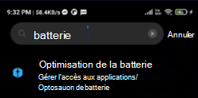
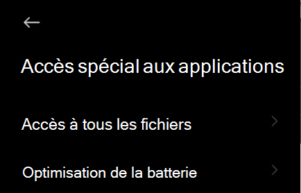
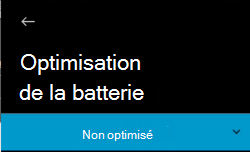
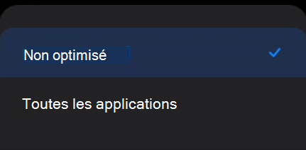
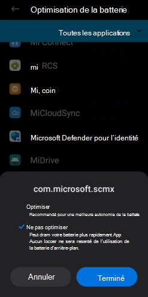

# Résolution des problèmes sur Microsoft Defender pour point de terminaison sur Android

[!INCLUDE [Microsoft 365 Defender rebranding](../../includes/microsoft-defender.md)]

**S’applique à :**
- [Microsoft Defender for Endpoint Plan 1](https://go.microsoft.com/fwlink/p/?linkid=2154037)
- [Microsoft Defender for Endpoint Plan 2](https://go.microsoft.com/fwlink/p/?linkid=2154037)
- [Microsoft 365 Defender](https://go.microsoft.com/fwlink/?linkid=2118804)

> Vous voulez découvrir Microsoft Defender pour point de terminaison ? [Inscrivez-vous pour bénéficier d’un essai gratuit.](https://signup.microsoft.com/create-account/signup?products=7f379fee-c4f9-4278-b0a1-e4c8c2fcdf7e&ru=https://aka.ms/MDEp2OpenTrial?ocid=docs-wdatp-exposedapis-abovefoldlink)

Lors de l’intégration d’un appareil, vous pouvez voir des problèmes de sign in après l’installation de l’application.

Lors de l’intégration, vous pouvez rencontrer des problèmes de connectez-vous après l’installation de l’application sur votre appareil.

Cet article fournit des solutions pour vous aider à résoudre les problèmes d' sign-on.

## Échec de la signature : erreur inattendue

**Échec de la signature : erreur** *inattendue, essayez plus tard*

:::image type="content" alt-text="Image de l’erreur d’échec de la signature. Erreur inattendue." source="images/f9c3bad127d636c1f150d79814f35d4c.png":::

**Message:**

Erreur inattendue, essayez ultérieurement

**Cause :**

Une version antérieure de l’application « Microsoft Authenticator » est installée sur votre appareil.

**Solution :**

Installez la dernière version et les [Microsoft Authenticator](https://play.google.com/store/apps/details?id=com.azure.authenticator) à partir de Google Play Store et essayez à nouveau.

## Échec de la signature - Licence non valide

**Échec de la signature : licence** non *valide, contactez l’administrateur*

:::image type="content" alt-text="Image de l’échec de la connectez-vous. Contactez l’administrateur." source="images/920e433f440fa1d3d298e6a2a43d4811.png":::

**Message : licence** *non valide, contactez l’administrateur*

**Cause :**

Vous n’avez pas Microsoft 365 licence attribuée ou votre organisation n’a pas de licence pour Microsoft 365 Entreprise abonnement.

**Solution :**

Contactez votre administrateur pour obtenir de l'aide.

## Signaler un site non sécurisé

Les sites web de hameçonnage usurpent l’identité de sites web dignes de confiance dans le but d’obtenir vos informations personnelles ou financières. Consultez la page [Fournir des commentaires sur la protection](https://www.microsoft.com/wdsi/filesubmission/exploitguard/networkprotection) du réseau si vous souhaitez signaler un site web qui pourrait être un site de hameçonnage.

## Les pages de hameçonnage ne sont pas bloquées sur certains appareils OEM

**S’applique à :** OEM spécifiques uniquement

- **Érmi**

L’hameçonnage et les menaces web dangereuses détectées par Defender pour Endpoint pour Android ne sont pas bloqués sur certains appareils Android. Les fonctionnalités suivantes ne fonctionnent pas sur ces appareils.

**Cause :**

Les appareils Demi incluent un nouveau modèle d’autorisation. Cela empêche Defender pour point de terminaison pour Android d’afficher des fenêtres pop-up alors qu’elle s’exécute en arrière-plan.

Autorisation des appareils Demi : « Afficher les fenêtres pop-up en cours d’exécution en arrière-plan ».

**Solution :**

Activez l’autorisation requise sur les appareils Androidmi.

- Afficher les fenêtres pop-up en cours d’exécution en arrière-plan.

## Impossible d’autoriser l’autorisation « Protection permanente » lors de l’intégration sur certains appareils OEM

**S’applique à :** Appareils OEM spécifiques uniquement.

- **Android 11**

Defender App demande l’autorisation Optimisation de la batterie/Protection permanente  sur les appareils dans le cadre de l’intégration de l’application, et la sélection de l’autorisation renvoie une erreur qui veut que l’autorisation n’a pas pu être définie. Elle affecte uniquement la dernière autorisation appelée « Protection permanente ». 

**Cause :**

Il a modifié les autorisations d’optimisation de la batterie dans Android 11. Defender pour le point de terminaison n’est pas autorisé à configurer ce paramètre pour ignorer les optimisations de batterie.

**Solution :**

Nous travaillons avec OEM pour trouver une solution permettant d’activer cette autorisation à partir de l’écran d’intégration de l’application. Nous allons mettre à jour la documentation une fois ce problème résolu.
Les utilisateurs peuvent suivre ces étapes pour activer les mêmes autorisations à partir des paramètres de l’appareil : 

1. Go to **Paramètres** on your device.

2. Recherchez et sélectionnez **Optimisation de la batterie.**

   

3. Dans **l’accès spécial à l’application,** **sélectionnez Optimisation de la batterie.**

   

4. Modifiez la dropdown pour afficher **toutes les applications.**

   

   

5. Recherchez « Microsoft Defender pour le point de terminaison », puis **sélectionnez Ne pas optimiser.**

   

Revenir à l’écran d’intégration de Microsoft Defender for Endpoint, sélectionnez Autoriser **et** vous serez redirigé vers l’écran du tableau de bord.

## Envoyer des commentaires dans l’application

Si un utilisateur rencontre un problème qui n’est pas déjà résolu dans les sections **ci-dessus** ou n’est pas en mesure de résoudre à l’aide des étapes répertoriées, l’utilisateur peut fournir des commentaires dans l’application ainsi que des données **de diagnostic.** Notre équipe peut ensuite examiner les journaux pour fournir la solution appropriée. Les utilisateurs peuvent suivre les étapes suivantes pour faire de même :

1.  Ouvrez **l’application MDE** sur votre appareil et cliquez sur l’icône **de profil** dans le coin supérieur gauche.

    :::image type="content" alt-text="Cliquez sur l’icône de profil." source="images/select-profile-icon-1.jpg":::

2.  Sélectionnez « Aide & commentaires ».

    :::image type="content" alt-text="Sélectionnez l’aide et les commentaires." source="images/selecthelpandfeedback2.png":::

3.  Sélectionnez « Envoyer des commentaires à Microsoft ».

    :::image type="content" alt-text="Sélectionnez envoyer des commentaires à Microsoft." source="images/send-feedback-to-microsoft-3.jpg":::

4.  Choisissez parmi les options données. Pour signaler un problème, sélectionnez « Je souhaite signaler un problème ».

    :::image type="content" alt-text="Signalez un problème." source="images/report-issue-4.jpg":::

5.  Fournissez des détails sur le problème auquel vous êtes confronté et vérifiez « Envoyer des données de diagnostic ». Nous vous recommandons de vérifier « Inclure votre adresse e-mail » afin que l’équipe puisse vous joindre avec une solution ou un suivi.

    :::image type="content" alt-text="Ajoutez des détails et joignez des données de diagnostic." source="images/finalsubmit5.png":::

6.  Cliquez sur « Envoyer » pour envoyer correctement les commentaires.
