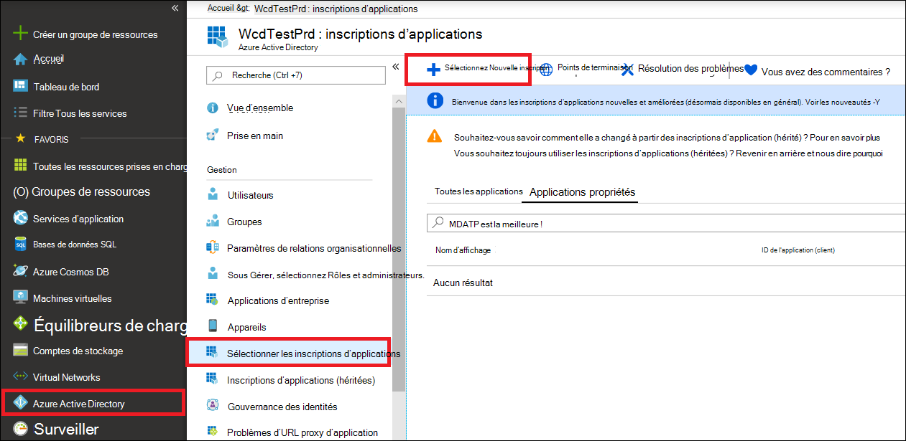
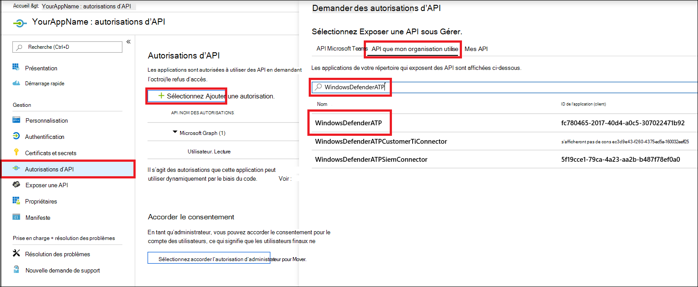
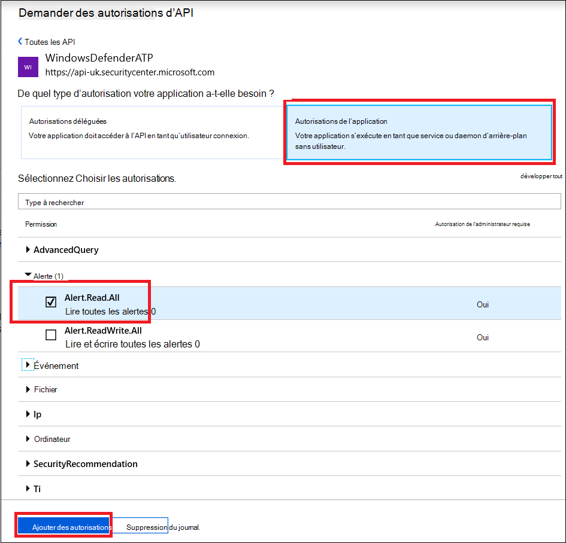
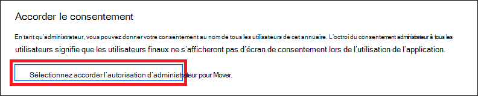
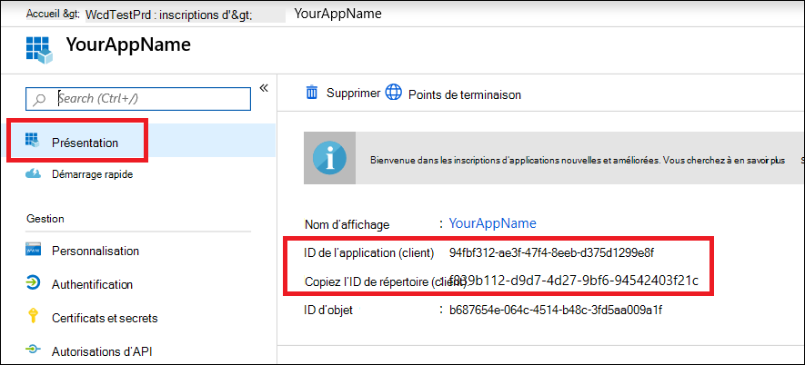

# <a name="microsoft-defender-for-endpoint-api---hello-world"></a>API Microsoft Defender pour point de terminaison - Hello World

[!INCLUDE [Microsoft 365 Defender rebranding](../../includes/microsoft-defender.md)]


**S’applique à :**
- [Microsoft Defender pour point de terminaison](https://go.microsoft.com/fwlink/?linkid=2154037)


- Vous voulez découvrir Microsoft Defender pour point de terminaison ? [Inscrivez-vous pour bénéficier d’un essai gratuit.](https://signup.microsoft.com/create-account/signup?products=7f379fee-c4f9-4278-b0a1-e4c8c2fcdf7e&ru=https://aka.ms/MDEp2OpenTrial?ocid=docs-wdatp-exposedapis-abovefoldlink)

[!include[Microsoft Defender for Endpoint API URIs for US Government](../../includes/microsoft-defender-api-usgov.md)]

[!include[Improve request performance](../../includes/improve-request-performance.md)]


## <a name="get-alerts-using-a-simple-powershell-script"></a>Obtenir des alertes à l’aide d’un script PowerShell simple

### <a name="how-long-it-takes-to-go-through-this-example"></a>Combien de temps faut-il pour passer par cet exemple ?

Cela ne prend que 5 minutes en deux étapes :

- Inscription de l’application
- Exemples : nécessite uniquement une copie/coller d’un court script PowerShell

### <a name="do-i-need-a-permission-to-connect"></a>Ai-je besoin d’une autorisation pour me connecter ?

Pour l’étape d’inscription  de l’application, vous devez avoir un rôle d’administrateur général dans Azure Active Directory client (Azure AD).

### <a name="step-1---create-an-app-in-azure-active-directory"></a>Étape 1 : créer une application dans Azure Active Directory

1. Connectez-vous [à Azure](https://portal.azure.com) avec votre **utilisateur administrateur** général.

2. Accédez à **Azure Active Directory** \> **inscription de l’application Nouvelle** \> **inscription.**

   

3. Dans le formulaire d’inscription, choisissez un nom pour votre application, puis cliquez sur **Enregistrer.**

4. Autorisez votre application à accéder à Defender pour endpoint et attribuez-lui **l’autorisation** « Lire toutes les alertes » :

   - Dans la page de votre application, cliquez sur **Autorisations d’API** Ajouter des API d’autorisation que mon \>  \>  organisation > **tapez WindowsDefenderATP** et cliquez sur **WindowsDefenderATP**.

   - **Remarque**: WindowsDefenderATP n’apparaît pas dans la liste d’origine. Vous devez commencer à écrire son nom dans la zone de texte pour qu’il apparaisse.

   

   - Choose **Application permissions** \> **Alert.Read.All** > Click on **Add permissions**

   

   **Remarque importante**: vous devez sélectionner les autorisations pertinentes. « Lire toutes les alertes » n’est qu’un exemple !

     Par exemple,

     - Pour [exécuter des requêtes avancées,](run-advanced-query-api.md)sélectionnez l’autorisation « Exécuter des requêtes avancées »
     - Pour [isoler un ordinateur,](isolate-machine.md)sélectionnez l’autorisation « Isoler l’ordinateur »
     - Pour déterminer l’autorisation qui vous est nécessaire, consultez la section **Autorisations** de l’API que vous souhaitez appeler.

5. Cliquez sur **Accorder le consentement**

   - **Remarque**: chaque fois que vous ajoutez une autorisation, vous devez cliquer sur **Accorder le consentement** pour que la nouvelle autorisation prenne effet.

   

6. Ajoutez un secret à l’application.

   - Cliquez **sur Certificats & secrets,** ajoutez une description à la secret, puis cliquez sur **Ajouter**.

    **Important**: après avoir cliqué sur Ajouter, **copiez la valeur de secret générée.** Vous ne pourrez plus récupérer une fois que vous êtes parti !

    

7. Notez votre ID d’application et votre ID de client :

   - Dans la page de votre application, allez à **Vue d’ensemble** et copiez ce qui suit :

   

Terminé ! Vous avez réussi à inscrire une application !

### <a name="step-2---get-a-token-using-the-app-and-use-this-token-to-access-the-api"></a>Étape 2 : obtenir un jeton à l’aide de l’application et utiliser ce jeton pour accéder à l’API.

- Copiez le script ci-dessous sur PowerShell ISE ou dans un éditeur de texte, puis enregistrez-le sous «**Get-Token.ps1**»
- L’exécution de ce script génère un jeton et l’enregistre dans le dossier de travail sous le nom **«Latest-token.txt**».

   ```powershell
   # That code gets the App Context Token and save it to a file named "Latest-token.txt" under the current directory
   # Paste below your Tenant ID, App ID and App Secret (App key).

   $tenantId = '' ### Paste your tenant ID here
   $appId = '' ### Paste your Application ID here
   $appSecret = '' ### Paste your Application secret here

   $resourceAppIdUri = 'https://api.securitycenter.microsoft.com'
   $oAuthUri = "https://login.microsoftonline.com/$TenantId/oauth2/token"
   $authBody = [Ordered] @{
       resource = "$resourceAppIdUri"
       client_id = "$appId"
       client_secret = "$appSecret"
       grant_type = 'client_credentials'
   }
   $authResponse = Invoke-RestMethod -Method Post -Uri $oAuthUri -Body $authBody -ErrorAction Stop
   $token = $authResponse.access_token
   Out-File -FilePath "./Latest-token.txt" -InputObject $token
   return $token
   ```

- Vérification de la sanité :
  - Exécutez le script.
  - Dans votre navigateur, allez à : <https://jwt.ms/>
  - Copiez le jeton (le contenu du Latest-token.txt fichier).
  - Coller dans la zone supérieure.
  - Recherchez la section « rôles ». Recherchez le rôle Alert.Read.All.

  

### <a name="lets-get-the-alerts"></a>Permet d’obtenir les alertes !

- Le script ci-dessous utilise **Get-Token.ps1** pour accéder à l’API et reçoit les dernières alertes de 48 heures.
- Enregistrez ce script dans le dossier que vous avez enregistré le script **précédentGet-Token.ps1**.
- Le script crée deux fichiers (json et csv) avec les données du même dossier que les scripts.

  ```powershell
  # Returns Alerts created in the past 48 hours.

  $token = ./Get-Token.ps1       #run the script Get-Token.ps1  - make sure you are running this script from the same folder of Get-Token.ps1

  # Get Alert from the last 48 hours. Make sure you have alerts in that time frame.
  $dateTime = (Get-Date).ToUniversalTime().AddHours(-48).ToString("o")

  # The URL contains the type of query and the time filter we create above
  # Read more about other query options and filters at   Https://TBD- add the documentation link
  $url = "https://api.securitycenter.microsoft.com/api/alerts?`$filter=alertCreationTime ge $dateTime"

  # Set the WebRequest headers
  $headers = @{
      'Content-Type' = 'application/json'
      Accept = 'application/json'
      Authorization = "Bearer $token"
  }

  # Send the webrequest and get the results.
  $response = Invoke-WebRequest -Method Get -Uri $url -Headers $headers -ErrorAction Stop

  # Extract the alerts from the results.
  $alerts =  ($response | ConvertFrom-Json).value | ConvertTo-Json

  # Get string with the execution time. We concatenate that string to the output file to avoid overwrite the file
  $dateTimeForFileName = Get-Date -Format o | foreach {$_ -replace ":", "."}

  # Save the result as json and as csv
  $outputJsonPath = "./Latest Alerts $dateTimeForFileName.json"
  $outputCsvPath = "./Latest Alerts $dateTimeForFileName.csv"

  Out-File -FilePath $outputJsonPath -InputObject $alerts
  ($alerts | ConvertFrom-Json) | Export-CSV $outputCsvPath -NoTypeInformation
  ```

Vous avez terminé ! Vous avez réussi :

- Créé et inscrit et application
- Autorisation accordée à cette application pour lire les alertes
- Connecté à l’API
- Utilisation d’un script PowerShell pour renvoyer les alertes créées au cours des dernières 48 heures

## <a name="related-topic"></a>Rubrique connexe

- [API Microsoft Defender pour point de terminaison](exposed-apis-list.md)
- [Accéder à Microsoft Defender pour le point de terminaison avec le contexte de l’application](exposed-apis-create-app-webapp.md)
- [Accéder à Microsoft Defender pour le point de terminaison avec le contexte utilisateur](exposed-apis-create-app-nativeapp.md)
