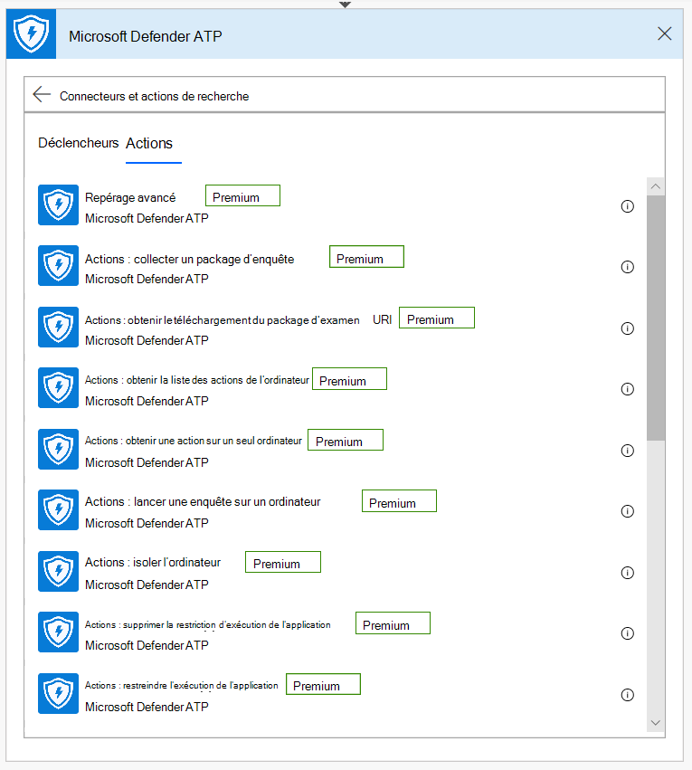
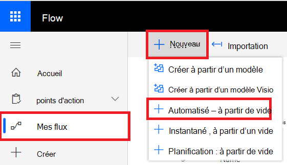

# Microsoft Power Automate (anciennement Microsoft Flow) et Azure Functions

[!INCLUDE [Microsoft 365 Defender rebranding](../../includes/microsoft-defender.md)]

**S’applique à :**
- [Microsoft Defender pour point de terminaison](https://go.microsoft.com/fwlink/p/?linkid=2154037)
- [Microsoft 365 Defender](https://go.microsoft.com/fwlink/?linkid=2118804)

- Vous souhaitez découvrir Microsoft Defender pour le point de terminaison ? [Inscrivez-vous à un essai gratuit.](https://www.microsoft.com/microsoft-365/windows/microsoft-defender-atp?ocid=docs-wdatp-exposedapis-abovefoldlink) 

L’automatisation des procédures de sécurité est une exigence standard pour chaque centre des opérations de sécurité moderne. L’absence de cyber-défenseurs professionnels force SOC à fonctionner de la manière la plus efficace et l’automatisation est une chose à faire. Microsoft Power Automate prend en charge différents connecteurs qui ont été créés exactement pour cela. Vous pouvez créer une automatisation de procédure de bout en bout en quelques minutes.

L’API Microsoft Defender dispose d’un connecteur Flow officiel avec de nombreuses fonctionnalités.

> [!NOTE]
> Pour plus d’informations sur les conditions préalables de licence des connecteurs premium, voir [Licensing for premium connectors](https://docs.microsoft.com/power-automate/triggers-introduction#licensing-for-premium-connectors).

## Exemple d'utilisation

L’exemple suivant montre comment créer une Flow qui est déclenchée chaque fois qu’une nouvelle alerte se produit sur votre client.

1. Connectez-vous [à Microsoft Power Automate](https://flow.microsoft.com).

2. Go to **My flows**  >  **New**  >  **Automated-from blank**.

    

3. Choisissez un nom pour votre Flow, recherchez « déclencheurs Microsoft Defender ATP » comme déclencheur, puis sélectionnez le nouveau déclencheur Alertes.

    

Vous avez maintenant une Flow qui est déclenchée chaque fois qu’une nouvelle alerte se produit.

Il vous suffit maintenant de choisir les étapes suivantes.
Par exemple, vous pouvez isoler l’appareil si la gravité de l’alerte est élevée et envoyer un e-mail à son sujet.
Le déclencheur d’alerte fournit uniquement l’ID d’alerte et l’ID de l’ordinateur. Vous pouvez utiliser le connecteur pour développer ces entités.

### Obtenir l’entité Alerte à l’aide du connecteur

1. Choisissez **Microsoft Defender ATP** pour la nouvelle étape.

2. Choose **Alerts - Get single alert API**.

3. Définissez **l’ID d’alerte** de la dernière étape en tant **qu’entrée.**

    

### Isoler l’appareil si la gravité de l’alerte est élevée

1. Ajoutez **condition** en tant que nouvelle étape.

2. Vérifiez si la gravité de **l’alerte est égale à** Élevée.

   Si oui, ajoutez le Microsoft Defender ATP - Isoler l’action **de l’ordinateur** avec l’ID de l’ordinateur et un commentaire.

    

3. Ajoutez une nouvelle étape pour l’envoi par courrier électronique de l’alerte et de l’isolation. Il existe plusieurs connecteurs de messagerie très faciles à utiliser, tels que Outlook ou Gmail.

4. Enregistrez votre flux.

Vous pouvez également créer un **flux programmé** qui exécute des requêtes de recherche avancée, et bien plus encore !

## Rubrique connexe
- [API Microsoft Defender pour point de terminaison](apis-intro.md)
