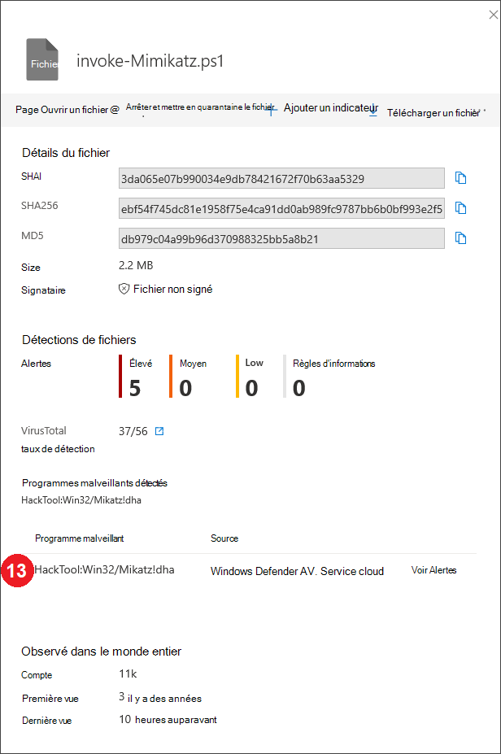
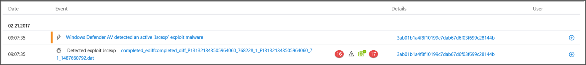
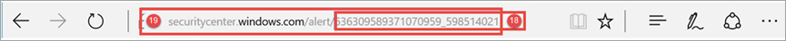

# Champs de l'API microsoft Defender pour les détections de points de terminaison

[!INCLUDE [Microsoft 365 Defender rebranding](../../includes/microsoft-defender.md)]

**S’applique à :**
- [Microsoft Defender pour point de terminaison](https://go.microsoft.com/fwlink/p/?linkid=2154037)
- [Microsoft 365 Defender](https://go.microsoft.com/fwlink/?linkid=2118804)

>Vous souhaitez faire l'expérience de Defender pour point de terminaison ? [Inscrivez-vous à un essai gratuit.](https://www.microsoft.com/microsoft-365/windows/microsoft-defender-atp?ocid=docs-wdatp-apiportalmapping-abovefoldlink)

Comprendre les champs de données qui sont exposés dans le cadre de l'API de détections et comment ils sont mapés au Centre de sécurité Microsoft Defender.

>[!Note]
>- [Defender for Endpoint Alert](alerts.md) se compose d'une ou de plusieurs détections.
>- **La détection Microsoft Defender ATP est** composée de l'événement suspect qui s'est produit sur l'appareil et de ses détails **d'alerte** associés.
>- L'API d'alerte microsoft Defender pour point de terminaison est la dernière API pour la consommation des alertes et contient une liste détaillée des preuves associées à chaque alerte. Pour plus d'informations, voir [Méthodes et propriétés d'alerte et](alerts.md) Liste des [alertes.](get-alerts.md)

## Champs API détections et mappage de portail
Le tableau suivant répertorie les champs disponibles exposés dans la charge utile de l'API de détections. Il présente des exemples pour les valeurs remplies et une référence sur la façon dont les données sont reflétées sur le portail.

La colonne de champ ArcSight contient le mappage par défaut entre les champs Defender pour point de terminaison et les champs intégrés dans ArcSight. Vous pouvez télécharger le fichier de mappage à partir du portail lorsque vous activez la fonctionnalité d'intégration SIEM et le modifier pour répondre aux besoins de votre organisation. Pour plus d'informations, voir [Enable SIEM integration in Defender for Endpoint](enable-siem-integration.md).

Les numéros de champ correspondent aux numéros dans les images ci-dessous.

> [!div class="mx-tableFixed"]
> 
> | Étiquette de portail   | Nom du champ SIEM           | Champ ArcSight      | Exemple de valeur                                                                      | Description                                                                                                                                                                    |
> |------------------|---------------------------|---------------------|------------------------------------------------------------------------------------|--------------------------------------------------------------------------------------------------------------------------------------------------------------------------------|
> | 1                | AlertTitle                | name                | L’Antivirus Microsoft Defender a détecté un programme malveillant de gravité élevée | Valeur disponible pour chaque détection.                                                                                                                                               |
> | 2                | Severity                  | deviceSeverity      | Élevé                                                                             | Valeur disponible pour chaque détection.                                                                                                                                               |
> | 3                | Catégorie                  | deviceEventCategory | Programme malveillant                                                               | Valeur disponible pour chaque détection.                                                                                                                                               |
> | 4                 | Source de détection                    | sourceServiceName   | Antivirus                                                                 | Antivirus Microsoft Defender ou Defender pour point de terminaison. Valeur disponible pour chaque détection.                                                                                         |
> | 5                 | MachineName               | sourceHostName      | desktop-4a5ngd6                                                                           | Valeur disponible pour chaque détection.                                                                                                                                               |
> | 6                 | FileName                  | fileName            | Robocopy.exe                                                                       | Disponible pour les détections associées à un fichier ou un processus.                                                                                                                      |
> | 7                 | FilePath                  | filePath            | C:\Windows\System32\Robocopy.exe                                                   | Disponible pour les détections associées à un fichier ou un processus.                                                                                                                     |
> | 8                 | UserDomain                | sourceNtDomain      | CONTOSO                                                                            | Domaine du contexte utilisateur exécutant l’activité, disponible pour defender pour les détections basées sur le comportement des points de terminaison.                                                           |
> | 9                 | UserName                  | sourceUserName      | liz.bean                                                                           | Contexte utilisateur exécutant l’activité, disponible pour Defender pour les détections basées sur le comportement des points de terminaison.                                                                           |
> | 10                | Sha1                      | fileHash            | 3da065e07b990034e9db7842167f70b63aa5329                                           | Disponible pour les détections associées à un fichier ou un processus.                                                                                                                      |
> | 11               | Sha256                    | deviceCustomString6 | ebf54f745dc81e1958f75e4ca91dd0ab989fc9787bb6b0bf993e2f5                   | Disponible pour les détections de Microsoft Defender AV.                                                                                                                                    |
> | 12                | Md5                       | deviceCustomString5 | db979c04a99b96d370988325bb5a8b21                                                   | Disponible pour les détections de Microsoft Defender AV.                                                                                                                                    |
> | 13               | ThreatName                | deviceCustomString1  | HackTool:Win32/Yahootz!dha                                                         | Disponible pour les détections de Microsoft Defender AV.                                                                                                                                    |
> | 14                | IpAddress                 | sourceAddress       | 218.90.204.141                                                                     | Disponible pour les détections associées aux événements réseau. Par exemple, « Communication vers une destination réseau malveillante ».                                                        |
> | 15                | Url                       | requestUrl          | down.esales360.cn                                                                  | Disponible pour les détections associées aux événements réseau. Par exemple, « Communication vers une destination réseau malveillante ».                                                         |
> | 16                | RemediationIsSuccess      | deviceCustomNumber2 | TRUE                                                                               | Disponible pour les détections de Microsoft Defender AV. La valeur ArcSight est 1 lorsque TRUE et 0 lorsque FALSE.                                                                                    |
> | 17                | WasExecutingWhileDetected | deviceCustomNumber1 | FALSE                                                                              | Disponible pour les détections de Microsoft Defender AV. La valeur ArcSight est 1 lorsque TRUE et 0 lorsque FALSE.                                                                                    |
> | 18                | AlertId                   | externalId          | 636210704265059241_673569822                                                       | Valeur disponible pour chaque détection.                                                                                                                                               |
> | 19               | LinkToWDATP               | flexString1         | `https://securitycenter.windows.com/alert/636210704265059241_673569822`            | Valeur disponible pour chaque détection.                                                                                                                                               |
> | 20               | AlertTime                 | deviceReceiptTime   | 2017-05-07T01:56:59.3191352Z                                                       | Heure à l’heure où l’événement s’est produit. Valeur disponible pour chaque détection.                                                                                       |
> |  21               | MachineDomain             | sourceDnsDomain     | contoso.com                                                                        | Nom de domaine non pertinent pour les appareils joints à AAD. Valeur disponible pour chaque détection.                                                                                           |
> | 22               | Actor                     | deviceCustomString4 | BORON                                                                                   | Disponible pour les alertes relatives à un groupe d’acteurs connus.                                                                                                                         |
> | 21+5             | ComputerDnsName           | Aucun mappage          | liz-bean.contoso.com                                                               | Nom de domaine complet de l’appareil. Valeur disponible pour chaque détection.                                                                                                    |
> |                  | LogOnUsers                | sourceUserId        | contoso\liz-bean;   contoso\ge-hardee                                             | Le domaine et l’utilisateur des utilisateurs/utilisateurs d’une logon interactive au moment de l’événement. Remarque : pour les appareils sous Windows 10 version 1607, les informations de domaine ne seront pas disponibles. |
> |                  | InternalIPv4List          | Aucun mappage          | 192.168.1.7, 10.1.14.1                                                             | Liste des IPS internes IPV4 pour les interfaces réseau actives.                                                                                                                                                                               |
> |                  | InternalIPv6List          | Aucun mappage          | fd30:0000:0000:0001:ff4e:003e:0009:000e, FE80:CD00:0000:0CDE:1257:0000:211E:729C | Liste des IPS internes IPV6 pour les interfaces réseau actives.                                                                                                                                                                               |
| | LinkToMTP | Aucun mappage | `https://security.microsoft.com/alert/da637370718981685665_16349121` | Valeur disponible pour chaque détection.
| | IncidentLinkToMTP | Aucun mappage | `"https://security.microsoft.com/incidents/byalert?alertId=da637370718981685665_16349121&source=SIEM` | Valeur disponible pour chaque détection.
| | IncidentLinkToWDATP | Aucun mappage | `https://securitycenter.windows.com/incidents/byalert?alertId=da637370718981685665_16349121&source=SIEM` | Valeur disponible pour chaque détection.
> | Champ interne | LastProcessedTimeUtc      | Aucun mappage          | 2017-05-07T01:56:58.9936648Z                                                       | Heure à quel moment l’événement est arrivé au niveau du back-end. Ce champ peut être utilisé lors de la définition du paramètre de demande pour la période de récupération des détections.                         |
> |                  | Ne fait pas partie du schéma    | deviceVendor        |                                                                                    | Valeur statique dans le mappage ArcSight : « Microsoft ».                                                                                                                          |
> |                  | Ne fait pas partie du schéma    | deviceProduct       |                                                                                    | Valeur statique dans le mappage ArcSight : « Microsoft Defender ATP ».                                                                                                               |
> |                  | Ne fait pas partie du schéma    | deviceVersion       |                                                                                    | Valeur statique dans le mappage ArcSight - « 2.0 » utilisé pour identifier les versions de mappage.                                                                                         

## Voir aussi
- [Activer l'intégration SIEM dans Microsoft Defender pour endpoint](enable-siem-integration.md)
- [Configurer ArcSight pour tirer Microsoft Defender pour les détections de points de terminaison](configure-arcsight.md)
- [Détecter Microsoft Defender pour les points de terminaison à l'aide de l'API REST](pull-alerts-using-rest-api.md)
- [Résoudre des problèmes d’intégration de l’outil SIEM](troubleshoot-siem.md)
