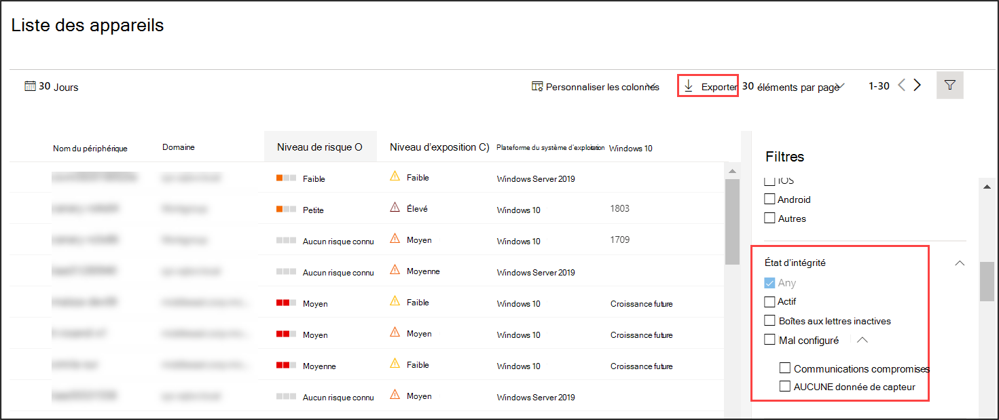

# Vérifier l’état d’état du capteur dans Microsoft Defender pour le point de terminaison

[!INCLUDE [Microsoft 365 Defender rebranding](../../includes/microsoft-defender.md)]

**S’applique à :**
- [Microsoft Defender pour point de terminaison](https://go.microsoft.com/fwlink/p/?linkid=2154037)
- [Microsoft 365 Defender](https://go.microsoft.com/fwlink/?linkid=2118804)

>Vous souhaitez faire l’expérience de Defender for Endpoint ? [Inscrivez-vous à un essai gratuit.](https://www.microsoft.com/microsoft-365/windows/microsoft-defender-atp?ocid=docs-wdatp-checksensor-abovefoldlink)

La vignette **Appareils avec problèmes de** capteur se trouve dans le tableau de bord Opérations de sécurité. Cette vignette fournit des informations sur la capacité de chaque appareil à fournir des données de capteur et à communiquer avec le service Defender for Endpoint. Il indique le nombre d’appareils nécessitant une attention particulière et vous aide à identifier les appareils problématiques et à prendre des mesures pour corriger les problèmes connus.

Il existe deux indicateurs d’état sur la vignette qui fournissent des informations sur le nombre d’appareils qui ne sont pas correctement signalés au service :
- **Mal configuré :** ces appareils peuvent signaler partiellement des données de capteur au service Defender for Endpoint et peuvent avoir des erreurs de configuration qui doivent être corrigées.
- **Inactif** : appareils qui ont cessé de signaler au service Defender for Endpoint pendant plus de sept jours au cours du mois précédent.

Le fait de cliquer sur l’un des groupes vous dirige vers la liste **Appareils,** filtrée en fonction de votre choix.

Dans **la liste Appareils,** vous pouvez filtrer la liste d’état selon l’état suivant :
- **Actif** : appareils qui font activement des rapports au service Defender for Endpoint.
- **Mal configuré :** ces appareils peuvent signaler partiellement des données de capteur au service Defender for Endpoint, mais ont des erreurs de configuration qui doivent être corrigées. Les appareils mal configurés peuvent avoir un ou plusieurs des problèmes suivants :
  - **Aucune donnée de capteur** : les appareils ont cessé d’envoyer des données de capteur. Des alertes limitées peuvent être déclenchées à partir de l’appareil.
  - **Communications réduites** : la capacité de communication avec l’appareil est réduite. L’envoi de fichiers pour analyse approfondie, le blocage de fichiers, l’isolation de l’appareil du réseau et d’autres actions nécessitant une communication avec l’appareil peuvent ne pas fonctionner.
- **Inactif** : appareils qui ont cessé de signaler au service Defender for Endpoint.

Vous pouvez également télécharger la liste entière au format CSV à l’aide de la **fonctionnalité d’exportation.** Pour plus d’informations sur les filtres, voir [Afficher et organiser la liste des appareils.](machines-view-overview.md)

>[!NOTE]
>Exportez la liste au format CSV pour afficher les données non filtrées. Le fichier CSV inclut tous les appareils de l’organisation, quel que soit le filtrage appliqué dans l’affichage lui-même et peut prendre beaucoup de temps à télécharger, en fonction de la taille de votre organisation.

Vous pouvez afficher les détails de l’appareil lorsque vous cliquez sur un appareil mal configuré ou inactif.

## Rubrique connexe
- [Corriger les capteurs défectueux dans Defender pour le point de terminaison](fix-unhealthy-sensors.md)
