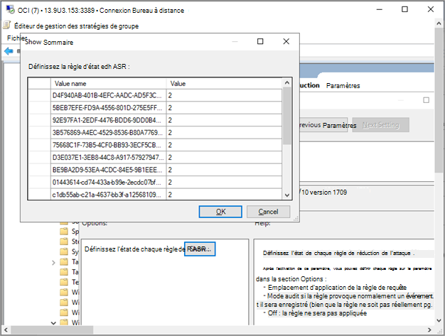

# Intégrer des appareils Windows à l’aide d’une stratégie de groupe 

[!INCLUDE [Microsoft 365 Defender rebranding](../../includes/microsoft-defender.md)]

[!include[Prerelease information](../../includes/prerelease.md)]

**S’applique à :**

- Stratégie de groupe
- [Microsoft Defender pour point de terminaison Plan 2](https://go.microsoft.com/fwlink/p/?linkid=2154037)
- [Microsoft 365 Defender](https://go.microsoft.com/fwlink/?linkid=2118804)

> Vous souhaitez faire l’expérience de Defender for Endpoint ? [Inscrivez-vous pour bénéficier d’un essai gratuit.](https://signup.microsoft.com/create-account/signup?products=7f379fee-c4f9-4278-b0a1-e4c8c2fcdf7e&ru=https://aka.ms/MDEp2OpenTrial?ocid=docs-wdatp-configureendpointsgp-abovefoldlink)

> [!NOTE]
> Pour utiliser les mises à jour de stratégie de groupe (GP) pour déployer le package, vous devez être sur Windows Server 2008 R2 ou version ultérieure.
>
> Pour Windows Server 2019 et Windows Server 2022, vous devrez peut-être remplacer NT AUTHORITY\Known-System-Account par NT AUTHORITY\SYSTEM du fichier XML créé par la préférence de stratégie de groupe.

> [!NOTE]
> Si vous utilisez la nouvelle solution unifiée Microsoft Defender for Endpoint pour Windows Server 2012 R2 et 2016, assurez-vous que vous utilisez les derniers fichiers ADMX de votre magasin central pour accéder aux options de stratégie Microsoft Defender for Endpoint correctes. Veuillez [référencer comment créer et](/troubleshoot/windows-client/group-policy/create-and-manage-central-store) gérer le magasin central pour les modèles d’administration de stratégie de groupe dans Windows et télécharger les fichiers les plus récents à utiliser avec **Windows 10**.

Consultez le [fichier PDF](https://download.microsoft.com/download/5/6/0/5609001f-b8ae-412f-89eb-643976f6b79c/mde-deployment-strategy.pdf) [ou Visio](https://download.microsoft.com/download/5/6/0/5609001f-b8ae-412f-89eb-643976f6b79c/mde-deployment-strategy.vsdx) pour voir les différents chemins d’accès dans le déploiement de Defender for Endpoint.

1. Ouvrez le fichier de package de configuration de la gp (`WindowsDefenderATPOnboardingPackage.zip`) que vous avez téléchargé à partir de l’Assistant d’intégration de service. Vous pouvez également obtenir le package à partir du <a href="https://go.microsoft.com/fwlink/p/?linkid=2077139" target="_blank">portail Microsoft 365 Defender:</a>

    1. Dans le volet de navigation, sélectionnez **Paramètres** >  **EndpointsDevice** >  **managementOnboarding**  > .

    1. Sélectionnez le système d’exploitation.

    1. Dans le **champ Méthode de déploiement** , sélectionnez **Stratégie de groupe**.

    1. Cliquez **sur Télécharger le package** et enregistrez .zip fichier.

2. Extrayez le contenu du .zip vers un emplacement partagé en lecture seule accessible par l’appareil. Vous devez avoir un dossier appelé *OptionalParamsPolicy* et le fichier *WindowsDefenderATPOnboardingScript.cmd*.

3. Pour créer un objet de stratégie de groupe, ouvrez la [Console](/internet-explorer/ie11-deploy-guide/group-policy-and-group-policy-mgmt-console-ie11) de gestion des **stratégies** de groupe (GPMC), cliquez avec le bouton droit sur Objets de stratégie de groupe à configurer, puis cliquez sur **Nouveau**. Entrez le nom du nouvel GPO dans la boîte de dialogue qui s’affiche, puis cliquez sur **OK**.

4. Ouvrez [la Console](/internet-explorer/ie11-deploy-guide/group-policy-and-group-policy-mgmt-console-ie11) de gestion des stratégies de groupe (GPMC), cliquez avec le bouton droit sur l’objet de stratégie de groupe à configurer, puis cliquez sur **Modifier**.

5. Dans **l’Éditeur de gestion des stratégies** de groupe, allez à **Configuration** ordinateur, puis **Préférences, puis** aux **paramètres du Panneau de configuration**.

6. Cliquez avec le bouton droit **sur Tâches programmées**, pointez sur **Nouveau**, puis cliquez sur **Tâche immédiate (au moins Windows 7).**.

7. Dans la **fenêtre** Tâche qui s’ouvre, allez dans **l’onglet** Général. Sous **Options de sécurité,** cliquez **sur Modifier** l’utilisateur ou le groupe, puis tapez SYSTEM, puis cliquez **sur Vérifier les** noms, **puis OK**. NT AUTHORITY\SYSTEM apparaît en tant que compte d’utilisateur que la tâche exécutera.

8. **Sélectionnez Exécuter, que l’utilisateur soit** connecté ou non et cochez la case Exécuter avec **les privilèges les plus élevés**.

9. Dans le champ Nom, tapez un nom approprié pour la tâche programmée (par exemple, Defender pour le déploiement de point de terminaison).

10. Go to the **Actions** tab and select **New...** **Assurez-vous que démarrer un programme** est sélectionné dans le **champ Action** . Entrez le chemin d’accès UNC, à l’aide du nom de domaine complet (FQDN) du serveur de fichiers, du fichier *WindowsDefenderATPOnboardingScript.cmd* partagé.

11. **Sélectionnez OK** et fermez toutes les fenêtres GPMC ouvertes.

12. Pour lier l’GPO à une unité d’organisation, cliquez avec le bouton droit et sélectionnez **Lier un GPO existant**. Dans la boîte de dialogue qui s’affiche, sélectionnez l’objet de stratégie de groupe à lier. Cliquez sur **OK**.

> [!TIP]
> Après avoir intégré l’appareil, vous pouvez choisir d’exécuter un test de détection pour vérifier que l’appareil est correctement intégré au service. Pour plus d’informations, voir [Exécuter un test de détection sur un appareil Defender for Endpoint nouvellement intégré](run-detection-test.md).

## Paramètres de configuration defender supplémentaires pour les points de terminaison

Pour chaque appareil, vous pouvez déterminer si des échantillons peuvent être collectés à partir de l’appareil lorsqu’une demande est faite via Microsoft 365 Defender pour soumettre un fichier pour analyse approfondie.

Vous pouvez utiliser la stratégie de groupe (GP) pour configurer des paramètres, tels que les paramètres de l’exemple de partage utilisé dans la fonctionnalité d’analyse approfondie.

### Configurer des paramètres de collection d’exemples

1. Sur votre appareil de gestion de la gp, copiez les fichiers suivants à partir du package de configuration :

    - Copier _AtpConfiguration.admx_ dans _C:\\Windows\\ PolicyDefinitions_

    - Copier _AtpConfiguration.adml_ dans _C:\\Windows\\ PolicyDefinitionsen-US\\_

    Si vous utilisez un magasin central pour les modèles d’administration de stratégie de groupe, copiez les fichiers [suivants](https://support.microsoft.com/help/3087759/how-to-create-and-manage-the-central-store-for-group-policy-administra) à partir du package de configuration :

    - Copier _AtpConfiguration.admx_ dans _\\\<forest.root\>\\\\SysVolPoliciesPolicyDefinitions\\\<forest.root\>\\\\_

    - Copier _AtpConfiguration.adml_ dans _\\\<forest.root\>\\\\SysVolPoliciesPolicyDefinitionsen-US\\\<forest.root\>\\\\\\_

2. Ouvrez la [Console de gestion des stratégies](/internet-explorer/ie11-deploy-guide/group-policy-and-group-policy-mgmt-console-ie11) de groupe, cliquez avec le bouton droit sur l’GPO à configurer, puis cliquez sur **Modifier**.

3. Dans **l’Éditeur de gestion des stratégies de** groupe, allez à **Configuration de l’ordinateur**.

4. Cliquez **sur Stratégies**, **puis Modèles d’administration**.

5. Cliquez **Windows composants**, **puis Windows Defender ATP**.

6. Choisissez d’activer ou de désactiver le partage d’exemples à partir de vos appareils.

> [!NOTE]
> Si vous ne définissez pas de valeur, la valeur par défaut consiste à activer la collection d’exemples.

## Autres paramètres de configuration recommandés

### Mettre à jour la configuration de la protection des points de terminaison

Après avoir configuré le script d’intégration, continuez à modifier la même stratégie de groupe pour ajouter des configurations de protection des points de terminaison. Effectuez des modifications de stratégie de groupe à partir d’un système exécutant Windows 10 ou Server 2019, Windows 11 ou Windows Server 2022 pour vous assurer que vous avez toutes les fonctionnalités Antivirus Microsoft Defender requises. Vous devrez peut-être fermer et rouvrir l’objet de stratégie de groupe pour inscrire les paramètres de configuration de Defender ATP.

Toutes les stratégies se trouvent sous `Computer Configuration\Policies\Administrative Templates`.

**Emplacement de la stratégie** : \Windows\Windows Defender ATP

Stratégie|Setting
---|---
Enable\Disable Sample collection|Activé : vérification « Activer la collecte d’exemples sur les ordinateurs »

 

**Emplacement de la stratégie** : \Windows\Antivirus Microsoft Defender

Stratégie|Setting
---|---
Configurer la détection pour les applications potentiellement indésirables|Activé, Bloquer

 

**Emplacement de la stratégie** : \Windows\Antivirus Microsoft Defender\MAPS

Stratégie|Setting
---|---
Rejoindre Microsoft MAPS|Enabled, Advanced MAPS
Envoyer des exemples de fichiers lorsque des analyses plus approfondies sont requises | Activé, Envoyer des exemples sûrs

 

**Emplacement de la stratégie** : \Windows\Antivirus Microsoft Defender\Protection en temps réel

Stratégie|Setting
---|---
Désactiver la protection en temps réel|Désactivé
Activer l’analyse du comportement|Activé
Analyser tous les fichiers et pièces jointes téléchargés|Activé
Surveiller l’activité des fichiers et des programmes sur votre ordinateur|Activé

 

**Emplacement de la stratégie** : \Windows\Antivirus Microsoft Defender\Scan

Ces paramètres configurent des analyses périodiques du point de terminaison. Nous vous recommandons d’effectuer une analyse rapide hebdomadaire, autorisant les performances.

Stratégie|Setting
---|---
Recherchez les dernières informations sur la sécurité des virus et logiciels espions avant d’exécution d’une analyse programmée |Activé

 

**Emplacement de la stratégie** : \Windows\Antivirus Microsoft Defender\Protection contre les attaques Microsoft Defender\Réduction de la surface d’attaque

Obtenez la liste actuelle des GUID des règles de réduction de la surface d’attaque à partir de l’étape 3 du déploiement des règles de réduction de [la surface d’attaque : implémenter des règles de réduction de la surface d’attaque](attack-surface-reduction-rules-deployment-implement.md). Pour plus d’informations sur les règles, consultez la référence des règles de réduction [de la surface d’attaque](attack-surface-reduction-rules-reference.md)

1. Ouvrez la **stratégie Configurer la Réduction de la surface d’attaque** .

1. Sélectionnez **Activé**.

1. Sélectionnez le **bouton** Afficher.

1. Ajoutez chaque GUID dans le **champ Nom de** la valeur avec la valeur 2.

   Chacun d’eux est alors uniquement mis en place pour l’audit.

   

Stratégie|Emplacement|Setting
---|---|---
Configurer l’accès contrôlé aux dossiers| \Windows Components\Antivirus Microsoft Defender\Protection contre les attaques Microsoft Defender\Controlled Folder Access| Activé, mode Audit

## Exécuter un test de détection pour vérifier l’intégration

Après avoir intégré l’appareil, vous pouvez choisir d’exécuter un test de détection pour vérifier qu’un appareil est correctement intégré au service. Pour plus d’informations, voir [Exécuter un test de détection sur un appareil Microsoft Defender pour point de terminaison nouvellement intégré](run-detection-test.md).

## Appareils de tableau de bord à l’aide de la stratégie de groupe

Pour des raisons de sécurité, le package utilisé pour la sortie des appareils expirera 30 jours après la date de téléchargement. Les packages de offboarding expirés envoyés à un appareil seront rejetés. Lorsque vous téléchargez un package de déclassage, vous êtes informé de la date d’expiration des packages et il est également inclus dans le nom du package.

> [!NOTE]
> Les stratégies d’intégration et deboarding ne doivent pas être déployées sur le même appareil en même temps, sinon cela provoquera des collisions imprévisibles.

1. Obtenez le package deboarding à partir du <a href="https://go.microsoft.com/fwlink/p/?linkid=2077139" target="_blank">portail Microsoft 365 Defender :</a>

    1. Dans le volet de navigation, sélectionnez **Paramètres** >  **EndpointsDevice** >  **managementOffboarding** > .

    1. Sélectionnez le système d’exploitation.
    
    1. Dans le **champ Méthode de déploiement** , sélectionnez **Stratégie de groupe**.

    1. Cliquez **sur Télécharger le package** et enregistrez .zip fichier.

2. Extrayez le contenu du .zip vers un emplacement partagé en lecture seule accessible par l’appareil. Vous devez avoir un fichier nommé *WindowsDefenderATPOffboardingScript_valid_until_YYYY-MM-DD.cmd*.

3. Ouvrez [la Console](/internet-explorer/ie11-deploy-guide/group-policy-and-group-policy-mgmt-console-ie11) de gestion des stratégies de groupe (GPMC), cliquez avec le bouton droit sur l’objet de stratégie de groupe à configurer, puis cliquez sur **Modifier**.

4. Dans **l’Éditeur de gestion des stratégies** de groupe, allez à **Configuration ordinateur,** puis **Préférences, puis** aux **paramètres du Panneau de configuration**.

5. Cliquez avec le bouton droit **sur Tâches programmées**, pointez sur **Nouveau**, puis cliquez sur **Tâche immédiate**.

6. Dans la **fenêtre** Tâche qui s’ouvre, allez dans **l’onglet** Général. Choisissez le compte d’utilisateur SYSTÈME local (BUILTIN\SYSTEM) sous **Options de sécurité**.

7. **Sélectionnez Exécuter, que l’utilisateur soit** connecté ou non et cochez la case Exécuter avec les **privilèges les plus élevés**.

8. Dans le champ Nom, tapez un nom approprié pour la tâche programmée (par exemple, Defender pour le déploiement de point de terminaison).

9. Go to the **Actions** tab and select **New...**. **Assurez-vous que démarrer un programme** est sélectionné dans le **champ Action** . Entrez le chemin d’accès UNC, à l’aide du nom de domaine complet (FQDN) du serveur de fichiers, du fichier *WindowsDefenderATPOffboardingScript_valid_until_YYYY-MM-DD.cmd* partagé.

10. **Sélectionnez OK** et fermez toutes les fenêtres GPMC ouvertes.

> [!IMPORTANT]
> Laboarding empêche l’appareil d’envoyer des données de capteur au portail, mais les données de l’appareil, y compris la référence aux alertes qu’il a eues, seront conservées pendant 6 mois.

## Surveiller la configuration de l’appareil

Avec la stratégie de groupe, il n’existe pas d’option pour surveiller le déploiement des stratégies sur les appareils. La surveillance peut être effectuée directement sur le portail ou à l’aide des différents outils de déploiement.

## Surveiller les appareils à l’aide du portail

1. Go to the <a href="https://go.microsoft.com/fwlink/p/?linkid=2077139" target="_blank">Microsoft 365 Defender portal</a>.
2. Cliquez sur **Inventaire des appareils**.
3. Vérifiez que les appareils apparaissent.

> [!NOTE]
> L’affichage des appareils dans la liste Appareils peut prendre plusieurs **jours**. Cela inclut le temps qu’il faut pour que les stratégies soient distribuées à l’appareil, le temps qu’il faut avant que l’utilisateur se connecte et le temps qu’il faut au point de terminaison pour commencer à créer des rapports.

## Stratégies de l’Antivirus Setup Defender

Créez une stratégie de groupe ou groupez ces paramètres avec les autres stratégies. Cela dépend de l’environnement des clients et de la façon dont ils souhaitent déployer le service en ciblant différentes unités d’organisation.

1. Après avoir choisi la gp ou en avoir créé une nouvelle, modifiez-la.

2. Accédez **à Computer** **ConfigurationPoliciesAdministrative** >  >  **Templates** >  **Windows Components** >  **Antivirus Microsoft Defender** >  **Real-time Protection**.

    :::image type="content" source="images/realtime-protect.png" alt-text="protection en temps réel.":::

1. Dans le dossier Quarantaine, configurez la suppression des éléments du dossier Quarantaine.

    :::image type="content" source="images/removal-items-quarantine1.png" alt-text="dossier de mise en quarantaine des éléments de suppression.":::

    :::image type="content" source="images/config-removal-items-quarantine2.png" alt-text="mise en quarantaine de la suppression de la config.":::

4. Dans le dossier Analyse, configurez les paramètres d’analyse.

    :::image type="content" source="images/gpo-scans.png" alt-text="analyses gpo.":::

### Surveiller tous les fichiers dans la protection en temps réel

Accédez  à **Modèles d’administration** \> \> des **stratégies** \> de **configuration ordinateur Windows composants** \> **Antivirus Microsoft Defender** \> **protection en temps réel**.

 Étant donné que la valeur « Analyser les fichiers entrants et sortants » (par défaut) est 0, la stratégie de groupe « Configurer la surveillance des activités de programme et de fichiers entrants et sortants » pour le paramètre « bi-directionnel (accès complet) » est désactivée.

:::image type="content" source="images/config-monitor-incoming-outgoing-file-act.png" alt-text="configurer la surveillance de l’activité des fichiers sortants entrants.":::

### Configurer Windows Defender paramètres SmartScreen

1. Accédez aux  **modèles d’administration** \> \> des **stratégies** \> de configuration ordinateur **Windows composants** \> **Windows Defender’explorateur SmartScreen**\>.

    :::image type="content" source="images/config-windows-def-smartscr-explorer.png" alt-text="config windows defender smart screen explorer.":::
 
2. Accédez **à** **ConfigurationPoliciesAdministrative** >  >  **Templates** >  **Windows Components** >  **Windows Defender SmartScreen** >  **Microsoft Edge**.

    :::image type="content" source="images/config-windows-def-smartscr-explorer.png" alt-text="Config windows defender smart screen Edge.":::

### Configurer les applications potentiellement indésirables

Accédez  à **Modèles d’administration** \> \> des **stratégies** \> de **configuration ordinateur Windows composants** \> **Antivirus Microsoft Defender**.

:::image type="content" source="images/config-potential-unwanted-apps.png" alt-text="config d’une application potentiellement indésirable.":::

:::image type="content" source="images/config-potential-unwanted-apps2.png" alt-text="potentiel de la config.":::

### Configurer cloud Deliver Protection et envoyer automatiquement des exemples

Accédez  à **Modèles d’administration** \> \> des **stratégies** \> de configuration ordinateur **Windows composants** \> **Antivirus Microsoft Defender** \> **MAPS**.

:::image type="content" source="images/gpo-maps1.png" alt-text="cartes.":::

:::image type="content" source="images/gpo-maps-block-atfirst-sight.png" alt-text="bloquer à la première vue.":::

:::image type="content" source="images/gpo-maps-join-ms-maps.png" alt-text="rejoignez Microsoft Maps.":::

:::image type="content" source="images/send-file-sample-further-analysis-require.png" alt-text="envoyer un exemple de fichier lorsque des analyses plus approfondies sont requises.":::

> [!NOTE]
> **L’option Envoyer tous les exemples** fournit la plus grande analyse des binaires/scripts/documents, ce qui augmente la posture de sécurité.
**L’option Envoyer des exemples sûrs** limite le type de binaires/scripts/documents en cours d’analyse et diminue la posture de sécurité. 

Pour plus d’informations, voir [Activer la protection cloud dans Antivirus Microsoft Defender](enable-cloud-protection-microsoft-defender-antivirus.md), la protection cloud et l’envoi d’exemples [dans Antivirus Microsoft Defender.](cloud-protection-microsoft-antivirus-sample-submission.md)

### Vérifier la mise à jour des signatures

Accédez  aux **modèles d’administration des stratégies** \> de **configuration** \> \> ordinateur **Windows composants** \> **Antivirus Microsoft Defender** \> **mises à jour security intelligence**.

:::image type="content" source="images/signature-update-1.png" alt-text="mise à jour de signature.":::

:::image type="content" source="images/signature-update-2.png" alt-text="mise à jour de définition de signature.":::

### Configurer le délai d’entrée et le niveau de protection de la livraison cloud

Accédez à  **Modèles d’administration** \> \> des **stratégies** \> de configuration ordinateur **Windows composants** \> **Antivirus Microsoft Defender** \> **MpEngine**.
Lorsque vous configurez la stratégie de niveau de protection cloud Antivirus Microsoft Defender **stratégie** de blocage par défaut, la stratégie est désactivée. C’est ce qui est nécessaire pour définir le niveau de protection sur la valeur par défaut de Windows.

:::image type="content" source="images/config-extended-cloud-check.png" alt-text="vérification étendue du cloud de la config;":::

:::image type="content" source="images/cloud-protection-level.png" alt-text="niveau de protection cloud de la config.":::

## Voir aussi
- [Intégrer des appareils Windows à l’aide de Microsoft Endpoint Configuration Manager](configure-endpoints-sccm.md)
- [Intégrer les appareils Windows à l’aide des outils de gestion des appareils mobiles](configure-endpoints-mdm.md)
- [Intégrer les appareils Windows utilisant un script local](configure-endpoints-script.md)
- [Intégrer les ordinateurs virtuels d’infrastructure de bureau (VDI) non persistants](configure-endpoints-vdi.md)
- [Exécuter un test de détection sur un microsoft Defender pour les appareils de point de terminaison nouvellement intégré](run-detection-test.md)
- [Résoudre les problèmes d’intégration de Microsoft Defender pour les points de terminaison](troubleshoot-onboarding.md)
