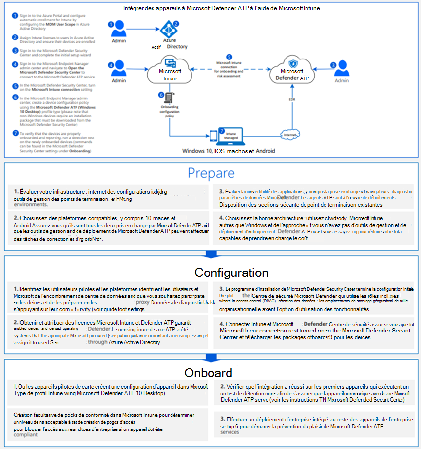

# Intégrer les appareils Windows 10 à l’aide des outils de gestion des appareils mobiles

[!INCLUDE [Microsoft 365 Defender rebranding](../../includes/microsoft-defender.md)]

**S’applique à :**
- [Microsoft Defender pour point de terminaison](https://go.microsoft.com/fwlink/p/?linkid=2154037)
- [Microsoft 365 Defender](https://go.microsoft.com/fwlink/?linkid=2118804)

>Vous souhaitez faire l'expérience de Defender pour point de terminaison ? [Inscrivez-vous à un essai gratuit.](https://www.microsoft.com/microsoft-365/windows/microsoft-defender-atp?ocid=docs-wdatp-configureendpointsmdm-abovefoldlink)

Vous pouvez utiliser des solutions de gestion des périphériques mobiles (MDM) pour configurer des appareils. Defender for Endpoint prend en charge les appareils mobiles en fournissant des OMA-URIs pour créer des stratégies pour gérer les appareils.

Pour plus d'informations sur l'utilisation du programme CSP Defender for Endpoint, voir le fichier DDF [WindowsAdvancedThreatProtection](https://msdn.microsoft.com/library/windows/hardware/mt723296(v=vs.85).aspx) et [WindowsAdvancedThreatProtection.](https://msdn.microsoft.com/library/windows/hardware/mt723297(v=vs.85).aspx)

## Avant de commencer
Si vous utilisez Microsoft Intune, vous devez avoir inscrit l'appareil MDM. Dans le cas contraire, les paramètres ne seront pas appliqués correctement. 

Pour plus d'informations sur l'activation de la gestion des périphériques multi-appareils avec Microsoft Intune, voir Inscription d'appareils [(Microsoft Intune).](https://docs.microsoft.com/mem/intune/enrollment/device-enrollment)

## Intégrer des appareils à l'aide de Microsoft Intune

Consultez le [fichier PDF](https://github.com/MicrosoftDocs/microsoft-365-docs/raw/public/microsoft-365/security/defender-endpoint/downloads/mdatp-deployment-strategy.pdf)  ou  [Visio](https://github.com/MicrosoftDocs/microsoft-365-docs/raw/public/microsoft-365/security/defender-endpoint/downloads/mdatp-deployment-strategy.vsdx) pour voir les différents chemins d'accès dans le déploiement de Defender pour Endpoint. 

Suivez les instructions [d'Intune.](https://docs.microsoft.com/intune/advanced-threat-protection)

Pour plus d'informations sur l'utilisation du programme CSP Defender for Endpoint, voir le fichier DDF [WindowsAdvancedThreatProtection](https://msdn.microsoft.com/library/windows/hardware/mt723296(v=vs.85).aspx) et [WindowsAdvancedThreatProtection.](https://msdn.microsoft.com/library/windows/hardware/mt723297(v=vs.85).aspx)

> [!NOTE]
> - La **stratégie État d'état d'état des appareils** intégrés utilise des propriétés en lecture seule et ne peut pas être corrigé.
> - La configuration de la fréquence de rapports de données de diagnostic est disponible uniquement pour les appareils sur Windows 10, version 1703.

>[!TIP]
> Après avoir intégré l'appareil, vous pouvez choisir d'exécuter un test de détection pour vérifier qu'un appareil est correctement intégré au service. Pour plus d'informations, voir Exécuter un test de détection sur un appareil [Microsoft Defender pour point de terminaison nouvellement intégré.](run-detection-test.md)

Consultez le [pdf ou](https://github.com/MicrosoftDocs/microsoft-365-docs/raw/public/microsoft-365/security/defender-endpoint/downloads/mdatp-deployment-strategy.pdf)  [Visio](https://github.com/MicrosoftDocs/microsoft-365-docs/raw/public/microsoft-365/security/defender-endpoint/downloads/mdatp-deployment-strategy.vsdx) pour voir les différents chemins d'accès dans le déploiement de Microsoft Defender pour Endpoint.

## Utiliser les outils de gestion des périphériques mobiles pour les appareils mobiles pour les hors-bord et les surveiller
Pour des raisons de sécurité, le package utilisé pour la sortie des appareils expirera 30 jours après la date de téléchargement. Les packages de offboarding expirés envoyés à un appareil seront rejetés. Lorsque vous téléchargez un package de déclassage, vous êtes informé de la date d'expiration des packages et il est également inclus dans le nom du package.

> [!NOTE]
> Les stratégies d'intégration et deboarding ne doivent pas être déployées sur le même appareil en même temps, sinon cela provoquera des collisions imprévisibles.

1. Obtenez le package deboarding à partir du [Centre de sécurité Microsoft Defender](https://securitycenter.windows.com/):

   1. Dans le volet de navigation, sélectionnez **Paramètres**  >  **Deboarding**.

   1. Sélectionnez Windows 10 comme système d'exploitation.

   1. Dans le **champ Méthode de déploiement,** sélectionnez **Gestion des périphériques mobiles / Microsoft Intune**.
    
   1. Cliquez **sur Télécharger le package,** puis enregistrez le fichier .zip.

2. Extrayez le contenu du fichier .zip vers un emplacement partagé en lecture seule accessible par les administrateurs réseau qui déploieront le package. Vous devez avoir un fichier nommé *WindowsDefenderATP_valid_until_YYYY-MM-DD.offboarding*.

3. Utilisez la stratégie de configuration personnalisée Microsoft Intune pour déployer les paramètres OMA-URI pris en charge suivants.

      OMA-URI : ./Device/Vendor/MSFT/WindowsAdvancedThreatProtection/Offboarding 
      Type de date : Chaîne 
      Valeur : [Copier et coller la valeur à partir du contenu du fichier WindowsDefenderATP_valid_until_YYYY-MM-DD.offboarding]

Pour plus d'informations sur les paramètres de stratégie Microsoft Intune, voir les paramètres de stratégie [Windows 10 dans Microsoft Intune.](https://docs.microsoft.com/intune/deploy-use/windows-10-policy-settings-in-microsoft-intune)

> [!NOTE]
> La **stratégie État d'état d'état des appareils** déboardés utilise des propriétés en lecture seule et ne peut pas être corrigé.

> [!IMPORTANT]
> Laboarding empêche l'appareil d'envoyer des données de capteur au portail, mais les données de l'appareil, y compris la référence aux alertes qu'il a eues, seront conservées pendant 6 mois.

## Voir aussi
- [Intégrer des appareils Windows 10 à l'aide de la stratégie de groupe](configure-endpoints-gp.md)
- [Intégrer des appareils Windows 10 à l'aide de Microsoft Endpoint Configuration Manager](configure-endpoints-sccm.md)
- [Intégrer les appareils Windows 10 utilisant un script local](configure-endpoints-script.md)
- [Intégrer les ordinateurs virtuels d’infrastructure de bureau (VDI) non persistants](configure-endpoints-vdi.md)
- [Exécuter un test de détection sur un appareil Microsoft Defender pour point de terminaison nouvellement intégré](run-detection-test.md)
- [Résoudre les problèmes d'intégration de Microsoft Defender pour les points de terminaison](troubleshoot-onboarding.md)
