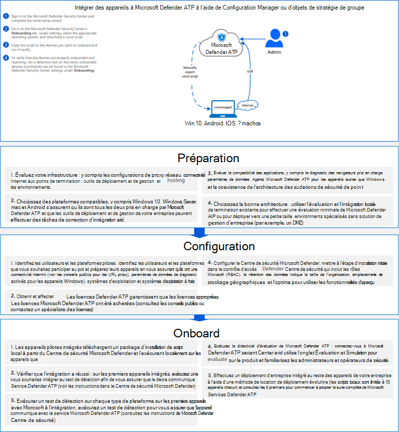

# <a name="onboard-windows-10-devices-using-a-local-script"></a>Intégrer les appareils Windows 10 utilisant un script local

[!INCLUDE [Microsoft 365 Defender rebranding](../../includes/microsoft-defender.md)]

- [Microsoft 365 Defender](https://go.microsoft.com/fwlink/?linkid=2118804)


>Vous souhaitez faire l’expérience de Defender for Endpoint ? [Inscrivez-vous à un essai gratuit.](https://www.microsoft.com/microsoft-365/windows/microsoft-defender-atp?ocid=docs-wdatp-configureendpointsscript-abovefoldlink)

Vous pouvez également intégrer manuellement des appareils individuels à Defender for Endpoint. Vous pouvez d’abord le faire lors du test du service avant de vous engager à intégrer tous les appareils de votre réseau.

> [!IMPORTANT]
> Ce script a été optimisé pour une utilisation sur jusqu’à 10 appareils.
>
> Pour déployer à grande échelle, utilisez [d’autres options de déploiement.](configure-endpoints.md) Par exemple, vous pouvez déployer un script d’intégration sur plus de 10 appareils en production avec le script disponible dans les appareils Windows 10 intégrés à l’aide de la stratégie [de groupe.](configure-endpoints-gp.md)

## <a name="onboard-devices"></a>Intégration des appareils 

[](images/onboard-script.png#lightbox)


Consultez le [fichier PDF](https://github.com/MicrosoftDocs/microsoft-365-docs/raw/public/microsoft-365/security/defender-endpoint/downloads/mdatp-deployment-strategy.pdf) [ou Visio](https://github.com/MicrosoftDocs/microsoft-365-docs/raw/public/microsoft-365/security/defender-endpoint/downloads/mdatp-deployment-strategy.vsdx) pour voir les différents chemins d’accès dans le déploiement de Defender for Endpoint. 


1.  Ouvrez le fichier de package de configuration de .zip de groupe (*WindowsDefenderATPOnboardingPackage.zip*) que vous avez téléchargé à partir de l’Assistant d’intégration de service. Vous pouvez également obtenir le package à partir [de Centre de sécurité Microsoft Defender](https://securitycenter.windows.com/):

    1. Dans le volet de navigation, sélectionnez  >  **Paramètres’intégration.**

    1. Sélectionnez Windows 10 comme système d’exploitation.

    1. Dans le **champ Méthode de** déploiement, sélectionnez Script **local.**

    1. Cliquez **sur Télécharger le package** et enregistrez .zip fichier.

  
2.  Extrayez le contenu du package de configuration vers un emplacement sur l’appareil que vous souhaitez intégrer (par exemple, le Bureau). Vous devez avoir un fichier nommé *WindowsDefenderATPLocalOnboardingScript.cmd*.

3.  Ouvrez une invite de ligne de commande avec élévation de niveaux sur l’appareil et exécutez le script :

    1.  Accéder à **Démarrer** et taper **cmd**.

    1.  Cliquez avec le bouton droit sur **Invite de commandes** et sélectionnez **Exécuter en tant qu'administrateur**.

        

4.  Tapez l’emplacement du fichier de script. Si vous avez copié le fichier sur le Bureau, tapez : *%userprofile%\Desktop\WindowsDefenderATPLocalOnboardingScript.cmd*

5.  Appuyez sur **entrée** ou cliquez sur **OK.**

Pour plus d’informations sur la façon dont vous pouvez vérifier manuellement que l’appareil est conforme et signale correctement les données de capteur, consultez La procédure de résolution des problèmes d’intégration des points de terminaison [dans Microsoft Defender.](troubleshoot-onboarding.md)


>[!TIP]
> Après avoir intégré l’appareil, vous pouvez choisir d’exécuter un test de détection pour vérifier qu’un appareil est correctement intégré au service. Pour plus d’informations, voir Exécuter un test de détection sur un point de terminaison [Microsoft Defender pour point de terminaison nouvellement intégré.](run-detection-test.md)

## <a name="configure-sample-collection-settings"></a>Configurer des paramètres de collection d’exemples
Pour chaque appareil, vous pouvez définir une valeur de configuration pour déterminer si des échantillons peuvent être collectés à partir de l’appareil lorsqu’une demande est faite via Centre de sécurité Microsoft Defender pour soumettre un fichier pour analyse approfondie.

Vous pouvez configurer manuellement le paramètre de partage d’exemples sur l’appareil à l’aide de *regedit* ou en créant et en exécutant *un fichier .reg.*  

La configuration est définie par le biais de l’entrée de clé de Registre suivante :

```console
Path: “HKLM\SOFTWARE\Policies\Microsoft\Windows Advanced Threat Protection”
Name: "AllowSampleCollection"
Value: 0 or 1
```
Où :<br>
Le type de nom est D-WORD. <br>
Les valeurs possibles sont les suivantes :
- 0 : n’autorise pas le partage d’exemples à partir de cet appareil
- 1 : autorise le partage de tous les types de fichiers à partir de cet appareil

La valeur par défaut au cas où la clé de Registre n’existe pas est 1.


## <a name="offboard-devices-using-a-local-script"></a>Hors-carte des appareils à l’aide d’un script local
Pour des raisons de sécurité, le package utilisé pour la sortie des appareils expirera 30 jours après la date de téléchargement. Les packages de offboarding expirés envoyés à un appareil seront rejetés. Lorsque vous téléchargez un package de déclassage, vous êtes informé de la date d’expiration des packages et il est également inclus dans le nom du package.

> [!NOTE]
> Les stratégies d’intégration et deboarding ne doivent pas être déployées sur le même appareil en même temps, sinon cela provoquera des collisions imprévisibles.

1. Obtenez le package deboarding à partir [Centre de sécurité Microsoft Defender](https://securitycenter.windows.com/):

    1. Dans le volet de navigation, sélectionnez **Paramètres**  >  **de l’appareil.**

    1. Sélectionnez Windows 10 comme système d’exploitation.

    1. Dans le **champ Méthode de** déploiement, sélectionnez Script **local.**

    1. Cliquez **sur Télécharger le package** et enregistrez .zip fichier.

2. Extrayez le contenu du .zip vers un emplacement partagé en lecture seule accessible par les appareils. Vous devez avoir un fichier nommé *WindowsDefenderATPOffboardingScript_valid_until_YYYY-MM-DD.cmd*.

3.  Ouvrez une invite de ligne de commande avec élévation de niveaux sur l’appareil et exécutez le script :

    1.  Accéder à **Démarrer** et taper **cmd**.

    1.  Cliquez avec le bouton droit sur **Invite de commandes** et sélectionnez **Exécuter en tant qu'administrateur**.

        

4.  Tapez l’emplacement du fichier de script. Si vous avez copié le fichier sur le Bureau, tapez : *%userprofile%\Desktop\WindowsDefenderATPOffboardingScript_valid_until_YYYY-MM-DD.cmd*

5.  Appuyez sur **entrée** ou cliquez sur **OK.**

> [!IMPORTANT]
> Laboarding empêche l’appareil d’envoyer des données de capteur au portail, mais les données de l’appareil, y compris la référence aux alertes qu’il a eues, seront conservées pendant 6 mois.


## <a name="monitor-device-configuration"></a>Surveiller la configuration de l’appareil
Vous pouvez suivre les différentes [](troubleshoot-onboarding.md) étapes de vérification dans la résolution des problèmes d’intégration pour vérifier que le script s’est correctement terminé et que l’agent est en cours d’exécution.

La surveillance peut également être effectuée directement sur le portail ou à l’aide des différents outils de déploiement.

### <a name="monitor-devices-using-the-portal"></a>Surveiller les appareils à l’aide du portail
1. Go to Centre de sécurité Microsoft Defender.

2. Cliquez **sur La liste Appareils.**

3. Vérifiez que les appareils apparaissent.


## <a name="related-topics"></a>Voir aussi
- [Intégrer des Windows 10 à l’aide de la stratégie de groupe](configure-endpoints-gp.md)
- [Intégrer Windows 10 appareils à l’aide Microsoft Endpoint Configuration Manager](configure-endpoints-sccm.md)
- [Intégrer les appareils Windows 10 à l’aide des outils de gestion des appareils mobiles](configure-endpoints-mdm.md)
- [Intégrer les ordinateurs virtuels d’infrastructure de bureau (VDI) non persistants](configure-endpoints-vdi.md)
- [Exécuter un test de détection sur un appareil Microsoft Defender pour point de terminaison nouvellement intégré](run-detection-test.md)
- [Résoudre les problèmes d’intégration de Microsoft Defender pour les points de terminaison](troubleshoot-onboarding.md)
