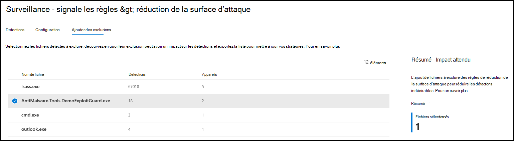

# Optimiser le déploiement et les détections des règles ASR

[!INCLUDE [Microsoft 365 Defender rebranding](../../includes/microsoft-defender.md)]

**S’applique à :**
- [Microsoft Defender pour point de terminaison](https://go.microsoft.com/fwlink/p/?linkid=2154037)
- [Microsoft 365 Defender](https://go.microsoft.com/fwlink/?linkid=2118804)

> Vous souhaitez faire l’expérience de Defender pour point de terminaison ? [Inscrivez-vous pour bénéficier d’un essai gratuit.](https://www.microsoft.com/WindowsForBusiness/windows-atp?ocid=docs-wdatp-onboardconfigure-abovefoldlink)

[Les règles de réduction de la surface](./attack-surface-reduction.md) d’attaque identifient et empêchent les attaques de programmes malveillants classiques. Ils contrôlent quand et comment du code potentiellement malveillant peut s’exécuter. Par exemple, ils peuvent empêcher JavaScript ou VBScript de lancer un exécutable téléchargé, bloquer les appels d’API Win32 à partir de macros Office et bloquer les processus qui s’exécutent à partir de lecteurs USB.

:::image type="content" source="../../media/attack-surface-mgmt.png" alt-text="Carte de gestion de la surface d’attaque.":::
 
*Carte de gestion de la surface d’attaque*

La *carte de gestion de la surface d’attaque* est un point d’entrée vers les outils Microsoft 365 centre de sécurité que vous pouvez utiliser pour :

* Comprendre comment les règles de la asr. sont actuellement déployées dans votre organisation.
* Examinez les détections de la résurv et identifiez les détections éventuellement incorrectes.
* Analysez l’impact des exclusions et générez la liste des chemins d’accès aux fichiers à exclure.

Sélectionnez **Go to attack surface management** \> **Reports** Attack surface \> **reduction rules** Add \> **exclusions**. À partir de là, vous pouvez accéder à d’autres sections du centre Microsoft 365 sécurité.

 
Onglet ***Ajouter des exclusions** dans la page Règles de réduction de la surface d’attaque Microsoft 365 centre de sécurité*

> [!NOTE]
> Pour accéder Microsoft 365 centre de sécurité, vous avez besoin d’une licence Microsoft 365 E3 ou E5 et d’un compte qui a certains rôles sur Azure Active Directory. [En savoir plus sur les licences et autorisations requises.](/office365/securitycompliance/microsoft-security-and-compliance#required-licenses-and-permissions)

Pour plus d’informations sur le déploiement de règles asr dans Microsoft 365 sécurité, voir Surveiller et gérer le déploiement et les détections de règles [asr.](/office365/securitycompliance/monitor-devices#monitor-and-manage-asr-rule-deployment-and-detections)

**Rubriques connexes**

* [Vérifier que vos appareils sont correctement configurés](configure-machines.md)
* [Obtenir des appareils intégrés à Microsoft Defender pour le point de terminaison](configure-machines-onboarding.md)
* [Surveiller la conformité à la ligne de base de sécurité microsoft Defender pour les points de terminaison](configure-machines-security-baseline.md)
