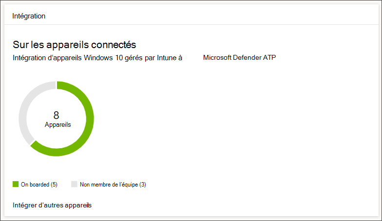
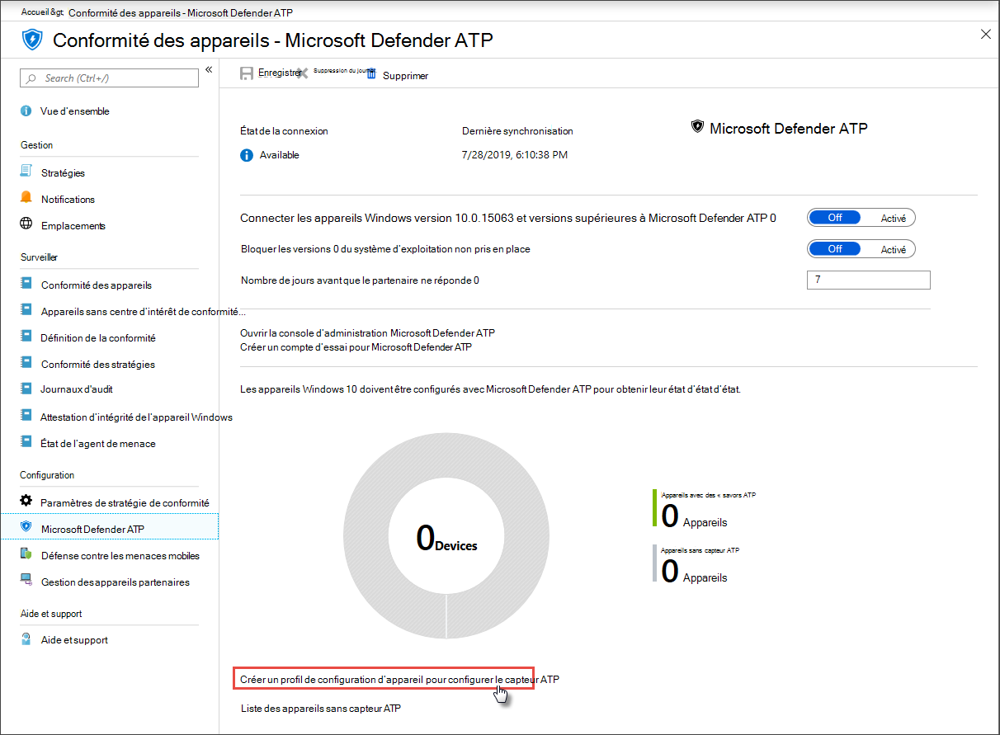

# Obtenir des appareils intégrés à Microsoft Defender pour le point de terminaison

[!INCLUDE [Microsoft 365 Defender rebranding](../../includes/microsoft-defender.md)]

**S’applique à :**
- [Microsoft Defender pour point de terminaison](https://go.microsoft.com/fwlink/p/?linkid=2154037)
- [Microsoft 365 Defender](https://go.microsoft.com/fwlink/?linkid=2118804)

>Vous souhaitez découvrir Microsoft Defender pour le point de terminaison ? [Inscrivez-vous à un essai gratuit.](https://www.microsoft.com/microsoft-365/windows/microsoft-defender-atp?ocid=docs-wdatp-onboardconfigure-abovefoldlink)

Chaque appareil intégré ajoute un capteur protection évolutive des points de terminaison (PEPT) et augmente la visibilité sur l’activité de violation dans votre réseau. L’intégration garantit également qu’un appareil peut être vérifié pour les composants vulnérables ainsi que les problèmes de configuration de sécurité et peut recevoir des actions de correction critiques pendant les attaques.

Avant de pouvoir suivre et gérer l’intégration d’appareils :
- [Inscrire vos appareils à la gestion Intune](configure-machines.md#enroll-devices-to-intune-management)
- [Vérifier que vous avez les autorisations nécessaires](configure-machines.md#obtain-required-permissions)

## Découvrir et suivre les appareils non protégés

La  carte d’intégration fournit une vue d’ensemble de votre taux d’intégration en comparant le nombre d’appareils Windows 10 réellement intégrés à Defender for Endpoint et le nombre total d’appareils Windows 10 gérés par Intune.

 
*Carte affichant les appareils intégrés par rapport au nombre total d’appareils gérés Windows 10 Intune*

>[!NOTE]
>Si vous avez utilisé Le Gestionnaire de configuration du Centre de sécurité, le script d’intégration ou d’autres méthodes d’intégration qui n’utilisent pas les profils Intune, vous pouvez rencontrer des incohérences de données. Pour résoudre ces incohérences, créez un profil de configuration Intune correspondant pour l’intégration de Defender for Endpoint et affectez ce profil à vos appareils.

## Intégrer d’autres appareils avec des profils Intune

Defender pour le point de terminaison fournit plusieurs options pratiques pour [l’intégration Windows 10 appareils.](onboard-configure.md) Toutefois, pour les appareils gérés par Intune, vous pouvez tirer parti des profils Intune pour déployer facilement le capteur Defender for Endpoint afin de sélectionner des appareils, ce qui permet d’intégrer efficacement ces appareils au service.

À partir de **la carte d’intégration,** sélectionnez **Intégrer d’autres appareils** pour créer et affecter un profil sur Intune. Le lien vous permet d’utiliser la page de conformité des appareils sur Intune, qui fournit une vue d’ensemble similaire de votre état d’intégration.

 
   *Page de conformité des appareils Microsoft Defender for Endpoint sur la gestion des appareils Intune*

>[!TIP]
>Vous pouvez également accéder à la page de conformité d’intégration Defender for Endpoint dans le portail [Microsoft Azure](https://portal.azure.com/) à partir de Tous les **services > Intune > Conformité** des > Microsoft Defender ATP .

>[!NOTE]
> Si vous souhaitez afficher les données d’appareil les plus récentes, cliquez sur Liste des appareils sans **capteur ATP.**

À partir de la page de conformité des appareils, créez un profil de configuration spécifique pour le déploiement du capteur Defender for Endpoint et affectez ce profil aux appareils que vous souhaitez intégrer. Pour ce faire, vous pouvez :

- Sélectionnez Créer un profil de configuration d’appareil pour configurer le capteur **ATP** afin qu’il commence par un profil de configuration d’appareil prédéféré.
- Créez le profil de configuration de l’appareil de A à Z.

Pour plus d’informations, découvrez l’utilisation des profils de configuration d’appareil Intune pour intégrer des [appareils à Defender for Endpoint.](/intune/advanced-threat-protection#onboard-devices-by-using-a-configuration-profile)

>Vous souhaitez découvrir Microsoft Defender pour le point de terminaison ? [Inscrivez-vous à un essai gratuit.](https://www.microsoft.com/microsoft-365/windows/microsoft-defender-atp?ocid=docs-wdatp-onboardconfigure-belowfoldlink)

## Voir aussi
- [Vérifier que vos appareils sont correctement configurés](configure-machines.md)
- [Renforcer la conformité à la ligne de base de sécurité de Defender for Endpoint](configure-machines-security-baseline.md)
- [Optimiser le déploiement et les détections de règles asr](configure-machines-asr.md)
