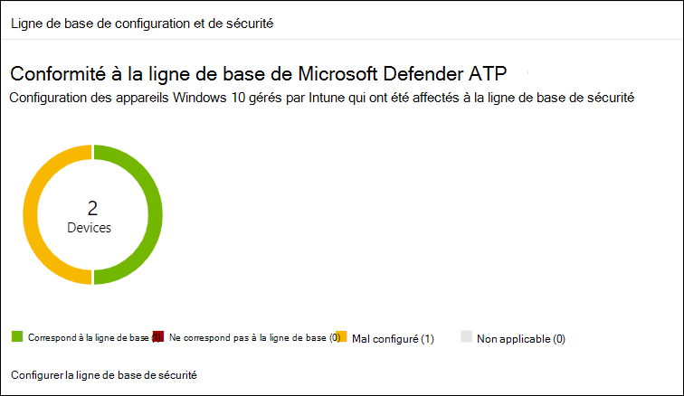
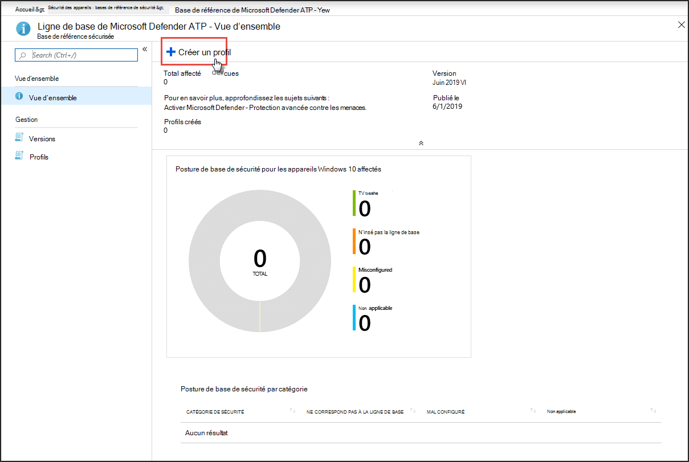
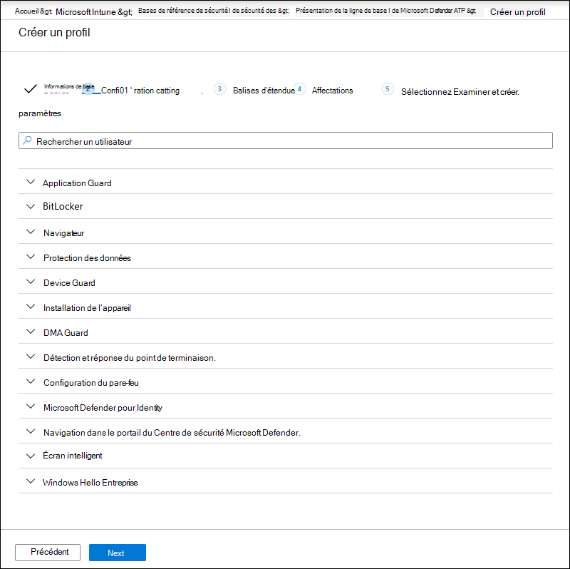
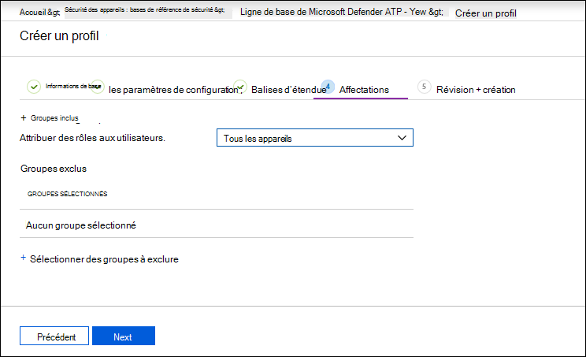
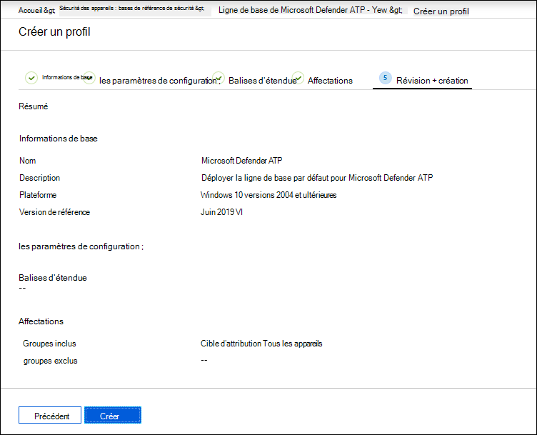

# Renforcer la conformité à la ligne de base de sécurité microsoft Defender pour les points de terminaison

[!INCLUDE [Microsoft 365 Defender rebranding](../../includes/microsoft-defender.md)]

**S’applique à :**
- [Microsoft Defender pour point de terminaison](https://go.microsoft.com/fwlink/p/?linkid=2154037)
- [Microsoft 365 Defender](https://go.microsoft.com/fwlink/?linkid=2118804)

> Vous souhaitez faire l’expérience de Defender pour point de terminaison ? [Inscrivez-vous pour bénéficier d’un essai gratuit.](https://signup.microsoft.com/create-account/signup?products=7f379fee-c4f9-4278-b0a1-e4c8c2fcdf7e&ru=https://aka.ms/MDEp2OpenTrial?ocid=docs-wdatp-onboardconfigure-abovefoldlink)

Les lignes de base de sécurité garantissent que les fonctionnalités de sécurité sont configurées conformément aux conseils des experts en sécurité et des Windows administrateurs système. Lorsqu’elle est déployée, la ligne de base de sécurité defender pour point de terminaison définit les contrôles de sécurité Defender pour les points de terminaison afin de fournir une protection optimale.

Pour comprendre les lignes de base de sécurité et la façon dont elles sont affectées sur Intune à l’aide de profils de configuration, [lisez ce FAQ.](/intune/security-baselines#q--a)

Avant de pouvoir déployer et suivre la conformité aux lignes de base de sécurité :

- [Inscrire vos appareils à la gestion Intune](configure-machines.md#enroll-devices-to-intune-management)
- [Vérifier que vous avez les autorisations nécessaires](configure-machines.md#obtain-required-permissions)

## Comparer les lignes de base de sécurité Microsoft Defender pour endpoint et Windows intune

La ligne de base de sécurité Windows Intune fournit un ensemble complet de paramètres recommandés nécessaires pour configurer en toute sécurité les appareils exécutant Windows, y compris les paramètres du navigateur, les paramètres PowerShell, ainsi que les paramètres de certaines fonctionnalités de sécurité telles que Antivirus Microsoft Defender. En revanche, la ligne de base de Defender pour point de terminaison fournit des paramètres qui optimisent tous les contrôles de sécurité dans la pile Defender pour les points de terminaison, y compris les paramètres de protection évolutive des points de terminaison (PEPT), ainsi que les paramètres également trouvés dans la ligne de base de sécurité Windows Intune. Pour plus d’informations sur chaque ligne de base, voir :

- [Windows de base de sécurité pour Intune](/intune/security-baseline-settings-windows)
- [Paramètres de référence de Microsoft Defender pour point de terminaison pour Intune](/intune/security-baseline-settings-defender-atp)

Dans l’idéal, les appareils intégrés à Defender pour point de terminaison sont déployés à la fois sur les deux lignes de base : la ligne de base de sécurité Windows Intune pour sécuriser initialement les Windows, puis la ligne de base de sécurité De Defender pour point de terminaison superposée sur le haut pour configurer de manière optimale les contrôles de sécurité Defender pour les points de terminaison. Pour tirer parti des données les plus récentes sur les risques et les menaces et réduire les conflits à mesure que les lignes de base évoluent, appliquez toujours les dernières versions des lignes de base sur tous les produits dès leur publication.

> [!NOTE]
> La ligne de base de sécurité defender pour point de terminaison a été optimisée pour les appareils physiques et n’est actuellement pas recommandée pour une utilisation sur des ordinateurs virtuels (VM) ou des points de terminaison VDI. Certains paramètres de référence peuvent avoir un impact sur les sessions interactives à distance sur les environnements virtualisés.

## Surveiller la conformité à la ligne de base de sécurité de Defender for Endpoint

La **carte de référence** sécurité sur la gestion de la [configuration](configure-machines.md) des appareils fournit une vue d’ensemble de la conformité sur Windows 10 appareils qui ont été affectés à la ligne de base de sécurité Defender for Endpoint.

*Carte montrant la conformité à la ligne de base de sécurité defender pour point de terminaison*

L’un des types d’état suivants est attribué à chaque appareil :

- **Correspond à la ligne de** base : les paramètres de l’appareil correspondent à tous les paramètres de la ligne de base.
- **Ne correspond pas à la ligne** de base : au moins un paramètre d’appareil ne correspond pas à la ligne de base.
- **Mal configuré**: au moins un paramètre de référence n’est pas correctement configuré sur l’appareil et est en conflit, en erreur ou en attente.
- **Non applicable**: au moins un paramètre de référence n’est pas applicable sur l’appareil.

Pour passer en revue des appareils spécifiques, **sélectionnez Configurer la ligne de base de sécurité** sur la carte. Cela vous permet d’utiliser la gestion des appareils Intune. À partir de là, **sélectionnez État de l’appareil** pour les noms et les états des appareils.

> [!NOTE]
> Vous pouvez faire face à des incohérences dans les données agrégées affichées sur la page de gestion de la configuration des appareils et celles affichées sur les écrans de vue d’ensemble dans Intune.

## Examiner et affecter la ligne de base de sécurité microsoft Defender pour les points de terminaison

La gestion de la configuration des appareils surveille la conformité de référence uniquement Windows 10 appareils qui ont été spécifiquement affectés à la ligne de base de sécurité Microsoft Defender for Endpoint. Vous pouvez facilement consulter la ligne de base et l’affecter aux appareils sur la gestion des appareils Intune.

1. Sélectionnez **Configurer la ligne de base de sécurité** sur la carte de **référence** sécurité pour passer à la gestion des appareils Intune. Une vue d’ensemble similaire de la conformité de référence s’affiche.

   > [!TIP]
   > Vous pouvez également accéder à la ligne de base de sécurité Defender for Endpoint dans le portail Microsoft Azure à partir de Tous les **services > Intune >** Sécurité des appareils > Sécurité > ligne de base Microsoft Defender ATP .

2. Créez un profil.

    
   *Vue d’ensemble de la ligne de base de sécurité microsoft Defender pour point de terminaison sur Intune*

3. Lors de la création du profil, vous pouvez examiner et ajuster des paramètres spécifiques sur la ligne de base.

    
   *Options de base de sécurité lors de la création du profil sur Intune*

4. Affectez le profil au groupe d’appareils approprié.

    
   *Affectation du profil de base de sécurité sur Intune*

5. Créez le profil pour l’enregistrer et déployez-le sur le groupe d’appareils affecté.

    
   *Création du profil de base de sécurité sur Intune*

> [!TIP]
> Les lignes de base de sécurité sur Intune offrent un moyen pratique de sécuriser et de protéger de manière exhaustive vos appareils. [En savoir plus sur les bases de référence de sécurité sur Intune.](/intune/security-baselines)

> Vous voulez découvrir Microsoft Defender pour point de terminaison ? [Inscrivez-vous pour bénéficier d’un essai gratuit.](https://signup.microsoft.com/create-account/signup?products=7f379fee-c4f9-4278-b0a1-e4c8c2fcdf7e&ru=https://aka.ms/MDEp2OpenTrial?ocid=docs-wdatp-onboardconfigure-belowfoldlink)

## Rubriques connexes

- [Vérifier que vos appareils sont correctement configurés](configure-machines.md)
- [Obtenir des appareils intégrés à Microsoft Defender pour le point de terminaison](configure-machines-onboarding.md)
- [Optimiser le déploiement et les détections des règles ASR](configure-machines-asr.md)
