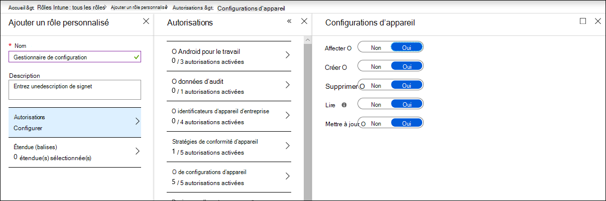

# Vérifier que vos appareils sont correctement configurés

[!INCLUDE [Microsoft 365 Defender rebranding](../../includes/microsoft-defender.md)]

**S’applique à :**
- [Microsoft Defender pour point de terminaison](https://go.microsoft.com/fwlink/p/?linkid=2154037)
- [Microsoft 365 Defender](https://go.microsoft.com/fwlink/?linkid=2118804)

> Vous souhaitez faire l’expérience de Defender for Endpoint ? [Inscrivez-vous pour bénéficier d’un essai gratuit.](https://signup.microsoft.com/create-account/signup?products=7f379fee-c4f9-4278-b0a1-e4c8c2fcdf7e&ru=https://aka.ms/MDEp2OpenTrial?ocid=docs-wdatp-onboardconfigure-abovefoldlink)

Avec des appareils correctement configurés, vous pouvez renforcer la résilience globale contre les menaces et améliorer votre capacité à détecter les attaques et à y répondre. La gestion de la configuration de la sécurité permet de s’assurer que vos appareils :

- Intégrer à Microsoft Defender pour point de terminaison
- Meet or exceed the Defender for Endpoint security baseline configuration
- Mettre en place des atténuations de la surface d’attaque stratégique

Cliquez **sur Gestion de la** configuration dans le menu de navigation pour ouvrir la page Gestion de la configuration des appareils.

*Page Gestion de la configuration des appareils*

Vous pouvez suivre l’état de configuration au niveau de l’organisation et prendre rapidement des mesures en réponse à une couverture d’intégration médiocre, à des problèmes de conformité et à des atténuations de la surface d’attaque mal optimisées via des liens directs et profonds vers les pages de gestion des appareils sur le centre de sécurité Microsoft Intune et Microsoft 365.

Pour ce faire, vous bénéficiez des avantages de :

- Visibilité complète des événements sur vos appareils
- Veille fiable sur les menaces et technologies puissantes d’apprentissage des appareils pour traiter les événements bruts et identifier l’activité de violation et les indicateurs de menace
- Pile complète de fonctionnalités de sécurité configurées pour arrêter efficacement l’installation de programmes malveillants, le piratage de fichiers et de processus système, l’exfiltration de données et d’autres activités contre les menaces
- Optimisation des atténuations de la surface d’attaque, optimisation des défenses stratégiques contre l’activité des menaces tout en réduisant l’impact sur la productivité

## Inscrire des appareils à la gestion Intune

La gestion de la configuration des appareils fonctionne en étroite collaboration avec la gestion des appareils Intune pour établir l’inventaire des appareils de votre organisation et la configuration de sécurité de référence. Vous pourrez suivre et gérer les problèmes de configuration sur les appareils gérés Windows Intune.

Avant de pouvoir vous assurer que vos appareils sont correctement configurés, inscrivez-les à la gestion Intune. L’inscription Intune est robuste et offre plusieurs options d’inscription pour Windows appareils. Pour plus d’informations sur les options d’inscription Intune, voir la configuration de l’inscription [Windows appareils mobiles.](/intune/windows-enroll)

> [!NOTE]
> Pour inscrire des Windows à Intune, les administrateurs doivent avoir déjà reçu des licences. [En savoir plus sur l’attribution de licences pour l’inscription des appareils.](/intune/licenses-assign)

> [!TIP]
> Pour optimiser la gestion des appareils via Intune, [connectez Intune à Defender pour endpoint.](/intune/advanced-threat-protection#enable-windows-defender-atp-in-intune)

## Obtenir les autorisations requises

Par défaut, seuls les utilisateurs qui ont reçu le rôle Administrateur général ou Administrateur du service Intune sur Azure AD peuvent gérer et affecter les profils de configuration d’appareil nécessaires à l’intégration des appareils et au déploiement de la ligne de base de sécurité.

Si d’autres rôles vous ont été attribués, assurez-vous que vous avez les autorisations nécessaires :

- Autorisations complètes sur les configurations d’appareil
- Autorisations complètes sur les lignes de base de sécurité
- Autorisations de lecture des stratégies de conformité des appareils
- Autorisations de lecture pour l’organisation

*Autorisations de configuration d’appareil sur Intune*

> [!TIP]
> Pour en savoir plus sur l’attribution d’autorisations sur Intune, découvrez [la création de rôles personnalisés.](/intune/create-custom-role#to-create-a-custom-role)

## Dans cette section

Rubrique|Description
:---|:---
[Obtenir des appareils intégrés à Defender pour le point de terminaison](configure-machines-onboarding.md)|Suivre l’état d’intégration des appareils gérés par Intune et intégrer d’autres appareils via Intune. 
[Renforcer la conformité à la ligne de base de sécurité de Defender for Endpoint](configure-machines-security-baseline.md)|Assurer le suivi de la conformité et de la non-conformité des lignes de base. Déployez la ligne de base de sécurité sur d’autres appareils gérés par Intune.
[Optimiser le déploiement et les détections des règles ASR](configure-machines-asr.md)|Examinez le déploiement des règles et ajustez les détections à l’aide des outils d’analyse d’impact Microsoft 365 centre de sécurité.

> Vous souhaitez faire l’expérience de Defender for Endpoint ? [Inscrivez-vous pour bénéficier d’un essai gratuit.](https://signup.microsoft.com/create-account/signup?products=7f379fee-c4f9-4278-b0a1-e4c8c2fcdf7e&ru=https://aka.ms/MDEp2OpenTrial?ocid=docs-wdatp-onboardconfigure-belowfoldlink)
