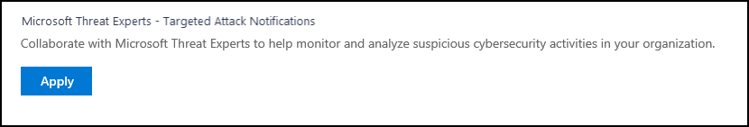
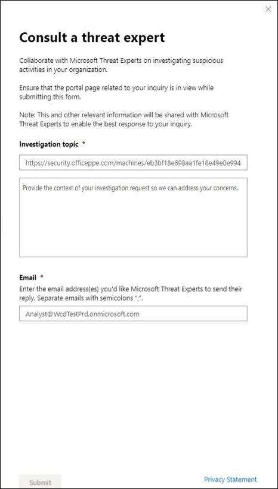

# Configurer et gérer les fonctionnalités de Spécialistes des menaces Microsoft

[!INCLUDE [Microsoft 365 Defender rebranding](../../includes/microsoft-defender.md)]

**S’applique à :**
- [Microsoft Defender pour point de terminaison](https://go.microsoft.com/fwlink/p/?linkid=2154037)
- [Microsoft 365 Defender](https://go.microsoft.com/fwlink/?linkid=2118804)

> Vous souhaitez faire l’expérience de Defender pour point de terminaison ? [Inscrivez-vous pour bénéficier d’un essai gratuit.](https://signup.microsoft.com/create-account/signup?products=7f379fee-c4f9-4278-b0a1-e4c8c2fcdf7e&ru=https://aka.ms/MDEp2OpenTrial?ocid=docs-wdatp-assignaccess-abovefoldlink)

## Avant de commencer

> [!NOTE]
> Discutez des conditions d’éligibilité avec votre fournisseur de services techniques Microsoft et votre équipe de compte avant de vous inscrire à Spécialistes des menaces Microsoft - Service de recherche de menace gérée de notification d’attaque ciblée.

Assurez-vous que Defender pour le point de terminaison est déployé dans votre environnement avec des appareils inscrits, et pas seulement sur une mise en place de laboratoire.

Si vous êtes un client Defender pour point de terminaison, vous devez demander **des Spécialistes des menaces Microsoft - Notifications** d’attaque ciblées pour obtenir des informations et une analyse spéciales afin d’identifier les menaces les plus critiques, afin de pouvoir y répondre rapidement. Contactez votre équipe de compte ou votre représentant Microsoft pour vous abonner **à Spécialistes des menaces Microsoft - Experts** à la demande pour consulter nos experts en matière de menaces sur les détections et les adversaires pertinents.

## Appliquer pour les Spécialistes des menaces Microsoft - Service de notifications d’attaques ciblées

Si vous êtes déjà un client Defender for Endpoint, vous pouvez l’appliquer via le Centre de sécurité Microsoft Defender.

1. Dans le volet de navigation, Paramètres > général > fonctionnalités avancées **> Spécialistes des menaces Microsoft - Notifications** d’attaque ciblées .

2. Cliquez sur **Appliquer**.

    

3. Entrez votre nom et votre adresse e-mail afin que Microsoft puisse vous revenir sur votre application.

    

4. Lisez [la déclaration de confidentialité,](https://privacy.microsoft.com/privacystatement)puis cliquez sur **Envoyer** lorsque vous avez terminé. Vous recevrez un e-mail de bienvenue une fois votre application approuvée.

    

Lorsqu’il est accepté, vous recevez un  e-mail de bienvenue et le bouton Appliquer change sur un bouton bascule qui est « sur ». Si vous souhaitez vous dérender du service Notifications d’attaques  ciblées, faites glisser le bouton bascule vers le bas, puis cliquez sur Enregistrer les préférences en bas de la page.

## L’endroit où les notifications d’attaque ciblées s’Spécialistes des menaces Microsoft

Vous pouvez recevoir des notifications d’attaques ciblées Spécialistes des menaces Microsoft via le support suivant :

- Page Incidents du portail Defender pour les points **de terminaison**
- Tableau de bord **Alertes** du portail Defender pour les points de terminaison
- API d’alerte OData [et API](/windows/security/threat-protection/microsoft-defender-atp/get-alerts) [REST](/windows/security/threat-protection/microsoft-defender-atp/pull-alerts-using-rest-api)
- [Table DeviceAlertEvents en](/windows/security/threat-protection/microsoft-defender-atp/advanced-hunting-devicealertevents-table) recherche avancée
- Votre courrier électronique, si vous choisissez de le configurer

Pour recevoir des notifications d’attaque ciblée par courrier électronique, créez une règle de notification par courrier électronique.

### Créer une règle de notification par courrier électronique

Vous pouvez créer des règles pour envoyer des notifications par courrier électronique aux destinataires de la notification. Pour plus d’informations, voir Configurer les  [notifications d’alerte](configure-email-notifications.md) pour créer, modifier, supprimer ou dépanner les notifications par courrier électronique.

## Afficher la notification d’attaque ciblée

Vous commencerez à recevoir des notifications d’attaques ciblées Spécialistes des menaces Microsoft votre courrier électronique après avoir configuré votre système pour recevoir une notification par courrier électronique.

1. Cliquez sur le lien dans l’e-mail pour aller dans le contexte d’alerte correspondant dans le tableau de bord balisé avec des **experts en menaces.**

2. Dans le tableau de bord, sélectionnez la même rubrique d’alerte que celle que vous avez reçu de l’e-mail pour afficher les détails.

## S’abonner à Spécialistes des menaces Microsoft - Experts à la demande

Il est disponible en tant que service d’abonnement. Si vous êtes déjà un client Defender for Endpoint, vous pouvez contacter votre représentant Microsoft pour vous abonner à Spécialistes des menaces Microsoft - Experts à la demande.

## Consulter un expert microsoft en matière de menaces sur les activités de cybersécurité suspectes dans votre organisation

Vous pouvez travailler en partenariat avec Spécialistes des menaces Microsoft qui peuvent être impliqués directement à partir du Centre de sécurité Microsoft Defender pour obtenir une réponse précise et rapide. Les experts fournissent des informations pour mieux comprendre les menaces complexes, les notifications d’attaque ciblées que vous recevez, ou si vous avez besoin d’informations supplémentaires sur les alertes, un appareil potentiellement compromis ou un contexte d’intelligence des menaces que vous voyez sur votre tableau de bord du portail.

> [!NOTE]
>
> - Les demandes d’alerte liées aux données d’intelligence contre les menaces personnalisées de votre organisation ne sont actuellement pas pris en charge. Pour plus d’informations, consultez vos opérations de sécurité ou votre équipe de réponse aux incidents.
> - Vous devez avoir l’autorisation Gérer les **paramètres** de sécurité dans le portail du Centre de sécurité pour pouvoir soumettre une demande « Consulter un expert en menaces ».

1. Accédez à la page du portail avec les informations pertinentes que vous souhaitez examiner, par exemple, la page **Incident.** Assurez-vous que la page de l’alerte ou du périphérique approprié est en vue avant d’envoyer une demande d’enquête.

2. Dans le menu supérieur droit, cliquez sur **le bouton ?** . Ensuite, **sélectionnez Consulter un expert en menaces.**

    

    Un écran volant s’ouvre. L’écran suivant indique quand vous êtes sur un abonnement d’essai.

    

    L’écran suivant montre quand vous êtes sur un abonnement Spécialistes des menaces Microsoft - Experts à la demande.

    

    Le **champ Rubrique de** la requête est pré-rempli avec le lien vers la page concernée pour votre demande d’enquête. Par exemple, un lien vers la page de détails de l’incident, de l’alerte ou de l’appareil que vous étiez lorsque vous avez effectué la demande.

3. Dans le champ suivant, fournissez suffisamment d’informations pour donner au Spécialistes des menaces Microsoft suffisamment de contexte pour lancer l’enquête.

4. Entrez l’adresse de messagerie que vous souhaitez utiliser pour correspondre à Spécialistes des menaces Microsoft.

> [!NOTE]
> Si vous souhaitez suivre l’état de vos cas d’experts à la demande via le Microsoft Services Hub, faites-en le suivi.

Regardez cette vidéo pour obtenir une vue d’ensemble rapide du Microsoft Services Hub.

> [!VIDEO https://www.microsoft.com/videoplayer/embed/RE4pk9f]

## Exemples de rubriques d’examen que vous pouvez consulter avec Spécialistes des menaces Microsoft - Experts à la demande

### Informations sur les alertes

- Nous voyons un nouveau type d’alerte pour un binaire « living-off-the-land » : [AlertID]. Pouvez-vous nous en dire plus sur cette alerte et sur la façon dont nous pouvons examiner plus en détail ?
- Nous avons observé deux attaques similaires, qui tentent d’exécuter des scripts PowerShell malveillants, mais génèrent des alertes différentes. L’une est « Ligne de commande PowerShell suspecte » et l’autre est « Un fichier malveillant a été détecté en fonction de l’indication fournie par O365 ». Quelle est la différence ?
- Je reçois une alerte impaire aujourd’hui pour le nombre anormal d’échec de connexion à partir de l’appareil d’un utilisateur à profil élevé. Je ne trouve aucune preuve supplémentaire autour de ces tentatives de se connecte. Comment Defender for Endpoint peut-il voir ces tentatives ? Quel type de signatures sont surveillés ?
- Pouvez-vous donner plus de contexte ou d’informations sur cette alerte : « Un comportement suspect a été observé par un utilitaire système ».

### Compromission possible de l’ordinateur

- Pouvez-vous répondre à la question « Processus inconnu observé ? » Ce message ou cette alerte est fréquemment visible sur de nombreux appareils. Nous vous remercions de toute entrée pour clarifier si ce message ou cette alerte est lié à une activité malveillante.
- Pouvez-vous valider une compromission possible sur le système suivant à [date] avec des comportements similaires à la détection de programmes malveillants [nom de programme malveillant] précédente sur le même système en [mois] ?

### Détails de l’intelligence des menaces

- Nous avons détecté un e-mail de hameçonnage qui a remis un document Word malveillant à un utilisateur. Le document Word malveillant a provoqué une série d’événements suspects, qui ont déclenché plusieurs alertes Microsoft Defender pour les programmes malveillants [nom du programme malveillant]. Avez-vous des informations sur ce programme malveillant ? Si oui, pouvez-vous m’envoyer un lien ?
- J’ai récemment vu un billet de [référence aux réseaux sociaux, par exemple, Twitter ou blog] sur une menace ciblant mon secteur d’activité. Pouvez-vous m’aider à comprendre quelle protection Defender pour Endpoint offre contre cet acteur des menaces ?

### Spécialistes des menaces Microsoft les communications d’alerte de l’Spécialistes des menaces Microsoft

- Votre équipe de réponse aux incidents peut-elle nous aider à résoudre la notification d’attaque ciblée que nous avons reçu ?
- J’ai reçu cette notification d’attaque ciblée de Spécialistes des menaces Microsoft. Nous n’avons pas notre propre équipe de réponse aux incidents. Que pouvons-nous faire maintenant et comment contenir l’incident ?
- J’ai reçu une notification d’attaque ciblée de Spécialistes des menaces Microsoft. Quelles données pouvez-vous nous fournir que nous pouvons transmettre à notre équipe de réponse aux incidents ?

  > [!NOTE]
  > Spécialistes des menaces Microsoft est un service de recherche de cyber-sécurité géré et non un service de réponse aux incidents. Toutefois, vous pouvez faire appel à votre propre équipe de réponse aux incidents pour résoudre les problèmes nécessitant une réponse aux incidents. Si vous ne possédez pas votre propre équipe de réponse aux incidents et que vous souhaitez obtenir de l’aide de Microsoft, vous pouvez vous engager avec l’équipe de réponse aux incidents de cybersécurité CSS (CIRT). Ils peuvent ouvrir un ticket pour vous aider à répondre à vos questions.

## Scénario

### Recevoir un rapport d’avancement sur votre recherche gérée

La réponse de Spécialistes des menaces Microsoft varie en fonction de votre demande. Ils vous envoient un rapport  d’avancement sur votre examen expert en menaces dans un délai de deux jours, pour communiquer l’état de l’enquête dans les catégories suivantes :

- Plus d’informations sont nécessaires pour poursuivre l’enquête
- Un fichier ou plusieurs exemples de fichiers sont nécessaires pour déterminer le contexte technique
- L’examen nécessite plus de temps
- Les informations initiales étaient suffisantes pour conclure l’enquête

Il est essentiel de répondre rapidement pour que l’enquête continue de se déplacer.

## Rubrique connexe

- [Vue d’ensemble des spécialistes des menaces Microsoft](microsoft-threat-experts.md)
- [Spécialistes des menaces Microsoft dans Microsoft 365 vue d’ensemble](/microsoft-365/security/mtp/microsoft-threat-experts)
