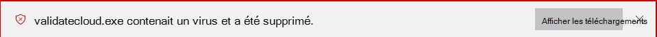
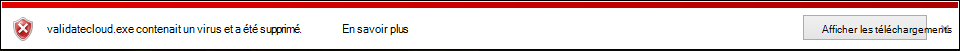

# <a name="configure-and-validate-microsoft-defender-antivirus-network-connections"></a>Configurer et valider les connexions réseau à un antivirus Microsoft Defender

**S’applique à :**

- [Microsoft Defender pour point de terminaison](/microsoft-365/security/defender-endpoint/)

Pour garantir Antivirus Microsoft Defender protection assurée par le cloud fonctionne correctement, votre équipe de sécurité doit configurer votre réseau pour autoriser les connexions entre vos points de terminaison et certains serveurs Microsoft. Cet article répertorie les connexions qui doivent être autorisées, par exemple à l’aide de règles de pare-feu, et fournit des instructions pour valider votre connexion. La configuration appropriée de votre protection vous permet de bénéficier de la meilleure valeur de vos services de protection cloud.

Consultez le billet de blog Concernant les modifications importantes apportées au point de terminaison [Microsoft Active Protection Services](https://techcommunity.microsoft.com/t5/Configuration-Manager-Archive/Important-changes-to-Microsoft-Active-Protection-Service-MAPS/ba-p/274006) pour plus d’informations sur la connectivité réseau.

> [!TIP]
> Visitez le site web de démonstration microsoft Defender pour points de [terminaison sur demo.wd.microsoft.com](https://demo.wd.microsoft.com?ocid=cx-wddocs-testground) pour vérifier que les fonctionnalités suivantes fonctionnent :
>
> - Protection fournie par le cloud
> - Apprentissage rapide (y compris bloquer à la première vue)
> - Blocage d’applications potentiellement indésirables

## <a name="allow-connections-to-the-microsoft-defender-antivirus-cloud-service"></a>Autoriser les connexions au service Antivirus Microsoft Defender cloud

Le Antivirus Microsoft Defender cloud fournit une protection rapide et forte pour vos points de terminaison. L’activation du service de protection cloud est facultative, mais elle est vivement recommandée, car elle offre une protection importante contre les programmes malveillants sur vos points de terminaison et sur votre réseau. Pour plus d’informations sur l’activation du service avec Intune, Microsoft Endpoint Configuration Manager, la stratégie de groupe, les cmdlets PowerShell ou sur des clients individuels dans l’application Sécurité Windows, voir Activer la [protection](enable-cloud-protection-microsoft-defender-antivirus.md) cloud. 

Après avoir activé le service, vous devrez peut-être configurer votre réseau ou votre pare-feu pour autoriser les connexions entre celui-ci et vos points de terminaison. Étant donné que votre protection est un service cloud, les ordinateurs doivent avoir accès à Internet et accéder à Microsoft Defender pour Office 365 services d’apprentissage automatique. N’excluez pas l’URL `*.blob.core.windows.net` d’un type d’inspection réseau. 

> [!NOTE]
> Le Antivirus Microsoft Defender cloud est un mécanisme permettant de fournir une protection mise à jour à votre réseau et points de terminaison. Bien qu’il soit appelé service cloud, il ne s’agit pas simplement de la protection des fichiers stockés dans le cloud, mais plutôt de l’utilisation de ressources distribuées et d’apprentissage automatique pour fournir une protection à vos points de terminaison à une vitesse beaucoup plus rapide que les mises à jour d’informations de sécurité traditionnelles.

## <a name="services-and-urls"></a>Services et URL

Le tableau de cette section répertorie les services et leurs adresses web associées (URL). 

Assurez-vous qu’il n’existe aucune règle de pare-feu ou de filtrage réseau qui refuse l’accès à ces URL. Dans le cas contraire, vous devrez peut-être créer une règle d’autoriser spécifiquement pour eux (à l’exclusion de `*.blob.core.windows.net` l’URL). Les URL du tableau suivant utilisent le port 443 pour la communication.

| Service et description | URL |
|----|---- |
| Antivirus Microsoft Defender service de protection cloud, également appelé Microsoft Active Protection Service (MAPS)<p>Ce service est utilisé par les Antivirus Microsoft Defender pour fournir une protection fournie par le cloud|`*.wdcp.microsoft.com` <p> `*.wdcpalt.microsoft.com` <p> `*.wd.microsoft.com`|
| Microsoft Update Service (MU) et Windows Update Service (WU) <p>Ces services permettent d’obtenir des informations sur la sécurité et des mises à jour de produit   |`*.update.microsoft.com` <p> `*.delivery.mp.microsoft.com`<p> `*.windowsupdate.com` <p> Pour plus d’informations, voir [Points de terminaison de](/windows/privacy/manage-windows-1709-endpoints#windows-update) connexion pour Windows update|
|Security intelligence updates Alternate Download Location (ADL)<p>Il s’agit d’un autre emplacement pour Antivirus Microsoft Defender mises à jour de l’intelligence de sécurité si l’intelligence de sécurité installée est hors service (au moins 7 jours après)|  `*.download.microsoft.com`  <p> `*.download.windowsupdate.com`<p>  `go.microsoft.com`<p> `https://fe3cr.delivery.mp.microsoft.com/ClientWebService/client.asmx`|
| Stockage de soumission de programmes malveillants <p>Il s’agit de l’emplacement de téléchargement des fichiers envoyés à Microsoft via le formulaire de soumission ou l’envoi automatique d’exemples | `ussus1eastprod.blob.core.windows.net` <p>    `ussus2eastprod.blob.core.windows.net` <p>    `ussus3eastprod.blob.core.windows.net` <p>    `ussus4eastprod.blob.core.windows.net` <p>    `wsus1eastprod.blob.core.windows.net` <p>    `wsus2eastprod.blob.core.windows.net` <p>    `ussus1westprod.blob.core.windows.net` <p>    `ussus2westprod.blob.core.windows.net` <p>    `ussus3westprod.blob.core.windows.net` <p>    `ussus4westprod.blob.core.windows.net` <p>    `wsus1westprod.blob.core.windows.net` <p>    `wsus2westprod.blob.core.windows.net` <p>    `usseu1northprod.blob.core.windows.net` <p>    `wseu1northprod.blob.core.windows.net` <p>    `usseu1westprod.blob.core.windows.net` <p>    `wseu1westprod.blob.core.windows.net` <p>    `ussuk1southprod.blob.core.windows.net` <p>    `wsuk1southprod.blob.core.windows.net` <p>    `ussuk1westprod.blob.core.windows.net` <p>    `wsuk1westprod.blob.core.windows.net` |
| Liste de révocation de certificats (CRL) <p>Cette liste est utilisée par les Windows lors de la création de la connexion SSL à MAPS pour la mise à jour de la liste de niveau de liste de remise   | `http://www.microsoft.com/pkiops/crl/` <p> `http://www.microsoft.com/pkiops/certs` <p>   `http://crl.microsoft.com/pki/crl/products` <p> `http://www.microsoft.com/pki/certs` |
| Magasin de symboles <p>Le magasin de symboles est utilisé par les Antivirus Microsoft Defender pour restaurer certains fichiers critiques pendant les flux de correction   | `https://msdl.microsoft.com/download/symbols` |
| Client de télémétrie universel <p>Ce client est utilisé par les Windows pour envoyer des données de diagnostic client<p> Antivirus Microsoft Defender télémétrie à des fins de surveillance de la qualité des produits    | La mise à jour utilise SSL (port TCP 443) pour télécharger des manifestes et télécharger des données de diagnostic vers Microsoft qui utilise les points de terminaison DNS suivants : <p> `vortex-win.data.microsoft.com` <p>   `settings-win.data.microsoft.com`|

## <a name="validate-connections-between-your-network-and-the-cloud"></a>Valider les connexions entre votre réseau et le cloud

Après avoir permis les URL répertoriées ci-dessus, vous pouvez tester si vous êtes connecté au service cloud Antivirus Microsoft Defender et que vous signalez et recevez correctement des informations pour vous assurer que vous êtes entièrement protégé.

### <a name="use-the-cmdline-tool-to-validate-cloud-delivered-protection"></a>Utiliser l’outil cmdline pour valider la protection cloud

Utilisez l’argument suivant avec l Antivirus Microsoft Defender de ligne de commande ( ) pour vérifier que votre réseau peut communiquer avec Antivirus Microsoft Defender `mpcmdrun.exe` service cloud :

```console
"%ProgramFiles%\Windows Defender\MpCmdRun.exe" -ValidateMapsConnection
```

> [!NOTE]
> Vous devez ouvrir une version de niveau administrateur de l’invite de commandes. Cliquez avec le bouton droit sur l’élément dans le menu Démarrer, cliquez sur Exécuter **en tant** qu’administrateur et cliquez sur **Oui** à l’invite d’autorisations. Cette commande ne fonctionne que sur Windows 10 version 1703 ou supérieure.

Pour plus d’informations, [voir Gérer Antivirus Microsoft Defender avec l’outil mpcmdrun.exe ligne de commande.](command-line-arguments-microsoft-defender-antivirus.md)

### <a name="attempt-to-download-a-fake-malware-file-from-microsoft"></a>Tentative de téléchargement d’un fichier de programmes malveillants factices à partir de Microsoft

Vous pouvez télécharger un exemple de fichier Antivirus Microsoft Defender détecter et bloquer si vous êtes correctement connecté au cloud.

Téléchargez le fichier en visitant [https://aka.ms/ioavtest](https://aka.ms/ioavtest) .

> [!NOTE]
> Ce fichier n’est pas un programme malveillant réel. Il s’agit d’un fichier factice conçu pour tester si vous êtes correctement connecté au cloud.

Si vous êtes correctement connecté, un avertissement s’Antivirus Microsoft Defender notification.

Si vous utilisez Microsoft Edge, vous verrez également un message de notification :



Un message similaire se produit si vous utilisez Internet Explorer :



Vous verrez également une  détection des menaces mises en quarantaine dans la **section** Historique des analyses de l’application Sécurité Windows :

1. Ouvrez l Sécurité Windows application en cliquant sur l’icône de bouclier dans la barre des tâches ou en recherchant sécurité dans le menu **Démarrer.**

2. Sélectionnez **Virus & protection contre les** menaces, puis sélectionnez Historique de la **protection.**

3. Sous la section **Menaces en quarantaine,** **sélectionnez Consulter l’historique complet** pour voir les programmes malveillants factices détectés.

   > [!NOTE]
   > Les versions Windows 10 antérieures à la version 1703 ont une interface utilisateur différente. Voir [Antivirus Microsoft Defender dans l’application Sécurité Windows.](microsoft-defender-security-center-antivirus.md)

   Le Windows journal des événements affiche également [Windows Defender’ID d’événement client 1116](troubleshoot-microsoft-defender-antivirus.md).

