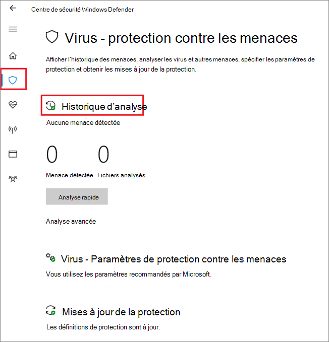

# <a name="configure-and-validate-microsoft-defender-antivirus-network-connections"></a>Configurer et valider les connexions réseau à un antivirus Microsoft Defender

[!INCLUDE [Microsoft 365 Defender rebranding](../../includes/microsoft-defender.md)]


**S’applique à :**

- [Microsoft Defender pour point de terminaison](/microsoft-365/security/defender-endpoint/)

Pour vous assurer que la protection assurée par l'Antivirus Microsoft Defender fonctionne correctement, vous devez configurer votre réseau pour autoriser les connexions entre vos points de terminaison et certains serveurs Microsoft.

Cet article répertorie les connexions qui doivent être autorisées, par exemple à l'aide de règles de pare-feu, et fournit des instructions pour valider votre connexion. La configuration appropriée de votre protection vous permet de bénéficier de la meilleure valeur de vos services de protection cloud.

Consultez le billet de blog Concernant les modifications importantes apportées au point de terminaison [Microsoft Active Protection Services](https://techcommunity.microsoft.com/t5/Configuration-Manager-Archive/Important-changes-to-Microsoft-Active-Protection-Service-MAPS/ba-p/274006) pour plus d'informations sur la connectivité réseau.

>[!TIP]
>Vous pouvez également consulter le site web de démonstration microsoft Defender pour points de terminaison [sur demo.wd.microsoft.com](https://demo.wd.microsoft.com?ocid=cx-wddocs-testground) pour vérifier que les fonctionnalités suivantes fonctionnent :
>
>- Protection cloud
>- Apprentissage rapide (y compris bloquer à la première vue)
>- Blocage d'applications potentiellement indésirables

## <a name="allow-connections-to-the-microsoft-defender-antivirus-cloud-service"></a>Autoriser les connexions au service cloud de l'Antivirus Microsoft Defender

Le service cloud de l'Antivirus Microsoft Defender offre une protection rapide et forte pour vos points de terminaison. L'activation du service de protection cloud est facultative, mais elle est vivement recommandée, car elle offre une protection importante contre les programmes malveillants sur vos points de terminaison et sur votre réseau.

>[!NOTE]
>Le service cloud de l'Antivirus Microsoft Defender est un mécanisme permettant de fournir une protection mise à jour à votre réseau et points de terminaison. Bien qu'il soit appelé service cloud, il ne s'agit pas simplement de la protection des fichiers stockés dans le cloud, mais plutôt de l'utilisation de ressources distribuées et d'apprentissage automatique pour fournir une protection à vos points de terminaison à une vitesse beaucoup plus rapide que les mises à jour d'informations de sécurité traditionnelles.

Voir Activer la [protection](enable-cloud-protection-microsoft-defender-antivirus.md) cloud pour plus d'informations sur l'activation du service avec Intune, Microsoft Endpoint Configuration Manager, la stratégie de groupe, les cmdlets PowerShell ou sur des clients individuels dans l'application Sécurité Windows. 

Après avoir activé le service, vous devrez peut-être configurer votre réseau ou votre pare-feu pour autoriser les connexions entre celui-ci et vos points de terminaison.

Étant donné que votre protection est un service cloud, les ordinateurs doivent avoir accès à Internet et accéder aux services d'apprentissage automatique de Microsoft Defender pour Office 365. N'excluez pas l'URL `*.blob.core.windows.net` d'un type d'inspection réseau. 

Le tableau ci-dessous répertorie les services et leurs URL associées. Assurez-vous qu'il n'existe aucune règle de pare-feu ou de filtrage réseau qui refuse l'accès à ces URL, ou vous devrez peut-être créer une règle d'autoriser spécifiquement pour eux (à l'exclusion de `*.blob.core.windows.net` l'URL). Les URL de mention ci-dessous utilisent le port 443 pour la communication.


| **Service**| **Description** |**URL** |
| :--: | :-- | :-- |
| Service de protection cloud de l'Antivirus Microsoft Defender, également appelé Microsoft Active Protection Service (MAPS)|Utilisé par l'Antivirus Microsoft Defender pour fournir une protection fournie par le cloud|`*.wdcp.microsoft.com` <br/> `*.wdcpalt.microsoft.com` <br/> `*.wd.microsoft.com`|
| Service Microsoft Update (MU) <br/> Windows Update Service (WU)|  Veille sur la sécurité et mises à jour des produits   |`*.update.microsoft.com` <br/> `*.delivery.mp.microsoft.com`<br/> `*.windowsupdate.com` <br/><br/> Pour plus d'informations, [voir Points de terminaison de connexion pour Windows Update](/windows/privacy/manage-windows-1709-endpoints#windows-update)|
|Security intelligence updates Alternate Download Location (ADL)|   Autre emplacement pour les mises à jour de l'Intelligence de sécurité de l'antivirus Microsoft Defender si l'intelligence de sécurité installée est hors de service (7 jours ou plus)|    `*.download.microsoft.com`  </br> `*.download.windowsupdate.com`</br> `https://fe3cr.delivery.mp.microsoft.com/ClientWebService/client.asmx`|
| Stockage de soumission de programmes malveillants|Emplacement de chargement des fichiers envoyés à Microsoft via le formulaire de soumission ou l'envoi automatique d'exemples    | `ussus1eastprod.blob.core.windows.net` <br/>    `ussus2eastprod.blob.core.windows.net` <br/>    `ussus3eastprod.blob.core.windows.net` <br/>    `ussus4eastprod.blob.core.windows.net` <br/>    `wsus1eastprod.blob.core.windows.net` <br/>    `wsus2eastprod.blob.core.windows.net` <br/>    `ussus1westprod.blob.core.windows.net` <br/>    `ussus2westprod.blob.core.windows.net` <br/>    `ussus3westprod.blob.core.windows.net` <br/>    `ussus4westprod.blob.core.windows.net` <br/>    `wsus1westprod.blob.core.windows.net` <br/>    `wsus2westprod.blob.core.windows.net` <br/>    `usseu1northprod.blob.core.windows.net` <br/>    `wseu1northprod.blob.core.windows.net` <br/>    `usseu1westprod.blob.core.windows.net` <br/>    `wseu1westprod.blob.core.windows.net` <br/>    `ussuk1southprod.blob.core.windows.net` <br/>    `wsuk1southprod.blob.core.windows.net` <br/>    `ussuk1westprod.blob.core.windows.net` <br/>    `wsuk1westprod.blob.core.windows.net` |
| Liste de révocation de certificats (CRL)|Utilisé par Windows lors de la création de la connexion SSL à MAPS pour la mise à jour de la liste derls   | `http://www.microsoft.com/pkiops/crl/` <br/> `http://www.microsoft.com/pkiops/certs` <br/>   `http://crl.microsoft.com/pki/crl/products` <br/> `http://www.microsoft.com/pki/certs` |
| Magasin de symboles|Utilisé par l'Antivirus Microsoft Defender pour restaurer certains fichiers critiques lors des flux de correction  | `https://msdl.microsoft.com/download/symbols` |
| Client de télémétrie universel| Utilisé par Windows pour envoyer des données de diagnostic client ; L'Antivirus Microsoft Defender utilise la télémétrie à des fins de surveillance de la qualité des produits   | La mise à jour utilise SSL (port TCP 443) pour télécharger des manifestes et télécharger des données de diagnostic vers Microsoft qui utilise les points de terminaison DNS suivants :   `vortex-win.data.microsoft.com` <br/>   `settings-win.data.microsoft.com`|

## <a name="validate-connections-between-your-network-and-the-cloud"></a>Valider les connexions entre votre réseau et le cloud

Après avoir permis les URL répertoriées ci-dessus, vous pouvez tester si vous êtes connecté au service cloud de l'Antivirus Microsoft Defender et que vous signalez et recevez correctement des informations pour vous assurer que vous êtes entièrement protégé.

**Utilisez l'outil cmdline pour valider la protection cloud :**

Utilisez l'argument suivant avec l'utilitaire de ligne de commande de l'Antivirus Microsoft Defender ( ) pour vérifier que votre réseau peut communiquer avec le service cloud de `mpcmdrun.exe` l'Antivirus Microsoft Defender :

```console
"%ProgramFiles%\Windows Defender\MpCmdRun.exe" -ValidateMapsConnection
```

> [!NOTE]
> Vous devez ouvrir une version de niveau administrateur de l'invite de commandes. Cliquez avec le bouton droit sur l'élément dans le menu Démarrer, cliquez sur Exécuter **en tant** qu'administrateur et cliquez sur **Oui** à l'invite d'autorisations. Cette commande ne fonctionne que sur Windows 10, version 1703 ou supérieure.

Pour plus d'informations, voir [Gérer l'Antivirus Microsoft Defender avec lmpcmdrun.exe de ligne de commande.](command-line-arguments-microsoft-defender-antivirus.md)

**Essayez de télécharger un fichier de programmes malveillants factices à partir de Microsoft :**

Vous pouvez télécharger un exemple de fichier que l'Antivirus Microsoft Defender détectera et bloquera si vous êtes correctement connecté au cloud.

Téléchargez le fichier en visitant [https://aka.ms/ioavtest](https://aka.ms/ioavtest) .

>[!NOTE]
>Ce fichier n'est pas un programme malveillant réel. Il s'agit d'un fichier factice conçu pour tester si vous êtes correctement connecté au cloud.

Si vous êtes correctement connecté, vous verrez une notification d'avertissement de l'Antivirus Microsoft Defender.

Si vous utilisez Microsoft Edge, vous verrez également un message de notification :


Un message similaire se produit si vous utilisez Internet Explorer :


Vous verrez également une  détection des menaces mises en quarantaine dans la **section** Historique d'analyse de l'application Sécurité Windows :

1. Ouvrez l'application Sécurité Windows en cliquant sur l'icône de bouclier dans la barre des tâches ou en recherchant Defender dans le menu **Démarrer.**

2. Sélectionnez la **vignette & protection** contre les virus contre les menaces (ou l'icône de bouclier dans la barre de menus de gauche), puis l'étiquette De l'historique de **l'analyse** :

    

3. Sous la section **Menaces en quarantaine,** **sélectionnez Consulter l'historique complet** pour voir les programmes malveillants factices détectés.

   > [!NOTE]
   > Les versions de Windows 10 antérieures à la version 1703 ont une interface utilisateur différente. Voir [Antivirus Microsoft Defender dans l'application Sécurité Windows.](microsoft-defender-security-center-antivirus.md)

   Le journal des événements Windows affiche également [Windows Defender'ID d'événement client 1116](troubleshoot-microsoft-defender-antivirus.md).

## <a name="related-articles"></a>Articles connexes

- [Antivirus Microsoft Defender dans Windows 10](microsoft-defender-antivirus-in-windows-10.md)

- [Activer la protection cloud](enable-cloud-protection-microsoft-defender-antivirus.md)

- [Arguments de ligne de commande](command-line-arguments-microsoft-defender-antivirus.md)

- [Modifications importantes apportées au point de terminaison Microsoft Active Protection Services](https://techcommunity.microsoft.com/t5/Configuration-Manager-Archive/Important-changes-to-Microsoft-Active-Protection-Service-MAPS/ba-p/274006)