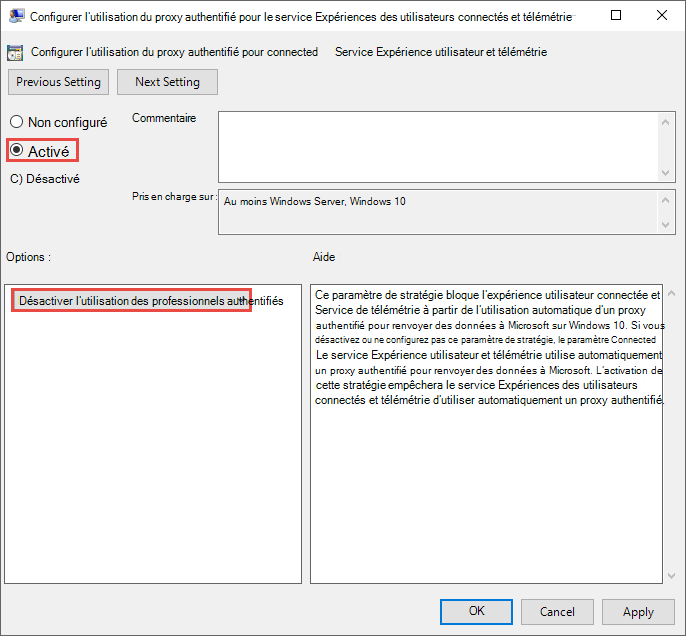
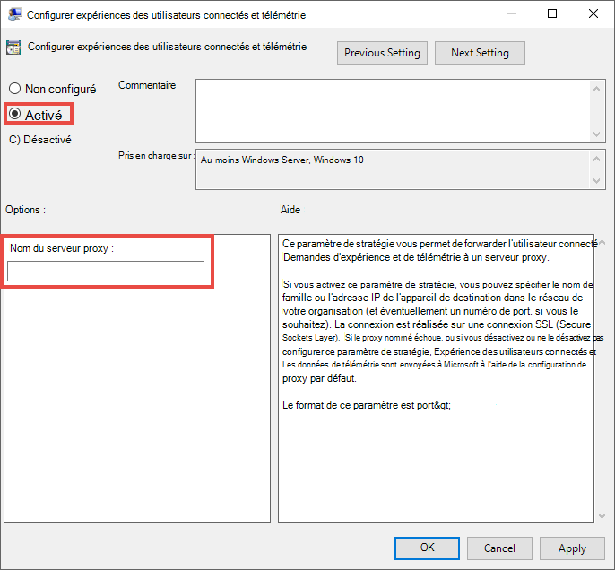
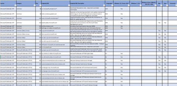

# <a name="configure-device-proxy-and-internet-connectivity-settings"></a>Configurer les paramètres de proxy d'appareil et de connectivité Internet

[!INCLUDE [Microsoft 365 Defender rebranding](../../includes/microsoft-defender.md)]

**S’applique à :**
- [Microsoft Defender pour point de terminaison](https://go.microsoft.com/fwlink/p/?linkid=2154037)
- [Microsoft 365 Defender](https://go.microsoft.com/fwlink/?linkid=2118804)

> Vous souhaitez faire l'expérience de Defender pour point de terminaison ? [Inscrivez-vous à un essai gratuit.](https://www.microsoft.com/en-us/WindowsForBusiness/windows-atp?ocid=docs-wdatp-configureendpointsscript-abovefoldlink)

Le capteur Defender pour point de terminaison nécessite Microsoft Windows HTTP (WinHTTP) pour signaler les données du capteur et communiquer avec le service Defender for Endpoint.

Le capteur Defender for Endpoint incorporé s'exécute dans le contexte système à l'aide du compte LocalSystem. Le capteur utilise les services HTTP De Microsoft Windows (WinHTTP) pour permettre la communication avec le service cloud de Defender for Endpoint.

>[!TIP]
>Pour les organisations qui utilisent des proxies de transfert comme passerelle vers l'Internet, vous pouvez utiliser la protection du réseau pour enquêter derrière un proxy. Pour plus d'informations, voir [Enquêter sur les événements de connexion qui se produisent derrière les procurations](investigate-behind-proxy.md).

Le paramètre de configuration WinHTTP est indépendant des paramètres de proxy de navigation Internet Windows Internet (WinINet) et peut uniquement découvrir un serveur proxy à l'aide des méthodes de découverte suivantes :

- Méthodes de découverte automatique :
  - Proxy transparent
  - Protocole WPAD (Web Proxy Auto-Discovery Protocol)

    > [!NOTE]
    > Si vous utilisez un proxy transparent ou WPAD dans votre topologie réseau, vous n'avez pas besoin de paramètres de configuration spéciaux. Pour plus d'informations sur les exclusions d'URL defender pour point de terminaison dans le proxy, voir Activer l'accès à Defender pour les URL de service de point de terminaison dans [le serveur proxy.](#enable-access-to-microsoft-defender-for-endpoint-service-urls-in-the-proxy-server)

- Configuration manuelle du proxy statique :
  - Configuration basée sur le registre
  - WinHTTP configuré à l'aide de la commande netsh – Convient uniquement aux ordinateurs de bureau à topologie stable (par exemple : un ordinateur de bureau dans un réseau d'entreprise derrière le même proxy)

## <a name="configure-the-proxy-server-manually-using-a-registry-based-static-proxy"></a>Configurer le serveur proxy manuellement en utilisant un proxy statique basé sur le registre

Configurez un proxy statique basé sur le Registre pour autoriser uniquement le capteur Defender for Endpoint à signaler les données de diagnostic et à communiquer avec Defender pour les services Endpoint si un ordinateur n'est pas autorisé à se connecter à Internet.

> [!NOTE]
> - Lorsque vous utilisez cette option sur Windows 10 ou Windows Server 2019, il est recommandé d'avoir la version suivante (ou version ultérieure) et le cumul des mises à jour cumulatives :</br>
> Windows 10, version 1809 ou Windows Server 2019 - https://support.microsoft.com/kb/5001384 <br>
> Windows 10, version 1909 - https://support.microsoft.com/kb/4601380</br>
> Windows 10, version 2004 - https://support.microsoft.com/kb/4601382</br>
> Windows 10, version 20H2 - https://support.microsoft.com/kb/4601382</br>
> Ces mises à jour améliorent la connectivité et la fiabilité du canal CnC (Commande et contrôle).</br>

Le proxy statique est configurable via une stratégie de groupe. La stratégie de groupe se trouve sous :

- Modèles d'administration > composants Windows > collecte de données et builds d'aperçu > Configurer l'utilisation du proxy authentifié pour le service Expériences des utilisateurs connectés et télémétrie
  - Définissez-le **sur Activé et** sélectionnez Désactiver **l'utilisation** du proxy authentifié : 
- **Modèles d'administration > composants Windows >** collecte de données et builds d'aperçu > configurer les expériences utilisateur connectées et la télémétrie :
  - Configurez le proxy :<br>
    

    La stratégie définit deux valeurs de registre `TelemetryProxyServer` comme REG_SZ et `DisableEnterpriseAuthProxy` comme REG_DWORD sous la clé de registre `HKLM\Software\Policies\Microsoft\Windows\DataCollection`.

    La valeur de Registre `TelemetryProxyServer` prend le format de chaîne suivant :

    ```text
    <server name or ip>:<port>
    ```

    Par exemple, 10.0.0.6:8080

    Cette valeur de registre `DisableEnterpriseAuthProxy` doit être égale à 1.

## <a name="configure-the-proxy-server-manually-using-netsh-command"></a>Configurer le serveur proxy manuellement à l'aide de la commande netsh

Utiliser netsh pour configurer un proxy statique à l’échelle du système.

> [!NOTE]
> - Cela affectera toutes les applications, y compris les services Windows qui utilisent WinHTTP avec un proxy par défaut.</br>
> - Les ordinateurs portables qui changent de topologie (par exemple, de bureau à domicile) ne fonctionneront pas correctement avec netsh. Utiliser la configuration statique du proxy basée sur le registre.

1. Ouvrir une ligne de commandes avec élévation de privilèges :

    a. Accéder à **Démarrer** et taper **cmd**.

    b. Cliquez avec le bouton droit sur **Invite de commandes** et sélectionnez **Exécuter en tant qu'administrateur**.

2. Entrez la commande suivante et appuyez sur **Entrée** :

   ```PowerShell
   netsh winhttp set proxy <proxy>:<port>
   ```

   Par exemple : netsh winhttp initialiser proxy 10.0.0.6:8080

Pour réinitialiser le proxy winhttp, entrez la commande suivante et appuyez sur **Entrée.**

```PowerShell
netsh winhttp reset proxy
```

Pour plus d’informations, voir [la syntaxe, les contextes et le formatage de la commande Netsh](https://docs.microsoft.com/windows-server/networking/technologies/netsh/netsh-contexts).

## <a name="enable-access-to-microsoft-defender-for-endpoint-service-urls-in-the-proxy-server"></a>Activer l'accès aux URL du service Microsoft Defender pour les points de terminaison dans le serveur proxy

Si un proxy ou un pare-feu bloque tout le trafic par défaut et n'autorise le passage que de domaines spécifiques, ajoutez les domaines énumérés dans la feuille téléchargeable à la liste des domaines autorisés.

La feuille de calcul téléchargeable suivante répertorie les services et les URL associées à qui votre réseau doit pouvoir se connecter. Vous devez vous assurer qu'il n'existe aucune règle de pare-feu ou de  filtrage réseau qui refuserait l'accès à ces URL, ou que vous devrez peut-être créer une règle d'autoriser spécifiquement pour eux.


|**Liste de feuilles de calcul de domaines**|**Description**|
|:-----|:-----|
|<br/>  | Feuille de calcul d'enregistrements DNS spécifiques pour les emplacements de service, les emplacements géographiques et le système d'exploitation. <br><br>[Téléchargez la feuille de calcul ici.](https://download.microsoft.com/download/8/a/5/8a51eee5-cd02-431c-9d78-a58b7f77c070/mde-urls.xlsx) 


Si l’analyse HTTPS (inspection SSL) est activée pour un proxy ou un pare-feu, excluez les domaines répertoriés dans le tableau ci-dessus de l’analyse HTTPS.

> [!NOTE]
> settings-win.data.microsoft.com est nécessaire uniquement si vous avez des appareils Windows 10 exécutant la version 1803 ou une version antérieure.<br>


> [!NOTE]
> Les URL qui incluent v20 sont nécessaires uniquement si vous avez des appareils Windows 10 exécutant la version 1803 ou ultérieure. Par exemple, est nécessaire pour un appareil ```us-v20.events.data.microsoft.com``` Windows 10 exécutant la version 1803 ou ultérieure et intégré à la région de stockage de données des États-Unis.


> [!NOTE]
> Si vous utilisez l'Antivirus Microsoft Defender dans votre environnement, voir Configurer les connexions réseau au service cloud de [l'Antivirus Microsoft Defender.](https://docs.microsoft.com/windows/security/threat-protection/microsoft-defender-antivirus/configure-network-connections-microsoft-defender-antivirus)

Si un proxy ou un pare-feu bloque le trafic anonyme, comme le capteur Defender for Endpoint se connecte à partir du contexte système, assurez-vous que le trafic anonyme est autorisé dans les URL répertoriées précédemment.

### <a name="microsoft-monitoring-agent-mma---proxy-and-firewall-requirements-for-older-versions-of-windows-client-or-windows-server"></a>Agent de surveillance Microsoft (MMA) : exigences relatives au proxy et au pare-feu pour les versions antérieures du client Windows ou de Windows Server

Les informations ci-dessous répentent les informations de configuration du proxy et du pare-feu requises pour communiquer avec l'agent d'analyse des journaux (souvent appelé Agent de surveillance Microsoft) pour les versions précédentes de Windows, telles que Windows 7 SP1, Windows 8.1, Windows Server 2008 R2, Windows Server 2012 R2 et Windows Server 2016.

|Ressource Agent|Ports |Direction |Contourner l'inspection HTTPS|
|------|---------|--------|--------|   
|*.ods.opinsights.azure.com |Port 443 |Sortant|Oui |  
|*.oms.opinsights.azure.com |Port 443 |Sortant|Oui |  
|*.blob.core.windows.net |Port 443 |Sortant|Oui |
|*.azure-automation.net |Port 443 |Sortant|Oui |  


> [!NOTE]
> En tant que solution informatique, la plage d'adresses IP peut changer. Il est recommandé de passer au paramètre de résolution DNS.

## <a name="confirm-microsoft-monitoring-agent-mma-service-url-requirements"></a>Vérifier les conditions requises pour l'URL du service de l'agent de surveillance Microsoft (MMA) 

Consultez les instructions suivantes pour éliminer les caractères génériques (*) requis pour votre environnement spécifique lors de l'utilisation de l'agent de surveillance Microsoft (MMA) pour les versions précédentes de Windows.

1.  Intégrer un système d'exploitation précédent avec l'agent de surveillance Microsoft (MMA) dans Defender pour endpoint (pour plus d'informations, voir Intégrer les versions précédentes de [Windows on Defender pour endpoint](https://go.microsoft.com/fwlink/p/?linkid=2010326) et les serveurs Windows [intégrés.](configure-server-endpoints.md#windows-server-2008-r2-sp1-windows-server-2012-r2-and-windows-server-2016)

2.  Assurez-vous que l'ordinateur est correctement signalé dans le portail centre de sécurité Microsoft Defender.

3.  Exécutez l'outil TestCloudConnection.exe à partir de « C:\Program Files\Microsoft Monitoring Agent\Agent » pour valider la connectivité et voir les URL requises pour votre espace de travail spécifique.

4.  Consultez la liste des URL de point de terminaison Microsoft Defender pour obtenir la liste complète des conditions requises pour votre région (reportez-vous à la feuille de calcul URL [de](https://download.microsoft.com/download/8/a/5/8a51eee5-cd02-431c-9d78-a58b7f77c070/mde-urls.xlsx)service).


Les caractères génériques (*) utilisés dans les points de terminaison d'URL *.ods.opinsights.azure.com, *.oms.opinsights.azure.com et *.agentsvc.azure-automation.net peuvent être remplacés par votre ID d'espace de travail spécifique. L'ID d'espace de travail est spécifique à votre environnement et à votre espace de travail et se trouve dans la section Intégration de votre client dans le portail centre de sécurité Microsoft Defender.

Le point de terminaison d'URL *.blob.core.windows.net peut être remplacé par les URL affichées dans la section « Règle de pare-feu : *.blob.core.windows.net » des résultats du test. 

> [!NOTE]
> Dans le cas de l'intégration via Azure Defender, plusieurs espaces de travail peuvent être utilisés. Vous devrez effectuer la procédure TestCloudConnection.exe ci-dessus sur un ordinateur intégré à partir de chaque espace de travail (pour déterminer s'il existe des modifications apportées aux URL *.blob.core.windows.net entre les espaces de travail).

## <a name="verify-client-connectivity-to-microsoft-defender-for-endpoint-service-urls"></a>Vérifier la connectivité du client aux URL du service Microsoft Defender pour les points de terminaison

Vérifier que la configuration du proxy a été effectuée avec succès, que WinHTTP peut découvrir et communiquer par le biais du serveur proxy dans votre environnement, et que le serveur proxy permet le trafic vers les URL du service Defender for Endpoint.

1. Téléchargez [l'outil Analyseur de client MDATP](https://aka.ms/mdatpanalyzer) sur le PC sur lequel le capteur Defender for Endpoint est en cours d'exécution.

2. Extraire le contenu de MDATPClientAnalyzer.zip sur l’appareil.

3. Ouvrir une ligne de commandes avec élévation de privilèges :

    a. Accéder à **Démarrer** et taper **cmd**.

    b.  Cliquez avec le bouton droit sur **Invite de commandes** et sélectionnez **Exécuter en tant qu'administrateur**.

4. Entrez la commande suivante et appuyez sur **Entrée** :

    ```PowerShell
    HardDrivePath\MDATPClientAnalyzer.cmd
    ```

    Remplacez la *HardDrivePath* par le chemin d’accès dans lequel l’outil MDATPClientAnalyzer automatiquement a été téléchargé, par exemple.

    ```PowerShell
    C:\Work\tools\MDATPClientAnalyzer\MDATPClientAnalyzer.cmd
    ```

5. *ExtrayezMDATPClientAnalyzerResult.zip* fichier créé par l'outil dans le dossier utilisé dans *HardDrivePath*.

6. Open *MDATPClientAnalyzerResult.txt* et vérifiez que vous avez effectué les étapes de configuration du proxy pour permettre la découverte du serveur et l'accès aux URL des services. <br><br>
   L'outil vérifie la connectivité des URL du service Defender for Endpoint avec lesquelles le client Defender for Endpoint est configuré pour interagir. Il imprime ensuite les résultats dans le fichier *MDATPClientAnalyzerResult.txt* pour chaque URL pouvant être utilisée pour communiquer avec Defender pour les services Endpoint. Par exemple :

   ```text
   Testing URL : https://xxx.microsoft.com/xxx
   1 - Default proxy: Succeeded (200)
   2 - Proxy auto discovery (WPAD): Succeeded (200)
   3 - Proxy disabled: Succeeded (200)
   4 - Named proxy: Doesn't exist
   5 - Command line proxy: Doesn't exist
   ```

Si au moins une des options de connectivité renvoie un état (200), le client Defender pour le point de terminaison peut communiquer avec l’URL testée correctement à l’aide de cette méthode de connectivité. <br><br>

Toutefois, si les résultats du contrôle de la connectivité indiquent un échec, une erreur HTTP est affichée (voir Codes d'état HTTP). Vous pouvez ensuite utiliser les URL dans le tableau indiqué dans Activer l'accès aux URL de [service Defender for Endpoint dans le serveur proxy.](#enable-access-to-microsoft-defender-for-endpoint-service-urls-in-the-proxy-server) Les URL que vous utiliserez dépendent de la région sélectionnée au cours de la procédure d'intégration.

> [!NOTE]
>  L’outil Analyseur de connectivité n’est pas compatible avec la règle ASR [Bloquer les créations de processus en provenance des commandes PSExec et WMI](https://docs.microsoft.com/windows/security/threat-protection/windows-defender-exploit-guard/attack-surface-reduction#attack-surface-reduction-rules). Vous devrez désactiver temporairement cette règle pour exécuter l’outil connectivité.


> [!NOTE]
> Lorsque telemetryProxyServer est défini, dans le Registre ou via la stratégie de groupe, Defender pour le point de terminaison revient à direct s'il ne peut pas accéder au proxy défini.

## <a name="related-topics"></a>Voir aussi

- [Intégrer des appareils Windows 10](configure-endpoints.md)
- [Résoudre les problèmes d'intégration de Microsoft Defender pour les points de terminaison](troubleshoot-onboarding.md)
