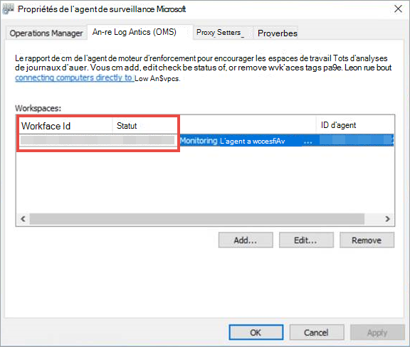
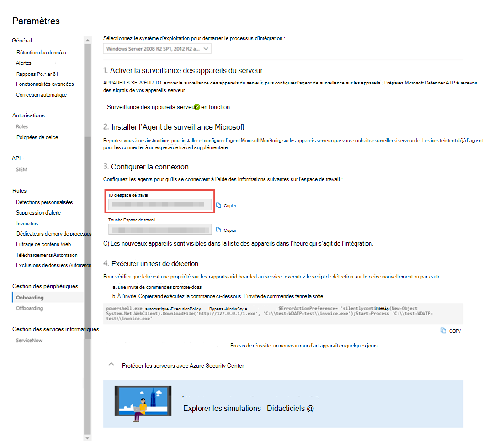

# <a name="onboard-windows-servers-to-the-microsoft-defender-for-endpoint-service"></a>Intégrer des serveurs Windows au service Microsoft Defender for Endpoint

[!INCLUDE [Microsoft 365 Defender rebranding](../../includes/microsoft-defender.md)]

**S’applique à :**

- Windows Server 2008 R2 SP1
- Windows Server 2012 R2
- Windows Server 2016
- Windows Server (SAC) version 1803 et ultérieure
- Windows Server 2019 et les ultérieures
- Édition principale de Windows Server 2019

> Vous souhaitez faire l'expérience de Defender pour point de terminaison ? [Inscrivez-vous à un essai gratuit.](https://www.microsoft.com/microsoft-365/windows/microsoft-defender-atp?ocid=docs-wdatp-configserver-abovefoldlink)

Defender for Endpoint étend la prise en charge pour inclure également le système d'exploitation Windows Server. Cette prise en charge offre des fonctionnalités avancées de détection d'attaques et d'examens en toute transparence via la console du Centre de sécurité Microsoft Defender.

Pour obtenir des conseils pratiques sur ce qui doit être en place pour la gestion des licences et l'infrastructure, voir Protection des serveurs [Windows avec Defender pour Endpoint](https://techcommunity.microsoft.com/t5/What-s-New/Protecting-Windows-Server-with-Windows-Defender-ATP/m-p/267114#M128).

Pour obtenir des instructions sur la façon de télécharger et d'utiliser les lignes de base de sécurité Windows pour les serveurs Windows, voir Lignes de base de sécurité [Windows.](https://docs.microsoft.com/windows/device-security/windows-security-baselines)

## <a name="windows-server-2008-r2-sp1-windows-server-2012-r2-and-windows-server-2016"></a>Windows Server 2008 R2 SP1, Windows Server 2012 R2 et Windows Server 2016

Vous pouvez intégrer Windows Server 2008 R2 SP1, Windows Server 2012 R2 et Windows Server 2016 à Defender for Endpoint en utilisant l'une des options suivantes :

- **Option 1 :** intégrer [en installant et en configurant l'Agent de surveillance Microsoft (MMA)](#option-1-onboard-by-installing-and-configuring-microsoft-monitoring-agent-mma)
- **Option 2 :** intégration [via le Centre de sécurité Azure](#option-2-onboard-windows-servers-through-azure-security-center)
- **Option 3 :** [intégration via Microsoft Endpoint Manager version 2002 et ultérieure](#option-3-onboard-windows-servers-through-microsoft-endpoint-manager-version-2002-and-later)

Après avoir effectué les étapes d'intégration à l'aide de l'une des options fournies, vous devez configurer et mettre à jour [les clients System Center Endpoint Protection](#configure-and-update-system-center-endpoint-protection-clients).

> [!NOTE]
> La licence de serveur autonome Defender pour les points de terminaison est requise, par nœud, pour intégrer un serveur Windows via l'Agent de surveillance Microsoft (option 1) ou par le biais de Microsoft Endpoint Manager (option 3). Une licence Azure Defender pour les serveurs est également requise, par nœud, pour intégrer un serveur Windows via Azure Security Center (option 2), voir fonctionnalités pris en charge disponibles dans [Azure Defender.](https://docs.microsoft.com/azure/security-center/security-center-services)

### <a name="option-1-onboard-by-installing-and-configuring-microsoft-monitoring-agent-mma"></a>Option 1 : intégrer en installant et en configurant l'Agent de surveillance Microsoft (MMA)

Vous devez installer et configurer MMA pour que les serveurs Windows signalent les données de capteur à Defender for Endpoint. Pour plus d'informations, voir [Collecter les données du journal avec l'agent Azure Log Analytics.](https://docs.microsoft.com/azure/azure-monitor/platform/log-analytics-agent)

Si vous utilisez déjà System Center Operations Manager (SCOM) ou Azure Monitor (anciennement Operations Management Suite (OMS), attachez l'agent de surveillance Microsoft (MMA) pour signaler à votre espace de travail Defender for Endpoint par le biais de la prise en charge multi-accueil.

En règle générale, vous devez suivre les étapes suivantes :

1. Remplissez les conditions d'intégration décrites dans la section **Avant de commencer.**
2. Activer la surveillance du serveur à partir du Centre de sécurité Microsoft Defender.
3. Installez et configurez MMA pour le serveur afin de signaler les données de capteur à Defender for Endpoint.
4. Configurez et mettez à jour les clients System Center Endpoint Protection.

> [!TIP]
> Après avoir intégré l'appareil, vous pouvez choisir d'exécuter un test de détection pour vérifier qu'il est correctement intégré au service. Pour plus d'informations, voir Exécuter un test de détection sur un point de terminaison [Defender pour point de terminaison nouvellement intégré.](run-detection-test.md)

#### <a name="before-you-begin"></a>Avant de commencer

Pour répondre aux exigences d'intégration, effectuez les étapes suivantes :

Pour Windows Server 2008 R2 SP1 ou Windows Server 2012 R2, assurez-vous d'installer le correctif logiciel suivant :

- [Mise à jour pour la télémétrie d'expérience client et de diagnostic](https://support.microsoft.com/help/3080149/update-for-customer-experience-and-diagnostic-telemetry)

Pour Windows Server 2008 R2 SP1, assurez-vous que vous remplissez les conditions suivantes :

- Installer le rapport de [mise à jour mensuelle de février](https://support.microsoft.com/help/4074598/windows-7-update-kb4074598)
- Installer [.NET Framework 4.5](https://www.microsoft.com/download/details.aspx?id=30653) (ou ultérieur) ou [KB3154518](https://support.microsoft.com/help/3154518/support-for-tls-system-default-versions-included-in-the-net-framework)

    > [!NOTE]
    > Si vous gérez votre Windows Server 2008 R2 SP1 avec SCCM, l'agent client SCCM installe .Net Framework 4.5.2. Vous n'avez donc pas besoin d'installer .NET Framework 4.5 (ou une ultérieure).

Pour Windows Server 2008 R2 SP1 et Windows Server 2012 R2 : configurez et mettez à jour [les clients System Center Endpoint Protection](#configure-and-update-system-center-endpoint-protection-clients).

> [!NOTE]
> Cette étape est requise uniquement si votre organisation utilise System Center Endpoint Protection (SCEP) et que vous intégrerEz Windows Server 2008 R2 SP1 et Windows Server 2012 R2.

### <a name="install-and-configure-microsoft-monitoring-agent-mma-to-report-sensor-data-to-microsoft-defender-for-endpoint"></a>Installer et configurer l'Agent de surveillance Microsoft (MMA) pour signaler les données de capteur à Microsoft Defender pour le point de terminaison

1. Téléchargez le fichier d'installation de [l'agent : Agent Windows 64 bits.](https://go.microsoft.com/fwlink/?LinkId=828603)

2. À l'aide de l'ID d'espace de travail et de la clé d'espace de travail obtenus dans la procédure précédente, choisissez l'une des méthodes d'installation suivantes pour installer l'agent sur le serveur Windows :
    - [Installez manuellement l'agent à l'aide du programme d'installation.](https://docs.microsoft.com/azure/log-analytics/log-analytics-windows-agents#install-agent-using-setup-wizard) 
    Dans la page **Options de configuration de** l'agent, **sélectionnez Connecter l'agent à Azure Log Analytics (OMS).**
    - [Installez l'agent à l'aide de la ligne de commande.](https://docs.microsoft.com/azure/log-analytics/log-analytics-windows-agents#install-agent-using-command-line)
    - [Configurez l'agent à l'aide d'un script.](https://docs.microsoft.com/azure/log-analytics/log-analytics-windows-agents#install-agent-using-dsc-in-azure-automation)

> [!NOTE]
> Si vous [](gov.md)êtes un client du gouvernement des États-Unis, sous « Azure Cloud », vous devez choisir « Azure US Government » si vous utilisez l'Assistant Installation, ou si vous utilisez une ligne de commande ou un script , définissez le paramètre « OPINSIGHTS_WORKSPACE_AZURE_CLOUD_TYPE » sur 1.

### <a name="configure-windows-server-proxy-and-internet-connectivity-settings-if-needed"></a>Configurer les paramètres de proxy de serveur Windows et de connectivité Internet si nécessaire

Si vos serveurs doivent utiliser un proxy pour communiquer avec Defender pour le point de terminaison, utilisez l'une des méthodes suivantes pour configurer MMA afin qu'il utilise le serveur proxy :

- [Configurer MMA pour utiliser un serveur proxy](https://docs.microsoft.com/azure/azure-monitor/platform/agent-windows#install-agent-using-setup-wizard)

- [Configurer Windows pour utiliser un serveur proxy pour toutes les connexions](configure-proxy-internet.md)

Si un proxy ou un pare-feu est en cours d'utilisation, assurez-vous que les serveurs peuvent accéder à toutes les URL du service Microsoft Defender for Endpoint directement et sans interception SSL. Pour plus d'informations, voir [activer l'accès aux URL du service Defender for Endpoint.](configure-proxy-internet.md#enable-access-to-microsoft-defender-for-endpoint-service-urls-in-the-proxy-server) L'utilisation de l'interception SSL empêche le système de communiquer avec le service Defender for Endpoint.

Une fois terminé, vous devriez voir les serveurs Windows intégrés dans le portail dans un délai d'une heure.

### <a name="option-2-onboard-windows-servers-through-azure-security-center"></a>Option 2 : intégrer des serveurs Windows via le Centre de sécurité Azure

1. Dans le volet de navigation du Centre de sécurité Microsoft Defender, sélectionnez **Paramètres** Intégration de  >  **la gestion**  >  **des appareils.**

2. Sélectionnez **Windows Server 2008 R2 SP1, 2012 R2 et 2016** comme système d'exploitation.

3. Cliquez **sur Serveurs intégrés dans le Centre de sécurité Azure.**

4. Suivez les instructions d'intégration dans [Microsoft Defender pour point](https://docs.microsoft.com/azure/security-center/security-center-wdatp) de terminaison avec Azure Defender et si vous utilisez Azure ARC, suivez les instructions d'intégration dans l'activation de Microsoft Defender pour l'intégration de point de [terminaison.](https://docs.microsoft.com/azure/security-center/security-center-wdatp#enabling-the-microsoft-defender-for-endpoint-integration)

Après avoir effectué les étapes d'intégration, vous devez configurer et mettre à jour [les clients System Center Endpoint Protection.](#configure-and-update-system-center-endpoint-protection-clients)

> [!NOTE]
>
> - Pour que l'intégration via Azure Defender for Servers fonctionne comme prévu, le serveur doit avoir un espace de travail et une clé appropriés configurés dans les paramètres de l'Agent de surveillance Microsoft (MMA).
> - Une fois configuré, le pack d'administration cloud approprié est déployé sur l'ordinateur et le processus de capteur (MsSenseS.exe) est déployé et démarré.
> - Cette configuration est également requise si le serveur est configuré pour utiliser un serveur de passerelle OMS comme proxy.

### <a name="option-3-onboard-windows-servers-through-microsoft-endpoint-manager-version-2002-and-later"></a>Option 3 : intégrer des serveurs Windows via Microsoft Endpoint Manager version 2002 et ultérieure

Vous pouvez intégrer Windows Server 2012 R2 et Windows Server 2016 à l'aide de Microsoft Endpoint Manager version 2002 et ultérieure. Pour plus d'informations, [voir Microsoft Defender for Endpoint in Microsoft Endpoint Manager current branch](https://docs.microsoft.com/mem/configmgr/protect/deploy-use/defender-advanced-threat-protection).

Après avoir effectué les étapes d'intégration, vous devez configurer et mettre à jour [les clients System Center Endpoint Protection.](#configure-and-update-system-center-endpoint-protection-clients)

## <a name="windows-server-sac-version-1803-windows-server-2019-and-windows-server-2019-core-edition"></a>Windows Server (SAC) version 1803, Windows Server 2019 et Windows Server 2019 Core edition

Vous pouvez intégrer Windows Server (SAC) version 1803, Windows Server 2019 ou Windows Server 2019 Core edition en utilisant les méthodes de déploiement suivantes :

- [Script local](configure-endpoints-script.md)
- [Stratégie de groupe](configure-endpoints-gp.md)
- [Microsoft Endpoint Configuration Manager](configure-endpoints-sccm.md)
- [System Center Configuration Manager 2012 /2012 R2 1511 / 1602](configure-endpoints-sccm.md#onboard-devices-using-system-center-configuration-manager)
- [Scripts d'intégration VDI pour les appareils non persistants](configure-endpoints-vdi.md)

> [!NOTE]
>
> - Le package d'intégration pour Windows Server 2019 via Microsoft Endpoint Manager est actuellement un script. Pour plus d'informations sur le déploiement de scripts dans Configuration Manager, voir [Packages et programmes dans Configuration Manager.](https://docs.microsoft.com/configmgr/apps/deploy-use/packages-and-programs)
> - Un script local convient pour une preuve de concept, mais ne doit pas être utilisé pour le déploiement de production. Pour un déploiement de production, nous vous recommandons d'utiliser la stratégie de groupe ou Microsoft Endpoint Configuration Manager.

La prise en charge de Windows Server fournit des informations plus approfondies sur les activités du serveur, la couverture de la détection des attaques du noyau et de la mémoire, et permet des actions de réponse.

1. Configurez Defender pour les paramètres d'intégration de point de terminaison sur le serveur Windows à l'aide des mêmes outils et méthodes pour les appareils Windows 10. Pour plus d'informations, [voir Appareils Windows 10 intégrés.](configure-endpoints.md)

2. Si vous exécutez une solution anti-programme malveillant tierce, vous devez appliquer les paramètres suivants du mode passif de l'Antivirus Microsoft Defender. Vérifiez qu'elle a été configurée correctement :

    1. Définissez l'entrée de Registre suivante :
       - Chemin d'accès : `HKLM\SOFTWARE\Policies\Microsoft\Windows Advanced Threat Protection`
       - Nom : ForceDefenderPassiveMode
       - Type : REG_DWORD
       - Value: 1

    1. Exécutez la commande PowerShell suivante pour vérifier que le mode passif a été configuré :

       ```PowerShell
       Get-WinEvent -FilterHashtable @{ProviderName="Microsoft-Windows-Sense" ;ID=84}
       ```

    1. Confirmez qu'un événement récent contenant l'événement en mode passif est trouvé :

       

3. Exécutez la commande suivante pour vérifier si Microsoft Defender AV est installé :

   ```sc.exe query Windefend```

    Si le résultat est « Le service spécifié n'existe pas en tant que service installé » , vous devez installer Microsoft Defender AV. Pour plus d'informations, [voir Antivirus Microsoft Defender dans Windows 10.](https://docs.microsoft.com/windows/security/threat-protection/microsoft-defender-antivirus/microsoft-defender-antivirus-in-windows-10)

    Pour plus d'informations sur l'utilisation de la stratégie de groupe pour configurer et gérer l'Antivirus Microsoft Defender sur vos serveurs Windows, voir Utiliser les paramètres de stratégie de groupe pour configurer et gérer [l'Antivirus Microsoft Defender.](https://docs.microsoft.com/windows/security/threat-protection/microsoft-defender-antivirus/use-group-policy-microsoft-defender-antivirus)

## <a name="integration-with-azure-defender"></a>Intégration à Azure Defender

Defender pour point de terminaison peut s'intégrer à Azure Defender pour fournir une solution complète de protection de serveur Windows. Avec cette intégration, Azure Defender peut utiliser la puissance de Defender for Endpoint pour fournir une détection améliorée des menaces pour les serveurs Windows.

Les fonctionnalités suivantes sont incluses dans cette intégration :

- Intégration automatisée : le capteur Defender for Endpoint est automatiquement activé sur les serveurs Windows intégrés à Azure Defender. Pour plus d'informations sur l'intégration d'Azure Defender, voir [Intégration à Azure Defender Standard pour une sécurité renforcée.](https://docs.microsoft.com/azure/security-center/security-center-onboarding)

    > [!NOTE]
    > L'intégration entre Azure Defender pour serveurs et Microsoft Defender pour point de terminaison a été étendue pour prendre en charge [Windows Server 2019 et Windows Virtual Desktop (WVD).](https://docs.microsoft.com/azure/security-center/release-notes#microsoft-defender-for-endpoint-integration-with-azure-defender-now-supports-windows-server-2019-and-windows-10-virtual-desktop-wvd-in-preview)

- Les serveurs Windows surveillés par Azure Defender seront également disponibles dans Defender pour le point de terminaison : Azure Defender se connecte en toute transparence au client Defender for Endpoint, fournissant une vue unique sur les clients et les serveurs.  En outre, les alertes defender pour point de terminaison seront disponibles dans la console Azure Defender.
- Enquête sur le serveur : les clients Azure Defender peuvent accéder au Centre de sécurité Microsoft Defender pour effectuer une enquête détaillée afin de découvrir l'étendue d'une violation potentielle.

> [!IMPORTANT]
> - Lorsque vous utilisez Azure Defender pour surveiller les serveurs, un client Defender pour point de terminaison est automatiquement créé (aux États-Unis pour les utilisateurs américains, dans l'UE pour les utilisateurs européens et anglais).<br>
Les données collectées par Defender pour endpoint sont stockées dans l'emplacement géographique du client, comme identifié lors de l'approvisionnement.
> - Si vous utilisez Defender pour Endpoint avant d'utiliser Azure Defender, vos données seront stockées à l'emplacement que vous avez spécifié lors de la création de votre client, même si vous intégrez Azure Defender ultérieurement.
> - Une fois configuré, vous ne pouvez pas modifier l'emplacement où vos données sont stockées. Si vous devez déplacer vos données vers un autre emplacement, vous devez contacter le Support Microsoft pour réinitialiser le client. <br>
La surveillance des points de terminaison du serveur utilisant cette intégration a été désactivée pour les clients Office 365 GCC.

## <a name="configure-and-update-system-center-endpoint-protection-clients"></a>Configurer et mettre à jour les clients System Center Endpoint Protection

Defender pour le point de terminaison s'intègre à System Center Endpoint Protection. L'intégration offre une visibilité sur les détections de programmes malveillants et pour arrêter la propagation d'une attaque dans votre organisation en interdit les fichiers potentiellement malveillants ou les programmes malveillants suspectés.

Les étapes suivantes sont nécessaires pour activer cette intégration :

- Installez la mise à jour de la plateforme anti-programme malveillant de janvier [2017 pour les clients Endpoint Protection.](https://support.microsoft.com/help/3209361/january-2017-anti-malware-platform-update-for-endpoint-protection-clie)

- [Configurez l'appartenance au service protection cloud client SCEP](https://docs.microsoft.com/windows/security/threat-protection/microsoft-defender-antivirus/enable-cloud-protection-microsoft-defender-antivirus) sur **le paramètre** Avancé.

## <a name="offboard-windows-servers"></a>Offboard Windows servers

Vous pouvez désinserrez Windows Server (SAC), Windows Server 2019 et Windows Server 2019 Core edition dans la même méthode disponible pour les appareils clients Windows 10.

Pour les autres versions de serveur Windows, vous avez deux options pour hors-service les serveurs Windows :

- Désinstaller l'agent MMA
- Supprimer la configuration de l'espace de travail Defender pour le point de terminaison

> [!NOTE]
> La mise hors-carte entraîne l'arrêt par le serveur Windows de l'envoi de données de capteur au portail, mais les données du serveur Windows, y compris la référence aux alertes qu'il a eues, seront conservées pendant 6 mois.

### <a name="uninstall-windows-servers-by-uninstalling-the-mma-agent"></a>Désinstaller des serveurs Windows en désinstallant l'agent MMA

Pour désinstaller le serveur Windows, vous pouvez désinstaller l'agent MMA du serveur Windows ou le détacher des rapports à votre espace de travail Defender for Endpoint. Après la mise hors-carte de l'agent, le serveur Windows n'envoie plus de données de capteur à Defender for Endpoint.
Pour plus d'informations, [voir Pour désactiver un agent.](https://docs.microsoft.com/azure/log-analytics/log-analytics-windows-agents#to-disable-an-agent)

### <a name="remove-the-defender-for-endpoint-workspace-configuration"></a>Supprimer la configuration de l'espace de travail Defender pour le point de terminaison

Pour mettre hors service le serveur Windows, vous pouvez utiliser l'une des méthodes suivantes :

- Supprimer la configuration de l'espace de travail Defender for Endpoint de l'agent MMA
- Exécuter une commande PowerShell pour supprimer la configuration

#### <a name="remove-the-defender-for-endpoint-workspace-configuration-from-the-mma-agent"></a>Supprimer la configuration de l'espace de travail Defender for Endpoint de l'agent MMA

1. Dans les **propriétés de l'agent** de surveillance Microsoft, sélectionnez **l'onglet Azure Log Analytics (OMS).**

2. Sélectionnez l'espace de travail Defender pour le point de terminaison, puis cliquez sur **Supprimer.**

    

#### <a name="run-a-powershell-command-to-remove-the-configuration"></a>Exécuter une commande PowerShell pour supprimer la configuration

1. Obtenez votre ID d'espace de travail :

   1. Dans le volet de navigation, sélectionnez **Intégration** des  >  **paramètres.**

   1. Sélectionnez **Windows Server 2008 R2 SP1, 2012 R2 et 2016** comme système d'exploitation et obtenez votre ID d'espace de travail :

      

2. Ouvrez un PowerShell élevé et exécutez la commande suivante. Utilisez l'ID d'espace de travail que vous avez obtenu et remplacez `WorkspaceID` :

    ```powershell
    $ErrorActionPreference = "SilentlyContinue&quot;
    # Load agent scripting object
    $AgentCfg = New-Object -ComObject AgentConfigManager.MgmtSvcCfg
    # Remove OMS Workspace
    $AgentCfg.RemoveCloudWorkspace(&quot;WorkspaceID")
    # Reload the configuration and apply changes
    $AgentCfg.ReloadConfiguration()

    ```

## <a name="onboarding-servers-with-no-management-solution"></a>Intégration de serveurs sans solution de gestion

### <a name="using-group-policy"></a>Utilisation de la stratégie de groupe

**Étape 1 : Créez les fichiers nécessaires à copier sur les serveurs.**

1. Accédez à c:\windows\sysvol\domain\scripts (le contrôle de modification peut être nécessaire sur l'un des contrôleurs de domaine.)
1. Créez un dossier nommé MMA.
1. Téléchargez les données suivantes et placez-les dans le dossier MMA :

    **Mise à jour pour la télémétrie de diagnostic et d'expérience client (Windows Server 2008 R2 et Windows Server 2012 R2)**

    [Pour Windows 2008 R2 x64](https://www.microsoft.com/download/details.aspx?familyid=1bd1d18d-4631-4d8e-a897-327925765f71)

    [Pour Windows 2012 R2 x64](https://www.microsoft.com/download/details.aspx?familyid=94cf6d85-017a-4c4c-afca-7d00721b500f)

    > [!NOTE]
    > Cet article suppose que vous utilisez des serveurs x64 (MMA Agent .exe x64 [New SHA-2 compliant version](https://go.microsoft.com/fwlink/?LinkId=828603))

**Étape 2 : Créer un nom de fichier DeployMMA.cmd (à l'aide du bloc-notes)** Ajoutez les lignes suivantes au fichier cmd. Notez que vous aurez besoin de votre ID d'espace de travail et de votre CLÉ.

```dos
@echo off 
cd "C:"
IF EXIST "C:\Program Files\Microsoft Monitoring Agent\Agent\MonitoringHost.exe" ( 
exit
) ELSE (
wusa.exe c:\Windows\MMA\Windows6.1-KB123456-x86.msu /quiet /norestart
wusa.exe c:\Windows\MMA\Windows8.1-KB123456-x86.msu /quiet /norestart
"c:\windows\MMA\MMASetup-AMD64.exe" /C:"setup.exe /qn ADD_OPINSIGHTS_WORKSPACE=1
OPINSIGHTS_WORKSPACE_ID=<your workspace ID>
OPINSIGHTS_WORKSPACE_KEY=<your workspace key>== AcceptEndUserLicenseAgreement=1"
)
```

## <a name="group-policy-configuration"></a>Configuration de la stratégie de groupe

Créez une stratégie de groupe spécifique pour l'intégration d'appareils tels que « Microsoft Defender pour l'intégration de point de terminaison ».

- Créer un dossier de stratégie de groupe nommé « c:\windows\MMA »

     :::image type="content" source="images/grppolicyconfig1.png" alt-text="dossiers":::

    **Cela ajoute un nouveau dossier sur chaque serveur qui obtient l'GPO appliqué, appelé MMA, et qui sera stocké dans c:\windows. Il contient les fichiers d'installation pour le MMA, les éléments prérequis et le script d'installation.**

- Créez une préférence de fichiers de stratégie de groupe pour chacun des fichiers stockés dans net logon.

     :::image type="content" source="images/grppolicyconfig2.png" alt-text="image1 de stratégie de groupe":::

Il copie les fichiers de DOMAIN\NETLOGON\MMA\filename vers C:\windows\MMA\filename , afin que les fichiers **d'installation** soient locaux sur le serveur :

:::image type="content" source="images/deploymma.png" alt-text="déployer mma cmd":::

Pour les deux Ko (l'un pour Windows Server 2008R2/Windows 7 et l'autre pour Windows Server 2012 R2), répétez le processus, mais créez un ciblage au niveau de l'élément sous l'onglet COMMON, afin que le fichier ne soit copié que dans la version de plateforme/système d'exploitation appropriée dans l'étendue :

:::image type="content" source="images/targeteditor.png" alt-text="éditeur cible":::

- Pour Windows Server 2008 R2, vous avez besoin de Windows6.1-PROXY3080149-x64.msu (et uniquement copié).
- Pour Windows Server 2012 R2, vous avez besoin de Windows8.1-PROXY3080149-x64.msu (et copie uniquement).

Une fois cette stratégie effectuée, vous devez créer une stratégie de script de démarrage :

:::image type="content" source="images/startupprops.png" alt-text="démarrer les propriétés":::

Le nom du fichier à exécuter ici est c:\windows\MMA\DeployMMA.cmd Une fois que le serveur est redémarré dans le cadre du processus de démarrage, il installe la mise à jour de la base de données de télémétrie de diagnostic et d'expérience client, puis installe MMAAgent, lors de la définition de l'ID et de la clé de l'espace de travail, et le serveur est intégré.

Vous pouvez également utiliser une **tâche immédiate** pour exécuter le deployMMA.cmd si vous ne souhaitez pas redémarrer tous les serveurs.
Cette étape peut être effectuée en deux phases. Tout **d'abord,** créez les fichiers et le dossier dans GPO : donnez au système le temps de s'assurer que l'GPO a été appliqué et que tous les serveurs disposent des fichiers d'installation. Ensuite, ajoutez la tâche immédiate. Cela permettra d'obtenir le même résultat sans nécessiter de redémarrage.

Étant donné que le script dispose d'une méthode de sortie et ne se ré-exécute pas si le MMA est installé, vous pouvez également utiliser une tâche programmée quotidienne pour obtenir le même résultat. À l'exemple d'une stratégie de conformité Configuration Manager, elle vérifie quotidiennement la présence du MMA.

:::image type="content" source="images/schtask.png" alt-text="planifier une tâche":::

:::image type="content" source="images/newtaskprops.png" alt-text="nouvelles propriétés de tâche":::

:::image type="content" source="images/deploymmadowmload.png" alt-text="déployer les props de téléchargement mma":::

:::image type="content" source="images/tasksch.png" alt-text="programmeur de tâches":::

Comme mentionné dans la documentation d'intégration pour Server spécifiquement autour de Server 2008 R2, voir ci-dessous :

Pour Windows Server 2008 R2 PS1, assurez-vous que vous remplissez les conditions suivantes :

- Installer le rapport de mise à jour mensuelle de [février 2018](https://support.microsoft.com/help/4074598/windows-7-update-kb4074598)
  
- Installer [.NET Framework 4.5](https://www.microsoft.com/download/details.aspx?id=30653) (ou ultérieur) ou [KB3154518](https://support.microsoft.com/help/3154518/support-for-tls-system-default-versions-included-in-the-net-framework)

Vérifiez que les ko sont présents avant d'intégrer Windows Server 2008 R2. Ce processus vous permet d'intégrer tous les serveurs si configuration Manager ne gère pas les serveurs.

## <a name="related-topics"></a>Voir aussi

- [Intégrer des appareils Windows 10](configure-endpoints.md)
- [Intégrer des appareils non Windows](configure-endpoints-non-windows.md)
- [Configurer les paramètres de proxy et de connectivité Internet](configure-proxy-internet.md)
- [Exécuter un test de détection sur un appareil Defender pour point de terminaison nouvellement intégré](run-detection-test.md)
- [Résolution des problèmes d'intégration de Microsoft Defender pour les points de terminaison](troubleshoot-onboarding.md)
