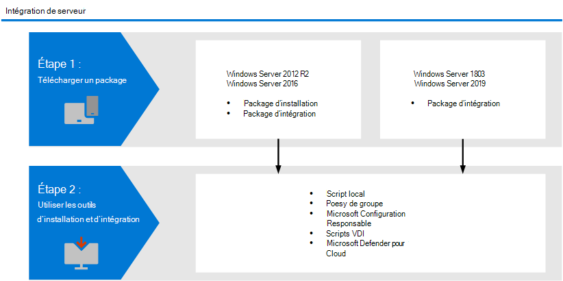

# <a name="onboard-windows-servers-to-the-microsoft-defender-for-endpoint-service"></a>Intégrer Windows serveurs au service Microsoft Defender for Endpoint

[!INCLUDE [Microsoft 365 Defender rebranding](../../includes/microsoft-defender.md)]

**S’applique à :**

- Windows Server 2012 R2
- Windows Server 2016
- Windows Server Semi-Annual Enterprise Channel
- Windows Server 2019 et les ultérieures
- Windows Server 2019 Core Edition
- Windows Server 2022
- [Microsoft Defender pour point de terminaison](https://go.microsoft.com/fwlink/p/?linkid=2154037)

[!include[Prerelease information](../../includes/prerelease.md)]

> Vous souhaitez faire l’expérience de Defender for Endpoint ? [Inscrivez-vous pour bénéficier d’un essai gratuit.](https://signup.microsoft.com/create-account/signup?products=7f379fee-c4f9-4278-b0a1-e4c8c2fcdf7e&ru=https://aka.ms/MDEp2OpenTrial?ocid=docs-wdatp-configserver-abovefoldlink)

Defender for Endpoint étend la prise en charge pour inclure également le Windows d’exploitation Server. Cette prise en charge offre des fonctionnalités avancées de détection d’attaques et d’examens en toute transparence via Microsoft 365 Defender console. La prise en charge de Windows Server fournit des informations plus approfondies sur les activités du serveur, la couverture de la détection des attaques du noyau et de la mémoire, et permet des actions de réponse.

Cette rubrique décrit comment intégrer des serveurs Windows spécifiques à Microsoft Defender for Endpoint.

Pour obtenir des instructions sur la façon de télécharger et d’utiliser Sécurité Windows de référence pour Windows serveurs, voir Sécurité Windows [baselines](/windows/device-security/windows-security-baselines).

## <a name="windows-server-onboarding-overview"></a>vue d’ensemble Windows’intégration de serveur Windows server

Vous devez effectuer les étapes générales suivantes pour intégrer correctement les serveurs.



**Windows Server 2012 R2 et Windows Server 2016 (prévisualisation)**

>[!IMPORTANT]
> Vous devez activer les fonctionnalités d’aperçu dans la section Points de terminaison de Microsoft 365 Defender pour utiliser cette fonctionnalité. Accédez à [Microsoft 365 Defender > Paramètres > points de terminaison > fonctionnalités](https://security.microsoft.com/preferences2/integration) avancées et activer les fonctionnalités d’aperçu.

- Télécharger les packages d’installation et d’intégration
- Appliquer le package d’installation
- Suivez les étapes d’intégration pour l’outil correspondant

**Windows Server Semi-Annual Enterprise Channel and Windows Server 2019**

- Télécharger le package d’intégration
- Suivez les étapes d’intégration pour l’outil correspondant

>[!IMPORTANT]
>Pour pouvoir acheter Microsoft Defender pour Endpoint Server SKU, vous devez avoir déjà acheté un minimum combiné des licences d’abonnement suivantes, Windows E5/A5, Microsoft 365 E5/A5 ou Microsoft 365 E5 Sécurité.  Pour plus d’informations sur les licences, consultez les conditions [d’utilisation du produit](https://www.microsoft.com/licensing/terms/productoffering/MicrosoftDefenderforEndpointServer/all).  


### <a name="new-windows-server-2012-r2-and-2016-functionality-in-the-modern-unified-solution-preview"></a>Nouvelles Windows Server 2012 R2 et 2016 dans la solution unifiée moderne (prévisualisation)

L’implémentation précédente de l’intégration Windows Server 2012 R2 et Windows Server 2016 nécessitait l’utilisation de Microsoft Monitoring Agent (MMA).

Le nouveau package de solution unifiée facilite l’intégration des serveurs en supprimant les dépendances et les étapes d’installation. En outre, ce package de solution unifiée présente les principales améliorations suivantes :

- [Antivirus Microsoft Defender](/microsoft-365/security/defender-endpoint/microsoft-defender-antivirus-windows) protection [nouvelle génération](/microsoft-365/security/defender-endpoint/next-generation-protection) pour Windows Server 2012 R2
- [Règles de réduction de la surface d’attaque (ASR)](/microsoft-365/security/defender-endpoint/attack-surface-reduction-rules)
- [Protection du réseau](/microsoft-365/security/defender-endpoint/network-protection)
- [Accès contrôlé aux dossiers](/microsoft-365/security/defender-endpoint/controlled-folders)
- [Blocage des applications potentiellement indésirables (PUA)](/microsoft-365/security/defender-endpoint/detect-block-potentially-unwanted-apps-microsoft-defender-antivirus)
- [Fonctionnalités de détection améliorées](/microsoft-365/security/defender-endpoint/overview-endpoint-detection-response)
- [Fonctionnalités de réponse étendues sur](/microsoft-365/security/defender-endpoint/respond-machine-alerts) les appareils et les [fichiers](/microsoft-365/security/defender-endpoint/respond-file-alerts)
- [PEPT mode blocage](/microsoft-365/security/defender-endpoint/edr-in-block-mode)
- [Réponse en direct](/microsoft-365/security/defender-endpoint/live-response)
- [Examen et réponse automatisés (AIR)](/microsoft-365/security/defender-endpoint/automated-investigations)
- [Protection contre la falsification](/microsoft-365/security/defender-endpoint/prevent-changes-to-security-settings-with-tamper-protection)

Selon le serveur que vous intégrerez, la solution unifiée installe Antivirus Microsoft Defender et/ou le capteur PEPT.. Le tableau suivant indique quel composant est installé et ce qui est intégré par défaut.

|Version du serveur|AV|PEPT|
|----|----|----|
|Windows Server 2012 R2 SP1|||
|Windows Server 2016|Intégré||
|Windows Server 2019 ou une ultérieure|Intégré|Intégré|

Si vous avez précédemment intégré vos serveurs à l’aide de MMA, suivez les instructions fournies dans la [migration](server-migration.md) de serveur pour migrer vers la nouvelle solution.

>[!NOTE]
>Bien que cette méthode d’intégration Windows Server 2012 R2 et Windows Server 2016 soit en prévisualisation, vous pouvez choisir de continuer à utiliser la méthode d’intégration précédente à l’aide de Microsoft Monitoring Agent (MMA). Pour plus d’informations, [voir Installer et configurer des points de terminaison à l’aide de MMA](onboard-downlevel.md#install-and-configure-microsoft-monitoring-agent-mma).

#### <a name="known-issues-and-limitations-on-the-new-unified-solution-package-for-windows-server-2012-r2-and-2016"></a>Problèmes connus et limitations sur le nouveau package de solution unifiée pour Windows Server 2012 R2 et 2016

Les spécificités suivantes s’appliquent au nouveau package de solution unifiée Windows Server 2012 R2 et 2016 :

- Assurez-vous que les exigences de connectivité spécifiées dans Activer l’accès aux [URL de service Microsoft Defender pour](/microsoft-365/security/defender-endpoint/configure-proxy-internet?enable-access-to-microsoft-defender-for-endpoint-service-urls-in-the-proxy-server) les points de terminaison dans le serveur proxy sont remplies. Ils sont équivalents à ceux de Windows Server 2019. 
- Nous enquêtons sur un problème de connectivité Windows Server 2012 R2 au cloud lorsque telemetryProxyServer statique est utilisé et que les URL de liste de révocation de certificats ne sont pas accessibles à partir du contexte du compte SYSTÈME. L’atténuation immédiate consiste à utiliser une autre option de proxy qui fournit une telle connectivité ou à configurer le même proxy via le paramètre WinInet sur le contexte du compte SYSTÈME.
- Auparavant, l’utilisation de la Microsoft Monitoring Agent (MMA) sur Windows Server 2016 et en dessous était autorisée pour la passerelle OMS/Log Analytics afin de fournir une connectivité aux services cloud de Defender. La nouvelle solution, telle que Microsoft Defender pour endpoint sur Windows Server 2019, Windows Server 2022 et Windows 10, ne prend pas en charge cette passerelle.

- Sur Windows Server 2016, vérifiez que Antivirus Microsoft Defender est installé, qu’il est actif et à jour. Vous pouvez télécharger et installer la dernière version de la plateforme à l’aide Windows Update. Vous pouvez également télécharger le package de mise à jour manuellement à partir du catalogue [Microsoft Update ou](https://www.catalog.update.microsoft.com/Search.aspx?q=KB4052623) de [MMPC](https://go.microsoft.com/fwlink/?linkid=870379&arch=x64).  
- Sur Windows Server 2012 R2, il n’existe aucune interface utilisateur pour Antivirus Microsoft Defender. En outre, l’interface utilisateur sur Windows Server 2016 autorise uniquement les opérations de base. Pour effectuer des opérations localement sur un appareil, reportez-vous à Gérer Microsoft Defender pour le point de terminaison avec [PowerShell, WMI et MPCmdRun.exe](/microsoft-365/security/defender-endpoint/manage-mde-post-migration-other-tools). Par conséquent, les fonctionnalités qui s’appuient spécifiquement sur l’interaction utilisateur, telles que l’endroit où l’utilisateur est invité à prendre une décision ou à effectuer une tâche spécifique, risquent de ne pas fonctionner comme prévu. Il est recommandé de désactiver ou de ne pas activer l’interface utilisateur, ni d’exiger une interaction utilisateur sur un serveur géré, car cela peut avoir un impact sur la fonctionnalité de protection.
- Toutes les règles de Réduction de la surface d’attaque ne sont pas disponibles sur tous les systèmes d’exploitation. Consultez [les règles de réduction de la surface d’attaque (ASR](/microsoft-365/security/defender-endpoint/attack-surface-reduction-rules)).
- Pour activer la [Protection du réseau](/microsoft-365/security/defender-endpoint/network-protection), une configuration supplémentaire est requise :
  - `Set-MpPreference -EnableNetworkProtection Enabled`
  - `Set-MpPreference -AllowNetworkProtectionOnWinServer 1`
  - `Set-MpPreference -AllowNetworkProtectionDownLevel 1`
  - `Set-MpPreference -AllowDatagramProcessingOnWinServer 1`

  En outre, sur les ordinateurs avec un volume élevé de trafic réseau, les tests de performances dans votre environnement sont vivement recommandés avant d’activer cette fonctionnalité à grande étendue. Vous devrez peut-être tenir compte de la consommation supplémentaire de ressources.
- Sur Windows Server 2012 R2, les événements réseau peuvent ne pas être remplis dans la chronologie. This issue requires a Windows Update released as part of the [October 12, 2021 monthly rollup (KB5006714)](https://support.microsoft.com/topic/october-12-2021-kb5006714-monthly-rollup-4dc4a2cd-677c-477b-8079-dcfef2bda09e).
- Les mises à niveau du système d’exploitation ne sont pas pris en charge. Désinstallez ensuite avant la mise à niveau.
- Les exclusions automatiques pour *les* rôles serveur ne sont pas Windows Server 2012 R2 ; toutefois, les exclusions intégrées pour les fichiers de système d’exploitation le sont. Pour plus d’informations sur l’ajout d’exclusions, voir [recommandations](https://support.microsoft.com/topic/virus-scanning-recommendations-for-enterprise-computers-that-are-running-currently-supported-versions-of-windows-kb822158-c067a732-f24a-9079-d240-3733e39b40bc) d’analyse antivirus pour Enterprise ordinateurs exécutant actuellement des versions de Windows.
- Actuellement, si vous choisissez de désinstaller et de désinstaller la solution moderne unifiée et de réinstaller le capteur PEPT MMA précédent, `MsSenseS.exe` vous pouvez rencontrer des incidents répétés. 

Pour contourner ce besoin, supprimez les clés de Registre suivantes si elles existent :
- `HKEY_LOCAL_MACHINE\SYSTEM\CurrentControlSet\Control\WMI\Security\fdedb2b8-61e4-4a7e-8b15-abf214a08fcc`
- `HKEY_LOCAL_MACHINE\SYSTEM\CurrentControlSet\Control\WMI\Security\c60418cc-7e07-400f-ae3b-d521c5dbd96f`

Vous pouvez utiliser les commandes suivantes :

```cmd
reg delete HKEY_LOCAL_MACHINE\SYSTEM\CurrentControlSet\Control\WMI\Security /v fdedb2b8-61e4-4a7e-8b15-abf214a08fcc /f
reg delete HKEY_LOCAL_MACHINE\SYSTEM\CurrentControlSet\Control\WMI\Security /v c60418cc-7e07-400f-ae3b-d521c5dbd96f /f
```
Aucun redémarrage n’est requis.


<a name="integration-with-azure-defender"></a>

## <a name="integration-with-microsoft-defender-for-cloud"></a>Intégration de à Microsoft Defender pour le cloud

Microsoft Defender pour le point de terminaison s’intègre en toute transparence à Microsoft Defender pour le Cloud. Vous pouvez intégrer automatiquement des serveurs, faire en effet apparaître les serveurs surveillés par Azure Defender dans Defender pour le point de terminaison et mener des enquêtes détaillées en tant que client Microsoft Defender pour le Cloud.

Pour plus d’informations, [voir Intégration à Microsoft Defender pour le cloud](azure-server-integration.md).

> [!NOTE]
> Pour Windows Server 2012 R2 et 2016 exécutant la prévisualisation de la solution unifiée moderne, l’intégration à Microsoft Defender pour le cloud / Microsoft Defender pour les serveurs pour les alertes et le déploiement automatisé n’est pas encore disponible. Même si vous pouvez installer manuellement la nouvelle solution sur ces ordinateurs, aucune alerte ne s’affichera dans Microsoft Defender pour le Cloud.

> [!NOTE]
> - L’intégration entre Microsoft Defender pour les serveurs et Microsoft Defender pour point de terminaison a été étendue pour prendre en charge Windows Server 2022, [Windows Server 2019 et Windows Virtual Desktop (WVD).](/azure/security-center/release-notes#microsoft-defender-for-endpoint-integration-with-azure-defender-now-supports-windows-server-2019-and-windows-10-virtual-desktop-wvd-in-preview)
> - La surveillance des points de terminaison de serveur utilisant cette intégration a été désactivée pour Office 365 Cloud de la communauté du secteur public clients.

## <a name="windows-server-2012-r2-and-windows-server-2016"></a>Windows Server 2012 R2 et Windows Server 2016

> [!NOTE]
> Bien que cette méthode d’intégration Windows Server 2012 R2 et Windows Server 2016 soit en prévisualisation, vous pouvez choisir de continuer à utiliser la méthode d’intégration précédente à l’aide de Microsoft Monitoring Agent (MMA). Pour plus d’informations, [voir Installer et configurer des points de terminaison à l’aide de MMA](onboard-downlevel.md#install-and-configure-microsoft-monitoring-agent-mma).

### <a name="prerequisites"></a>Configuration requise

**Conditions préalables pour Windows Server 2012 R2**

Si vous avez entièrement mis à jour vos ordinateurs avec [le dernier package](https://support.microsoft.com/topic/october-12-2021-kb5006714-monthly-rollup-4dc4a2cd-677c-477b-8079-dcfef2bda09e) de déploiement mensuel, aucune condition préalable supplémentaire **n’est** requise.

Le package d’installation vérifie si les composants suivants ont déjà été installés via une mise à jour :

- [Mise à jour pour la télémétrie d’expérience client et de diagnostic](https://support.microsoft.com/help/3080149/update-for-customer-experience-and-diagnostic-telemetry)
- [Mise à jour pour universal C Runtime dans Windows](https://support.microsoft.com/topic/update-for-universal-c-runtime-in-windows-c0514201-7fe6-95a3-b0a5-287930f3560c)

**Conditions préalables pour Windows Server 2016** 

Outre la mise à jour complète de l’ordinateur avec la dernière mise à jour cumulative(LCU), vérifiez que Antivirus Microsoft Defender est installé, qu’il est actif et à jour. Vous pouvez télécharger et installer la dernière version de la plateforme à l’aide Windows Update. Vous pouvez également télécharger le package de mise à jour manuellement à partir du catalogue [Microsoft Update ou](https://www.catalog.update.microsoft.com/Search.aspx?q=KB4052623) de [MMPC](https://go.microsoft.com/fwlink/?linkid=870379&arch=x64). 

> [!NOTE]
> Pour mettre à jour correctement la version intégrée de Windows Defender, dont le numéro de version commence à la version 4.10, vers la dernière plateforme disponible, une mise à jour de pile de maintenance doit avoir été appliquée, ainsi que la dernière mise à jour cumulative (LCU) égale ou ultérieure au 20 septembre 2018— KB4457127 (os Build 14393.2515).

**Conditions préalables à l’exécution avec des solutions de sécurité tierces**

Si vous avez l’intention d’utiliser une solution anti-programme malveillant tierce, vous devez exécuter Antivirus Microsoft Defender en mode passif. N’oubliez pas de définir le mode passif pendant le processus d’installation et d’intégration.

**Nouveau package de mise à jour pour Microsoft Defender pour endpoint Windows Server 2012 R2 et 2016**

Pour recevoir des améliorations et des correctifs réguliers pour le composant capteur PEPT, assurez-vous que la mise à jour Windows [KB5005292](https://go.microsoft.com/fwlink/?linkid=2168277) est appliquée ou approuvée. En outre, pour mettre à jour les composants de protection, voir [Gérer Antivirus Microsoft Defender mises à jour et appliquer les lignes de base](/microsoft-365/security/defender-endpoint/manage-updates-baselines-microsoft-defender-antivirus#monthly-platform-and-engine-versions).

### <a name="onboarding-steps-summary"></a>Résumé des étapes d’intégration

- ÉTAPE 1 : Télécharger [les packages d’installation et d’intégration](#step-1-download-installation-and-onboarding-packages)
- ÉTAPE 2 : Appliquer [le package d’installation et d’intégration](#step-2-apply-the-installation-and-onboarding-package)
- ÉTAPE 3 : Effectuer [les étapes d’intégration](#step-3-complete-the-onboarding-steps) 


### <a name="step-1-download-installation-and-onboarding-packages"></a>ÉTAPE 1 : Télécharger les packages d’installation et d’intégration

Vous devez télécharger les packages **d’installation** et **d’intégration** à partir du portail.

> [!div class="mx-imgBorder"]
> 


   > [!NOTE]
   > Sur Windows Server 2012R2, Antivirus Microsoft Defender sera installé par le package d’installation et sera actif, sauf si vous le définissez en mode passif. Sur Windows Server 2016, Antivirus Microsoft Defender doit d’abord être installé en tant que fonctionnalité (voir Basculer vers [MDE](/microsoft-365/security/defender-endpoint/switch-to-mde-phase-2#re-enable-microsoft-defender-antivirus-on-windows-server-2016)) et entièrement mis à jour avant de poursuivre l’installation.
   > 
   > Si vous exécutez une solution anti-programme malveillant non Microsoft, veillez à ajouter des exclusions pour Antivirus Microsoft Defender (à partir de cette liste de processus [Microsoft Defender](https://download.microsoft.com/download/8/a/5/8a51eee5-cd02-431c-9d78-a58b7f77c070/mde-urls.xlsx) sous l’onglet Processus Defender) à la solution non Microsoft avant l’installation.  Il est également recommandé d’ajouter des solutions de sécurité non Microsoft à la liste d’exclusions de l’Antivirus Defender.


Le **package d’installation** contient un fichier MSI qui installe l’agent Microsoft Defender pour Endpoint.

Le **package d’intégration** contient les fichiers suivants :

- `OptionalParamsPolicy` - contient le paramètre qui active la collection d’exemples
- `WindowsDefenderATPOnboardingScript.cmd` - contient le script d’intégration

Pour télécharger les packages, utilisez les étapes suivantes : 

1. In Microsoft 365 Defender, go to **Paramètres > Device Management > Onboarding**.

2. **Sélectionnez Windows Server 2012 R2 et 2016**.

3. **Sélectionnez Télécharger le package d’installation** et enregistrez .msi fichier. 
 
4. **Sélectionnez Télécharger le package d’intégration** et enregistrez .zip fichier.

5. Installez le package d’installation à l’aide de l’une des options d’installation Antivirus Microsoft Defender. L’installation nécessite des autorisations administratives.


### <a name="step-2-apply-the-installation-and-onboarding-package"></a>ÉTAPE 2 : Appliquer le package d’installation et d’intégration
Dans cette étape, vous allez installer les composants de prévention et de détection requis avant d’intégrer votre appareil à l’environnement cloud Microsoft Defender for Endpoint, pour préparer l’ordinateur à l’intégration. Assurez-vous [que toutes les conditions préalables](#prerequisites) ont été remplies. 

   > [!NOTE]
   > Antivirus Microsoft Defender installé et actif, sauf si vous le définissez en mode passif. 

#### <a name="options-to-install-the-microsoft-defender-for-endpoint-packages"></a>Options d’installation des packages Microsoft Defender pour les points de terminaison

Dans la section précédente, vous avez téléchargé un package d’installation. Le package d’installation contient le programme d’installation de tous les composants Microsoft Defender for Endpoint. 

Vous pouvez utiliser l’une des options suivantes pour installer l’agent :
- [Installer à l’aide de la ligne de commande](#install-microsoft-defender-for-endpoint-using-the-command-line)
- [Installer à l’aide d’un script](#install-microsoft-defender-for-endpoint-using-a-script)
- [Appliquer les packages d’installation et d’intégration à l’aide de la stratégie de groupe](#apply-the-microsoft-defender-for-endpoint-installation-and-onboarding-packages-using-group-policy)

##### <a name="install-microsoft-defender-for-endpoint-using-the-command-line"></a>Installer Microsoft Defender pour le point de terminaison à l’aide de la ligne de commande
Utilisez le package d’installation de l’étape précédente pour installer Microsoft Defender pour le point de terminaison. 


Exécutez la commande suivante pour installer Microsoft Defender pour le point de terminaison :

```console
Msiexec /i md4ws.msi /quiet
```

Pour désinstaller, assurez-vous que l’ordinateur est d’abord désint re désint re l aide du script de désint reboardage approprié. Ensuite, utilisez programmes et fonctionnalités du \> Panneau \> de contrôle pour effectuer la désinstallation.

Vous pouvez également exécuter la commande de désinstallation suivante pour désinstaller Microsoft Defender pour le point de terminaison :

```console
Msiexec /x md4ws.msi /quiet
```

Vous devez utiliser le même package que celui utilisé pour l’installation pour que la commande ci-dessus réussisse.

Le `/quiet` commutateur supprime toutes les notifications.

> [!NOTE]
> Antivirus Microsoft Defender ne passe pas automatiquement en mode passif. Vous pouvez choisir de définir Antivirus Microsoft Defender à exécuter en mode passif si vous exécutez une solution antivirus/anti-programme malveillant non-Microsoft. Pour les installations de ligne de commande, `FORCEPASSIVEMODE=1` l’option facultative définit immédiatement le Antivirus Microsoft Defender en mode passif afin d’éviter les interférences. Ensuite, pour vous assurer que l’Antivirus Defender reste en mode passif après l’intégration pour prendre en charge des fonctionnalités telles que PEPT Block, définissez la clé de Registre « ForceDefenderPassiveMode ».

La prise en charge de Windows Server fournit des informations plus approfondies sur les activités du serveur, la couverture de la détection des attaques du noyau et de la mémoire, et permet des actions de réponse.

##### <a name="install-microsoft-defender-for-endpoint-using-a-script"></a>Installer Microsoft Defender pour le point de terminaison à l’aide d’un script

Vous pouvez utiliser le [script d’installation pour](server-migration.md#installer-script) automatiser l’installation, la désinstallation et l’intégration. Pour plus d’informations, voir les instructions de la section suivante pour utiliser le script avec la stratégie de groupe.

##### <a name="apply-the-microsoft-defender-for-endpoint-installation-and-onboarding-packages-using-group-policy"></a>Appliquer les packages d’installation et d’intégration de Microsoft Defender for Endpoint à l’aide de la stratégie de groupe

1. Créez une stratégie de groupe : <br> Ouvrez [la Console de gestion des](/internet-explorer/ie11-deploy-guide/group-policy-and-group-policy-mgmt-console-ie11) **stratégies** de groupe (GPMC), cliquez avec le bouton droit sur Objets de stratégie de groupe à configurer, puis cliquez sur **Nouveau**. Entrez le nom du nouvel GPO dans la boîte de dialogue qui s’affiche, puis cliquez sur **OK**.

2. Ouvrez [la Console](/internet-explorer/ie11-deploy-guide/group-policy-and-group-policy-mgmt-console-ie11) de gestion des stratégies de groupe (GPMC), cliquez avec le bouton droit sur l’objet de stratégie de groupe à configurer, puis cliquez sur **Modifier**.

3. Dans **l’Éditeur de gestion des stratégies** de groupe, allez à **Configuration** ordinateur, puis **Préférences, puis** aux **paramètres du Panneau de configuration**.

4. Cliquez avec le bouton droit **sur Tâches programmées**, pointez sur **Nouveau**, puis cliquez sur **Tâche immédiate (au moins Windows 7).**.

5. Dans la **fenêtre** Tâche qui s’ouvre, allez dans **l’onglet** Général. Sous **Options de sécurité,** cliquez **sur Modifier** l’utilisateur ou le groupe, puis tapez SYSTEM, puis cliquez **sur Vérifier les** noms, **puis OK**. NT AUTHORITY\SYSTEM apparaît en tant que compte d’utilisateur que la tâche exécutera.

6. **Sélectionnez Exécuter, que l’utilisateur soit** connecté ou non et cochez la case Exécuter avec **les privilèges les plus élevés**.

7. Dans le champ Nom, tapez un nom approprié pour la tâche programmée (par exemple, Defender pour le déploiement de point de terminaison).

8. Go to the **Actions** tab and select **New...** **Assurez-vous que démarrer un programme** est sélectionné dans le **champ Action** . Le [script d’installation](server-migration.md#installer-script) gère l’installation et effectue immédiatement l’étape d’intégration une fois l’installation terminée. *SélectionnezC:\Windows\System32\WindowsPowerShell\v1.0\powershell.exe* puis fournissez les arguments :

    ```console
     -ExecutionPolicy RemoteSigned \\servername-or-dfs-space\share-name\install.ps1 -OnboardingScript \\servername-or-dfs-space\share-name\windowsdefenderatponboardingscript.cmd
    ```  

     >[!NOTE]
    >Le paramètre de stratégie d’exécution recommandé est `Allsigned`. Cela nécessite l’importation du certificat de signature du script dans le magasin Éditeurs de confiance de l’ordinateur local si le script s’exécute en tant que SYSTÈME sur le point de terminaison.

    \\Remplacez servername-or-dfs-space\share-name par le chemin d’accès UNC, à l’aide du nom de domaine complet (FQDN) du serveur de fichiers, du fichier *install.ps1* partagé. Le package dmd4ws.msi doit être placé dans le même répertoire.  Assurez-vous également que les autorisations du chemin d’accès UNC autorisent l’accès en lecture au compte d’ordinateur qui installe la plateforme.

   

    Pour les scénarios dans Antivirus Microsoft Defender des solutions anti-programme malveillant autres que Microsoft, ajoutez le paramètre $Passive pour définir le mode passif lors de l’installation.

9. **Sélectionnez OK** et fermez toutes les fenêtres GPMC ouvertes.

10. Pour lier l’GPO à une unité d’organisation, cliquez avec le bouton droit et sélectionnez **Lier un GPO existant**. Dans la boîte de dialogue qui s’affiche, sélectionnez l’objet de stratégie de groupe à lier. Cliquez sur **OK**.

Pour obtenir des paramètres de configuration supplémentaires, voir [Configurer les paramètres de collection d’exemples](configure-endpoints-gp.md#configure-sample-collection-settings) et [autres paramètres de configuration recommandés](configure-endpoints-gp.md#other-recommended-configuration-settings).

### <a name="step-3-complete-the-onboarding-steps"></a>ÉTAPE 3 : Effectuer les étapes d’intégration

Les étapes suivantes ne s’appliquent que si vous utilisez une solution anti-programme malveillant tierce. Vous devez appliquer le paramètre de mode passif Antivirus Microsoft Defender suivant. Vérifiez qu’elle a été configurée correctement :

1. Définissez l’entrée de Registre suivante :
    - Chemin d’accès : `HKLM\SOFTWARE\Policies\Microsoft\Windows Advanced Threat Protection`
    - Nom : `ForceDefenderPassiveMode`
    - Type : `REG_DWORD`
    - Valeur : `1`

2. Exécutez la commande PowerShell suivante pour vérifier que le mode passif a été configuré :

    ```powershell
    Get-WinEvent -FilterHashtable @{ProviderName="Microsoft-Windows-Sense" ;ID=84}
    ```

3. Confirmez qu’un événement récent contenant l’événement en mode passif est trouvé :

    

> [!IMPORTANT]
>
> - Lorsque vous utilisez Microsoft Defender pour le Cloud pour surveiller les serveurs, un client Defender pour endpoint est automatiquement créé (aux États-Unis pour les utilisateurs américains, dans l’UE pour les utilisateurs européens et au Royaume-Uni pour les utilisateurs au Royaume-Uni).
Les données collectées par Defender pour le point de terminaison sont stockées dans l’emplacement géographique du client, comme identifié lors de l’approvisionnement.
> - Si vous utilisez Defender pour endpoint avant d’utiliser Microsoft Defender pour le cloud, vos données seront stockées à l’emplacement que vous avez spécifié lors de la création de votre client, même si vous intégrez Microsoft Defender pour le Cloud ultérieurement.
> - Une fois configuré, vous ne pouvez pas modifier l’emplacement où vos données sont stockées. Si vous devez déplacer vos données vers un autre emplacement, vous devez contacter le Support Microsoft pour réinitialiser le client.
> - Le package d’intégration pour Windows Server 2019 et Windows Server 2022 à Microsoft Endpoint Manager actuellement un script. Pour plus d’informations sur le déploiement de scripts dans Configuration Manager, voir [Packages et programmes dans Configuration Manager](/configmgr/apps/deploy-use/packages-and-programs).
> - Un script local convient pour une preuve de concept, mais ne doit pas être utilisé pour le déploiement de production. Pour un déploiement de production, nous vous recommandons d’utiliser une stratégie de groupe ou Microsoft Endpoint Configuration Manager.


## <a name="windows-server-semi-annual-enterprise-channel-and-windows-server-2019-and-windows-server-2022"></a>Windows Server Semi-Annual Enterprise Channel and Windows Server 2019 et Windows Server 2022

Le package d’intégration pour Windows Server 2019 et Windows Server 2022 à Microsoft Endpoint Manager actuellement un script. Pour plus d’informations sur le déploiement de scripts dans Configuration Manager, voir [Packages et programmes dans Configuration Manager](/configmgr/apps/deploy-use/packages-and-programs).

### <a name="download-package"></a>Télécharger le package

1. In Microsoft 365 Defender, go to **Paramètres > Device Management > Onboarding**.

2. **Sélectionnez Windows Server 1803 et 2019**.

3. Sélectionnez **Télécharger le package**. Enregistrez-le sous WindowsDefenderATPOnboardingPackage.zip.

4. Suivez les étapes fournies dans la section [Terminer les étapes d’intégration](#step-3-complete-the-onboarding-steps) .


## <a name="verify-the-onboarding-and-installation"></a>Vérifier l’intégration et l’installation

Vérifiez que Antivirus Microsoft Defender et Microsoft Defender pour le point de terminaison sont en cours d’exécution.

## <a name="run-a-detection-test-to-verify-onboarding"></a>Exécuter un test de détection pour vérifier l’intégration

Après avoir intégré l’appareil, vous pouvez choisir d’exécuter un test de détection pour vérifier qu’un appareil est correctement intégré au service. Pour plus d’informations, voir [Exécuter un test de détection sur un appareil Microsoft Defender pour point de terminaison nouvellement intégré](run-detection-test.md).

> [!NOTE]
> L’Antivirus Microsoft Defender n’est pas requise, mais elle est recommandée. Si un autre produit fournisseur d’antivirus est la solution de protection de point de terminaison principale, vous pouvez exécuter l’Antivirus Defender en mode passif. Vous pouvez uniquement confirmer que le mode passif est en cours d’exécution après avoir vérifié que le capteur Sense (Microsoft Defender for Endpoint) est en cours d’exécution.

1. Exécutez la commande suivante pour vérifier que Antivirus Microsoft Defender est installé :

    >[!NOTE]
    >Cette étape de verifcation est requise uniquement si vous utilisez Antivirus Microsoft Defender comme solution anti-programme malveillant active.

    `sc.exe query Windefend`


    Si le résultat est « Le service spécifié n’existe pas en tant que service installé », vous devez installer Antivirus Microsoft Defender. 


    Pour plus d’informations sur l’utilisation de la stratégie de groupe pour configurer et gérer des Antivirus Microsoft Defender sur vos serveurs Windows, voir Utiliser les [paramètres](use-group-policy-microsoft-defender-antivirus.md) de stratégie de groupe pour configurer et gérer Antivirus Microsoft Defender.

2. Exécutez la commande suivante pour vérifier que Microsoft Defender pour le point de terminaison est en cours d’exécution :

    `sc.exe query sense`

    Le résultat doit montrer qu’il est en cours d’exécution. Si vous rencontrez des problèmes avec l’intégration, voir [Résoudre les problèmes d’intégration](troubleshoot-onboarding.md).

## <a name="run-a-detection-test"></a>Exécuter un test de détection

Suivez les étapes de [l’étape Exécuter un test](run-detection-test.md) de détection sur un appareil nouvellement intégré pour vérifier que le serveur fait des rapports à Defender pour le service Endpoint.

## <a name="next-steps"></a>Étapes suivantes

Une fois les appareils intégrés au service, vous devez configurer les composants individuels de Microsoft Defender pour le point de terminaison. Suivez [l’ordre d’adoption](prepare-deployment.md#adoption-order) pour être guidé sur l’activation des différents composants.

## <a name="offboard-windows-servers"></a>Serveurs de Windows de tableau

Vous pouvez déboarder Windows Server 2012 R2, Windows Server 2016, Windows Server (SAC), Windows Server 2019 et Windows Server 2019 Core edition dans la même méthode que pour les appareils clients Windows 10.

- [Appareils de tableau de bord à l’aide de la stratégie de groupe](configure-endpoints-gp.md#offboard-devices-using-group-policy)
- [Hors-carte des appareils à l’aide de Configuration Manager](configure-endpoints-sccm.md#offboard-devices-using-configuration-manager)
- [Utiliser les outils de gestion des périphériques mobiles pour les appareils mobiles pour les hors-bord et les surveiller](configure-endpoints-mdm.md#offboard-and-monitor-devices-using-mobile-device-management-tools)
- [Hors-carte des appareils à l’aide d’un script local](configure-endpoints-script.md#offboard-devices-using-a-local-script)

Pour les autres versions Windows serveur, vous avez deux options pour Windows serveurs à partir du service :

- Désinstaller l’agent MMA
- Supprimer la configuration de l’espace de travail Defender pour le point de terminaison

>[!NOTE]
>*Ces instructions de déboardage pour d’autres versions de serveur Windows s’appliquent également si vous exécutez le précédent Microsoft Defender for Endpoint pour Windows Server 2016 et Windows Server 2012 R2 qui nécessite le MMA. Instructions to migrate to the new unfiied solution are at [Server migration scenarios in Microsoft Defender for Endpoint](/microsoft-365/security/defender-endpoint/server-migration).

## <a name="related-topics"></a>Voir aussi

- [Intégrer des versions antérieures de Windows](onboard-downlevel.md)
- [Intégrer des appareils Windows 10](configure-endpoints.md)
- [Intégrer des appareils non Windows](configure-endpoints-non-windows.md)
- [Configurer les paramètres de proxy et de connectivité Internet](configure-proxy-internet.md)
- [Exécuter un test de détection sur un appareil Defender pour point de terminaison nouvellement intégré](run-detection-test.md)
- [Résolution des problèmes d’intégration de Microsoft Defender pour les points de terminaison](troubleshoot-onboarding.md)
