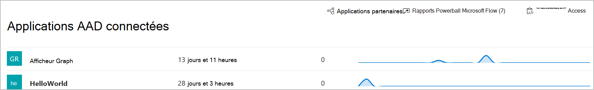

# Applications connectées dans Microsoft Defender pour point de terminaison

[!INCLUDE [Microsoft 365 Defender rebranding](../../includes/microsoft-defender.md)]

**S’applique à :**
- [Microsoft Defender pour point de terminaison](https://go.microsoft.com/fwlink/p/?linkid=2154037)
- [Microsoft 365 Defender](https://go.microsoft.com/fwlink/?linkid=2118804)

>Vous souhaitez faire l’expérience de Defender pour point de terminaison ? [Inscrivez-vous à un essai gratuit.](https://www.microsoft.com/microsoft-365/windows/microsoft-defender-atp?ocid=docs-wdatp-assignaccess-abovefoldlink)

Les applications connectées s’intègrent à la plateforme Defender for Endpoint à l’aide des API. 

Les applications utilisent le protocole OAuth 2.0 standard pour s’authentifier et fournir des jetons à utiliser avec les API Microsoft Defender for Endpoint.  En outre, Azure Active Directory applications (Azure AD) permettent aux administrateurs client de définir un contrôle explicite sur les API accessibles à l’aide de l’application correspondante.
 
Vous devez suivre ces [étapes](/microsoft-365/security/defender-endpoint/apis-intro) pour utiliser les API avec l’application connectée.
 
## Accéder à la page de l’application connectée
Dans le menu de navigation de gauche, sélectionnez **Points de terminaison**  >  **Partenaires et APPLICATIONS connectées**  >  **API.**

 
## Afficher les détails de l’application connectée
La page Applications connectées fournit des informations sur les applications Azure AD connectées à Microsoft Defender pour endpoint dans votre organisation. Vous pouvez passer en revue l’utilisation des applications connectées : dernière expérience, nombre de demandes au cours des dernières 24 heures et tendances des demandes au cours des 30 derniers jours.

 
## Modifier, reconfigurer ou supprimer une application connectée
Le **lien Ouvrir les paramètres de l’application** ouvre la page de gestion des applications Azure AD correspondante dans le portail Azure. À partir du portail Azure, vous pouvez gérer les autorisations, reconfigurer ou supprimer les applications connectées.
