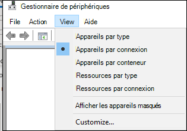
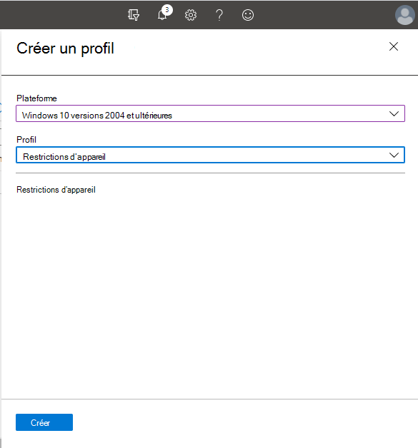
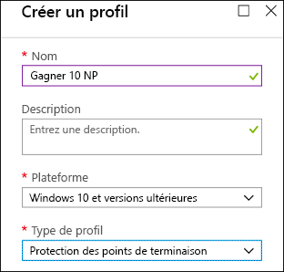

# <a name="how-to-control-usb-devices-and-other-removable-media-using-microsoft-defender-for-endpoint"></a>Comment contrôler des périphériques USB et d’autres supports amovibles à l’aide de Microsoft Defender pour le point de terminaison

**S’applique à :** [Microsoft Defender for Endpoint](https://go.microsoft.com/fwlink/p/?linkid=2069559)

Microsoft recommande une approche en [couches](https://aka.ms/devicecontrolblog)pour la sécurisation des médias amovibles, et Microsoft Defender pour endpoint fournit plusieurs fonctionnalités de surveillance et de contrôle pour éviter que les menaces dans les périphériques non autorisés compromettent vos appareils :

1. [Découvrez les événements connectés en plug-and-play](#discover-plug-and-play-connected-events)pour les périphériques dans Microsoft Defender pour le hunting avancé de point de terminaison. Identifier ou examiner les activités d’utilisation suspectes.

2. Configurez cette configuration pour autoriser ou bloquer uniquement certains appareils amovibles et éviter les menaces.
    1. Autoriser ou bloquer les [appareils amovibles](#allow-or-block-removable-devices) en fonction d’une configuration granulaire pour refuser l’accès en écriture aux disques amovibles et approuver ou refuser des appareils à l’aide d’ID de périphérique USB. Attribution de stratégie flexible des paramètres d’installation d’appareil en fonction d’un individu ou d’un groupe d Azure Active Directory utilisateurs et d’appareils (Azure AD).

    2. [Empêchez les menaces de stockage amovible introduites](#prevent-threats-from-removable-storage) par les périphériques de stockage amovibles en activant :  
        - Antivirus Microsoft Defender protection en temps réel (RTP) pour analyser le stockage amovible à la recherche de programmes malveillants.  
        - La règle USB réduction de la surface d’attaque (ASR) pour bloquer les processus non signés et non signés qui s’exécutent à partir de USB.  
        - Les paramètres de protection DMA (Direct Memory Access) pour atténuer les attaques DMA, y compris la protection DMA du noyau pour Thunderbolt et le blocage de DMA jusqu’à ce qu’un utilisateur se signe.  

3. [Créez des alertes personnalisées](#create-customized-alerts-and-response-actions) et des actions de réponse pour surveiller l’utilisation des appareils amovibles en fonction de ces événements plug-and-play ou de tout autre événement Microsoft Defender for Endpoint avec des règles de [détection personnalisées.](/microsoft-365/security/defender-endpoint/custom-detection-rules)

4. [Répondre aux menaces](#respond-to-threats) provenant de périphériques en temps réel en fonction des propriétés signalées par chaque périphérique.

> [!NOTE]
> Ces mesures de réduction des menaces contribuent à empêcher l’arrivée de programmes malveillants dans votre environnement. Pour protéger les données d’entreprise contre la sortie de votre environnement, vous pouvez également configurer des mesures de protection contre la perte de données. Par exemple, sur les appareils Windows 10 vous pouvez configurer [BitLocker](/windows/security/information-protection/bitlocker/bitlocker-overview.md) et [Windows Information Protection,](/windows/security/information-protection/create-wip-policy-using-intune-azure.md)qui chiffrent les données d’entreprise même si elles sont stockées sur un appareil personnel, ou utiliser le [CSP Stockage/RemovableDiskDenyWriteAccess](/windows/client-management/mdm/policy-csp-storage#storage-removablediskdenywriteaccess) pour refuser l’accès en écriture aux disques amovibles. En outre, vous pouvez classer et protéger des fichiers [sur Windows](/windows/security/threat-protection/windows-defender-atp/information-protection-in-windows-overview) appareils mobiles (y compris leurs périphériques USB montés) à l’aide de Microsoft Defender pour Endpoint et Azure Information Protection.

## <a name="discover-plug-and-play-connected-events"></a>Découvrir les événements connectés en plug-and-play

Vous pouvez afficher les événements connectés plug-and-play dans Microsoft Defender for Endpoint advanced hunting pour identifier les activités d’utilisation suspectes ou effectuer des enquêtes internes.
Pour obtenir des exemples de requêtes de recherche avancée Defender pour les points de terminaison, voir les requêtes de recherche avancée De Microsoft Defender pour les points de [terminaison GitHub de recherche.](https://github.com/Microsoft/WindowsDefenderATP-Hunting-Queries)

Des Power BI de rapport sont disponibles pour Microsoft Defender for Endpoint que vous pouvez utiliser pour les requêtes de recherche avancée. Avec ces exemples de modèles, y compris un pour le contrôle d’appareil, vous pouvez intégrer la puissance de la recherche avancée dans Power BI. Pour plus d’informations, voir le GitHub de référence pour les [modèles PowerBI.](https://github.com/microsoft/MDATP-PowerBI-Templates) Voir [Créer des rapports personnalisés à l Power BI](/microsoft-365/security/defender-endpoint/api-power-bi) pour en savoir plus sur Power BI’intégration.

## <a name="allow-or-block-removable-devices"></a>Autoriser ou bloquer les appareils amovibles
Le tableau suivant décrit les façons dont Microsoft Defender pour point de terminaison peut autoriser ou bloquer les appareils amovibles en fonction d’une configuration granulaire.

<br>

****

|Contrôle|Description|
|---|---|
|[Restreindre les lecteurs USB et les autres périphériques](#restrict-usb-drives-and-other-peripherals)|Vous pouvez autoriser/empêcher les utilisateurs d’installer uniquement les lecteurs USB et autres périphériques inclus dans une liste d’appareils ou de types d’appareils autorisés/non autorisés.|
|[Bloquer l’installation et l’utilisation du stockage amovible](#block-installation-and-usage-of-removable-storage)|Vous ne pouvez pas installer ou utiliser le stockage amovible.|
|[Autoriser l’installation et l’utilisation de périphériques approuvés spécifiquement](#allow-installation-and-usage-of-specifically-approved-peripherals)|Vous pouvez uniquement installer et utiliser des périphériques approuvés qui signalent des propriétés spécifiques dans leur microprogramme.|
|[Empêcher l’installation de périphériques spécifiquement interdits](#prevent-installation-of-specifically-prohibited-peripherals)|Vous ne pouvez pas installer ou utiliser des périphériques interdits qui signalent des propriétés spécifiques dans leur microprogramme.|
|[Autoriser l’installation et l’utilisation de périphériques approuvés spécifiquement avec des ID d’instance d’appareil correspondants](#allow-installation-and-usage-of-specifically-approved-peripherals-with-matching-device-instance-ids)|Vous pouvez uniquement installer et utiliser des périphériques approuvés qui correspondent à l’un de ces ID d’instance d’appareil.|
|[Empêcher l’installation et l’utilisation de périphériques spécifiquement interdits avec des ID d’instance d’appareil correspondants](#prevent-installation-and-usage-of-specifically-prohibited-peripherals-with-matching-device-instance-ids)|Vous ne pouvez pas installer ou utiliser des périphériques interdits qui correspondent à l’un de ces ID d’instance d’appareil.|
|[Limiter les services qui utilisent Bluetooth](#limit-services-that-use-bluetooth)|Vous pouvez limiter les services qui peuvent utiliser Bluetooth.|
|

### <a name="restrict-usb-drives-and-other-peripherals"></a>Restreindre les lecteurs USB et les autres périphériques

Pour éviter les infections par des programmes malveillants ou la perte de données, une organisation peut restreindre les lecteurs USB et d’autres périphériques. Le tableau suivant décrit les façons dont Microsoft Defender pour point de terminaison peut empêcher l’installation et l’utilisation de lecteurs USB et d’autres périphériques.

<br>

****

|Contrôle|Description
|---|---|
|[Autoriser l’installation et l’utilisation de lecteurs USB et d’autres périphériques](#allow-installation-and-usage-of-usb-drives-and-other-peripherals)|Autoriser les utilisateurs à installer uniquement les lecteurs USB et autres périphériques inclus dans une liste d’appareils ou de types d’appareils autorisés|
|[Empêcher l’installation et l’utilisation de lecteurs USB et d’autres périphériques](#prevent-installation-and-usage-of-usb-drives-and-other-peripherals)|Empêcher les utilisateurs d’installer des lecteurs USB et d’autres périphériques inclus dans une liste d’appareils et de types d’appareils non autorisés|
|

Tous les contrôles ci-dessus peuvent être définies par le biais des [modèles d’administration](/intune/administrative-templates-windows)Intune. Les stratégies pertinentes se trouvent ici dans les modèles d’administrateur Intune :


> [!NOTE]
> À l’aide d’Intune, vous pouvez appliquer des stratégies de configuration d’appareil à des groupes d’utilisateurs et/ou d’appareils Azure AD.
Les stratégies ci-dessus peuvent également être définies par le biais des [paramètres CSP d’installation](/windows/client-management/mdm/policy-csp-deviceinstallation) de périphérique et des GOS [d’installation de périphériques.](/previous-versions/dotnet/articles/bb530324(v=msdn.10))
>
> Testez et affinez toujours ces paramètres avec un groupe pilote d’utilisateurs et d’appareils avant de les appliquer en production.
Pour plus d’informations sur le contrôle des périphériques USB, consultez le [blog microsoft Defender pour point de terminaison.](https://www.microsoft.com/security/blog/2018/12/19/windows-defender-atp-has-protections-for-usb-and-removable-devices/)

#### <a name="allow-installation-and-usage-of-usb-drives-and-other-peripherals"></a>Autoriser l’installation et l’utilisation de lecteurs USB et d’autres périphériques

L’une des approches permettant d’installer et d’utiliser des lecteurs USB et d’autres périphériques consiste à commencer par tout autoriser. Ensuite, vous pouvez commencer à réduire les pilotes USB et autres périphériques.

> [!NOTE]
> Étant donné qu’un périphérique USB non autorisé peut avoir un microprogramme qui usurpe ses propriétés USB, nous vous recommandons d’autoriser uniquement les périphériques USB spécifiquement approuvés et de limiter les utilisateurs qui peuvent y accéder.

1. Activer empêcher **l’installation d’appareils non décrits par d’autres paramètres de stratégie pour** tous les utilisateurs.
2. Activer autoriser **l’installation d’appareils à l’aide de pilotes qui correspondent** à ces classes de configuration d’appareil pour toutes les [classes d’installation d’appareil.](/windows-hardware/drivers/install/system-defined-device-setup-classes-available-to-vendors)

Pour appliquer la stratégie pour les appareils déjà installés, appliquez les stratégies de prévention qui ont ce paramètre.

Lors de la configuration de la stratégie d’installation d’appareil autoriser, vous devez également autoriser tous les attributs parents. Vous pouvez afficher les parents d’un appareil en ouvrant le Gestionnaire de périphériques et l’afficher par connexion.



Dans cet exemple, les classes suivantes devaient être ajoutées : HID, Keyboard et {36fc9e60-c465-11cf-8056-444553540000}. Pour plus [d’informations, voir](/windows-hardware/drivers/usbcon/supported-usb-classes) les pilotes USB fournis par Microsoft.


Si vous souhaitez limiter l’accès à certains appareils, supprimez la classe de configuration de l’appareil du périphérique que vous souhaitez limiter. Ajoutez ensuite l’ID d’appareil que vous souhaitez ajouter. L’ID d’appareil est basé sur les valeurs d’ID de fournisseur et d’ID de produit d’un appareil. Pour plus d’informations sur les formats d’ID d’appareil, voir [Identificateurs USB standard.](/windows-hardware/drivers/install/standard-usb-identifiers) 

Pour trouver les ID d’appareil, voir [Rechercher l’ID de l’appareil.](#look-up-device-id) 

Par exemple :

1. Supprimez la classe USBDevice de l’installation autoriser l’installation des appareils à l’aide de pilotes **qui correspondent à ces configurations d’appareil.**
2. Ajoutez l’ID d’appareil à autoriser dans l’installation autoriser l’appareil qui correspond à l’un de **ces ID d’appareil.** 

#### <a name="prevent-installation-and-usage-of-usb-drives-and-other-peripherals"></a>Empêcher l’installation et l’utilisation de lecteurs USB et d’autres périphériques

Si vous souhaitez empêcher l’installation d’une classe d’appareil ou de certains appareils, vous pouvez utiliser les stratégies d’empêcher l’installation des appareils :

1. Activez **Empêcher l’installation des appareils qui correspondent** à l’un de ces ID d’appareil et ajoutez ces appareils à la liste.
2. Activez **empêcher l’installation d’appareils à l’aide de pilotes qui correspondent à ces classes de configuration d’appareil.**

> [!NOTE]
> Les stratégies d’empêchement d’installation de l’appareil sont prioritaires sur les stratégies d’installation d’appareil d’installation autoriser.

La stratégie Empêcher l’installation d’appareils qui correspondent à l’une de ces **stratégies d’ID** d’appareil vous permet de spécifier une liste d’appareils dont l’installation est Windows’est pas installée.

Pour empêcher l’installation d’appareils qui correspondent à l’un de ces ID d’appareil : 

1. [Recherchez l’ID d’appareil](#look-up-device-id) pour les appareils que vous Windows empêcher d’installer.

   

2. Activez **Empêcher l’installation des appareils qui** correspondent à l’un de ces ID d’appareil et ajoutez les ID de fournisseur ou de produit à la liste.

    

#### <a name="look-up-device-id"></a>Rechercher l’ID de l’appareil

Vous pouvez utiliser le Gestionnaire de périphériques pour rechercher un ID d’appareil.

1. Ouvrez le Gestionnaire de périphériques.
2. Cliquez **sur Afficher** et **sélectionnez Appareils par connexion.**
3. Dans l’arborescence, cliquez avec le bouton droit sur l’appareil et sélectionnez **Propriétés.**
4. Dans la boîte de dialogue de l’appareil sélectionné, cliquez sur **l’onglet Détails.**
5. Cliquez sur **la liste** de listes de propriétés et sélectionnez **ID matériels.**
6. Cliquez avec le bouton droit sur la valeur d’ID supérieure, puis **sélectionnez Copier.**

Pour plus d’informations sur les formats d’ID d’appareil, voir [Identificateurs USB standard.](/windows-hardware/drivers/install/standard-usb-identifiers)

Pour plus d’informations sur les ID de fournisseur, voir [les membres USB.](https://www.usb.org/members)

Voici un exemple pour la recherche d’un ID de fournisseur d’appareils ou d’un ID de produit (qui fait partie de l’ID d’appareil) à l’aide de PowerShell : 

```powershell
Get-WMIObject -Class Win32_DiskDrive | Select-Object -Property * 
```

La stratégie Empêcher **l’installation** d’appareils à l’aide de pilotes qui correspondent à ces classes d’installation d’appareil vous permet de spécifier des classes d’installation d’appareil dont l’installation est Windows’est pas installée.

Pour empêcher l’installation de classes spécifiques d’appareils :

1. Recherchez le GUID de la classe de configuration d’appareil à partir des classes d’installation d’appareil définies par le système [disponibles pour les fournisseurs.](/windows-hardware/drivers/install/system-defined-device-setup-classes-available-to-vendors)

2. Activez **empêcher l’installation d’appareils à l’aide de pilotes** qui correspondent à ces classes de configuration d’appareil et ajoutez le GUID de classe à la liste.

    > [!div class="mx-imgBorder"]
    > 

### <a name="block-installation-and-usage-of-removable-storage"></a>Bloquer l’installation et l’utilisation du stockage amovible

1. Connectez-vous au [centre Microsoft Endpoint Manager’administration.](https://endpoint.microsoft.com/)

2. Cliquez sur  >  **Profils de configuration des appareils** Pour créer un  >  **profil.**

    > [!div class="mx-imgBorder"]
    > 

3. Utilisez les paramètres suivants :
   - Nom : tapez un nom pour le profil
   - Description : tapez une description
   - Plateforme : Windows 10 et ultérieures
   - Type de profil : restrictions d’appareil

   > [!div class="mx-imgBorder"]
   > 

4. Cliquez **sur Configurer général**  >  .  

5. Pour **le stockage amovible et** la connexion USB **(mobile uniquement),** choisissez **Bloquer**. **Le stockage amovible inclut** les lecteurs USB, tandis que la connexion **USB (mobile uniquement)** exclut la charge USB, mais inclut d’autres connexions USB sur les appareils mobiles uniquement. 

   

6. Cliquez **sur OK** pour fermer les **paramètres** généraux et **les restrictions d’appareil.**

7. Cliquez **sur Créer** pour enregistrer le profil.

### <a name="allow-installation-and-usage-of-specifically-approved-peripherals"></a>Autoriser l’installation et l’utilisation de périphériques approuvés spécifiquement

Les périphériques autorisés à être installés peuvent être spécifiés par leur [identité matérielle.](/windows-hardware/drivers/install/device-identification-strings) Pour obtenir la liste des structures d’identificateur [courantes, voir Formats d’identificateur de périphérique.](/windows-hardware/drivers/install/device-identifier-formats) Testez la configuration avant de la déployer pour vous assurer qu’elle bloque et autorise les appareils attendus. Dans l’idéal, testez différentes instances du matériel. Par exemple, testez plusieurs clés USB plutôt qu’une seule.

Pour obtenir un exemple SyncML qui permet l’installation d’ID d’appareil spécifiques, voir [DeviceInstallation/AllowInstallationOfMatchingDeviceIDs CSP](/windows/client-management/mdm/policy-csp-deviceinstallation#deviceinstallation-allowinstallationofmatchingdeviceids). Pour autoriser des classes d’appareil spécifiques, voir [DeviceInstallation/AllowInstallationOfMatchingDeviceSetupClasses CSP](/windows/client-management/mdm/policy-csp-deviceinstallation#deviceinstallation-allowinstallationofmatchingdevicesetupclasses).
Autoriser l’installation d’appareils spécifiques nécessite également l’activation de [DeviceInstallation/PreventInstallationOfDevicesNotDescribedByOtherPolicySettings](/windows/client-management/mdm/policy-csp-deviceinstallation#deviceinstallation-preventinstallationofdevicesnotdescribedbyotherpolicysettings).

### <a name="prevent-installation-of-specifically-prohibited-peripherals"></a>Empêcher l’installation de périphériques spécifiquement interdits

Microsoft Defender pour le point de terminaison bloque l’installation et l’utilisation de périphériques interdits à l’aide de l’une de ces options :

- [Les modèles d’administration](/intune/administrative-templates-windows) peuvent bloquer tout appareil avec un ID matériel ou une classe d’installation correspondant.  
- [Paramètres CSP d’installation d’appareil](/windows/client-management/mdm/policy-csp-deviceinstallation) avec un profil personnalisé dans Intune. Vous pouvez empêcher [l’installation d’ID d’appareil spécifiques](/windows/client-management/mdm/policy-csp-deviceinstallation#deviceinstallation-preventinstallationofmatchingdeviceids) ou [empêcher des classes d’appareil spécifiques.](/windows/client-management/mdm/policy-csp-deviceinstallation#deviceinstallation-preventinstallationofmatchingdevicesetupclasses)

### <a name="allow-installation-and-usage-of-specifically-approved-peripherals-with-matching-device-instance-ids"></a>Autoriser l’installation et l’utilisation de périphériques approuvés spécifiquement avec des ID d’instance d’appareil correspondants

Les périphériques autorisés à être installés peuvent être spécifiés par leurs [ID d’instance d’appareil.](/windows-hardware/drivers/install/device-instance-ids) Testez la configuration avant de la déployer pour vous assurer qu’elle autorise les appareils attendus. Dans l’idéal, testez différentes instances du matériel. Par exemple, testez plusieurs clés USB plutôt qu’une seule.

Vous pouvez autoriser l’installation et l’utilisation de périphériques approuvés avec des ID d’instance d’appareil correspondants en configurant le paramètre de stratégie [DeviceInstallation/AllowInstallationOfMatchingDeviceInstanceIDs.](/windows/client-management/mdm/policy-csp-deviceinstallation#deviceinstallation-allowinstallationofmatchingdeviceinstanceids)

### <a name="prevent-installation-and-usage-of-specifically-prohibited-peripherals-with-matching-device-instance-ids"></a>Empêcher l’installation et l’utilisation de périphériques spécifiquement interdits avec des ID d’instance d’appareil correspondants

Les périphériques qui ne peuvent pas être installés peuvent être spécifiés par leurs [ID d’instance d’appareil.](/windows-hardware/drivers/install/device-instance-ids) Testez la configuration avant de la déployer pour vous assurer qu’elle autorise les appareils attendus. Dans l’idéal, testez différentes instances du matériel. Par exemple, testez plusieurs clés USB plutôt qu’une seule.

Vous pouvez empêcher l’installation des périphériques interdits avec des ID d’instance d’appareil correspondants en configurant le paramètre de stratégie [DeviceInstallation/PreventInstallationOfMatchingDeviceInstanceIDs.](/windows/client-management/mdm/policy-csp-deviceinstallation#deviceinstallation-preventinstallationofmatchingdeviceinstanceids)

### <a name="limit-services-that-use-bluetooth"></a>Limiter les services qui utilisent Bluetooth

À l’aide d’Intune, vous pouvez limiter les services qui peuvent utiliser les Bluetooth par le biais du « Bluetooth [services autorisés](/windows/client-management/mdm/policy-csp-bluetooth#servicesallowedlist-usage-guide)». L’état par défaut des paramètres « Bluetooth services autorisés » signifie que tout est autorisé.  Dès qu’un service est ajouté, il devient la liste autorisée. Si le client ajoute les valeurs Clavier et Souris et n’ajoute pas les GUID de transfert de fichiers, le transfert de fichiers doit être bloqué.

> [!div class="mx-imgBorder"]
> 


## <a name="prevent-threats-from-removable-storage"></a>Empêcher les menaces du stockage amovible
  
Les périphériques de stockage amovibles peuvent introduire un risque de sécurité supplémentaire pour votre organisation. Microsoft Defender pour le point de terminaison peut vous aider à identifier et bloquer les fichiers malveillants sur les appareils de stockage amovibles.

Microsoft Defender pour point de terminaison peut également empêcher l’utilisation de périphériques USB sur les appareils pour éviter les menaces externes. Pour ce faire, il utilise les propriétés signalées par les périphériques USB pour déterminer si elles peuvent être installées et utilisées sur l’appareil.

Notez que si vous bloquez les périphériques USB ou toute autre classe d’appareil à l’aide des stratégies d’installation d’appareil, les appareils connectés, tels que les téléphones, peuvent toujours facturer.

> [!NOTE]
> Testez et affinez toujours ces paramètres avec un groupe pilote d’utilisateurs et d’appareils avant de les distribuer largement à votre organisation. 

Le tableau suivant décrit les façons dont Microsoft Defender pour point de terminaison peut contribuer à empêcher les menaces de stockage amovible.

Pour plus d’informations sur le contrôle des périphériques USB, consultez le [blog microsoft Defender pour point de terminaison.](https://aka.ms/devicecontrolblog)

<br>

****

|Contrôle|Description|
|---|---|
|[Activer l’analyse Antivirus Microsoft Defender’analyse](#enable-microsoft-defender-antivirus-scanning)|Activez Antivirus Microsoft Defender recherche de protection en temps réel ou d’analyses programmées.|
|[Bloquer les processus non signés et non signés sur les périphériques USB](#block-untrusted-and-unsigned-processes-on-usb-peripherals)|Bloquez les fichiers USB non signés ou non.|
|[Se protéger contre les attaques d’accès direct à la mémoire (DMA)](#protect-against-direct-memory-access-dma-attacks)|Configurez les paramètres pour vous protéger contre les attaques DMA.|
|

> [!NOTE]
> Étant donné qu’un périphérique USB non autorisé peut avoir un microprogramme qui usurpe ses propriétés USB, nous vous recommandons d’autoriser uniquement les périphériques USB spécifiquement approuvés et de limiter les utilisateurs qui peuvent y accéder.

### <a name="enable-microsoft-defender-antivirus-scanning"></a>Activer l’analyse Antivirus Microsoft Defender’analyse

La protection du stockage amovible autorisé avec Antivirus Microsoft Defender nécessite l’activation de la [protection](/microsoft-365/security/defender-endpoint/configure-real-time-protection-microsoft-defender-antivirus) en temps réel ou la planification des analyses et la configuration des lecteurs amovibles pour les analyses.

- Si la protection en temps réel est activée, les fichiers sont analysés avant d’être accessibles et exécutés. L’étendue d’analyse inclut tous les fichiers, y compris ceux sur les appareils amovibles montés tels que les lecteurs USB. Vous pouvez éventuellement exécuter un [script PowerShell](/samples/browse/?redirectedfrom=TechNet-Gallery) pour effectuer une analyse personnalisée d’un lecteur USB après son montage, afin que Antivirus Microsoft Defender commence à analyser tous les fichiers sur un appareil amovible une fois l’appareil amovible attaché. Toutefois, nous vous recommandons d’activer la protection en temps réel pour améliorer les performances d’analyse, en particulier pour les appareils de stockage de grande taille.

- Si des analyses programmées sont utilisées, vous devez désactiver le paramètre DisableRemovableDriveScanning (activé par défaut) pour analyser le périphérique amovible pendant une analyse complète. Les appareils amovibles sont analysés lors d’une analyse rapide ou personnalisée, quel que soit le paramètre DisableRemovableDriveScanning.

> [!NOTE]
> Nous vous recommandons d’activer la surveillance en temps réel pour l’analyse. Dans Intune, vous pouvez activer la surveillance en temps réel pour les Windows 10 **restrictions d’appareil** Configurer Antivirus Microsoft Defender  >    >    >  **surveillance en temps réel.**

<!-- Need to build out point in the preceding note. 
-->

### <a name="block-untrusted-and-unsigned-processes-on-usb-peripherals"></a>Bloquer les processus non signés et non signés sur les périphériques USB

Les utilisateurs finaux peuvent brancher des appareils amovibles infectés par des programmes malveillants.
Pour éviter les infections, une entreprise peut bloquer les fichiers USB non signés ou non.
Les entreprises peuvent également tirer parti de la fonctionnalité d’audit des règles de réduction de la [surface](/microsoft-365/security/defender-endpoint/attack-surface-reduction) d’attaque pour surveiller l’activité des processus non signés et non signés qui s’exécutent sur un périphérique USB.
Pour ce faire, vous pouvez définir respectivement les processus  non signés et non **signés exécutés** à partir du port USB sur Bloquer ou **Auditer** uniquement.
Avec cette règle, les administrateurs peuvent empêcher ou auditer l’exécution de fichiers exécutables non signés ou non signés à partir de lecteurs amovibles USB, y compris les cartes SD.
Les types de fichiers affectés incluent les fichiers exécutables (tels que .exe, .dll ou .scr) et les fichiers de script tels qu’un fichier PowerShell (.ps), VisualBasic (.vbs) ou JavaScript (.js).

Ces paramètres nécessitent [l’activation de la protection en temps réel.](/microsoft-365/security/defender-endpoint/configure-real-time-protection-microsoft-defender-antivirus)

1. Connectez-vous au [Microsoft Endpoint Manager](https://endpoint.microsoft.com/).

2. Cliquez sur **Appareils**  >  **Windows**  >  **stratégies de configuration créer** un  >  **profil.** 

    

3. Utilisez les paramètres suivants :
   - Plateforme : Windows 10 et ultérieures 
   - Type de profil : restrictions d’appareil

   > [!div class="mx-imgBorder"]
   > 

4. Cliquez sur **Créer**.  

5. Pour les processus non signés et non signés qui s’exécutent à **partir du port USB,** choisissez **Bloquer**.

   

6. Cliquez **sur OK** pour fermer les paramètres et les **restrictions d’appareil.**

### <a name="protect-against-direct-memory-access-dma-attacks"></a>Se protéger contre les attaques d’accès direct à la mémoire (DMA)

Les attaques DMA peuvent entraîner la divulgation d’informations sensibles résidant sur un PC, ou même l’injection de programmes malveillants qui permettent aux personnes malveillantes de contourner l’écran de verrouillage ou de contrôler les PC à distance. Les paramètres suivants permettent d’empêcher les attaques DMA :

1. À partir Windows 10 version 1803, Microsoft a introduit la protection DMA du noyau pour [Thunderbolt](/windows/security/information-protection/kernel-dma-protection-for-thunderbolt.md) afin de fournir une protection native contre les attaques DMA via les ports Thunderbolt. La protection DMA du noyau pour Thunderbolt est activée par les fabricants système et ne peut pas être activée ou désactivée par les utilisateurs.

   À partir Windows 10 version 1809, vous pouvez ajuster le niveau de protection DMA du noyau en configurant le [CSP DMA Guard.](/windows/client-management/mdm/policy-csp-dmaguard#dmaguard-deviceenumerationpolicy) Il s’agit d’un contrôle supplémentaire pour les périphériques qui ne sont pas pris en charge l’isolation de la mémoire de l’appareil (également appelé DMA-remapping). L’isolation de la mémoire permet au système d’exploitation de tirer parti de l’unité de gestion de mémoire d’E/S d’un appareil pour bloquer les E/S non autorisé ou l’accès à la mémoire par le périphérique (bac à sable mémoire). En d’autres termes, le système d’exploitation affecte une certaine plage de mémoire au périphérique. Si le périphérique tente de lire/écrire dans la mémoire en dehors de la plage affectée, le système d’exploitation le bloque.

   Les périphériques qui prendre en charge l’isolation de la mémoire de l’appareil peuvent toujours se connecter. Les périphériques qui ne peuvent pas être bloqués, autorisés ou autorisés uniquement une fois que l’utilisateur se signe (par défaut).

2. Sur Windows 10 systèmes qui ne la prisent pas en charge de la protection DMA du noyau, vous pouvez :

   - [Bloquer DMA jusqu’à ce qu’un utilisateur se soit](/windows/client-management/mdm/policy-csp-dataprotection#dataprotection-allowdirectmemoryaccess)
   - [Bloquer toutes les connexions via les ports Thunderbolt (y compris les périphériques USB)](https://support.microsoft.com/help/2516445/blocking-the-sbp-2-driver-and-thunderbolt-controllers-to-reduce-1394-d)

## <a name="create-customized-alerts-and-response-actions"></a>Créer des alertes personnalisées et des actions de réponse

Vous pouvez créer des alertes personnalisées et des actions de réponse avec le connecteur WDATP et les règles de détection personnalisées :

**Actions de réponse du connecteur Wdatp :**

**Examinez :** Lancez des enquêtes, collectez un package d’enquête et isolez un ordinateur.

**Analyse des menaces** sur les périphériques USB.

**Restreindre l’exécution de toutes les applications** sur l’ordinateur à l’exception d’un ensemble prédéféré

Le connecteur MDATP est l’un des plus de 200 connecteurs prédéfinie, notamment Outlook, Teams, Slack, etc. Les connecteurs personnalisés peuvent être créés.

- [Plus d’informations sur les actions de réponse du connecteur WDATP](/connectors/wdatp/)

**Action de réponse des règles de détection personnalisées :**

Les actions au niveau de l’ordinateur et du fichier peuvent être appliquées.

- [Plus d’informations sur les actions de réponse des règles de détection personnalisées](/microsoft-365/security/defender-endpoint/custom-detection-rules)

Pour plus d’informations sur les événements de recherche avancée liés au contrôle d’appareil et des exemples sur la création d’alertes personnalisées, voir Mises à jour de recherche avancées : [événements USB, actions](https://techcommunity.microsoft.com/t5/Microsoft-Defender-ATP/Advanced-hunting-updates-USB-events-machine-level-actions-and/ba-p/824152)au niveau de l’ordinateur et modifications de schéma.

## <a name="respond-to-threats"></a>Répondre aux menaces

Vous pouvez créer des alertes personnalisées et des actions de réponse automatique à l’aide de [Microsoft Defender for Endpoint Custom Detection Rules](/microsoft-365/security/defender-endpoint/custom-detection-rules). Les actions de réponse au sein de la détection personnalisée couvrent les actions au niveau de l’ordinateur et du fichier. Vous pouvez également créer des alertes et des actions de réponse automatique à l’aide de [PowerApps](https://powerapps.microsoft.com/) [et Flow](https://flow.microsoft.com/) avec le connecteur Microsoft Defender pour point [de terminaison.](/connectors/wdatp/) Le connecteur prend en charge des actions pour l’examen, l’analyse des menaces et la limitation des applications en cours d’exécution. Il s’agit de l’un des plus de 200 connecteurs prédéfin définis, notamment Outlook, Teams, Slack et bien plus encore. Les connecteurs personnalisés peuvent également être créés. Voir [Connecteurs](/connectors/) pour en savoir plus sur les connecteurs.

Par exemple, à l’aide de l’une ou l’autre des approches, vous pouvez exécuter Antivirus Microsoft Defender automatiquement lorsqu’un périphérique USB est monté sur un ordinateur.

## <a name="related-topics"></a>Rubriques connexes

- [Configurer la protection en temps réel pour Antivirus Microsoft Defender](/microsoft-365/security/defender-endpoint/configure-real-time-protection-microsoft-defender-antivirus)
- [Defender/AllowFullScanRemovableDriveScanning](/windows/client-management/mdm/policy-csp-defender#defender-allowfullscanremovabledrivescanning)
- [Policy/DeviceInstallation CSP](/windows/client-management/mdm/policy-csp-deviceinstallation)
- [Effectuer une analyse personnalisée d’un appareil amovible](/samples/browse/?redirectedfrom=TechNet-Gallery)
- [Modèle PowerBI de contrôle d’appareil pour la création de rapports personnalisés](https://github.com/microsoft/MDATP-PowerBI-Templates)
- [BitLocker](/windows/security/information-protection/bitlocker/bitlocker-overview.md) 
- [Protection des informations Windows](/windows/security/information-protection/windows-information-protection/create-wip-policy-using-intune-azure.md)
