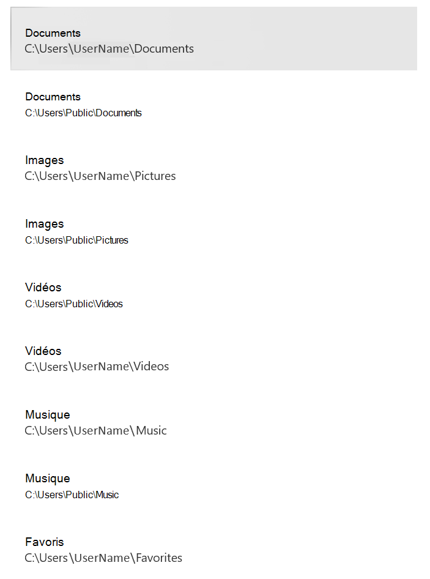

# <a name="protect-important-folders-with-controlled-folder-access"></a>Protéger les dossiers importants avec accès contrôlé aux dossiers

[!INCLUDE [Microsoft 365 Defender rebranding](../../includes/microsoft-defender.md)]

**S’applique à :**

- [Microsoft Defender pour point de terminaison Plan 2](https://go.microsoft.com/fwlink/p/?linkid=2154037)
- [Microsoft 365 Defender](https://go.microsoft.com/fwlink/?linkid=2118804)
- Antivirus Microsoft Defender

**S’applique à**
- Windows


> Vous voulez découvrir Defender pour point de terminaison ? [Inscrivez-vous pour bénéficier d’un essai gratuit.](https://signup.microsoft.com/create-account/signup?products=7f379fee-c4f9-4278-b0a1-e4c8c2fcdf7e&ru=https://aka.ms/MDEp2OpenTrial?ocid=docs-wdatp-assignaccess-abovefoldlink)

## <a name="what-is-controlled-folder-access"></a>Qu’est-ce que l’accès contrôlé aux dossiers ?

L’accès contrôlé aux dossiers permet de protéger vos données précieuses contre les applications malveillantes et les menaces, telles que les ransomwares. L’accès contrôlé aux dossiers protège vos données en vérifiant les applications par rapport à une liste d’applications connues et approuvées. Pris en charge sur les clients Windows Server 2019, Windows Server 2022, Windows 10 et Windows 11, l’accès contrôlé aux dossiers peut être activé à l’aide de l’application Sécurité Windows, Microsoft Endpoint Configuration Manager ou Intune (pour les appareils gérés).

> [!NOTE]
> Les moteurs de script ne sont pas approuvés et vous ne pouvez pas leur permettre d’accéder à des dossiers protégés contrôlés. Par exemple, PowerShell n’est pas approuvé par l’accès contrôlé aux dossiers, même si vous l’autorisez avec [des indicateurs de certificat et de fichier](/microsoft-365/security/defender-endpoint/indicator-certificates).

L’accès contrôlé aux dossiers fonctionne mieux avec [Microsoft Defender pour point de terminaison](microsoft-defender-endpoint.md), ce qui vous permet de générer des rapports détaillés sur les événements d’accès contrôlé aux dossiers et les blocs dans le cadre des [scénarios d’investigation des alertes habituels](investigate-alerts.md).

> [!TIP]
> Les blocs d’accès aux dossiers contrôlés ne génèrent pas d’alertes dans la [file d’attente d’alertes](alerts-queue.md). Toutefois, vous pouvez afficher des informations sur les blocs d’accès contrôlés aux dossiers dans [l’affichage chronologie de l’appareil](investigate-machines.md), lors de l’utilisation d’une [chasse avancée](advanced-hunting-overview.md) ou avec [des règles de détection personnalisées](custom-detection-rules.md).

## <a name="how-does-controlled-folder-access-work"></a>Comment fonctionne l’accès contrôlé aux dossiers ?

L’accès contrôlé aux dossiers fonctionne en autorisant uniquement les applications approuvées à accéder aux dossiers protégés. Les dossiers protégés sont spécifiés lorsque l’accès contrôlé aux dossiers est configuré. En règle générale, les dossiers couramment utilisés, tels que ceux utilisés pour les documents, les images, les téléchargements, etc., sont inclus dans la liste des dossiers contrôlés.

L’accès contrôlé aux dossiers fonctionne avec une liste d’applications approuvées. Les applications incluses dans la liste des logiciels approuvés fonctionnent comme prévu. Les applications qui ne sont pas incluses dans la liste sont empêchées d’apporter des modifications aux fichiers à l’intérieur des dossiers protégés.

Les applications sont ajoutées à la liste en fonction de leur prévalence et de leur réputation. Les applications très répandues au sein de votre organisation et qui n’ont jamais affiché de comportement considéré comme malveillant sont considérées comme dignes de confiance. Ces applications sont ajoutées automatiquement à la liste.

Les applications peuvent également être ajoutées manuellement à la liste approuvée à l’aide de Configuration Manager ou de Intune. Des actions supplémentaires peuvent être effectuées à partir du portail Microsoft 365 Defender.

## <a name="why-controlled-folder-access-is-important"></a>Pourquoi l’accès contrôlé aux dossiers est important

L’accès contrôlé aux dossiers est particulièrement utile pour protéger vos documents et informations contre les [ransomwares](https://www.microsoft.com/wdsi/threats/ransomware). Dans une attaque par ransomware, vos fichiers peuvent être chiffrés et pris en otage. Une fois l’accès contrôlé aux dossiers en place, une notification s’affiche sur l’ordinateur où une application a tenté d’apporter des modifications à un fichier dans un dossier protégé. Vous pouvez [personnaliser la notification](attack-surface-reduction-rules-deployment-implement.md#customize-attack-surface-reduction-rules) avec les informations et les coordonnées de l’entreprise. Vous pouvez également activer les règles individuellement pour personnaliser les techniques analysées par la fonctionnalité.

Les [dossiers protégés](#review-controlled-folder-access-events-in-windows-event-viewer) incluent des dossiers système courants (y compris les secteurs de démarrage) et vous pouvez [ajouter d’autres dossiers](customize-controlled-folders.md#protect-additional-folders). Vous pouvez également [autoriser les applications](customize-controlled-folders.md#allow-specific-apps-to-make-changes-to-controlled-folders) à leur donner accès aux dossiers protégés.

Vous pouvez utiliser le [mode audit](audit-windows-defender.md) pour évaluer l’impact de l’accès contrôlé aux dossiers sur votre organisation s’il était activé. Vous pouvez également visiter le site web Windows Defender Test ground à [demo.wd.microsoft.com](https://demo.wd.microsoft.com?ocid=cx-wddocs-testground) pour vérifier que la fonctionnalité fonctionne et voir comment elle fonctionne.

> [!NOTE]
> Le site de démonstration Defender pour point de terminaison sur demo.wd.microsoft.com est déconseillé et sera supprimé à l’avenir.

L’accès contrôlé aux dossiers est pris en charge sur les versions suivantes de Windows :

- [Windows 10, version 1709](/windows/whats-new/whats-new-windows-10-version-1709) et ultérieures
- Windows 11
- [Windows Server 2019](/windows-server/get-started-19/whats-new-19)
- Windows Server 2022

## <a name="windows-system-folders-are-protected-by-default"></a>Windows dossiers système sont protégés par défaut

Windows dossiers système sont protégés par défaut, ainsi que plusieurs autres dossiers :

Les dossiers protégés incluent des dossiers système courants (y compris les secteurs de démarrage) et vous pouvez ajouter des dossiers supplémentaires. Vous pouvez également autoriser les applications à leur donner accès aux dossiers protégés.  Les dossiers de systèmes Windows qui sont protégés par défaut sont les suivants :

- `c:\Users\<username>\Documents`
- `c:\Users\Public\Documents`
- `c:\Users\<username>\Pictures`
- `c:\Users\Public\Pictures`
- `c:\Users\Public\Videos`
- `c:\Users\<username>\Videos`
- `c:\Users\<username>\Music`
- `c:\Users\Public\Music`
- `c:\Users\<username>\Favorites`

Les dossiers par défaut apparaissent dans le profil de l’utilisateur, sous **ce PC**.
   > [!div class="mx-imgBorder"]
   > 

> [!NOTE]
> Vous pouvez configurer des dossiers supplémentaires en tant que dossiers protégés, mais vous ne pouvez pas supprimer les dossiers système Windows qui sont protégés par défaut.

## <a name="requirements-for-controlled-folder-access"></a>Configuration requise pour l’accès contrôlé aux dossiers

L’accès contrôlé aux dossiers nécessite l’activation [Antivirus Microsoft Defender protection en temps réel](configure-real-time-protection-microsoft-defender-antivirus.md).

## <a name="review-controlled-folder-access-events-in-the-microsoft-365-defender-portal"></a>Passer en revue les événements d’accès contrôlé aux dossiers dans le portail Microsoft 365 Defender

Defender pour point de terminaison fournit des rapports détaillés sur les événements et les blocs dans le cadre de ses [scénarios d’investigation d’alerte](investigate-alerts.md) dans le portail Microsoft 365 Defender ; consultez [Microsoft Defender pour point de terminaison dans Microsoft 365 Defender](../defender/microsoft-365-security-center-mde.md).

Vous pouvez interroger Microsoft Defender pour point de terminaison données à l’aide de [la chasse avancée](advanced-hunting-overview.md). Si vous utilisez le [mode audit](audit-windows-defender.md), vous pouvez utiliser la [chasse avancée](advanced-hunting-overview.md) pour voir comment les paramètres d’accès contrôlé aux dossiers auraient une incidence sur votre environnement s’ils étaient activés.

Exemples de requête :

```PowerShell
DeviceEvents
| where ActionType in ('ControlledFolderAccessViolationAudited','ControlledFolderAccessViolationBlocked')
```

## <a name="review-controlled-folder-access-events-in-windows-event-viewer"></a>Passer en revue les événements d’accès contrôlé aux dossiers dans Windows observateur d'événements

Vous pouvez consulter le journal des événements Windows pour voir les événements créés lorsque l’accès contrôlé aux dossiers bloque (ou audite) une application :

1. Téléchargez le [package d’évaluation](https://aka.ms/mp7z2w) et extrayez le fichier *cfa-events.xml* à un emplacement facilement accessible sur l’appareil.
2. Tapez **l’observateur d’événements** dans le menu Démarrer pour ouvrir le Windows observateur d'événements.
3. Dans le volet gauche, sous **Actions**, sélectionnez **Importer un affichage personnalisé...**.
4. Accédez à *l’emplacement* où vous avez extraitcfa-events.xmlet sélectionnez-le. Vous pouvez également [copier le code XML directement](event-views.md).
5. Sélectionnez **OK**.

Le tableau suivant présente les événements liés à l’accès contrôlé aux dossiers :

<br/><br/>

|ID d’événement|Description|
|---|---|
|5007|Événement lorsque les paramètres sont modifiés|
|1124|Événement d’accès contrôlé aux dossiers audité|
|1123|Événement d’accès contrôlé aux dossiers bloqué|

## <a name="view-or-change-the-list-of-protected-folders"></a>Afficher ou modifier la liste des dossiers protégés

Vous pouvez utiliser l’application Sécurité Windows pour afficher la liste des dossiers protégés par un accès contrôlé aux dossiers.

1. Sur votre appareil Windows 10 ou Windows 11, ouvrez l’application Sécurité Windows.
2. Sélectionnez **Protection contre les virus et les menaces**.
3. Sous **Protection contre les rançongiciels**, **sélectionnez Gérer la protection contre les ransomware**.
4. Si l’accès contrôlé aux dossiers est désactivé, vous devez l’activer. Sélectionnez **dossiers protégés**.
5. Effectuez l’une des étapes suivantes :
   - Pour ajouter un dossier, sélectionnez **+ Ajouter un dossier protégé**.
   - Pour supprimer un dossier, sélectionnez-le, puis **sélectionnez Supprimer**.

> [!NOTE]
> [Windows dossiers système sont protégés](#windows-system-folders-are-protected-by-default) par défaut et vous ne pouvez pas les supprimer de la liste.
