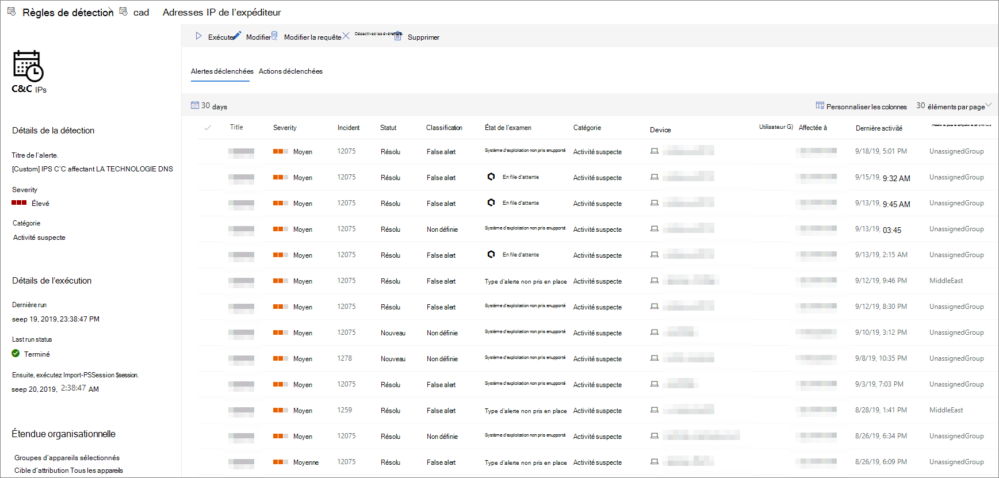

# Afficher et gérer des règles de détection personnalisées

[!INCLUDE [Microsoft 365 Defender rebranding](../../includes/microsoft-defender.md)]

**S’applique à :**
- [Microsoft Defender pour point de terminaison](https://go.microsoft.com/fwlink/p/?linkid=2154037)
- [Microsoft 365 Defender](https://go.microsoft.com/fwlink/?linkid=2118804)

>Vous souhaitez faire l’expérience de Defender pour point de terminaison ? [Inscrivez-vous à un essai gratuit.](https://www.microsoft.com/microsoft-365/windows/microsoft-defender-atp?ocid=docs-wdatp-assignaccess-abovefoldlink)

Gérez vos règles de [détection personnalisées](custom-detection-rules.md) existantes pour vous assurer qu’elles trouvent efficacement les menaces et prennent des mesures. Découvrez comment afficher la liste des règles, vérifier leurs précédentes séries et passer en revue les alertes qu’elles ont déclenchées. Vous pouvez également exécuter une règle à la demande et la modifier.

## Autorisations requises

Pour créer ou gérer des détections personnalisées, [votre rôle](user-roles.md#create-roles-and-assign-the-role-to-an-azure-active-directory-group) doit avoir l’autorisation gérer les **paramètres de** sécurité.

## Afficher les règles existantes

Pour afficher toutes les règles de détection personnalisées **existantes,** accédez à Paramètres  >  **Détections personnalisées.** La page répertorie toutes les règles avec les informations d’exécuter suivantes :

- **Dernière série**: lorsqu’une règle a été exécuté pour la dernière fois pour vérifier les correspondances de requête et générer des alertes
- **État de la dernière fois**: si une règle s’est correctement exécuté
- **Next run**—the next scheduled run
- **État**: si une règle a été allumée ou désactivée

## Afficher les détails de la règle, modifier la règle et exécuter la règle

Pour afficher des informations complètes sur une règle de détection personnalisée, sélectionnez le nom de la règle dans la liste des règles dans **paramètres**  >  **détections personnalisées**. Une page sur la règle sélectionnée affiche les informations suivantes :

- Informations générales sur la règle, y compris les détails de l’alerte, l’état d’exécuter et l’étendue
- Liste des alertes déclenchées
- Liste des actions déclenchées

 
*Page règle de détection personnalisée*

Vous pouvez également prendre les mesures suivantes sur la règle à partir de cette page :

- **Exécutez** la règle immédiatement. Cette action réinitialise également l’intervalle pour la prochaine suite.
- **Modifier**— modifier la règle sans modifier la requête
- **Modifier la requête —** modifier la requête dans le recherche avancée
- **Activer**  /  **Désactiver :** activer la règle ou l’arrêter d’être en cours d’exécution
- **Supprimer**: désactiver la règle et la supprimer

>[!TIP]
>Pour afficher rapidement des informations et agir sur un élément d’un tableau, utilisez la colonne de sélection [&#10003;] à gauche du tableau.

## Voir aussi
- [Vue d’ensemble des détections personnalisées](overview-custom-detections.md)
- [Créer des règles de détection](custom-detection-rules.md)
- [Vue d’ensemble du repérage avancé](advanced-hunting-overview.md)
- [Afficher et organiser les alertes](alerts-queue.md)
